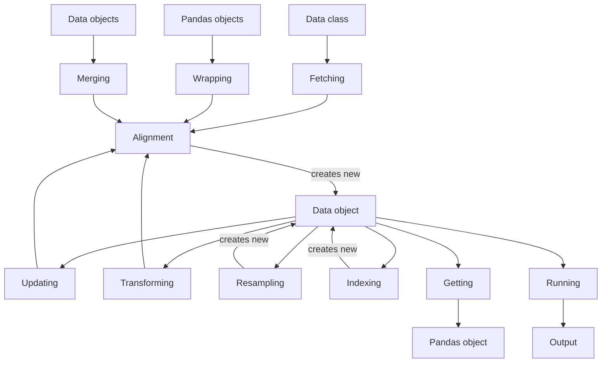

# Vectorbtpro_Docs - Data

**Pages:** 9

---

## Local

**URL:** https://vectorbt.pro/pvt_ff8edc14/documentation/data/local.md

**Contents:**
- Pickling
- Saving
  - CSV
  - HDF
  - Feather & Parquet
  - SQL
  - DuckDB
- Loading
  - CSV
    - Chunking

Making repeated requests to remote API endpoints can be costly, so caching data locally is important. Fortunately, VBT provides several methods for managing local data.

Like any class that subclasses [Pickleable](https://vectorbt.pro/pvt*ff8edc14/api/utils/pickling/#vectorbtpro.utils.pickling.Pickleable), you can save any [Data](https://vectorbt.pro/pvt*ff8edc14/api/data/base/#vectorbtpro.data.base.Data) instance to disk using [Pickleable.save](https://vectorbt.pro/pvt*ff8edc14/api/utils/pickling/#vectorbtpro.utils.pickling.Pickleable.save), and load it again with [Pickleable.load](https://vectorbt.pro/pvt*ff8edc14/api/utils/pickling/#vectorbtpro.utils.pickling.Pickleable.load). This process pickles the entire Python object, including stored Pandas objects, symbol dictionaries, and settings:

[=100% "Symbol 2/2"]{: .candystripe .candystripe-animate }

Just make sure you are using a compatible VBT version.

!!! important The class definition is not saved. If a new version of VBT introduces a breaking change to the [Data](https://vectorbt.pro/pvt_ff8edc14/api/data/base/#vectorbtpro.data.base.Data) constructor, the object might not load. In this case, you can manually create a new instance:

While pickling is a fast and convenient way to store Python objects of any size, the pickled file is essentially a black box that requires a Python interpreter to access its contents. This means it cannot be imported by most other data-driven tools, which makes it unusable for many tasks. To overcome this limitation, the [Data](https://vectorbt.pro/pvt_ff8edc14/api/data/base/#vectorbtpro.data.base.Data) class allows you to save only the stored Pandas objects into one or more tabular format files.

The first supported file format is [CSV](https://en.wikipedia.org/wiki/Comma-separated*values), which is implemented by the instance method [Data.to*csv](https://vectorbt.pro/pvt*ff8edc14/api/data/base/#vectorbtpro.data.base.Data.to*csv). This method takes the path to the directory where the data should be stored (`path*or*buf`) and saves each symbol in a separate file using [DataFrame.to*csv](https://pandas.pydata.org/docs/reference/api/pandas.DataFrame.to*csv.html).

By default, it appends the `.csv` extension to each symbol and saves the files in the current directory:

!!! info Multiple symbols cannot be stored in a single CSV file.

You can list all CSV files in the current directory using [list*files](https://vectorbt.pro/pvt*ff8edc14/api/utils/path*/#vectorbtpro.utils.path*.list_files):

A cleaner approach is to save all the data in a separate directory:

passing the keyword argument `mkdir*kwargs` to [check*mkdir](https://vectorbt.pro/pvt*ff8edc14/api/utils/path*/#vectorbtpro.utils.path*.check*mkdir).

To save the data as tab-separated values (TSV):

!!! tip You do not need to pass `sep`: VBT will recognize the extension and use the correct delimiter. You can still override this argument if you want to split the data by a custom character.

Similar to [Data.pull](https://vectorbt.pro/pvt*ff8edc14/api/data/base/#vectorbtpro.data.base.Data.pull), you can provide any argument as a feature/symbol dictionary of type [key*dict](https://vectorbt.pro/pvt*ff8edc14/api/data/base/#vectorbtpro.data.base.key*dict) to define different rules for different symbols. For example, you can store the symbols from our example in separate directories:

You can also specify the path to each file by using `path*or*buf` (the first argument):

To delete an entire directory, for example as part of a cleanup process:

The second supported file format is [HDF](https://en.wikipedia.org/wiki/Hierarchical*Data*Format), which is implemented by the instance method [Data.to*hdf](https://vectorbt.pro/pvt*ff8edc14/api/data/base/#vectorbtpro.data.base.Data.to*hdf). Unlike [Data.to*csv](https://vectorbt.pro/pvt*ff8edc14/api/data/base/#vectorbtpro.data.base.Data.to*csv), this method can store multiple symbols in a single file, where symbols are distributed as HDF keys.

By default, it creates a new file with the same name as the data class and the `.h5` extension, saving each symbol under a separate key using [DataFrame.to*hdf](https://pandas.pydata.org/docs/reference/api/pandas.DataFrame.to*hdf.html):

To see the list of all groups and keys in an HDF file:

Use the `key` argument to manually specify the key for a particular symbol:

!!! tip If there is only one symbol, you do not need to use [key*dict](https://vectorbt.pro/pvt*ff8edc14/api/data/base/#vectorbtpro.data.base.key*dict). You can simply pass `key="btc*usd"`.

You can also specify the path to each file by using `path*or*buf` (the first argument):

You can combine the arguments `path*or*buf` and `key`.

All other arguments behave the same as for [Data.to*csv](https://vectorbt.pro/pvt*ff8edc14/api/data/base/#vectorbtpro.data.base.Data.to_csv).

The third supported option is saving to a Feather or Parquet file, which are handled by the instance methods [Data.to*feather](https://vectorbt.pro/pvt*ff8edc14/api/data/base/#vectorbtpro.data.base.Data.to*feather) and [Data.to*parquet](https://vectorbt.pro/pvt*ff8edc14/api/data/base/#vectorbtpro.data.base.Data.to*parquet). Feather is an unmodified raw columnar Arrow memory format designed for short-term storage. Parquet is often more expensive to write but offers more layers of encoding and compression, making Parquet files usually much smaller than Feather files. Another key difference is that you cannot partition data with Feather, nor can you natively store the index. The index must be stored as a separate column, which is handled automatically by VBT. Here we will show how to save to Parquet.

By default, the `.parquet` extension is appended to each symbol, and files are saved in the current directory:

!!! info Multiple symbols cannot be stored in a single Parquet file.

Other saving options are very similar to the CSV saving options.

In addition to saving each DataFrame to a separate Parquet file, you can partition the DataFrame either by columns or by rows. Partitioning by columns is controlled by the `partition*cols` argument, which takes a list of column names. The columns must be present in your data and are partitioned in the order you provide. Partitioning by rows is controlled by the `partition*by` argument, which accepts a grouping instruction such as a frequency, an index (including multi-index), a Pandas grouper or resampler, or a VBT [Grouper](https://vectorbt.pro/pvt*ff8edc14/api/base/grouping/base/#vectorbtpro.base.grouping.base.Grouper) instance. Together with `groupby*kwargs`, this creates a new `Grouper` instance for partitioning. The groups are attached as columns to each DataFrame, and the names of these columns are provided as `partition*cols`. By default, if there is only one column, it will be named "group"; if there are multiple columns, they will be named "group*{index}". To use your own column names, enable `keep*groupby*names`.

!!! info When `partition*cols` or `partition*by` is provided, each symbol will be stored in a separate directory.

Let's partition our data into two-day groups and save each DataFrame to its own Parquet directory:

To visualize the directory tree for the `BTC-USD` symbol:

The fourth supported option is saving to a SQL database, which is implemented by the instance method [Data.to*sql](https://vectorbt.pro/pvt*ff8edc14/api/data/base/#vectorbtpro.data.base.Data.to*sql). This requires [SQLAlchemy](https://www.sqlalchemy.org/) to be installed. The method takes the engine (object, name, or URL) and saves each symbol as a separate table in the database managed by the engine using [`pd.to*sql`](https://pandas.pydata.org/docs/reference/api/pandas.DataFrame.to*sql.html). You can create the engine manually using SQLAlchemy's `create*engine` function, or pass a URL and it will be created for you; in this case, the engine will be disposed at the end of the call.

Let's create a SQL database file in the working directory and store the data there:

If you want to continue working with the same engine and avoid creating another engine object, pass `return_engine=True` to return the engine object:

You can also specify the schema using the `schema` argument. Note that some databases, such as SQLite, do not support the concept of a schema. If the schema does not exist, it will be created automatically.

Use the `table` argument to manually specify the table name for a particular symbol:

!!! info If the index is datetime-like and/or there are datetime-like columns, the method will localize or convert them to UTC first. To adjust this behavior, set the `to*utc` argument to False to deactivate, to "index" to apply it to the index only, or to "columns" to apply it to columns only. Additionally, the UTC timezone will be removed if `remove*utc_tz` is True (default) since some databases do not support timezone-aware timestamps; other timezones are not affected.

!!! tip The previous method (using SQLAlchemy) can also be used to write to a DuckDB database. For this, you need to install the [duckdb-engine](https://pypi.org/project/duckdb-engine/) extension.

The fifth supported option is very similar to the previous one and allows you to save data to a DuckDB database or to CSV, Parquet, or JSON files. It is implemented by the instance method [Data.to*duckdb](https://vectorbt.pro/pvt*ff8edc14/api/data/base/#vectorbtpro.data.base.Data.to_duckdb). This requires [DuckDB](https://duckdb.org/) to be installed. The method takes the connection (object or URL) and saves each symbol as a separate table in the database managed by the connection, or to file(s) using a SQL query. The connection can be created manually using DuckDB's `connect` function, or you can pass a URL and it will be created for you. If neither a connection nor connection-related keyword arguments are provided, the default in-memory connection is used.

Let's create a DuckDB database file in the working directory and store the data there:

You can also specify the catalog and schema using the `catalog` and `schema` arguments, respectively. If the schema does not exist, it will be created automatically.

Use the `table` argument to manually specify the table name for a particular symbol:

There is also an option to save each DataFrame to a CSV, Parquet, or JSON file rather than to the database itself. To do this, use `write*format`, `write*path`, and `write*options`. This operation is performed using [`COPY TO`](https://duckdb.org/docs/sql/statements/copy.html). If `write*path` is a directory (which is the working directory by default), each DataFrame will be saved to a file based on the specified format. The format is not needed if `write_path` points to a file with a recognizable extension. The options argument can be used to specify writing options; it can be either a string as in DuckDB's documentation, such as `HEADER 1, DELIMITER ','`, or a dictionary that will be translated into such a string by VBT, such as `dict(header=1, delimiter=',')`.

Let's save all data to Parquet files:

!!! info See the notes in the SQL section.

To import any previously stored data in a tabular format, you can use Pandas or VBT's preset data classes, which are specifically designed for this purpose.

You can import each CSV dataset manually using [pandas.read*csv](https://pandas.pydata.org/docs/reference/api/pandas.read*csv.html):

To combine the imported datasets and wrap them with [Data](https://vectorbt.pro/pvt*ff8edc14/api/data/base/#vectorbtpro.data.base.Data), you can use [Data.from*data](https://vectorbt.pro/pvt*ff8edc14/api/data/base/#vectorbtpro.data.base.Data.from*data):

To make it easier for users and eliminate the need to manually search for, fetch, and merge CSV data, VBT provides the [CSVData](https://vectorbt.pro/pvt*ff8edc14/api/data/custom/csv/#vectorbtpro.data.custom.csv.CSVData) class, which can recursively search directories for CSV files, resolve path expressions using [glob](https://docs.python.org/3/library/glob.html), translate matched paths into symbols, and import and join tabular data—all automatically with a single command. It is a subclass of [FileData](https://vectorbt.pro/pvt*ff8edc14/api/data/custom/file/#vectorbtpro.data.custom.file.FileData), which enables all of these features.

At the core of the path matching functionality is the class method [FileData.pull](https://vectorbt.pro/pvt*ff8edc14/api/data/custom/file/#vectorbtpro.data.custom.file.FileData.pull), which iterates over the specified paths. For each one, it finds the matching absolute paths using the class method [FileData.match*path](https://vectorbt.pro/pvt*ff8edc14/api/data/custom/file/#vectorbtpro.data.custom.file.FileData.match*path), then calls the abstract class method [FileData.fetch*key](https://vectorbt.pro/pvt*ff8edc14/api/data/custom/file/#vectorbtpro.data.custom.file.FileData.fetch_key) to pull the data from the file at that path.

To see how [FileData.match*path](https://vectorbt.pro/pvt*ff8edc14/api/data/custom/file/#vectorbtpro.data.custom.file.FileData.match_path) works, create a directory named `data` and store several empty files in it:

To view the directory structure you just created:

Match all files in a directory:

Match all CSV files in a directory:

Match all CSV files in a directory recursively:

For more details, see the [glob](https://docs.python.org/3/library/glob.html) documentation.

Returning to [FileData.pull](https://vectorbt.pro/pvt*ff8edc14/api/data/custom/file/#vectorbtpro.data.custom.file.FileData.pull): this method can match one or multiple path expressions as shown above, provided either as `symbols` (if `paths` is None) or as `paths`. When you pass paths as symbols, the method calls [FileData.path*to*symbol](https://vectorbt.pro/pvt*ff8edc14/api/data/custom/file/#vectorbtpro.data.custom.file.FileData.path*to*symbol) on each matched path to extract the symbol name (by default, this is the stem of the path):

!!! note Remember to filter by the `.csv`, `.tsv`, or any other extension in your path expression.

When you use a wildcard like `*.csv`, VBT will sort the matched paths (for each path expression). To disable sorting, set `sort*paths` to False. If you want to turn off the path matching mechanism entirely, you can set `match*paths` to False, which will send all arguments directly to [CSVData.fetch*key](https://vectorbt.pro/pvt*ff8edc14/api/data/custom/csv/#vectorbtpro.data.custom.csv.CSVData.fetch_key):

!!! tip Instead of paths, you can use any object type supported by the `filepath*or*buffer` argument in [pandas.read*csv](https://pandas.pydata.org/docs/reference/api/pandas.read*csv.html).

To summarize the techniques described above, let's create an empty directory called `data` again, write the `BTC-USD` symbol to a CSV file and the `ETH-USD` symbol to a TSV file, then load both datasets with a single `fetch` call:

[=100% "Symbol 2/2"]{: .candystripe .candystripe-animate }

!!! note Providing two paths with wildcards (`*`) does not guarantee you will get exactly two symbols: each wildcard may match more than one path. Think of the two expressions above as being OR'ed into a single expression `data/*.{csv,tsv}` (which, unfortunately, is not supported by [glob](https://docs.python.org/3/library/glob.html)).

Last but not least is regex matching with `match_regex`. This tells VBT to iterate over all matched paths and further validate them using a regular expression:

Any other argument is passed directly to [CSVData.fetch*key](https://vectorbt.pro/pvt*ff8edc14/api/data/custom/csv/#vectorbtpro.data.custom.csv.CSVData.fetch*key) and then to [pandas.read*csv](https://pandas.pydata.org/docs/reference/api/pandas.read_csv.html).

Instead of reading everything into memory at once, Pandas allows you to read data in chunks. For CSV files, this means you can load only a subset of lines into memory at any given time. While this is a great feature for working with large datasets, chunking does not have many benefits when your goal is simply to load all the data into memory anyway.

However, chunking becomes very useful for data filtering! The class [CSVData](https://vectorbt.pro/pvt*ff8edc14/api/data/custom/csv/#vectorbtpro.data.custom.csv.CSVData), as well as the function [pandas.read*csv](https://pandas.pydata.org/docs/reference/api/pandas.read_csv.html) that it uses, do not have arguments for skipping rows based on their content—only by row index. For example, to skip any data before `2020-01-03`, you would need to load all the data into memory first. But if the dataset is too large, this could exhaust your system's RAM. To work around this, you can split the data into chunks and check conditions on each chunk separately.

You have two options:

Both options make [pandas.read*csv](https://pandas.pydata.org/docs/reference/api/pandas.read*csv.html) to return an iterator of type `TextFileReader`. To take advantage of this, [CSVData.fetch*key](https://vectorbt.pro/pvt*ff8edc14/api/data/custom/csv/#vectorbtpro.data.custom.csv.CSVData.fetch*key) accepts a user-defined function `chunk*func` that should 1) accept the iterator, 2) select, process, and concatenate chunks, and 3) return a Series or DataFrame.

Let's fetch only the rows whose date ends with an even day:

[=100% "Symbol 2/2"]{: .candystripe .candystripe-animate }

!!! note Chunking is most useful when memory usage is a greater concern than speed.

Each HDF dataset can be imported manually using [pandas.read*hdf](https://pandas.pydata.org/docs/reference/api/pandas.read*hdf.html):

Just like [CSVData](https://vectorbt.pro/pvt*ff8edc14/api/data/custom/csv/#vectorbtpro.data.custom.csv.CSVData) for CSV data, VBT provides a preset class [HDFData](https://vectorbt.pro/pvt*ff8edc14/api/data/custom/hdf/#vectorbtpro.data.custom.hdf.HDFData) specifically for reading HDF files. It shares the same parent class [FileData](https://vectorbt.pro/pvt*ff8edc14/api/data/custom/file/#vectorbtpro.data.custom.file.FileData) and uses its fetcher [FileData.pull](https://vectorbt.pro/pvt*ff8edc14/api/data/custom/file/#vectorbtpro.data.custom.file.FileData.pull). Unlike CSV datasets, where each file stores one dataset, HDF datasets are stored by key within a single HDF file. Since groups and keys in HDF files follow a [POSIX](https://en.wikipedia.org/wiki/POSIX)-style hierarchy with `/` separators, you can query them just like you would query directories and files in a typical file system.

Let's demonstrate this by using [HDFData.match*path](https://vectorbt.pro/pvt*ff8edc14/api/data/custom/hdf/#vectorbtpro.data.custom.hdf.HDFData.match*path), which extends [FileData.match*path](https://vectorbt.pro/pvt*ff8edc14/api/data/custom/file/#vectorbtpro.data.custom.file.FileData.match*path) with proper discovery and handling of HDF groups and keys:

As you can see, the HDF file is now treated as a directory, while groups and keys are treated as subdirectories and files, respectively. This makes importing HDF datasets just as easy as importing CSV datasets:

Any other argument works the same as for [CSVData](https://vectorbt.pro/pvt*ff8edc14/api/data/custom/csv/#vectorbtpro.data.custom.csv.CSVData), but now is passed directly to [HDFData.fetch*key](https://vectorbt.pro/pvt*ff8edc14/api/data/custom/hdf/#vectorbtpro.data.custom.hdf.HDFData.fetch*key) and then to [pandas.read*hdf](https://pandas.pydata.org/docs/reference/api/pandas.read*hdf.html).

Chunking for HDF files works just like it does for CSV files, with two exceptions: the data must be saved as a [PyTables](https://www.pytables.org/) Table structure by using `format="table"`, and the iterator will be of type `TableIterator` instead of `TextFileReader`.

[=100% "Symbol 2/2"]{: .candystripe .candystripe-animate }

Each Parquet dataset can be manually imported using [pandas.read*parquet](https://pandas.pydata.org/docs/reference/api/pandas.read*parquet.html):

The same applies for partitioned datasets:

Just like with other classes for loading data from local files, VBT provides preset classes [FeatherData](https://vectorbt.pro/pvt*ff8edc14/api/data/custom/feather/#vectorbtpro.data.custom.feather.FeatherData) and [ParquetData](https://vectorbt.pro/pvt*ff8edc14/api/data/custom/parquet/#vectorbtpro.data.custom.parquet.ParquetData) for reading Feather and Parquet files, respectively. They share the same parent class [FileData](https://vectorbt.pro/pvt*ff8edc14/api/data/custom/file/#vectorbtpro.data.custom.file.FileData) and use its fetcher [FileData.pull](https://vectorbt.pro/pvt*ff8edc14/api/data/custom/file/#vectorbtpro.data.custom.file.FileData.pull).

First, let's discover any Parquet files or directories stored in the current working directory using [ParquetData.list*paths](https://vectorbt.pro/pvt*ff8edc14/api/data/custom/parquet/#vectorbtpro.data.custom.parquet.ParquetData.list_paths). This function searches for files with the ".parquet" extension as well as directories containing partitioned datasets that follow the [Hive partitioning scheme](https://arrow.apache.org/docs/python/generated/pyarrow.dataset.HivePartitioning.html).

This makes importing Parquet datasets just as easy as importing any other file-based dataset:

You might be wondering what happens to the "group" column in partitioned datasets. Whenever a partitioned dataset is pulled and VBT detects one or more partition groups named "group" or "group*{index}", these columns are automatically ignored because they were most likely generated by user-defined row partitioning with `partition*by`. Such groups are referred to as default groups.

You can disable this behavior by setting `keep*partition*cols` to True:

Each SQL table can be manually imported using [pandas.read*sql*table](https://pandas.pydata.org/docs/reference/api/pandas.read*sql*table.html):

You can also execute any query using [pandas.read*sql*query](https://pandas.pydata.org/docs/reference/api/pandas.read*sql*query.html):

But you might be asking: how do we know what schemas and tables are stored in our database? We can call [SQLData.list*schemas](https://vectorbt.pro/pvt*ff8edc14/api/data/custom/sql/#vectorbtpro.data.custom.sql.SQLData.list*schemas) and [SQLData.list*tables](https://vectorbt.pro/pvt*ff8edc14/api/data/custom/sql/#vectorbtpro.data.custom.sql.SQLData.list*tables), respectively. Most methods in [SQLData](https://vectorbt.pro/pvt_ff8edc14/api/data/custom/sql/#vectorbtpro.data.custom.sql.SQLData), including these two, require that the engine be provided.

To fetch the actual data, you can use [SQLData.fetch*key](https://vectorbt.pro/pvt*ff8edc14/api/data/custom/sql/#vectorbtpro.data.custom.sql.SQLData.fetch*key), which calls `pd.read*sql*query` and performs many pre-processing and post-processing steps under the hood. For example, it can inspect the database and map column indices to names, which is not natively supported by the Pandas method. This is useful when specifying information per column based on position, such as when providing `index*col` (which, by the way, defaults to 0 - the first column). It also properly handles datetime indexes and columns, and can automatically retrieve all tables under a schema or even from the entire database.

Let's pull all the tables we stored previously, both implicitly and explicitly:

You can also specify information per feature or symbol by providing it as an instance of [key*dict](https://vectorbt.pro/pvt*ff8edc14/api/data/base/#vectorbtpro.data.base.key_dict):

This is especially useful for executing custom queries:

!!! note When executing a custom query, most preprocessings are not available because the query cannot be easily introspected. For example, you must provide a column name under `index_col` (or False to avoid using any column as an index).

Because different engines have different configurations, and you may not want to repeatedly pass them when pulling, you can save the respective configuration to the global settings. First, create an engine name, and then save all the keyword arguments you would normally pass to [SQLData.fetch*key](https://vectorbt.pro/pvt*ff8edc14/api/data/custom/sql/#vectorbtpro.data.custom.sql.SQLData.fetch*key) under this engine name in `vbt.settings.data.engines`. This is easily accomplished using [SQLData.set*engine*settings](https://vectorbt.pro/pvt*ff8edc14/api/data/custom/sql/#vectorbtpro.data.custom.sql.SQLData.set*engine*settings), which takes an engine name and the keyword arguments to save. If the engine name is new, make sure to set `populate_` to True.

If any argument is None during fetching, it will be taken from these settings first. You only need to provide an engine name as `engine` or `engine_name`:

You can also save specific arguments you want to use under each engine name. For example, let's define the default engine name:

To fetch specific columns, use the `columns` argument:

!!! tip If you want to pull a single column and keep it as a DataFrame, set `squeeze` to False.

Unlike the Pandas method, you can also filter by any start and end condition. When `align*dates` is True (default), and `start` and/or `end` is provided, [SQLData.fetch*key](https://vectorbt.pro/pvt*ff8edc14/api/data/custom/sql/#vectorbtpro.data.custom.sql.SQLData.fetch*key) will fetch just one row of data first. It will check whether the index of this row is datetime-like, and if so, will treat the provided `start` and/or `end` as datetime-like objects. This means converting them to `datetime` objects and then localizing or converting them to the timezone of the index.

!!! note If you used [Data.to*sql](https://vectorbt.pro/pvt*ff8edc14/api/data/base/#vectorbtpro.data.base.Data.to*sql) to save the data, be sure to use the same `to*utc` option when pulling as you did when saving.

Most databases either do not support timezones or store data in UTC, so the default behavior is to localize any timezone-naive datetime to UTC. The user is then responsible for providing the correct timezone. If a timezone is provided via `tz` and the provided datetime is timezone-naive, it will be localized to `tz` and then converted to the timezone of the index. If `to*utc` is True, it will also be converted to UTC. If the index has no timezone, the provided datetime will be converted either to `tz` or to UTC (if `to*utc` is True), and then the timezone will be removed.

Let's demonstrate using a custom timezone by saving and then pulling the price of AAPL:

All datetime pre-processing can be disabled by turning off `align_dates`:

When you need to execute a custom query, filtering must be performed inside the query itself:

To filter by row number, a column with row numbers must be included first. This can be done automatically by using [Data.to*sql](https://vectorbt.pro/pvt*ff8edc14/api/data/base/#vectorbtpro.data.base.Data.to*sql) with `attach*row_number` set to True.

Then, when pulling, you can use `start*row` and `end*row` directly:

Chunking for SQL databases works the same way as it does for CSV files:

!!! tip The previous method (using SQLAlchemy) can also be used to read from a DuckDB database. To do this, you will need to install the [duckdb-engine](https://pypi.org/project/duckdb-engine/) extension.

To fetch data using DuckDB, you can use the convenient class [DuckDBData](https://vectorbt.pro/pvt*ff8edc14/api/data/custom/duckdb/#vectorbtpro.data.custom.duckdb.DuckDBData). This class provides methods for discovering catalogs, schemas, and tables, as well as methods for fetching the data itself, such as [DuckDBData.fetch*key](https://vectorbt.pro/pvt*ff8edc14/api/data/custom/duckdb/#vectorbtpro.data.custom.duckdb.DuckDBData.fetch*key). Let's delete the existing DuckDB database, create a new one by setting its URL globally, add some data, and review the stored objects:

To fetch the data, use [DuckDBData.pull](https://vectorbt.pro/pvt_ff8edc14/api/data/custom/duckdb/#vectorbtpro.data.custom.duckdb.DuckDBData.pull). If you provide one or more keys, they will be used as table names. Without any arguments, the method will first determine which tables are stored in the database and then pull them:

If you want to keep symbol names and table names separate, you can provide each table explicitly using a dictionary with [key*dict](https://vectorbt.pro/pvt*ff8edc14/api/data/base/#vectorbtpro.data.base.key_dict):

You can follow the same approach to execute custom queries:

In addition to querying tables, you can also read CSV, Parquet, and JSON files. The reading behavior is similar to the writing process shown in [Data.to*duckdb](https://vectorbt.pro/pvt*ff8edc14/api/data/base/#vectorbtpro.data.base.Data.to*duckdb), where there are three arguments: `read*format`, `read*path`, and `read*options`. The first argument specifies the format of the file(s), the second specifies the file path(s), and the third controls the options for reading the files. If `read*format` is not provided, it is parsed from the file extension and used to call the corresponding `read*{format}` function in the SQL query, for example, [`read_parquet`](https://duckdb.org/docs/data/parquet/overview) for Parquet files.

Updating local data works similarly to updating remote data, but it only affects the contents of the local file or database. When updating, the system will download new data, append it to the local dataset, and, if necessary, remove any duplicates. As a result, the file or database will always reflect the most up-to-date data available according to the update logic.

You can trigger an update manually, or you can configure automatic updates by setting schedules or making calls from your code. The specifics depend on how you have configured your data pipeline and storage.

Be sure to use the appropriate tools and methods provided by your data source and storage format to ensure reliable and consistent updates.

Tabular data, such as CSV and HDF files, can be read line by line, allowing you to monitor data updates. The classes [CSVData](https://vectorbt.pro/pvt*ff8edc14/api/data/custom/csv/#vectorbtpro.data.custom.csv.CSVData) and [HDFData](https://vectorbt.pro/pvt*ff8edc14/api/data/custom/hdf/#vectorbtpro.data.custom.hdf.HDFData) can be updated like any other preset data class by tracking the last row index in [Data.returned*kwargs](https://vectorbt.pro/pvt*ff8edc14/api/data/base/#vectorbtpro.data.base.Data.returned_kwargs). Whenever an update is triggered, this index is used as the starting row for reading the dataset. After the update, the end row becomes the new last row index.

Let's separately download data for `BTC-USD` and `ETH-USD`, save them to a single HDF file, and read the entire file using [HDFData](https://vectorbt.pro/pvt_ff8edc14/api/data/custom/hdf/#vectorbtpro.data.custom.hdf.HDFData):

[=100% "Symbol 2/2"]{: .candystripe .candystripe-animate }

Now, let's look at the last row index in each dataset:

We see that the third row in each dataset is the new start row (1 row for the header and 1 row for the data). Let's append new data to the `BTC-USD` dataset and then update our [HDFData](https://vectorbt.pro/pvt_ff8edc14/api/data/custom/hdf/#vectorbtpro.data.custom.hdf.HDFData) instance:

The `BTC-USD` dataset has been updated with 3 new data points, while the `ETH-USD` dataset remains unchanged. This is reflected in the last row index:

You can repeat this workflow as often as needed.

Feather and Parquet classes do not have any `start` or `end` arguments to select a date range to pull, but you can still load all the data and append any differences to what you already have. This operation is efficient because reading these formats is highly optimized. In newer versions of Pandas, you can also filter partitions using the `filters` argument (supported only for Parquet):

In newer versions of PyArrow, you can use the same argument to select rows:

!!! important There is an issue with PyArrow starting from version 12.0.0 that makes it impossible to filter by timezone-aware timestamps: https://github.com/apache/arrow/issues/37355. This issue is said to be resolved in version 14.0.0.

The class [SQLData](https://vectorbt.pro/pvt*ff8edc14/api/data/custom/sql/#vectorbtpro.data.custom.sql.SQLData) can be updated in two ways: by using the last row number or the last index. The first method works only if you have attached a column with row numbers, the name of this column is known and stored in [Data.returned*kwargs](https://vectorbt.pro/pvt*ff8edc14/api/data/base/#vectorbtpro.data.base.Data.returned*kwargs) (this happens automatically), and index-based filtering (`start` and/or `end`) is not used. If these conditions are met, this method will be used by default; it will retrieve the last row number from the DataFrame and pass it as `start_row`.

The second approach is enabled if the first approach is disabled and row-based filtering (`start*row` and/or `end*row`) is not used. It will extract the last index from [Data.last*index](https://vectorbt.pro/pvt*ff8edc14/api/data/base/#vectorbtpro.data.base.Data.last_index) and pass it as `start`, regardless of the index data type.

If the data was originally pulled using a custom query, both approaches will be disabled, and you will need to implement either method manually.

!!! tip The previous method (using SQLAlchemy) can also be used to update from a DuckDB database. To do this, you must install the [duckdb-engine](https://pypi.org/project/duckdb-engine/) extension.

To update an existing [DuckDBData](https://vectorbt.pro/pvt_ff8edc14/api/data/custom/duckdb/#vectorbtpro.data.custom.duckdb.DuckDBData) with new data, you can use the `start` and `end` arguments, or construct a SQL query that returns the desired data range.

Alternatively, you can do this manually using a custom SQL query:

You can also use prepared statements as shown below:

Similarly, you can filter based on the dynamically generated row number:

[:material-language-python: Python code](https://vectorbt.pro/pvt*ff8edc14/assets/jupytext/documentation/data/local.py.txt){ .md-button target="blank*" }

**Examples:**

Example 1 (pycon):
```pycon
>>> from vectorbtpro import *

>>> yf_data = vbt.YFData.pull(
...     ["BTC-USD", "ETH-USD"], 
...     start="2020-01-01", 
...     end="2020-01-05"
... )
```

Example 2 (pycon):
```pycon
>>> yf_data.save("yf_data")  # (1)!

>>> yf_data = vbt.YFData.load("yf_data")  # (2)!
>>> yf_data = yf_data.update(end="2020-01-06")
>>> yf_data.close
symbol                         BTC-USD     ETH-USD
Date                                              
2020-01-01 00:00:00+00:00  7200.174316  130.802002
2020-01-02 00:00:00+00:00  6985.470215  127.410179
2020-01-03 00:00:00+00:00  7344.884277  134.171707
2020-01-04 00:00:00+00:00  7410.656738  135.069366
2020-01-05 00:00:00+00:00  7411.317383  136.276779
```

Example 3 (pycon):
```pycon
    >>> yf_data = vbt.YFData(**vbt.Configured.load("yf_data").config)
```

Example 4 (pycon):
```pycon
>>> yf_data.to_csv()
```

---

## base

**URL:** https://vectorbt.pro/pvt_ff8edc14/api/data/base.md

**Contents:**
- BaseDataMixin <span class="dobjtype">class</span><a class="githublink" href="https://github.com/polakowo/vectorbt.pro/blob/6e18cf0aa37849cfc20848f40f1d26ecfdc771b4/vectorbtpro/data/base.py#L94-L415" target="_blank" title="Jump to source">:material-github:</a> { #vectorbtpro.data.base.BaseDataMixin data-toc-label="BaseDataMixin" }
  - assert_has_feature <span class="dobjtype">method</span><a class="githublink" href="https://github.com/polakowo/vectorbt.pro/blob/6e18cf0aa37849cfc20848f40f1d26ecfdc771b4/vectorbtpro/data/base.py#L353-L362" target="_blank" title="Jump to source">:material-github:</a> { #vectorbtpro.data.base.BaseDataMixin.assert_has_feature data-toc-label="assert\_has\_feature" }
  - assert_has_symbol <span class="dobjtype">method</span><a class="githublink" href="https://github.com/polakowo/vectorbt.pro/blob/6e18cf0aa37849cfc20848f40f1d26ecfdc771b4/vectorbtpro/data/base.py#L364-L373" target="_blank" title="Jump to source">:material-github:</a> { #vectorbtpro.data.base.BaseDataMixin.assert_has_symbol data-toc-label="assert\_has\_symbol" }
  - feature_wrapper <span class="dobjtype">class property</span><a class="githublink" href="https://github.com/polakowo/vectorbt.pro/blob/6e18cf0aa37849cfc20848f40f1d26ecfdc771b4/vectorbtpro/data/base.py#L101-L111" target="_blank" title="Jump to source">:material-github:</a> { #vectorbtpro.data.base.BaseDataMixin.feature_wrapper data-toc-label="feature\_wrapper" }
  - features <span class="dobjtype">class property</span><a class="githublink" href="https://github.com/polakowo/vectorbt.pro/blob/6e18cf0aa37849cfc20848f40f1d26ecfdc771b4/vectorbtpro/data/base.py#L125-L132" target="_blank" title="Jump to source">:material-github:</a> { #vectorbtpro.data.base.BaseDataMixin.features data-toc-label="features" }
  - get <span class="dobjtype">method</span><a class="githublink" href="https://github.com/polakowo/vectorbt.pro/blob/6e18cf0aa37849cfc20848f40f1d26ecfdc771b4/vectorbtpro/data/base.py#L304-L327" target="_blank" title="Jump to source">:material-github:</a> { #vectorbtpro.data.base.BaseDataMixin.get data-toc-label="get" }
  - get_feature <span class="dobjtype">method</span><a class="githublink" href="https://github.com/polakowo/vectorbt.pro/blob/6e18cf0aa37849cfc20848f40f1d26ecfdc771b4/vectorbtpro/data/base.py#L375-L394" target="_blank" title="Jump to source">:material-github:</a> { #vectorbtpro.data.base.BaseDataMixin.get_feature data-toc-label="get\_feature" }
  - get_feature_idx <span class="dobjtype">method</span><a class="githublink" href="https://github.com/polakowo/vectorbt.pro/blob/6e18cf0aa37849cfc20848f40f1d26ecfdc771b4/vectorbtpro/data/base.py#L178-L208" target="_blank" title="Jump to source">:material-github:</a> { #vectorbtpro.data.base.BaseDataMixin.get_feature_idx data-toc-label="get\_feature\_idx" }
  - get_symbol <span class="dobjtype">method</span><a class="githublink" href="https://github.com/polakowo/vectorbt.pro/blob/6e18cf0aa37849cfc20848f40f1d26ecfdc771b4/vectorbtpro/data/base.py#L396-L415" target="_blank" title="Jump to source">:material-github:</a> { #vectorbtpro.data.base.BaseDataMixin.get_symbol data-toc-label="get\_symbol" }
  - get_symbol_idx <span class="dobjtype">method</span><a class="githublink" href="https://github.com/polakowo/vectorbt.pro/blob/6e18cf0aa37849cfc20848f40f1d26ecfdc771b4/vectorbtpro/data/base.py#L210-L240" target="_blank" title="Jump to source">:material-github:</a> { #vectorbtpro.data.base.BaseDataMixin.get_symbol_idx data-toc-label="get\_symbol\_idx" }

Module providing base classes and dictionary types for working with data sources.

Base mixin class for working with data.

This class provides helper properties and methods for managing feature and symbol data, including key normalization and index lookup.

**Inherited members**

Assert that the specified feature exists.

**```feature```** :&ensp;`Feature` :   Feature identifier.

Assert that the specified symbol exists.

**```symbol```** :&ensp;`Symbol` :   Symbol identifier.

Column wrapper for feature data.

!!! abstract This property should be overridden in a subclass.

`ArrayWrapper` :   Column wrapper for feature data.

List of features obtained from the feature wrapper columns.

`List[Feature]` :   List of features.

Retrieve data for specified features and symbols.

!!! abstract This method should be overridden in a subclass.

**```features```** :&ensp;`Optional[MaybeFeatures]` :   Feature identifier(s).

**```symbols```** :&ensp;`Optional[MaybeSymbols]` :   Symbol identifier(s).

**```feature```** :&ensp;`Optional[Feature]` :   Feature identifier.

**```symbol```** :&ensp;`Optional[Symbol]` :   Symbol identifier.

**```**kwargs```** :   Keyword arguments for data retrieval.

`MaybeTuple[SeriesFrame]` :   Retrieved data.

**Overridden by methods**

Retrieve data for a feature by its index or label.

**```feature```** :&ensp;`Union[int, Feature]` :   Index or label of the feature.

**```raise_error```** :&ensp;`bool` :   Whether to raise an error if the feature is not found.

`Optional[SeriesFrame]` :   Data corresponding to the specified feature, or None if not found.

Return the index of the specified feature.

**```feature```** :&ensp;`Feature` :   Feature identifier.

**```raise_error```** :&ensp;`bool` :   Whether to raise an error if the feature is not found.

`int` :   Index of the feature, or -1 if not found.

`ValueError` :   If multiple features match the specified key.

Retrieve data for a symbol by its index or label.

**```symbol```** :&ensp;`Union[int, Symbol]` :   Index or label of the symbol.

**```raise_error```** :&ensp;`bool` :   Whether to raise an error if the symbol is not found.

`Optional[SeriesFrame]` :   Data corresponding to the specified symbol, or None if not found.

Return the index of the specified symbol.

**```symbol```** :&ensp;`Symbol` :   Symbol identifier.

**```raise_error```** :&ensp;`bool` :   Whether to raise an error if the symbol is not found.

`int` :   Index of the symbol, or -1 if not found.

`ValueError` :   If multiple symbols match the specified key.

Check whether the specified feature exists.

**```feature```** :&ensp;`Feature` :   Feature identifier.

`bool` :   True if the feature exists, False otherwise.

Check whether the provided keys represent multiple keys.

**```keys```** :&ensp;`MaybeKeys` :   Feature or symbol identifier(s).

`bool` :   True if the keys are a sequence, False if they are hashable.

Check whether the specified symbol exists.

**```symbol```** :&ensp;`Symbol` :   Symbol identifier.

`bool` :   True if the symbol exists, False otherwise.

Prepare a key by normalizing it.

Transforms string keys to lowercase, strips whitespace, and replaces spaces with underscores. Tuples are processed recursively.

**```key```** :&ensp;`Key` :   Feature or symbol identifier.

`Key` :   Normalized key.

Select one or more features by their index positions.

!!! abstract This method should be overridden in a subclass.

**```idxs```** :&ensp;`MaybeSequence[int]` :   Index or indices of the features to select.

**```**kwargs```** :   Keyword arguments for feature selection.

[BaseDataMixin](https://vectorbt.pro/pvt_ff8edc14/api/data/base/#vectorbtpro.data.base.BaseDataMixin "vectorbtpro.data.base.BaseDataMixin") :   New instance with the selected features.

Select one or more features using label(s).

**```features```** :&ensp;`MaybeFeatures` :   Feature identifier(s).

**```**kwargs```** :   Keyword arguments for [BaseDataMixin.select*feature*idxs](https://vectorbt.pro/pvt*ff8edc14/api/data/base/#vectorbtpro.data.base.BaseDataMixin.select*feature*idxs "vectorbtpro.data.base.BaseDataMixin.select*feature_idxs").

[BaseDataMixin](https://vectorbt.pro/pvt_ff8edc14/api/data/base/#vectorbtpro.data.base.BaseDataMixin "vectorbtpro.data.base.BaseDataMixin") :   New instance containing the selected features.

Select one or more symbols by their index positions.

!!! abstract This method should be overridden in a subclass.

**```idxs```** :&ensp;`MaybeSequence[int]` :   Index or indices of the symbols to select.

**```**kwargs```** :   Keyword arguments for symbol selection.

[BaseDataMixin](https://vectorbt.pro/pvt_ff8edc14/api/data/base/#vectorbtpro.data.base.BaseDataMixin "vectorbtpro.data.base.BaseDataMixin") :   New instance with the selected symbols.

Select one or more symbols using label(s).

**```symbols```** :&ensp;`MaybeSymbols` :   Symbol identifier(s).

**```**kwargs```** :   Keyword arguments for [BaseDataMixin.select*symbol*idxs](https://vectorbt.pro/pvt*ff8edc14/api/data/base/#vectorbtpro.data.base.BaseDataMixin.select*symbol*idxs "vectorbtpro.data.base.BaseDataMixin.select*symbol_idxs").

[BaseDataMixin](https://vectorbt.pro/pvt_ff8edc14/api/data/base/#vectorbtpro.data.base.BaseDataMixin "vectorbtpro.data.base.BaseDataMixin") :   New instance containing the selected symbols.

Column wrapper for symbol data.

!!! abstract This property should be overridden in a subclass.

`ArrayWrapper` :   Column wrapper for symbol data.

List of symbols obtained from the symbol wrapper columns.

`List[Symbol]` :   List of symbols.

Class for downloading, updating, and managing data from a data source.

!!! info For default settings, see [data](https://vectorbt.pro/pvt*ff8edc14/api/*settings/#vectorbtpro.*settings.data "vectorbtpro.*settings.data").

**```wrapper```** :&ensp;`ArrayWrapper` :   Array wrapper instance.

**```data```** :&ensp;`KeyDict` :   Data dictionary structured as feature-oriented ([feature*dict](https://vectorbt.pro/pvt*ff8edc14/api/data/base/#vectorbtpro.data.base.feature*dict "vectorbtpro.data.base.feature*dict")) or symbol-oriented ([symbol*dict](https://vectorbt.pro/pvt*ff8edc14/api/data/base/#vectorbtpro.data.base.symbol*dict "vectorbtpro.data.base.symbol*dict")).

**```single_key```** :&ensp;`bool` :   Specifies whether the instance should be treated as having a single key.

**```classes```** :&ensp;`Optional[KeyDict]` :   Class definitions for keys.

**```level_name```** :&ensp;`Union[None, bool, MaybeIterable[Hashable]]` :   Name(s) of levels for keys.

**```fetch_kwargs```** :&ensp;`Optional[KeyDict]` :   Additional parameters for data fetching.

**```returned_kwargs```** :&ensp;`Optional[KeyDict]` :   Keyword arguments returned from data fetching.

**```last_index```** :&ensp;`Optional[KeyDict]` :   Container to record the last datetime index for each key.

**```delisted```** :&ensp;`Optional[KeyDict]` :   Container to track delisted status for each key.

**```tz_localize```** :&ensp;`Union[None, bool, TimezoneLike]` :   Flag or specification for timezone localization.

**```tz_convert```** :&ensp;`Union[None, bool, TimezoneLike]` :   Flag or specification for timezone conversion.

**```missing_index```** :&ensp;`Optional[str]` :   Specifies how to handle missing indices when aligning data.

**```missing_columns```** :&ensp;`Optional[str]` :   Specifies how to handle missing columns when aligning data.

**```**kwargs```** :   Keyword arguments for [Analyzable](https://vectorbt.pro/pvt_ff8edc14/api/generic/analyzable/#vectorbtpro.generic.analyzable.Analyzable "vectorbtpro.generic.analyzable.Analyzable").

**Inherited members**

Create a new [Data](https://vectorbt.pro/pvt_ff8edc14/api/data/base/#vectorbtpro.data.base.Data "vectorbtpro.data.base.Data") instance with a new feature or symbol based on the data's orientation.

Depending on the data orientation, delegates to either [Data.add*symbol](https://vectorbt.pro/pvt*ff8edc14/api/data/base/#vectorbtpro.data.base.Data.add*symbol "vectorbtpro.data.base.Data.add*symbol") or [Data.add*feature](https://vectorbt.pro/pvt*ff8edc14/api/data/base/#vectorbtpro.data.base.Data.add*feature "vectorbtpro.data.base.Data.add*feature"). The orientation is automatically determined by comparing data columns with existing features and symbols.

**```key```** :&ensp;`Key` :   Feature or symbol identifier.

**```data```** :&ensp;`Union[None, SeriesFrame, CustomTemplate]` :   Data corresponding to the key.

**```**kwargs```** :   Keyword arguments for the delegated function.

[Data](https://vectorbt.pro/pvt*ff8edc14/api/data/base/#vectorbtpro.data.base.Data "vectorbtpro.data.base.Data") :   New [Data](https://vectorbt.pro/pvt*ff8edc14/api/data/base/#vectorbtpro.data.base.Data "vectorbtpro.data.base.Data") instance with the added feature or symbol.

`ValueError` :   If the orientation cannot be determined from the data.

Create a new [Data](https://vectorbt.pro/pvt_ff8edc14/api/data/base/#vectorbtpro.data.base.Data "vectorbtpro.data.base.Data") instance with a new column added to the current instance.

Depending on the data orientation, delegates to either [Data.add*symbol](https://vectorbt.pro/pvt*ff8edc14/api/data/base/#vectorbtpro.data.base.Data.add*symbol "vectorbtpro.data.base.Data.add*symbol") or [Data.add*feature](https://vectorbt.pro/pvt*ff8edc14/api/data/base/#vectorbtpro.data.base.Data.add*feature "vectorbtpro.data.base.Data.add*feature").

**```column```** :&ensp;`Column` :   Column identifier.

**```data```** :&ensp;`Union[None, SeriesFrame, CustomTemplate]` :   Data corresponding to the column.

**```**kwargs```** :   Keyword arguments for the delegated function.

[Data](https://vectorbt.pro/pvt*ff8edc14/api/data/base/#vectorbtpro.data.base.Data "vectorbtpro.data.base.Data") :   New [Data](https://vectorbt.pro/pvt*ff8edc14/api/data/base/#vectorbtpro.data.base.Data "vectorbtpro.data.base.Data") instance with the added key.

Create a new [Data](https://vectorbt.pro/pvt_ff8edc14/api/data/base/#vectorbtpro.data.base.Data "vectorbtpro.data.base.Data") instance with a new feature added to this instance.

**```feature```** :&ensp;`Feature` :   Feature identifier.

**```data```** :&ensp;`Union[None, SeriesFrame, CustomTemplate]` :   Data corresponding to the feature.

**```pull*feature```** :&ensp;`bool` :   Whether to use [Data.pull](https://vectorbt.pro/pvt*ff8edc14/api/data/base/#vectorbtpro.data.base.Data.pull "vectorbtpro.data.base.Data.pull") to retrieve data when `data` is None.

**```pull*kwargs```** :&ensp;`KwargsLike` :   Keyword arguments for [Data.pull](https://vectorbt.pro/pvt*ff8edc14/api/data/base/#vectorbtpro.data.base.Data.pull "vectorbtpro.data.base.Data.pull").

**```reuse*fetch*kwargs```** :&ensp;`bool` :   Whether to reuse fetch kwargs from the current instance.

**```run*kwargs```** :&ensp;`KwargsLike` :   Keyword arguments for [Data.run](https://vectorbt.pro/pvt*ff8edc14/api/data/base/#vectorbtpro.data.base.Data.run "vectorbtpro.data.base.Data.run").

**```wrap_kwargs```** :&ensp;`KwargsLike` :   Keyword arguments for wrapping the result.

**```merge*kwargs```** :&ensp;`KwargsLike` :   Keyword arguments for [Data.merge](https://vectorbt.pro/pvt*ff8edc14/api/data/base/#vectorbtpro.data.base.Data.merge "vectorbtpro.data.base.Data.merge").

**```**kwargs```** :   Keyword arguments for [Data.from*data](https://vectorbt.pro/pvt*ff8edc14/api/data/base/#vectorbtpro.data.base.Data.from*data "vectorbtpro.data.base.Data.from*data").

[Data](https://vectorbt.pro/pvt*ff8edc14/api/data/base/#vectorbtpro.data.base.Data "vectorbtpro.data.base.Data") :   New [Data](https://vectorbt.pro/pvt*ff8edc14/api/data/base/#vectorbtpro.data.base.Data "vectorbtpro.data.base.Data") instance with the added feature.

Create a new [Data](https://vectorbt.pro/pvt_ff8edc14/api/data/base/#vectorbtpro.data.base.Data "vectorbtpro.data.base.Data") instance with a new key added to the current instance.

Depending on the data orientation, delegates to either [Data.add*feature](https://vectorbt.pro/pvt*ff8edc14/api/data/base/#vectorbtpro.data.base.Data.add*feature "vectorbtpro.data.base.Data.add*feature") or [Data.add*symbol](https://vectorbt.pro/pvt*ff8edc14/api/data/base/#vectorbtpro.data.base.Data.add*symbol "vectorbtpro.data.base.Data.add*symbol").

**```key```** :&ensp;`Key` :   Feature or symbol identifier.

**```data```** :&ensp;`Union[None, SeriesFrame, CustomTemplate]` :   Data corresponding to the key.

**```**kwargs```** :   Keyword arguments for the delegated function.

[Data](https://vectorbt.pro/pvt*ff8edc14/api/data/base/#vectorbtpro.data.base.Data "vectorbtpro.data.base.Data") :   New [Data](https://vectorbt.pro/pvt*ff8edc14/api/data/base/#vectorbtpro.data.base.Data "vectorbtpro.data.base.Data") instance with the added key.

Create a new [Data](https://vectorbt.pro/pvt_ff8edc14/api/data/base/#vectorbtpro.data.base.Data "vectorbtpro.data.base.Data") instance with a new symbol added to this instance.

**```symbol```** :&ensp;`Symbol` :   Symbol identifier.

**```data```** :&ensp;`Union[None, SeriesFrame, CustomTemplate]` :   Data corresponding to the symbol.

**```pull*kwargs```** :&ensp;`KwargsLike` :   Keyword arguments for [Data.pull](https://vectorbt.pro/pvt*ff8edc14/api/data/base/#vectorbtpro.data.base.Data.pull "vectorbtpro.data.base.Data.pull").

**```reuse*fetch*kwargs```** :&ensp;`bool` :   Whether to reuse fetch kwargs from the current instance.

**```merge*kwargs```** :&ensp;`KwargsLike` :   Keyword arguments for [Data.merge](https://vectorbt.pro/pvt*ff8edc14/api/data/base/#vectorbtpro.data.base.Data.merge "vectorbtpro.data.base.Data.merge").

**```**kwargs```** :   Keyword arguments for [Data.from*data](https://vectorbt.pro/pvt*ff8edc14/api/data/base/#vectorbtpro.data.base.Data.from*data "vectorbtpro.data.base.Data.from*data").

[Data](https://vectorbt.pro/pvt*ff8edc14/api/data/base/#vectorbtpro.data.base.Data "vectorbtpro.data.base.Data") :   New [Data](https://vectorbt.pro/pvt*ff8edc14/api/data/base/#vectorbtpro.data.base.Data "vectorbtpro.data.base.Data") instance with the added symbol.

Align data to share a common set of columns.

**```data```** :&ensp;`dict` :   Data dictionary.

**```missing```** :&ensp;`Optional[str]` :   Specifies how to handle missing columns when aligning data.

**```silence_warnings```** :&ensp;`Optional[bool]` :   Flag to suppress warning messages.

`dict` :   Dictionary with all data reindexed to a common set of columns.

Align data by preparing indices and columns.

Removes duplicate indices, prepares timezone-aware datetime indices, and aligns both indices and columns.

**```data```** :&ensp;`dict` :   Data dictionary.

**```last_index```** :&ensp;`Optional[KeyDict]` :   Container to record the last datetime index for each key.

**```delisted```** :&ensp;`Optional[KeyDict]` :   Container to track delisted status for each key.

**```tz_localize```** :&ensp;`Union[None, bool, TimezoneLike]` :   Flag or specification for timezone localization.

**```tz_convert```** :&ensp;`Union[None, bool, TimezoneLike]` :   Flag or specification for timezone conversion.

**```missing_index```** :&ensp;`Optional[str]` :   Specifies how to handle missing indices when aligning data.

**```missing_columns```** :&ensp;`Optional[str]` :   Specifies how to handle missing columns when aligning data.

**```silence_warnings```** :&ensp;`Optional[bool]` :   Flag to suppress warning messages.

`dict` :   Aligned data dictionary with cleaned and ordered indices and columns.

Align data to share a common index.

!!! info For default settings, see [data](https://vectorbt.pro/pvt*ff8edc14/api/*settings/#vectorbtpro.*settings.data "vectorbtpro.*settings.data").

**```data```** :&ensp;`dict` :   Data dictionary.

**```missing```** :&ensp;`Optional[str]` :   Specifies how to handle missing indices when aligning data.

**```silence_warnings```** :&ensp;`Optional[bool]` :   Flag to suppress warning messages.

`dict` :   Dictionary with all data reindexed to a common index.

Build and return the documentation for the feature configuration.

**```source_cls```** :&ensp;`Optional[type]` :   Source class providing the original configuration.

`str` :   Formatted feature configuration documentation.

Check if the provided argument conforms to a data dictionary type.

**```arg```** :&ensp;`Any` :   Argument to be validated.

**```arg_name```** :&ensp;`Optional[str]` :   Name of the argument for error messaging.

**```dict_type```** :&ensp;`Optional[Type[KeyDict]]` :   Dictionary type to validate against.

Class definitions for the keys in the data dictionary.

`Type[KeyDict]` :   Type of the data dictionary.

Stack multiple [Data](https://vectorbt.pro/pvt_ff8edc14/api/data/base/#vectorbtpro.data.base.Data "vectorbtpro.data.base.Data") instances along columns.

This method concatenates multiple [Data](https://vectorbt.pro/pvt*ff8edc14/api/data/base/#vectorbtpro.data.base.Data "vectorbtpro.data.base.Data") instances by stacking their underlying arrays along the column axis. It relies on [ArrayWrapper.column*stack](https://vectorbt.pro/pvt*ff8edc14/api/base/wrapping/#vectorbtpro.base.wrapping.ArrayWrapper.column*stack "vectorbtpro.base.wrapping.ArrayWrapper.column_stack") to merge the wrappers.

**```*objs```** :&ensp;`MaybeSequence[Data]` :   (Additional) [Data](https://vectorbt.pro/pvt_ff8edc14/api/data/base/#vectorbtpro.data.base.Data "vectorbtpro.data.base.Data") instances to stack.

**```wrapper_kwargs```** :&ensp;`KwargsLike` :   Keyword arguments for configuring the wrapper.

**```**kwargs```** :   Keyword arguments for [Data](https://vectorbt.pro/pvt_ff8edc14/api/data/base/#vectorbtpro.data.base.Data "vectorbtpro.data.base.Data").

[Data](https://vectorbt.pro/pvt*ff8edc14/api/data/base/#vectorbtpro.data.base.Data "vectorbtpro.data.base.Data") :   New [Data](https://vectorbt.pro/pvt*ff8edc14/api/data/base/#vectorbtpro.data.base.Data "vectorbtpro.data.base.Data") instance created by stacking the given instances.

If the data is feature-oriented ([feature*dict](https://vectorbt.pro/pvt*ff8edc14/api/data/base/#vectorbtpro.data.base.feature*dict "vectorbtpro.data.base.feature*dict")), returns [symbol*dict](https://vectorbt.pro/pvt*ff8edc14/api/data/base/#vectorbtpro.data.base.symbol*dict "vectorbtpro.data.base.symbol*dict"); otherwise, returns [feature*dict](https://vectorbt.pro/pvt*ff8edc14/api/data/base/#vectorbtpro.data.base.feature*dict "vectorbtpro.data.base.feature*dict").

`Type[KeyDict]` :   Column type.

Column index based on the default symbol wrapper.

`Index` :   Column index of the default symbol wrapper.

Concatenate data associated with the specified keys along columns.

**```keys```** :&ensp;`Optional[Symbols]` :   Keys to select the data for concatenation.

**```attach_classes```** :&ensp;`bool` :   Whether to attach classes to the data using the key wrapper.

**```clean*index*kwargs```** :&ensp;`KwargsLike` :   Keyword arguments for cleaning MultiIndex levels.

**```**kwargs```** :   Keyword arguments for [Data.get*key*wrapper](https://vectorbt.pro/pvt*ff8edc14/api/data/base/#vectorbtpro.data.base.Data.get*key*wrapper "vectorbtpro.data.base.Data.get*key_wrapper").

`KeyDict` :   Dictionary-like structure containing the concatenated data.

Either feature-oriented ([feature*dict](https://vectorbt.pro/pvt*ff8edc14/api/data/base/#vectorbtpro.data.base.feature*dict "vectorbtpro.data.base.feature*dict")) or symbol-oriented ([symbol*dict](https://vectorbt.pro/pvt*ff8edc14/api/data/base/#vectorbtpro.data.base.symbol*dict "vectorbtpro.data.base.symbol*dict")).

`KeyDict` :   Data dictionary.

`KeyDict` :   Delisting status.

Data dictionary type.

Indicates whether the data dictionary is feature-oriented ([feature*dict](https://vectorbt.pro/pvt*ff8edc14/api/data/base/#vectorbtpro.data.base.feature*dict "vectorbtpro.data.base.feature*dict")) or symbol-oriented ([symbol*dict](https://vectorbt.pro/pvt*ff8edc14/api/data/base/#vectorbtpro.data.base.symbol*dict "vectorbtpro.data.base.symbol*dict")).

`Type[KeyDict]` :   Type of the data dictionary.

Return a Data instance by calling [Data.pull](https://vectorbt.pro/pvt_ff8edc14/api/data/base/#vectorbtpro.data.base.Data.pull "vectorbtpro.data.base.Data.pull") with the provided arguments.

This method exists for backward compatibility; use [Data.pull](https://vectorbt.pro/pvt_ff8edc14/api/data/base/#vectorbtpro.data.base.Data.pull "vectorbtpro.data.base.Data.pull") in new code.

**```*args```** :   Positional arguments for [Data.pull](https://vectorbt.pro/pvt_ff8edc14/api/data/base/#vectorbtpro.data.base.Data.pull "vectorbtpro.data.base.Data.pull").

**```**kwargs```** :   Keyword arguments for [Data.pull](https://vectorbt.pro/pvt_ff8edc14/api/data/base/#vectorbtpro.data.base.Data.pull "vectorbtpro.data.base.Data.pull").

`PullOutput` :   [Data](https://vectorbt.pro/pvt*ff8edc14/api/data/base/#vectorbtpro.data.base.Data "vectorbtpro.data.base.Data") instance or a list of execution outputs if `return*raw` is True.

Drop missing values from data.

Calls [Data.transform](https://vectorbt.pro/pvt_ff8edc14/api/data/base/#vectorbtpro.data.base.Data.transform "vectorbtpro.data.base.Data.transform") with a function that applies `dropna` on each Pandas Series or DataFrame.

**```**kwargs```** :   Keyword arguments for `pd.Series.dropna` or `pd.DataFrame.dropna`.

[Data](https://vectorbt.pro/pvt_ff8edc14/api/data/base/#vectorbtpro.data.base.Data "vectorbtpro.data.base.Data") :   New instance with missing values removed.

`Optional[feature_dict]` :   Key classes if the data is feature-oriented; otherwise, returns None.

Feature configuration for [Data](https://vectorbt.pro/pvt_ff8edc14/api/data/base/#vectorbtpro.data.base.Data "vectorbtpro.data.base.Data").

This property returns `Data.*feature*config`, which is (hybrid-) copied during instance creation. Modifying this configuration does not affect the class-level configuration.

To change fields, modify the configuration in-place, override this property, or replace the instance variable `Data.*feature*config`.

`Config` :   Feature configuration for the class.

Feature-oriented flag.

Indicates whether the data is feature-oriented, meaning keys represent features.

`bool` :   True if the data is feature-oriented, False otherwise.

Return a Data instance by calling [Data.pull](https://vectorbt.pro/pvt_ff8edc14/api/data/base/#vectorbtpro.data.base.Data.pull "vectorbtpro.data.base.Data.pull") with the provided arguments.

This method exists for backward compatibility; use [Data.pull](https://vectorbt.pro/pvt_ff8edc14/api/data/base/#vectorbtpro.data.base.Data.pull "vectorbtpro.data.base.Data.pull") in new code.

**```*args```** :   Positional arguments for [Data.pull](https://vectorbt.pro/pvt_ff8edc14/api/data/base/#vectorbtpro.data.base.Data.pull "vectorbtpro.data.base.Data.pull").

**```**kwargs```** :   Keyword arguments for [Data.pull](https://vectorbt.pro/pvt_ff8edc14/api/data/base/#vectorbtpro.data.base.Data.pull "vectorbtpro.data.base.Data.pull").

`PullOutput` :   [Data](https://vectorbt.pro/pvt*ff8edc14/api/data/base/#vectorbtpro.data.base.Data "vectorbtpro.data.base.Data") instance or a list of execution outputs if `return*raw` is True.

Fetch a feature from the data.

This method may also return a dictionary that is stored in [Data.returned*kwargs](https://vectorbt.pro/pvt*ff8edc14/api/data/base/#vectorbtpro.data.base.Data.returned*kwargs "vectorbtpro.data.base.Data.returned*kwargs"). If the returned dictionary includes the keyword arguments `tz*localize`, `tz*convert`, or `freq`, they will be used to override global settings.

!!! abstract This method should be overridden in a subclass.

**```feature```** :&ensp;`Feature` :   Feature identifier.

**```**kwargs```** :   Keyword arguments for fetching the feature.

`FeatureData` :   Fetched data and (optionally) a metadata dictionary, or None.

Keyword arguments originally passed to [Data.fetch*symbol](https://vectorbt.pro/pvt*ff8edc14/api/data/base/#vectorbtpro.data.base.Data.fetch*symbol "vectorbtpro.data.base.Data.fetch*symbol").

`KeyDict` :   Keyword arguments for fetching data.

The method can return a dictionary accessible from [Data.returned*kwargs](https://vectorbt.pro/pvt*ff8edc14/api/data/base/#vectorbtpro.data.base.Data.returned*kwargs "vectorbtpro.data.base.Data.returned*kwargs"). If the returned dictionary includes any of the following keyword arguments, they are used to override global settings:

!!! abstract This method should be overridden in a subclass.

**```symbol```** :&ensp;`Symbol` :   Symbol identifier.

**```**kwargs```** :   Keyword arguments for fetching the symbol.

`SymbolData` :   Fetched data and (optionally) a metadata dictionary, or None.

Ensure that the data dictionary conforms to the proper key dictionary type.

If `data` is not an instance of [key*dict](https://vectorbt.pro/pvt*ff8edc14/api/data/base/#vectorbtpro.data.base.key*dict "vectorbtpro.data.base.key*dict"), convert it using [symbol*dict](https://vectorbt.pro/pvt*ff8edc14/api/data/base/#vectorbtpro.data.base.symbol*dict "vectorbtpro.data.base.symbol*dict").

**```data```** :&ensp;`dict` :   Data dictionary.

`KeyDict` :   Wrapped data dictionary.

Adjust dictionary-type keyword arguments to conform to the specified `data_type`.

For each attribute in `*key*dict_attrs` present in `kwargs`, replace None with an empty dictionary and convert the value to the proper type if necessary.

**```data_type```** :&ensp;`Type[KeyDict]` :   Data dictionary type.

**```**kwargs```** :   Keyword arguments.

`Kwargs` :   Adjusted keyword arguments.

Frequency based on the default symbol wrapper.

`Optional[PandasFrequency]` :   Frequency of the default symbol wrapper.

Load data from an ArcticDB database using [ArcticDBData](https://vectorbt.pro/pvt_ff8edc14/api/data/custom/arcticdb/#vectorbtpro.data.custom.arcticdb.ArcticDBData "vectorbtpro.data.custom.arcticdb.ArcticDBData") and switch the object's class.

**```*args```** :   Positional arguments for [ArcticDBData.pull](https://vectorbt.pro/pvt_ff8edc14/api/data/custom/arcticdb/#vectorbtpro.data.custom.arcticdb.ArcticDBData.pull "vectorbtpro.data.custom.arcticdb.ArcticDBData.pull").

**```fetch_kwargs```** :&ensp;`KwargsLike` :   Keyword arguments originally used for fetching data.

**```**kwargs```** :   Keyword arguments for [ArcticDBData.pull](https://vectorbt.pro/pvt_ff8edc14/api/data/custom/arcticdb/#vectorbtpro.data.custom.arcticdb.ArcticDBData.pull "vectorbtpro.data.custom.arcticdb.ArcticDBData.pull").

[Data](https://vectorbt.pro/pvt_ff8edc14/api/data/base/#vectorbtpro.data.base.Data "vectorbtpro.data.base.Data") :   Instance of the data with updated fetch parameters.

Load data from CSV files and convert the instance to the current class.

Uses [CSVData](https://vectorbt.pro/pvt_ff8edc14/api/data/custom/csv/#vectorbtpro.data.custom.csv.CSVData "vectorbtpro.data.custom.csv.CSVData") to load CSV data and then switches the resulting instance to the current class.

**```*args```** :   Positional arguments for [FileData.pull](https://vectorbt.pro/pvt_ff8edc14/api/data/custom/file/#vectorbtpro.data.custom.file.FileData.pull "vectorbtpro.data.custom.csv.CSVData.pull").

**```fetch_kwargs```** :&ensp;`KwargsLike` :   Keyword arguments originally used for fetching data.

**```**kwargs```** :   Keyword arguments for [FileData.pull](https://vectorbt.pro/pvt_ff8edc14/api/data/custom/file/#vectorbtpro.data.custom.file.FileData.pull "vectorbtpro.data.custom.csv.CSVData.pull").

[Data](https://vectorbt.pro/pvt_ff8edc14/api/data/base/#vectorbtpro.data.base.Data "vectorbtpro.data.base.Data") :   Instance of the class with the loaded data.

Create a new [Data](https://vectorbt.pro/pvt_ff8edc14/api/data/base/#vectorbtpro.data.base.Data "vectorbtpro.data.base.Data") instance from provided data.

!!! info For default settings, see [data](https://vectorbt.pro/pvt*ff8edc14/api/*settings/#vectorbtpro.*settings.data "vectorbtpro.*settings.data").

**```data```** :&ensp;`Union[dict, SeriesFrame]` :   Dictionary or DataFrame/Series used to construct the instance.

**```columns*are*symbols```** :&ensp;`bool` :   Flag indicating whether the columns represent symbols.

**```invert*data```** :&ensp;`bool` :   Determines if the data dictionary should be inverted using [Data.invert*data](https://vectorbt.pro/pvt*ff8edc14/api/data/base/#vectorbtpro.data.base.Data.invert*data "vectorbtpro.data.base.Data.invert_data").

**```single_key```** :&ensp;`bool` :   Specifies whether the instance should be treated as having a single key.

**```classes```** :&ensp;`Optional[dict]` :   Mapping defining classes for data handling.

**```level_name```** :&ensp;`Union[None, bool, MaybeIterable[Hashable]]` :   Level name(s) for indexing.

**```tz_localize```** :&ensp;`Union[None, bool, TimezoneLike]` :   Flag or specification for timezone localization.

**```tz_convert```** :&ensp;`Union[None, bool, TimezoneLike]` :   Flag or specification for timezone conversion.

**```missing_index```** :&ensp;`Optional[str]` :   Specifies how to handle missing indices when aligning data.

**```missing_columns```** :&ensp;`Optional[str]` :   Specifies how to handle missing columns when aligning data.

**```wrapper_kwargs```** :&ensp;`KwargsLike` :   Keyword arguments for configuring the wrapper.

**```fetch*kwargs```** :&ensp;`Optional[dict]` :   Additional keyword arguments initially passed to [Data.fetch*symbol](https://vectorbt.pro/pvt*ff8edc14/api/data/base/#vectorbtpro.data.base.Data.fetch*symbol "vectorbtpro.data.base.Data.fetch_symbol").

**```returned*kwargs```** :&ensp;`Optional[dict]` :   Additional keyword arguments returned by [Data.fetch*symbol](https://vectorbt.pro/pvt*ff8edc14/api/data/base/#vectorbtpro.data.base.Data.fetch*symbol "vectorbtpro.data.base.Data.fetch_symbol").

**```last_index```** :&ensp;`Optional[dict]` :   Last fetched index per symbol.

**```delisted```** :&ensp;`Optional[dict]` :   Indicator dictionary for delisted symbols.

**```silence_warnings```** :&ensp;`Optional[bool]` :   Flag to suppress warning messages.

**```**kwargs```** :   Keyword arguments for [Data.replace](https://vectorbt.pro/pvt_ff8edc14/api/utils/config/#vectorbtpro.utils.config.Configured.replace "vectorbtpro.data.base.Data.replace").

[Data](https://vectorbt.pro/pvt*ff8edc14/api/data/base/#vectorbtpro.data.base.Data "vectorbtpro.data.base.Data") :   New [Data](https://vectorbt.pro/pvt*ff8edc14/api/data/base/#vectorbtpro.data.base.Data "vectorbtpro.data.base.Data") instance constructed from the provided data.

Parse a [Data](https://vectorbt.pro/pvt_ff8edc14/api/data/base/#vectorbtpro.data.base.Data "vectorbtpro.data.base.Data") instance from a string.

**```data*str```** :&ensp;`str` :   String representing the data instance, formatted as either "Class:Symbol" (e.g. "YFData:BTC-USD") or "Symbol". In the latter case, the default class [YFData](https://vectorbt.pro/pvt*ff8edc14/api/data/custom/yf/#vectorbtpro.data.custom.yf.YFData "vectorbtpro.data.custom.yf.YFData") is used.

[Data](https://vectorbt.pro/pvt*ff8edc14/api/data/base/#vectorbtpro.data.base.Data "vectorbtpro.data.base.Data") :   Parsed [Data](https://vectorbt.pro/pvt*ff8edc14/api/data/base/#vectorbtpro.data.base.Data "vectorbtpro.data.base.Data") instance.

Load data from a DuckDB database using [DuckDBData](https://vectorbt.pro/pvt_ff8edc14/api/data/custom/duckdb/#vectorbtpro.data.custom.duckdb.DuckDBData "vectorbtpro.data.custom.duckdb.DuckDBData") and switch the object's class.

**```*args```** :   Positional arguments for [DuckDBData.pull](https://vectorbt.pro/pvt_ff8edc14/api/data/custom/duckdb/#vectorbtpro.data.custom.duckdb.DuckDBData.pull "vectorbtpro.data.custom.duckdb.DuckDBData.pull").

**```fetch_kwargs```** :&ensp;`KwargsLike` :   Keyword arguments originally used for fetching data.

**```**kwargs```** :   Keyword arguments for [DuckDBData.pull](https://vectorbt.pro/pvt_ff8edc14/api/data/custom/duckdb/#vectorbtpro.data.custom.duckdb.DuckDBData.pull "vectorbtpro.data.custom.duckdb.DuckDBData.pull").

[Data](https://vectorbt.pro/pvt_ff8edc14/api/data/base/#vectorbtpro.data.base.Data "vectorbtpro.data.base.Data") :   Instance of the data with updated fetch parameters.

Load data from Feather files and switch the class of the loaded data.

Load data using [FileData.pull](https://vectorbt.pro/pvt_ff8edc14/api/data/custom/file/#vectorbtpro.data.custom.file.FileData.pull "vectorbtpro.data.custom.feather.FeatherData.pull"), change its class to the current class, and update its fetch parameters.

**```*args```** :   Positional arguments for [FileData.pull](https://vectorbt.pro/pvt_ff8edc14/api/data/custom/file/#vectorbtpro.data.custom.file.FileData.pull "vectorbtpro.data.custom.feather.FeatherData.pull").

**```fetch_kwargs```** :&ensp;`KwargsLike` :   Keyword arguments originally used for fetching data.

**```**kwargs```** :   Keyword arguments for [FileData.pull](https://vectorbt.pro/pvt_ff8edc14/api/data/custom/file/#vectorbtpro.data.custom.file.FileData.pull "vectorbtpro.data.custom.feather.FeatherData.pull").

[Data](https://vectorbt.pro/pvt_ff8edc14/api/data/base/#vectorbtpro.data.base.Data "vectorbtpro.data.base.Data") :   Instance of the class containing the loaded data.

Load data from an HDF file and convert the instance to the current class.

Uses [HDFData](https://vectorbt.pro/pvt_ff8edc14/api/data/custom/hdf/#vectorbtpro.data.custom.hdf.HDFData "vectorbtpro.data.custom.hdf.HDFData") to load HDF data and then switches the resulting instance to the current class.

**```*args```** :   Positional arguments for [FileData.pull](https://vectorbt.pro/pvt_ff8edc14/api/data/custom/file/#vectorbtpro.data.custom.file.FileData.pull "vectorbtpro.data.custom.hdf.HDFData.pull").

**```fetch_kwargs```** :&ensp;`KwargsLike` :   Keyword arguments originally used for fetching data.

**```**kwargs```** :   Keyword arguments for [FileData.pull](https://vectorbt.pro/pvt_ff8edc14/api/data/custom/file/#vectorbtpro.data.custom.file.FileData.pull "vectorbtpro.data.custom.hdf.HDFData.pull").

[Data](https://vectorbt.pro/pvt_ff8edc14/api/data/base/#vectorbtpro.data.base.Data "vectorbtpro.data.base.Data") :   Instance of the class with the loaded data.

Load data from Parquet and convert the object to the specified class using [ParquetData](https://vectorbt.pro/pvt_ff8edc14/api/data/custom/parquet/#vectorbtpro.data.custom.parquet.ParquetData "vectorbtpro.data.custom.parquet.ParquetData").

**```*args```** :   Positional arguments for [FileData.pull](https://vectorbt.pro/pvt_ff8edc14/api/data/custom/file/#vectorbtpro.data.custom.file.FileData.pull "vectorbtpro.data.custom.parquet.ParquetData.pull").

**```fetch_kwargs```** :&ensp;`KwargsLike` :   Keyword arguments originally used for fetching data.

**```**kwargs```** :   Keyword arguments for [FileData.pull](https://vectorbt.pro/pvt_ff8edc14/api/data/custom/file/#vectorbtpro.data.custom.file.FileData.pull "vectorbtpro.data.custom.parquet.ParquetData.pull").

[Data](https://vectorbt.pro/pvt_ff8edc14/api/data/base/#vectorbtpro.data.base.Data "vectorbtpro.data.base.Data") :   Instance of `cls` with data loaded from Parquet.

Load data from a SQL database and convert it to the current class.

This method fetches data using [SQLData.pull](https://vectorbt.pro/pvt*ff8edc14/api/data/custom/sql/#vectorbtpro.data.custom.sql.SQLData.pull "vectorbtpro.data.custom.sql.SQLData.pull") and then switches the loaded data to the current class. The `fetch*kwargs` are applied afterward to update fetch parameters.

**```*args```** :   Positional arguments for [SQLData.pull](https://vectorbt.pro/pvt_ff8edc14/api/data/custom/sql/#vectorbtpro.data.custom.sql.SQLData.pull "vectorbtpro.data.custom.sql.SQLData.pull").

**```fetch_kwargs```** :&ensp;`KwargsLike` :   Keyword arguments originally used for fetching data.

**```**kwargs```** :   Keyword arguments for [SQLData.pull](https://vectorbt.pro/pvt_ff8edc14/api/data/custom/sql/#vectorbtpro.data.custom.sql.SQLData.pull "vectorbtpro.data.custom.sql.SQLData.pull").

[Data](https://vectorbt.pro/pvt_ff8edc14/api/data/base/#vectorbtpro.data.base.Data "vectorbtpro.data.base.Data") :   Instance of the current class containing the loaded data.

Retrieve one or more features and symbols from the data.

**```features```** :&ensp;`Optional[MaybeFeatures]` :   Feature identifier(s).

**```symbols```** :&ensp;`Optional[MaybeSymbols]` :   Symbol identifier(s).

**```feature```** :&ensp;`Optional[Feature]` :   Feature identifier.

**```symbol```** :&ensp;`Optional[Symbol]` :   Symbol identifier.

**```squeeze_features```** :&ensp;`bool` :   Whether to squeeze the features when only one element is present.

**```squeeze_symbols```** :&ensp;`bool` :   Whether to squeeze the symbols when only one element is present.

**```per```** :&ensp;`str` :   Grouping specification for data concatenation, such as "feature", "symbol", "column", or "key".

**```as_dict```** :&ensp;`bool` :   If True, returns the data as a dictionary mapping keys to the data.

**```**kwargs```** :   Keyword arguments for [Data.concat](https://vectorbt.pro/pvt_ff8edc14/api/data/base/#vectorbtpro.data.base.Data.concat "vectorbtpro.data.base.Data.concat").

`Union[MaybeTuple[SeriesFrame], dict]` :   Retrieved data as a tuple or dictionary based on the provided parameters.

**Overridden methods**

Fetch a base setting using `CustomData.get*setting` with `path*id="base"`.

**```*args```** :   Positional arguments for [HasSettings.get*setting](https://vectorbt.pro/pvt*ff8edc14/api/utils/config/#vectorbtpro.utils.config.HasSettings.get*setting "vectorbtpro.data.base.Data.get*setting").

**```**kwargs```** :   Keyword arguments for [HasSettings.get*setting](https://vectorbt.pro/pvt*ff8edc14/api/utils/config/#vectorbtpro.utils.config.HasSettings.get*setting "vectorbtpro.data.base.Data.get*setting").

`Any` :   Requested base setting.

Retrieve base settings using `CustomData.get*settings` with `path*id="base"`.

**```*args```** :   Positional arguments for [HasSettings.get*settings](https://vectorbt.pro/pvt*ff8edc14/api/utils/config/#vectorbtpro.utils.config.HasSettings.get*settings "vectorbtpro.data.base.Data.get*settings").

**```**kwargs```** :   Keyword arguments for [HasSettings.get*settings](https://vectorbt.pro/pvt*ff8edc14/api/utils/config/#vectorbtpro.utils.config.HasSettings.get*settings "vectorbtpro.data.base.Data.get*settings").

`dict` :   Base settings.

Return an array wrapper with features as columns.

**```features```** :&ensp;`Optional[MaybeFeatures]` :   Feature identifier(s) to use as columns.

**```**kwargs```** :   Keyword arguments for [Data.get*key*wrapper](https://vectorbt.pro/pvt*ff8edc14/api/data/base/#vectorbtpro.data.base.Data.get*key*wrapper "vectorbtpro.data.base.Data.get*key_wrapper") when applicable.

`ArrayWrapper` :   [ArrayWrapper](https://vectorbt.pro/pvt_ff8edc14/api/base/wrapping/#vectorbtpro.base.wrapping.ArrayWrapper "vectorbtpro.base.wrapping.ArrayWrapper") instance updated to have features as columns.

Retrieve a dictionary of sub-keys and values that are common and identical across all entries.

**```dct```** :&ensp;`dict` :   Source dictionary containing nested dictionaries as values.

`dict` :   Dictionary of sub-keys with uniform corresponding values across all nested dictionaries.

Generate Pandas Index for the data keys.

**```keys```** :&ensp;`Optional[Keys]` :   List of keys; required for class method calls.

**```level_name```** :&ensp;`Union[None, bool, MaybeIterable[Hashable]]` :   Specification for level name(s) to be used in the Index.

**```feature_oriented```** :&ensp;`Optional[bool]` :   Indicates whether the data is feature-oriented; required for class method calls.

`Index` :   Pandas Index, or a MultiIndex if level names are provided as a tuple.

Return a new [ArrayWrapper](https://vectorbt.pro/pvt_ff8edc14/api/base/wrapping/#vectorbtpro.base.wrapping.ArrayWrapper "vectorbtpro.base.wrapping.ArrayWrapper") instance with keys as columns.

If `attach*classes` is True, this method stacks [Data.classes](https://vectorbt.pro/pvt*ff8edc14/api/data/base/#vectorbtpro.data.base.Data.classes "vectorbtpro.data.base.Data.classes") over the keys using [stack*indexes](https://vectorbt.pro/pvt*ff8edc14/api/base/indexes/#vectorbtpro.base.indexes.stack*indexes "vectorbtpro.base.indexes.stack*indexes").

**```keys```** :&ensp;`Optional[MaybeKeys]` :   Feature or symbol identifier(s) to use as columns.

**```attach*classes```** :&ensp;`bool` :   Whether to attach classes from [Data.classes](https://vectorbt.pro/pvt*ff8edc14/api/data/base/#vectorbtpro.data.base.Data.classes "vectorbtpro.data.base.Data.classes").

**```clean*index*kwargs```** :&ensp;`KwargsLike` :   Keyword arguments for cleaning MultiIndex levels.

**```group_by```** :&ensp;`GroupByLike` :   Grouping specification.

**```**kwargs```** :   Keyword arguments for [Configured.replace](https://vectorbt.pro/pvt_ff8edc14/api/utils/config/#vectorbtpro.utils.config.Configured.replace "vectorbtpro.base.wrapping.ArrayWrapper.replace").

`ArrayWrapper` :   New array wrapper updated with the specified keys and dimensions.

Return keys based on the provided dictionary type.

**```dict_type```** :&ensp;`Type[KeyDict]` :   Data dictionary type used to determine which keys to return.

`List[Key]` :   List of keys corresponding to the specified dictionary type.

Determine level name(s) for data keys.

!!! note If `level_name` is boolean `False`, no level names are applied.

**```keys```** :&ensp;`Optional[Keys]` :   List of keys; required for class method calls.

**```level_name```** :&ensp;`Union[None, bool, MaybeIterable[Hashable]]` :   Specification for level name(s).

**```feature_oriented```** :&ensp;`Optional[bool]` :   Indicates whether the data is feature-oriented; required for class method calls.

`Optional[MaybeIterable[Hashable]]` :   Level name(s) for the keys.

Return an array wrapper with symbols as columns.

**```symbols```** :&ensp;`Optional[MaybeSymbols]` :   Symbol identifier(s) to use as columns.

**```**kwargs```** :   Keyword arguments for [Data.get*key*wrapper](https://vectorbt.pro/pvt*ff8edc14/api/data/base/#vectorbtpro.data.base.Data.get*key*wrapper "vectorbtpro.data.base.Data.get*key_wrapper") when applicable.

`ArrayWrapper` :   [ArrayWrapper](https://vectorbt.pro/pvt_ff8edc14/api/base/wrapping/#vectorbtpro.base.wrapping.ArrayWrapper "vectorbtpro.base.wrapping.ArrayWrapper") instance updated to have symbols as columns.

Check for the presence of a base setting by using `CustomData.has*setting` with `path*id="base"`.

**```*args```** :   Positional arguments for [HasSettings.has*setting](https://vectorbt.pro/pvt*ff8edc14/api/utils/config/#vectorbtpro.utils.config.HasSettings.has*setting "vectorbtpro.data.base.Data.has*setting").

**```**kwargs```** :   Keyword arguments for [HasSettings.has*setting](https://vectorbt.pro/pvt*ff8edc14/api/utils/config/#vectorbtpro.utils.config.HasSettings.has*setting "vectorbtpro.data.base.Data.has*setting").

`bool` :   True if the base setting exists, False otherwise.

Determine whether base settings exist by invoking `CustomData.has*settings` with `path*id="base"`.

**```*args```** :   Positional arguments for [HasSettings.has*settings](https://vectorbt.pro/pvt*ff8edc14/api/utils/config/#vectorbtpro.utils.config.HasSettings.has*settings "vectorbtpro.data.base.Data.has*settings").

**```**kwargs```** :   Keyword arguments for [HasSettings.has*settings](https://vectorbt.pro/pvt*ff8edc14/api/utils/config/#vectorbtpro.utils.config.HasSettings.has*settings "vectorbtpro.data.base.Data.has*settings").

`bool` :   True if base settings exist, False otherwise.

Check if the provided argument contains any data dictionary.

**```arg```** :&ensp;`Any` :   Argument to check for a data dictionary.

**```dict_type```** :&ensp;`Optional[Type[KeyDict]]` :   Dictionary type to validate against.

`bool` :   True if the argument contains a data dictionary, False otherwise.

Index based on the default symbol wrapper.

`Index` :   Index of the default symbol wrapper.

Perform indexing on the [Data](https://vectorbt.pro/pvt_ff8edc14/api/data/base/#vectorbtpro.data.base.Data "vectorbtpro.data.base.Data") instance.

This method applies positional and keyword arguments to index the underlying data. It retrieves indexing metadata via [ArrayWrapper.indexing*func*meta](https://vectorbt.pro/pvt*ff8edc14/api/base/wrapping/#vectorbtpro.base.wrapping.ArrayWrapper.indexing*func*meta "vectorbtpro.base.wrapping.ArrayWrapper.indexing*func*meta"), applies the specified indexing to each element in the data, and then constructs a new [Data](https://vectorbt.pro/pvt*ff8edc14/api/data/base/#vectorbtpro.data.base.Data "vectorbtpro.data.base.Data") instance with an updated wrapper and modified data.

**```*args```** :   Positional arguments for [ArrayWrapper.indexing*func*meta](https://vectorbt.pro/pvt*ff8edc14/api/base/wrapping/#vectorbtpro.base.wrapping.ArrayWrapper.indexing*func*meta "vectorbtpro.base.wrapping.ArrayWrapper.indexing*func_meta").

**```replace*kwargs```** :&ensp;`KwargsLike` :   Keyword arguments for [Data.replace](https://vectorbt.pro/pvt*ff8edc14/api/utils/config/#vectorbtpro.utils.config.Configured.replace "vectorbtpro.data.base.Data.replace").

**```**kwargs```** :   Keyword arguments for [ArrayWrapper.indexing*func*meta](https://vectorbt.pro/pvt*ff8edc14/api/base/wrapping/#vectorbtpro.base.wrapping.ArrayWrapper.indexing*func*meta "vectorbtpro.base.wrapping.ArrayWrapper.indexing*func_meta").

[Data](https://vectorbt.pro/pvt*ff8edc14/api/data/base/#vectorbtpro.data.base.Data "vectorbtpro.data.base.Data") :   New [Data](https://vectorbt.pro/pvt*ff8edc14/api/data/base/#vectorbtpro.data.base.Data "vectorbtpro.data.base.Data") instance after indexing.

**Overridden methods**

Invert the data and return a new instance.

**```key*wrapper*kwargs```** :&ensp;`KwargsLike` :   Keyword arguments for [Data.get*key*wrapper](https://vectorbt.pro/pvt*ff8edc14/api/data/base/#vectorbtpro.data.base.Data.get*key*wrapper "vectorbtpro.data.base.Data.get*key_wrapper").

**```**kwargs```** :   Keyword arguments for [Data.replace](https://vectorbt.pro/pvt_ff8edc14/api/utils/config/#vectorbtpro.utils.config.Configured.replace "vectorbtpro.data.base.Data.replace") for instance configuration.

[Data](https://vectorbt.pro/pvt_ff8edc14/api/data/base/#vectorbtpro.data.base.Data "vectorbtpro.data.base.Data") :   New instance with the inverted data.

Invert data by swapping keys and columns.

**```dct```** :&ensp;`Dict[Key, SeriesFrame]` :   Dictionary mapping keys to Pandas Series or DataFrame.

`Dict[Key, SeriesFrame]` :   Inverted dictionary where keys and columns are swapped. If `dct` is an instance of [symbol*dict](https://vectorbt.pro/pvt*ff8edc14/api/data/base/#vectorbtpro.data.base.symbol*dict "vectorbtpro.data.base.symbol*dict"), returns a [feature*dict](https://vectorbt.pro/pvt*ff8edc14/api/data/base/#vectorbtpro.data.base.feature*dict "vectorbtpro.data.base.feature*dict"); if `dct` is an instance of [feature*dict](https://vectorbt.pro/pvt*ff8edc14/api/data/base/#vectorbtpro.data.base.feature*dict "vectorbtpro.data.base.feature*dict"), returns a [symbol*dict](https://vectorbt.pro/pvt*ff8edc14/api/data/base/#vectorbtpro.data.base.symbol*dict "vectorbtpro.data.base.symbol*dict").

Iterate over specific aspects of the [Data](https://vectorbt.pro/pvt_ff8edc14/api/data/base/#vectorbtpro.data.base.Data "vectorbtpro.data.base.Data") instance.

Depending on the value of `over`, this method iterates over different components of the data:

**```over```** :&ensp;`str` :   Iteration mode.

**```group_by```** :&ensp;`GroupByLike` :   Grouping specification.

**```apply*group*by```** :&ensp;`bool` :   If True, applies the grouping to both iteration and the final output.

**```keep_2d```** :&ensp;`bool` :   Whether to maintain the output data in a 2D format.

**```key*as*index```** :&ensp;`bool` :   Whether to return the yielded key as an index.

`Items` :   Iterator yielding pairs of key and corresponding [Data](https://vectorbt.pro/pvt_ff8edc14/api/data/base/#vectorbtpro.data.base.Data "vectorbtpro.data.base.Data") subsets.

**Overridden methods**

Clear the cache by deleting the LMDB database.

!!! info For default settings, see [data](https://vectorbt.pro/pvt*ff8edc14/api/*settings/#vectorbtpro.*settings.data "vectorbtpro.*settings.data").

**```cache_dir```** :&ensp;`Optional[PathLike]` :   Directory where the cache database is stored.

**```db_name```** :&ensp;`Optional[str]` :   Name of the LMDB database.

**```template_context```** :&ensp;`KwargsLike` :   Additional context for template substitution.

Retrieve cached data corresponding to a specific key and fetch kwargs.

The cache key is generated by hashing the combination of the provided key and fetch kwargs. If a cache entry exists for the generated key, the data is deserialized and returned.

!!! info For default settings, see [data](https://vectorbt.pro/pvt*ff8edc14/api/*settings/#vectorbtpro.*settings.data "vectorbtpro.*settings.data").

**```key```** :&ensp;`Key` :   Feature or symbol identifier.

**```fetch_kwargs```** :&ensp;`KwargsLike` :   Keyword arguments originally used for fetching data.

**```cache_dir```** :&ensp;`Optional[PathLike]` :   Directory where the cache database is stored.

**```db_name```** :&ensp;`Optional[str]` :   Name of the LMDB database.

**```open_kwargs```** :&ensp;`KwargsLike` :   Keyword arguments used when opening the LMDB database via `Lmdb.open`.

**```loads_kwargs```** :&ensp;`KwargsLike` :   Keyword arguments used for deserializing objects.

**```template_context```** :&ensp;`KwargsLike` :   Additional context for template substitution.

`SymbolData` :   Cached data if available, otherwise None.

Cache data corresponding to a specific key and fetch kwargs.

The cache key is generated by hashing the combination of the provided key and fetch kwargs. The data is serialized and stored in an LMDB database located in the specified cache directory.

!!! info For default settings, see [data](https://vectorbt.pro/pvt*ff8edc14/api/*settings/#vectorbtpro.*settings.data "vectorbtpro.*settings.data").

**```key```** :&ensp;`Key` :   Feature or symbol identifier.

**```data```** :&ensp;`SymbolData` :   Data to be cached.

**```fetch_kwargs```** :&ensp;`KwargsLike` :   Keyword arguments originally used for fetching data.

**```cache_dir```** :&ensp;`Optional[PathLike]` :   Directory where the cache database is stored.

**```db_name```** :&ensp;`Optional[str]` :   Name of the LMDB database.

**```mkdir_kwargs```** :&ensp;`KwargsLike` :   Keyword arguments for directory creation.

**```open_kwargs```** :&ensp;`KwargsLike` :   Keyword arguments used when opening the LMDB database via `Lmdb.open`.

**```dumps_kwargs```** :&ensp;`KwargsLike` :   Keyword arguments used for serializing objects.

**```template_context```** :&ensp;`KwargsLike` :   Additional context for template substitution.

A Pandas Index generated from the data keys using [Data.get*key*index](https://vectorbt.pro/pvt*ff8edc14/api/data/base/#vectorbtpro.data.base.Data.get*key*index "vectorbtpro.data.base.Data.get*key_index").

`Index` :   Pandas Index, or a MultiIndex if level names are provided as a tuple.

Key-based array wrapper.

This property returns an [ArrayWrapper](https://vectorbt.pro/pvt*ff8edc14/api/base/wrapping/#vectorbtpro.base.wrapping.ArrayWrapper "vectorbtpro.base.wrapping.ArrayWrapper") instance with columns determined by the object's keys via `get*key_wrapper`.

`ArrayWrapper` :   [ArrayWrapper](https://vectorbt.pro/pvt_ff8edc14/api/base/wrapping/#vectorbtpro.base.wrapping.ArrayWrapper "vectorbtpro.base.wrapping.ArrayWrapper") instance with keys as columns.

List of keys in the data dictionary.

These represent features for [feature*dict](https://vectorbt.pro/pvt*ff8edc14/api/data/base/#vectorbtpro.data.base.feature*dict "vectorbtpro.data.base.feature*dict") data or symbols for [symbol*dict](https://vectorbt.pro/pvt*ff8edc14/api/data/base/#vectorbtpro.data.base.symbol*dict "vectorbtpro.data.base.symbol*dict") data.

`List[Union[Feature, Symbol]]` :   List of keys in the data dictionary.

`KeyDict` :   Last fetched index.

Level name(s) property.

Specifies the name(s) for the keys in the data dictionary. For multi-level keys, it is a sequence of names; for single-level keys, it is a hashable. If set to `False`, no level names are used.

`Optional[MaybeIterable[Hashable]]` :   Level name(s) for the keys.

Merge multiple [Data](https://vectorbt.pro/pvt_ff8edc14/api/data/base/#vectorbtpro.data.base.Data "vectorbtpro.data.base.Data") instances into a single instance.

Data from later instances overrides earlier instances. This method supports merging both symbols and features.

**```*datas```** :&ensp;`MaybeSequence[Data]` :   (Additional) data instances to merge.

**```rename```** :&ensp;`Optional[Dict[Key, Key]]` :   Optional mapping for renaming keys during merging.

**```**kwargs```** :   Keyword arguments for [Configured.resolve*merge*kwargs](https://vectorbt.pro/pvt*ff8edc14/api/utils/config/#vectorbtpro.utils.config.Configured.resolve*merge*kwargs "vectorbtpro.data.base.Data.resolve*merge*kwargs") and then [Data.from*data](https://vectorbt.pro/pvt*ff8edc14/api/data/base/#vectorbtpro.data.base.Data.from*data "vectorbtpro.data.base.Data.from_data").

[Data](https://vectorbt.pro/pvt*ff8edc14/api/data/base/#vectorbtpro.data.base.Data "vectorbtpro.data.base.Data") :   Merged [Data](https://vectorbt.pro/pvt*ff8edc14/api/data/base/#vectorbtpro.data.base.Data "vectorbtpro.data.base.Data") instance.

Metrics configuration for [Data](https://vectorbt.pro/pvt_ff8edc14/api/data/base/#vectorbtpro.data.base.Data "vectorbtpro.data.base.Data").

This property returns a copy of `Data._metrics` created during instance initialization. Modifications to the returned configuration do not affect the class-level settings.

To modify the metrics, change the configuration in-place, override this property, or assign a new value to the instance variable `Data._metrics`.

`Config` :   Copy of the metrics configuration for [Data](https://vectorbt.pro/pvt_ff8edc14/api/data/base/#vectorbtpro.data.base.Data "vectorbtpro.data.base.Data").

Mirror OHLC features in the data.

[mirror*ohlc*nb](https://vectorbt.pro/pvt*ff8edc14/api/ohlcv/nb/#vectorbtpro.ohlcv.nb.mirror*ohlc*nb "vectorbtpro.ohlcv.nb.mirror*ohlc_nb")

**```jitted```** :&ensp;`JittedOption` :   Option to control JIT compilation.

**```chunked```** :&ensp;`ChunkedOption` :   Option to control chunked processing.

**```start_value```** :&ensp;`ArrayLike` :   Initial value for the transformation.

**```ref_feature```** :&ensp;`ArrayLike` :   Reference feature used for mirroring.

[Data](https://vectorbt.pro/pvt_ff8edc14/api/data/base/#vectorbtpro.data.base.Data "vectorbtpro.data.base.Data") :   New data instance with mirrored OHLC features.

`missing` argument provided to [Data.align*columns](https://vectorbt.pro/pvt*ff8edc14/api/data/base/#vectorbtpro.data.base.Data.align*columns "vectorbtpro.data.base.Data.align*columns").

`Optional[str]` :   Missing columns argument.

`missing` argument provided to [Data.align*index](https://vectorbt.pro/pvt*ff8edc14/api/data/base/#vectorbtpro.data.base.Data.align*index "vectorbtpro.data.base.Data.align*index").

`Optional[str]` :   Missing index argument.

Number of dimensions based on the default symbol wrapper.

`int` :   Number of dimensions of the default symbol wrapper.

Override the feature configuration documentation for the subclass.

**```**pdoc**```** :&ensp;`dict` :   Dictionary mapping objects to their documentation strings.

**```source_cls```** :&ensp;`Optional[type]` :   Source class providing the original configuration.

Plot one feature across multiple symbols or generate an OHLC(V) chart for a single symbol.

**```column```** :&ensp;`Column` :   Column identifier.

**```feature```** :&ensp;`Feature` :   Feature identifier.

**```symbol```** :&ensp;`Symbol` :   Symbol identifier.

**```feature_map```** :&ensp;`KwargsLike` :   Dictionary mapping feature names to OHLCV components.

**```plot_volume```** :&ensp;`bool` :   Whether to plot volume below.

**```base```** :&ensp;`float` :   Initial base value for rebasing the feature series.

**```**kwargs```** :   Keyword arguments for [GenericAccessor.plot](https://vectorbt.pro/pvt*ff8edc14/api/generic/accessors/#vectorbtpro.generic.accessors.GenericAccessor.plot "vectorbtpro.generic.accessors.GenericAccessor.plot") for lines and to [OHLCVDFAccessor.plot](https://vectorbt.pro/pvt*ff8edc14/api/ohlcv/accessors/#vectorbtpro.ohlcv.accessors.OHLCVDFAccessor.plot "vectorbtpro.ohlcv.accessors.OHLCVDFAccessor.plot") for OHLC(V).

`Union[BaseFigure, TraceUpdater]` :   Plot figure or trace updater instance.

Plot the lines of one feature across all symbols:

[=100% "100%"]{: .candystripe .candystripe-animate }

Plot OHLC(V) of one symbol (only if data contains the respective features):

{: .iimg loading=lazy } {: .iimg loading=lazy }

{: .iimg loading=lazy } {: .iimg loading=lazy }

Default configuration for [PlotsBuilderMixin.plots](https://vectorbt.pro/pvt*ff8edc14/api/generic/plots*builder/#vectorbtpro.generic.plots_builder.PlotsBuilderMixin.plots "vectorbtpro.data.base.Data.plots").

Merges the defaults from [PlotsBuilderMixin.plots*defaults](https://vectorbt.pro/pvt*ff8edc14/api/generic/plots*builder/#vectorbtpro.generic.plots*builder.PlotsBuilderMixin.plots*defaults "vectorbtpro.generic.plots*builder.PlotsBuilderMixin.plots*defaults") with the `plots` configuration from [data](https://vectorbt.pro/pvt*ff8edc14/api/*settings/#vectorbtpro.*settings.data "vectorbtpro._settings.data").

`Kwargs` :   Dictionary containing the default configuration for the plots builder.

Prepare datetime index and columns.

**```obj```** :&ensp;`SeriesFrame` :   Pandas Series or DataFrame.

**```parse_dates```** :&ensp;`Union[None, bool, Sequence[str]]` :   Specifies whether to parse dates.

**```to_utc```** :&ensp;`Union[None, bool, str, Sequence[str]]` :   Specifies whether to localize or convert datetime fields to UTC.

**```remove*utc*tz```** :&ensp;`bool` :   Indicates whether to remove the timezone after converting to UTC.

`Frame` :   Pandas DataFrame or Series with prepared datetime indices and columns.

Prepare a datetime column.

**```sr```** :&ensp;`Series` :   Series to be processed.

**```parse*dates```** :&ensp;`bool` :   If True, convert to a datetime index using [prepare*dt*index](https://vectorbt.pro/pvt*ff8edc14/api/utils/datetime*/#vectorbtpro.utils.datetime*.prepare*dt*index "vectorbtpro.utils.datetime*.prepare*dt_index").

**```tz_localize```** :&ensp;`TimezoneLike` :   Timezone to localize a datetime-naive index.

**```tz_convert```** :&ensp;`TimezoneLike` :   Timezone to convert a datetime-aware index.

**```force*tz*convert```** :&ensp;`bool` :   If True, convert the timezone even if the index is not timezone-aware.

**```remove_tz```** :&ensp;`bool` :   Whether to remove timezone information from the index.

`Series` :   Series with its index converted to a datetime index if applicable, or the original series.

Prepare a datetime index.

**```index```** :&ensp;`Index` :   Index to be processed.

**```parse*dates```** :&ensp;`bool` :   If True, convert to a datetime index using [prepare*dt*index](https://vectorbt.pro/pvt*ff8edc14/api/utils/datetime*/#vectorbtpro.utils.datetime*.prepare*dt*index "vectorbtpro.utils.datetime*.prepare*dt_index").

**```tz_localize```** :&ensp;`TimezoneLike` :   Timezone to localize a datetime-naive index.

**```tz_convert```** :&ensp;`TimezoneLike` :   Timezone to convert a datetime-aware index.

**```force*tz*convert```** :&ensp;`bool` :   If True, convert the timezone even if the index is not timezone-aware.

**```remove_tz```** :&ensp;`bool` :   Whether to remove timezone information from the index.

`SeriesFrame` :   Processed datetime index.

Prepare a pandas object for storage backends.

**```obj```** :&ensp;`SeriesFrame` :   Object to prepare.

`SeriesFrame` :   Prepared object.

Prepare a timezone-aware index for a Pandas object.

!!! info For default settings, see [data](https://vectorbt.pro/pvt*ff8edc14/api/*settings/#vectorbtpro.*settings.data "vectorbtpro.*settings.data").

**```obj```** :&ensp;`SeriesFrame` :   Pandas Series or DataFrame.

**```tz_localize```** :&ensp;`Union[None, bool, TimezoneLike]` :   Flag or specification for timezone localization.

**```tz_convert```** :&ensp;`Union[None, bool, TimezoneLike]` :   Flag or specification for timezone conversion.

`SeriesFrame` :   Object with a timezone-aware index.

Fetch each feature or symbol using [Data.fetch*feature](https://vectorbt.pro/pvt*ff8edc14/api/data/base/#vectorbtpro.data.base.Data.fetch*feature "vectorbtpro.data.base.Data.fetch*feature")/[Data.fetch*symbol](https://vectorbt.pro/pvt*ff8edc14/api/data/base/#vectorbtpro.data.base.Data.fetch*symbol "vectorbtpro.data.base.Data.fetch*symbol") and prepare it with [Data.from*data](https://vectorbt.pro/pvt*ff8edc14/api/data/base/#vectorbtpro.data.base.Data.from*data "vectorbtpro.data.base.Data.from*data").

Iteration over features or symbols is performed using [execute](https://vectorbt.pro/pvt_ff8edc14/api/utils/execution/#vectorbtpro.utils.execution.execute "vectorbtpro.utils.execution.execute") to allow parallelized execution.

!!! info For default settings, see [data](https://vectorbt.pro/pvt*ff8edc14/api/*settings/#vectorbtpro.*settings.data "vectorbtpro.*settings.data").

**```keys```** :&ensp;`Union[None, dict, MaybeKeys]` :   Feature or symbol identifier(s).

**```keys*are*features```** :&ensp;`Optional[bool]` :   Flag indicating whether the keys represent features.

**```features```** :&ensp;`Union[None, dict, MaybeFeatures]` :   Feature identifier(s).

**```symbols```** :&ensp;`Union[None, dict, MaybeSymbols]` :   Symbol identifier(s).

**```classes```** :&ensp;`Optional[MaybeSequence[Union[Hashable, dict]]]` :   See [Data.classes](https://vectorbt.pro/pvt_ff8edc14/api/data/base/#vectorbtpro.data.base.Data.classes "vectorbtpro.data.base.Data.classes").

**```level*name```** :&ensp;`Union[None, bool, MaybeIterable[Hashable]]` :   Used as in [Data.level*name](https://vectorbt.pro/pvt*ff8edc14/api/data/base/#vectorbtpro.data.base.Data.level*name "vectorbtpro.data.base.Data.level_name").

**```tz_localize```** :&ensp;`Union[None, bool, TimezoneLike]` :   Flag or specification for timezone localization.

**```tz_convert```** :&ensp;`Union[None, bool, TimezoneLike]` :   Flag or specification for timezone conversion.

**```missing_index```** :&ensp;`Optional[str]` :   Specifies how to handle missing indices when aligning data.

**```missing_columns```** :&ensp;`Optional[str]` :   Specifies how to handle missing columns when aligning data.

**```wrapper_kwargs```** :&ensp;`KwargsLike` :   Keyword arguments for configuring the wrapper.

**```skip*on*error```** :&ensp;`Optional[bool]` :   Whether to skip pulling a feature or symbol if an exception occurs.

**```silence_warnings```** :&ensp;`Optional[bool]` :   Flag to suppress warning messages.

**```execute_kwargs```** :&ensp;`KwargsLike` :   Keyword arguments for the execution handler.

**```cache```** :&ensp;`Union[None, bool, KeyDict]` :   Whether to look for cached data before fetching and to cache fetched data.

**```refresh_cache```** :&ensp;`Union[bool, KeyDict]` :   If True, ignore existing cached data and refresh the cache with newly fetched data.

**```clear_cache```** :&ensp;`bool` :   If True, clear the entire cache before pulling data.

**```cache*kwargs```** :&ensp;`KwargsLike` :   Keyword arguments for [Data.key*cache*set](https://vectorbt.pro/pvt*ff8edc14/api/data/base/#vectorbtpro.data.base.Data.key*cache*set "vectorbtpro.data.base.Data.key*cache*set") and [Data.key*cache*get](https://vectorbt.pro/pvt*ff8edc14/api/data/base/#vectorbtpro.data.base.Data.key*cache*get "vectorbtpro.data.base.Data.key*cache_get").

**```split_seed```** :&ensp;`bool` :   If True, derive a unique seed per feature or symbol from a scalar `seed`.

**```return_raw```** :&ensp;`bool` :   Return the raw outputs if True.

**```**kwargs```** :   Keyword arguments for [Data.fetch*feature](https://vectorbt.pro/pvt*ff8edc14/api/data/base/#vectorbtpro.data.base.Data.fetch*feature "vectorbtpro.data.base.Data.fetch*feature")/[Data.fetch*symbol](https://vectorbt.pro/pvt*ff8edc14/api/data/base/#vectorbtpro.data.base.Data.fetch*symbol "vectorbtpro.data.base.Data.fetch*symbol").

`PullOutput` :   [Data](https://vectorbt.pro/pvt*ff8edc14/api/data/base/#vectorbtpro.data.base.Data "vectorbtpro.data.base.Data") instance or a list of execution outputs if `return*raw` is True.

Perform realignment on [Data](https://vectorbt.pro/pvt_ff8edc14/api/data/base/#vectorbtpro.data.base.Data "vectorbtpro.data.base.Data").

This method realigns features based on a specified rule or the frequency defined in the wrapper. It checks for a `realign*func` in [Data.feature*config](https://vectorbt.pro/pvt*ff8edc14/api/data/base/#vectorbtpro.data.base.Data.feature*config "vectorbtpro.data.base.Data.feature*config") for each feature, which should handle the realignment with a resampler and an option to forward-fill missing values. If no function is provided, it realigns the "open" feature using [GenericAccessor.realign*opening](https://vectorbt.pro/pvt*ff8edc14/api/generic/accessors/#vectorbtpro.generic.accessors.GenericAccessor.realign*opening "vectorbtpro.generic.accessors.GenericAccessor.realign*opening") and applies [GenericAccessor.realign*closing](https://vectorbt.pro/pvt*ff8edc14/api/generic/accessors/#vectorbtpro.generic.accessors.GenericAccessor.realign*closing "vectorbtpro.generic.accessors.GenericAccessor.realign_closing") to other features.

**```rule```** :&ensp;`Optional[AnyRuleLike]` :   Time rule for realignment.

**```*args```** :   Positional arguments for [ArrayWrapper.resample*meta](https://vectorbt.pro/pvt*ff8edc14/api/base/wrapping/#vectorbtpro.base.wrapping.ArrayWrapper.resample*meta "vectorbtpro.base.wrapping.ArrayWrapper.resample*meta").

**```wrapper_meta```** :&ensp;`DictLike` :   Metadata from the resampling operation on the wrapper.

**```ffill```** :&ensp;`bool` :   Whether to forward-fill missing values during realignment.

**```**kwargs```** :   Keyword arguments for [ArrayWrapper.resample*meta](https://vectorbt.pro/pvt*ff8edc14/api/base/wrapping/#vectorbtpro.base.wrapping.ArrayWrapper.resample*meta "vectorbtpro.base.wrapping.ArrayWrapper.resample*meta").

[Data](https://vectorbt.pro/pvt_ff8edc14/api/data/base/#vectorbtpro.data.base.Data "vectorbtpro.data.base.Data") :   New data instance with realigned features.

Create a new [Data](https://vectorbt.pro/pvt_ff8edc14/api/data/base/#vectorbtpro.data.base.Data "vectorbtpro.data.base.Data") instance with the specified key(s) removed by automatically determining orientation.

Depending on the data orientation, delegates to either [Data.remove*features](https://vectorbt.pro/pvt*ff8edc14/api/data/base/#vectorbtpro.data.base.Data.remove*features "vectorbtpro.data.base.Data.remove*features") or [Data.remove*symbols](https://vectorbt.pro/pvt*ff8edc14/api/data/base/#vectorbtpro.data.base.Data.remove*symbols "vectorbtpro.data.base.Data.remove*symbols"). The orientation is automatically determined by comparing data columns with existing features and symbols.

**```keys```** :&ensp;`MaybeKeys` :   Feature or symbol identifier(s).

**```**kwargs```** :   Keyword arguments for the delegated function.

[Data](https://vectorbt.pro/pvt*ff8edc14/api/data/base/#vectorbtpro.data.base.Data "vectorbtpro.data.base.Data") :   New [Data](https://vectorbt.pro/pvt*ff8edc14/api/data/base/#vectorbtpro.data.base.Data "vectorbtpro.data.base.Data") instance after removal of the specified key(s).

Create a new [Data](https://vectorbt.pro/pvt_ff8edc14/api/data/base/#vectorbtpro.data.base.Data "vectorbtpro.data.base.Data") instance with the specified column(s) removed.

Depending on the data orientation, delegates to either [Data.remove*symbols](https://vectorbt.pro/pvt*ff8edc14/api/data/base/#vectorbtpro.data.base.Data.remove*symbols "vectorbtpro.data.base.Data.remove*symbols") or [Data.remove*features](https://vectorbt.pro/pvt*ff8edc14/api/data/base/#vectorbtpro.data.base.Data.remove*features "vectorbtpro.data.base.Data.remove*features").

**```columns```** :&ensp;`MaybeColumns` :   Column identifier(s).

**```**kwargs```** :   Keyword arguments for the delegated function.

[Data](https://vectorbt.pro/pvt*ff8edc14/api/data/base/#vectorbtpro.data.base.Data "vectorbtpro.data.base.Data") :   New [Data](https://vectorbt.pro/pvt*ff8edc14/api/data/base/#vectorbtpro.data.base.Data "vectorbtpro.data.base.Data") instance with the remaining columns.

Create a new [Data](https://vectorbt.pro/pvt_ff8edc14/api/data/base/#vectorbtpro.data.base.Data "vectorbtpro.data.base.Data") instance with the specified feature(s) removed.

**```features```** :&ensp;`MaybeFeatures` :   Feature identifier(s).

**```**kwargs```** :   Keyword arguments for [Data.select*feature*idxs](https://vectorbt.pro/pvt*ff8edc14/api/data/base/#vectorbtpro.data.base.BaseDataMixin.select*feature*idxs "vectorbtpro.data.base.Data.select*feature_idxs").

[Data](https://vectorbt.pro/pvt*ff8edc14/api/data/base/#vectorbtpro.data.base.Data "vectorbtpro.data.base.Data") :   New [Data](https://vectorbt.pro/pvt*ff8edc14/api/data/base/#vectorbtpro.data.base.Data "vectorbtpro.data.base.Data") instance with the remaining features.

Create a new [Data](https://vectorbt.pro/pvt_ff8edc14/api/data/base/#vectorbtpro.data.base.Data "vectorbtpro.data.base.Data") instance with the specified key(s) removed.

Depending on the data orientation, delegates to either [Data.remove*features](https://vectorbt.pro/pvt*ff8edc14/api/data/base/#vectorbtpro.data.base.Data.remove*features "vectorbtpro.data.base.Data.remove*features") or [Data.remove*symbols](https://vectorbt.pro/pvt*ff8edc14/api/data/base/#vectorbtpro.data.base.Data.remove*symbols "vectorbtpro.data.base.Data.remove*symbols").

**```keys```** :&ensp;`MaybeKeys` :   Feature or symbol identifier(s).

**```**kwargs```** :   Keyword arguments for the delegated function.

[Data](https://vectorbt.pro/pvt*ff8edc14/api/data/base/#vectorbtpro.data.base.Data "vectorbtpro.data.base.Data") :   New [Data](https://vectorbt.pro/pvt*ff8edc14/api/data/base/#vectorbtpro.data.base.Data "vectorbtpro.data.base.Data") instance with the specified keys removed.

Create a new [Data](https://vectorbt.pro/pvt_ff8edc14/api/data/base/#vectorbtpro.data.base.Data "vectorbtpro.data.base.Data") instance with the specified symbol(s) removed.

**```symbols```** :&ensp;`MaybeSymbols` :   Symbol identifier(s).

**```**kwargs```** :   Keyword arguments for [Data.select*symbol*idxs](https://vectorbt.pro/pvt*ff8edc14/api/data/base/#vectorbtpro.data.base.BaseDataMixin.select*symbol*idxs "vectorbtpro.data.base.Data.select*symbol_idxs").

[Data](https://vectorbt.pro/pvt*ff8edc14/api/data/base/#vectorbtpro.data.base.Data "vectorbtpro.data.base.Data") :   New [Data](https://vectorbt.pro/pvt*ff8edc14/api/data/base/#vectorbtpro.data.base.Data "vectorbtpro.data.base.Data") instance with the remaining symbols.

Create a new [Data](https://vectorbt.pro/pvt_ff8edc14/api/data/base/#vectorbtpro.data.base.Data "vectorbtpro.data.base.Data") instance with features or symbols renamed by automatically determining orientation.

Depending on the data orientation, delegates to either [Data.rename*features](https://vectorbt.pro/pvt*ff8edc14/api/data/base/#vectorbtpro.data.base.Data.rename*features "vectorbtpro.data.base.Data.rename*features") or [Data.rename*symbols](https://vectorbt.pro/pvt*ff8edc14/api/data/base/#vectorbtpro.data.base.Data.rename*symbols "vectorbtpro.data.base.Data.rename*symbols"). The orientation is automatically determined by comparing data columns with existing features and symbols.

**```rename```** :&ensp;`Union[MaybeKeys, Dict[Key, Key]]` :   Feature or symbol identifier(s) or a mapping.

**```to```** :&ensp;`Optional[MaybeKeys]` :   New feature or symbol identifier(s) corresponding to the old one(s).

**```**kwargs```** :   Keyword arguments for the delegated function.

[Data](https://vectorbt.pro/pvt*ff8edc14/api/data/base/#vectorbtpro.data.base.Data "vectorbtpro.data.base.Data") :   New [Data](https://vectorbt.pro/pvt*ff8edc14/api/data/base/#vectorbtpro.data.base.Data "vectorbtpro.data.base.Data") instance with renamed features or symbols.

Create a new [Data](https://vectorbt.pro/pvt_ff8edc14/api/data/base/#vectorbtpro.data.base.Data "vectorbtpro.data.base.Data") instance with columns renamed based on a provided mapping.

If a value for `to` is provided, a one-to-one mapping is constructed.

**```rename```** :&ensp;`Union[MaybeColumns, Dict[Column, Column]]` :   Column identifier(s) or a mapping.

**```to```** :&ensp;`Optional[MaybeColumns]` :   New column identifier(s) corresponding to the old one(s).

**```**kwargs```** :   Keyword arguments for [Data.replace](https://vectorbt.pro/pvt_ff8edc14/api/utils/config/#vectorbtpro.utils.config.Configured.replace "vectorbtpro.data.base.Data.replace").

[Data](https://vectorbt.pro/pvt*ff8edc14/api/data/base/#vectorbtpro.data.base.Data "vectorbtpro.data.base.Data") :   New [Data](https://vectorbt.pro/pvt*ff8edc14/api/data/base/#vectorbtpro.data.base.Data "vectorbtpro.data.base.Data") instance with columns renamed.

Create a new [Data](https://vectorbt.pro/pvt_ff8edc14/api/data/base/#vectorbtpro.data.base.Data "vectorbtpro.data.base.Data") instance with features renamed based on a provided mapping.

Depending on the data orientation, delegates to either [Data.rename*keys](https://vectorbt.pro/pvt*ff8edc14/api/data/base/#vectorbtpro.data.base.Data.rename*keys "vectorbtpro.data.base.Data.rename*keys") or [Data.rename*columns](https://vectorbt.pro/pvt*ff8edc14/api/data/base/#vectorbtpro.data.base.Data.rename*columns "vectorbtpro.data.base.Data.rename*columns").

**```rename```** :&ensp;`Union[MaybeFeatures, Dict[Feature, Feature]]` :   Feature identifier(s) or a mapping.

**```to```** :&ensp;`Optional[MaybeFeatures]` :   New feature identifier(s) corresponding to the old one(s).

**```**kwargs```** :   Keyword arguments for the delegated function.

[Data](https://vectorbt.pro/pvt*ff8edc14/api/data/base/#vectorbtpro.data.base.Data "vectorbtpro.data.base.Data") :   New [Data](https://vectorbt.pro/pvt*ff8edc14/api/data/base/#vectorbtpro.data.base.Data "vectorbtpro.data.base.Data") instance with features renamed.

Rename keys in the given dictionary using a provided mapping.

**```dct```** :&ensp;`dict` :   Dictionary whose keys will be renamed.

**```rename```** :&ensp;`Dict[Key, Key]` :   Mapping from old keys to new keys.

`dict` :   New dictionary with keys renamed according to the mapping.

Create a new [Data](https://vectorbt.pro/pvt_ff8edc14/api/data/base/#vectorbtpro.data.base.Data "vectorbtpro.data.base.Data") instance with keys renamed based on a provided mapping.

If a value for `to` is provided, a one-to-one mapping is constructed.

**```rename```** :&ensp;`Union[MaybeKeys, Dict[Key, Key]]` :   Feature or symbol identifier(s) or a mapping.

**```to```** :&ensp;`Optional[MaybeKeys]` :   New feature or symbol identifier(s) corresponding to the old one(s).

**```**kwargs```** :   Keyword arguments for [Data.replace](https://vectorbt.pro/pvt_ff8edc14/api/utils/config/#vectorbtpro.utils.config.Configured.replace "vectorbtpro.data.base.Data.replace").

[Data](https://vectorbt.pro/pvt*ff8edc14/api/data/base/#vectorbtpro.data.base.Data "vectorbtpro.data.base.Data") :   New [Data](https://vectorbt.pro/pvt*ff8edc14/api/data/base/#vectorbtpro.data.base.Data "vectorbtpro.data.base.Data") instance with keys renamed.

Create a new [Data](https://vectorbt.pro/pvt_ff8edc14/api/data/base/#vectorbtpro.data.base.Data "vectorbtpro.data.base.Data") instance with symbols renamed.

Depending on the data orientation, delegates to either [Data.rename*columns](https://vectorbt.pro/pvt*ff8edc14/api/data/base/#vectorbtpro.data.base.Data.rename*columns "vectorbtpro.data.base.Data.rename*columns") or [Data.rename*keys](https://vectorbt.pro/pvt*ff8edc14/api/data/base/#vectorbtpro.data.base.Data.rename*keys "vectorbtpro.data.base.Data.rename*keys").

**```rename```** :&ensp;`Union[MaybeSymbols, Dict[Symbol, Symbol]]` :   Symbol identifier(s) or a mapping.

**```to```** :&ensp;`Optional[MaybeSymbols]` :   New symbol identifier(s) corresponding to the old one(s).

**```**kwargs```** :   Keyword arguments for the delegated function.

[Data](https://vectorbt.pro/pvt*ff8edc14/api/data/base/#vectorbtpro.data.base.Data "vectorbtpro.data.base.Data") :   New [Data](https://vectorbt.pro/pvt*ff8edc14/api/data/base/#vectorbtpro.data.base.Data "vectorbtpro.data.base.Data") instance with renamed symbols.

Perform resampling on [Data](https://vectorbt.pro/pvt_ff8edc14/api/data/base/#vectorbtpro.data.base.Data "vectorbtpro.data.base.Data").

This method automatically resamples features such as "open", "high", "low", "close", "volume", "trade count", and "vwap" (case-insensitive). It searches for a `resample*func` in [Data.feature*config](https://vectorbt.pro/pvt*ff8edc14/api/data/base/#vectorbtpro.data.base.Data.feature*config "vectorbtpro.data.base.Data.feature*config") for each feature, which should accept the [Data](https://vectorbt.pro/pvt*ff8edc14/api/data/base/#vectorbtpro.data.base.Data "vectorbtpro.data.base.Data") instance, the feature object, and a resampler. If a feature-specific function is not provided, default resampling methods are used based on the feature name.

**```*args```** :   Positional arguments for [ArrayWrapper.resample*meta](https://vectorbt.pro/pvt*ff8edc14/api/base/wrapping/#vectorbtpro.base.wrapping.ArrayWrapper.resample*meta "vectorbtpro.base.wrapping.ArrayWrapper.resample*meta").

**```wrapper_meta```** :&ensp;`DictLike` :   Metadata from the resampling operation on the wrapper.

**```**kwargs```** :   Keyword arguments for [ArrayWrapper.resample*meta](https://vectorbt.pro/pvt*ff8edc14/api/base/wrapping/#vectorbtpro.base.wrapping.ArrayWrapper.resample*meta "vectorbtpro.base.wrapping.ArrayWrapper.resample*meta").

[Data](https://vectorbt.pro/pvt_ff8edc14/api/data/base/#vectorbtpro.data.base.Data "vectorbtpro.data.base.Data") :   New data instance with resampled features.

**Overridden methods**

Resolve a base setting by calling `CustomData.resolve*setting` with `path*id="base"`.

**```*args```** :   Positional arguments for [HasSettings.resolve*setting](https://vectorbt.pro/pvt*ff8edc14/api/utils/config/#vectorbtpro.utils.config.HasSettings.resolve*setting "vectorbtpro.data.base.Data.resolve*setting").

**```**kwargs```** :   Keyword arguments for [HasSettings.resolve*setting](https://vectorbt.pro/pvt*ff8edc14/api/utils/config/#vectorbtpro.utils.config.HasSettings.resolve*setting "vectorbtpro.data.base.Data.resolve*setting").

`Any` :   Resolved base setting.

Return the column from the instance that matches the provided column.

If the instance is feature-oriented, the column is resolved as a symbol; otherwise, it is resolved as a feature.

**```column```** :&ensp;`Column` :   Column identifier.

**```raise_error```** :&ensp;`bool` :   Whether to raise an error if the column is not found.

`Optional[Column]` :   Matching column if found; otherwise, None.

Return the column(s) from the instance that match the provided input.

If the instance is feature-oriented, columns are resolved as symbols; otherwise, they are resolved as features.

**```columns```** :&ensp;`MaybeColumns` :   Column identifier(s).

**```raise_error```** :&ensp;`bool` :   Whether to raise an error if a column is not found.

`MaybeColumns` :   Resolved column(s), either as a single column or a list of columns.

Return the feature from the instance that matches the provided feature.

**```feature```** :&ensp;`Feature` :   Feature identifier.

**```raise_error```** :&ensp;`bool` :   Whether to raise an error if the feature is not found.

`Optional[Feature]` :   Matching feature if found; otherwise, None.

Return the feature(s) from the instance that match the provided input.

If a single feature is provided, a single feature is returned; otherwise, a list of features is returned.

**```features```** :&ensp;`MaybeFeatures` :   Feature identifier(s).

**```raise_error```** :&ensp;`bool` :   Whether to raise an error if a feature is not found.

`MaybeFeatures` :   Resolved feature(s), either as a single feature or a list of features.

Return the key from the instance that matches the provided key.

If the instance is feature-oriented, the key is resolved as a feature; otherwise, it is resolved as a symbol.

**```key```** :&ensp;`Key` :   Feature or symbol identifier.

**```raise_error```** :&ensp;`bool` :   Whether to raise an error if the key is not found.

`Optional[Key]` :   Matching key if found; otherwise, None.

Resolve an argument based on its type and key.

**```arg```** :&ensp;`Any` :   Input argument to process.

**```k```** :&ensp;`Key` :   Key used for lookup when the argument is a key dictionary.

**```arg_name```** :&ensp;`str` :   Name of the argument for validation and template evaluation.

**```check*dict*type```** :&ensp;`bool` :   Flag to validate the type of dictionaries.

**```template_context```** :&ensp;`KwargsLike` :   Additional context for template substitution.

**```is_kwargs```** :&ensp;`bool` :   Specifies if the argument should be handled as keyword arguments.

`Any` :   Resolved argument with any applicable template substitutions.

Return the key(s) from the instance that match the provided input.

For a feature-oriented instance, keys are resolved as features; otherwise, they are resolved as symbols.

**```keys```** :&ensp;`MaybeKeys` :   Feature or symbol identifier(s).

**```raise_error```** :&ensp;`bool` :   Whether to raise an error if a key is not found.

`MaybeKeys` :   Resolved key(s), either as a single key or a list of keys.

Resolve metadata for keys.

The method validates that only one of `keys`, `features`, or `symbols` is provided and determines whether the keys represent features. It also sets the corresponding dictionary type. The resolved metadata is returned as a dictionary with the keys, a flag for features, and the determined dictionary type.

**```keys```** :&ensp;`Union[None, dict, MaybeKeys]` :   Feature or symbol identifier(s).

**```keys*are*features```** :&ensp;`Optional[bool]` :   Flag indicating whether the keys represent features.

**```features```** :&ensp;`Union[None, dict, MaybeFeatures]` :   Feature identifier(s).

**```symbols```** :&ensp;`Union[None, dict, MaybeSymbols]` :   Symbol identifier(s).

`Kwargs` :   Dictionary with metadata:

Return the symbol from the instance that matches the provided symbol.

**```symbol```** :&ensp;`Symbol` :   Symbol identifier.

**```raise_error```** :&ensp;`bool` :   Whether to raise an error if the symbol is not found.

`Optional[Symbol]` :   Matching symbol if found; otherwise, None.

Return the symbol(s) from the instance that match the provided input.

**```symbols```** :&ensp;`MaybeSymbols` :   Symbol identifier(s).

**```raise_error```** :&ensp;`bool` :   Whether to raise an error if a symbol is not found.

`MaybeSymbols` :   Resolved symbol(s), either as a single symbol or a list of symbols.

Keyword arguments returned by [Data.fetch*symbol](https://vectorbt.pro/pvt*ff8edc14/api/data/base/#vectorbtpro.data.base.Data.fetch*symbol "vectorbtpro.data.base.Data.fetch*symbol").

`KeyDict` :   Keyword arguments returned from fetching data.

Stack multiple [Data](https://vectorbt.pro/pvt_ff8edc14/api/data/base/#vectorbtpro.data.base.Data "vectorbtpro.data.base.Data") instances along rows.

This method uses [ArrayWrapper.row*stack](https://vectorbt.pro/pvt*ff8edc14/api/base/wrapping/#vectorbtpro.base.wrapping.ArrayWrapper.row*stack "vectorbtpro.base.wrapping.ArrayWrapper.row*stack") to combine the wrappers from each instance, validates that all instances share consistent data keys and dictionary types, and merges their data along with related attributes.

**```*objs```** :&ensp;`MaybeSequence[Data]` :   (Additional) [Data](https://vectorbt.pro/pvt_ff8edc14/api/data/base/#vectorbtpro.data.base.Data "vectorbtpro.data.base.Data") instances to stack.

**```wrapper_kwargs```** :&ensp;`KwargsLike` :   Keyword arguments for configuring the wrapper.

**```**kwargs```** :   Keyword arguments for [Data](https://vectorbt.pro/pvt_ff8edc14/api/data/base/#vectorbtpro.data.base.Data "vectorbtpro.data.base.Data").

[Data](https://vectorbt.pro/pvt*ff8edc14/api/data/base/#vectorbtpro.data.base.Data "vectorbtpro.data.base.Data") :   New [Data](https://vectorbt.pro/pvt*ff8edc14/api/data/base/#vectorbtpro.data.base.Data "vectorbtpro.data.base.Data") instance created by stacking the given instances.

Run a function on data.

This method applies a function or a collection of functions to the data contained in the current object. It automatically inspects the signature of the provided function and fills in parameters using object attributes (e.g., substituting `open` with [Data.open](https://vectorbt.pro/pvt_ff8edc14/api/data/base/#vectorbtpro.data.base.OHLCDataMixin.open "vectorbtpro.data.base.Data.open")).

The `func` parameter can be one of the following:

Use `magnet*kwargs` to pass keyword arguments that are provided only if they are present in the function signature. Use `rename*args` to map argument names; for example, data can be passed under a different name as expected by a simulation method.

Set `unpack` to True, "dict", or "frame" to automatically post-process the result using the corresponding methods: [IndicatorBase.unpack](https://vectorbt.pro/pvt*ff8edc14/api/indicators/factory/#vectorbtpro.indicators.factory.IndicatorBase.unpack "vectorbtpro.indicators.factory.IndicatorBase.unpack"), `to*dict`, or `to_frame`.

!!! info For default settings, see [indexing](https://vectorbt.pro/pvt*ff8edc14/api/*settings/#vectorbtpro.*settings.indexing "vectorbtpro.*settings.indexing").

**```func```** :&ensp;`MaybeIterable[Union[Hashable, Callable]]` :   Function, location, indicator name, or simulation method to run, or an iterable of such.

**```*args```** :   Positional arguments for the function.

**```on_features```** :&ensp;`Optional[MaybeFeatures]` :   Features identifier(s) used to filter the data.

**```on_symbols```** :&ensp;`Optional[MaybeSymbols]` :   Symbols identifier(s) used to filter the data.

**```func*name```** :&ensp;`Union[None, str, run*func_dict]` :   Name of the function.

**```func*args```** :&ensp;`Union[ArgsLike, run*func_dict]` :   Extra positional arguments for the function.

**```func*kwargs```** :&ensp;`Union[KwargsLike, run*func_dict]` :   Extra keyword arguments for the function.

**```indicator_kwargs```** :&ensp;`KwargsLike` :   Keyword arguments for the respective indicator constructor.

**```name_numbering```** :&ensp;`Optional[str]` :   Naming convention for duplicate types.

**```magnet_kwargs```** :&ensp;`KwargsLike` :   Keyword arguments injected only if they match the function signature.

**```ignore_args```** :&ensp;`Optional[Sequence[str]]` :   Names of arguments to ignore when auto-assigning object attributes.

**```rename_args```** :&ensp;`DictLike` :   Mapping of argument names to substitute names.

**```location```** :&ensp;`Optional[str]` :   Identifier used to specify the location for indicator selection.

**```prepend_location```** :&ensp;`Optional[bool]` :   When True, indicator names are prefixed with their location.

**```unpack```** :&ensp;`Union[bool, str]` :   Determines the processing of the function output.

**```concat```** :&ensp;`bool` :   If True, concatenates results from multiple function calls.

**```data*kwargs```** :&ensp;`KwargsLike` :   Keyword arguments for [Data.from*data](https://vectorbt.pro/pvt*ff8edc14/api/data/base/#vectorbtpro.data.base.Data.from*data "vectorbtpro.data.base.Data.from_data").

**```silence_warnings```** :&ensp;`bool` :   Flag to suppress warning messages.

**```raise_errors```** :&ensp;`bool` :   If True, raises any exceptions encountered.

**```execute_kwargs```** :&ensp;`KwargsLike` :   Keyword arguments for the execution handler.

**```filter*results```** :&ensp;`bool` :   Whether to filter out results that are [NoResult](https://vectorbt.pro/pvt*ff8edc14/api/utils/execution/#vectorbtpro.utils.execution.NoResult "vectorbtpro.utils.execution.NoResult").

**```raise*no*results```** :&ensp;`bool` :   Flag indicating whether to raise a [NoResultsException](https://vectorbt.pro/pvt_ff8edc14/api/utils/execution/#vectorbtpro.utils.execution.NoResultsException "vectorbtpro.utils.execution.NoResultsException") exception if no results remain.

**```merge_func```** :&ensp;`MergeFuncLike` :   Function to merge the results.

**```merge*kwargs```** :&ensp;`KwargsLike` :   Keyword arguments for `merge*func`.

**```template_context```** :&ensp;`KwargsLike` :   Additional context for template substitution.

**```return_keys```** :&ensp;`bool` :   If True, includes keys representing function names in the return.

**```**kwargs```** :   Keyword arguments for the function.

`Any` :   Result of applying the function(s) to the data. If `return_keys` is True, returns a tuple of the results and the corresponding function keys.

Create a new [Data](https://vectorbt.pro/pvt_ff8edc14/api/data/base/#vectorbtpro.data.base.Data "vectorbtpro.data.base.Data") instance with selected features or symbols based on the provided keys.

Depending on the data orientation, delegates to either [BaseDataMixin.select*features](https://vectorbt.pro/pvt*ff8edc14/api/data/base/#vectorbtpro.data.base.BaseDataMixin.select*features "vectorbtpro.data.base.Data.select*features") or [BaseDataMixin.select*symbols](https://vectorbt.pro/pvt*ff8edc14/api/data/base/#vectorbtpro.data.base.BaseDataMixin.select*symbols "vectorbtpro.data.base.Data.select*symbols").

**```keys```** :&ensp;`MaybeKeys` :   Feature or symbol identifier(s).

**```**kwargs```** :   Keyword arguments for the delegated function.

[Data](https://vectorbt.pro/pvt*ff8edc14/api/data/base/#vectorbtpro.data.base.Data "vectorbtpro.data.base.Data") :   New [Data](https://vectorbt.pro/pvt*ff8edc14/api/data/base/#vectorbtpro.data.base.Data "vectorbtpro.data.base.Data") instance with the selected features or symbols.

Select a feature or symbol from the attribute [Data.classes](https://vectorbt.pro/pvt_ff8edc14/api/data/base/#vectorbtpro.data.base.Data.classes "vectorbtpro.data.base.Data.classes").

!!! note If the attribute name ends with "*kwargs", selection is performed using [Data.select*key*kwargs](https://vectorbt.pro/pvt*ff8edc14/api/data/base/#vectorbtpro.data.base.Data.select*key*kwargs "vectorbtpro.data.base.Data.select*key*kwargs"), otherwise [Data.select*key*from*dict](https://vectorbt.pro/pvt*ff8edc14/api/data/base/#vectorbtpro.data.base.Data.select*key*from*dict "vectorbtpro.data.base.Data.select*key*from*dict") is used.

**```key```** :&ensp;`Key` :   Feature or symbol identifier.

**```**kwargs```** :   Keyword arguments for selection.

`Any` :   Selected feature or symbol.

Create a new [Data](https://vectorbt.pro/pvt_ff8edc14/api/data/base/#vectorbtpro.data.base.Data "vectorbtpro.data.base.Data") instance containing only the selected columns.

**```columns```** :&ensp;`MaybeColumns` :   Column identifier(s).

**```**kwargs```** :   Keyword arguments for [Data.indexing*func](https://vectorbt.pro/pvt*ff8edc14/api/data/base/#vectorbtpro.data.base.Data.indexing*func "vectorbtpro.data.base.Data.indexing*func").

[Data](https://vectorbt.pro/pvt*ff8edc14/api/data/base/#vectorbtpro.data.base.Data "vectorbtpro.data.base.Data") :   New [Data](https://vectorbt.pro/pvt*ff8edc14/api/data/base/#vectorbtpro.data.base.Data "vectorbtpro.data.base.Data") instance with the selected columns.

Select a feature or symbol from the attribute [Data.delisted](https://vectorbt.pro/pvt_ff8edc14/api/data/base/#vectorbtpro.data.base.Data.delisted "vectorbtpro.data.base.Data.delisted").

!!! note If the attribute name ends with "*kwargs", selection is performed using [Data.select*key*kwargs](https://vectorbt.pro/pvt*ff8edc14/api/data/base/#vectorbtpro.data.base.Data.select*key*kwargs "vectorbtpro.data.base.Data.select*key*kwargs"), otherwise [Data.select*key*from*dict](https://vectorbt.pro/pvt*ff8edc14/api/data/base/#vectorbtpro.data.base.Data.select*key*from*dict "vectorbtpro.data.base.Data.select*key*from*dict") is used.

**```key```** :&ensp;`Key` :   Feature or symbol identifier.

**```**kwargs```** :   Keyword arguments for selection.

`Any` :   Selected feature or symbol.

Select the value associated with a feature in the given dictionary.

**```feature```** :&ensp;`Feature` :   Feature identifier.

**```dct```** :&ensp;[feature*dict](https://vectorbt.pro/pvt*ff8edc14/api/data/base/#vectorbtpro.data.base.feature*dict "vectorbtpro.data.base.feature*dict") :   Dictionary containing feature values.

**```**kwargs```** :   Keyword arguments for [Data.select*key*kwargs](https://vectorbt.pro/pvt*ff8edc14/api/data/base/#vectorbtpro.data.base.Data.select*key*kwargs "vectorbtpro.data.base.Data.select*key_kwargs").

`Any` :   Value corresponding to the feature.

Select the keyword arguments associated with a feature.

**```feature```** :&ensp;`Feature` :   Feature identifier.

**```kwargs```** :&ensp;`KwargsLike` :   Dictionary of keyword arguments.

**```**kwargs*```** :   Keyword arguments for [Data.select*key*kwargs](https://vectorbt.pro/pvt*ff8edc14/api/data/base/#vectorbtpro.data.base.Data.select*key*kwargs "vectorbtpro.data.base.Data.select*key*kwargs").

`Kwargs` :   Dictionary containing the filtered keyword arguments.

Select a feature or symbol from the attribute [Data.fetch*kwargs](https://vectorbt.pro/pvt*ff8edc14/api/data/base/#vectorbtpro.data.base.Data.fetch*kwargs "vectorbtpro.data.base.Data.fetch*kwargs").

!!! note If the attribute name ends with "*kwargs", selection is performed using [Data.select*key*kwargs](https://vectorbt.pro/pvt*ff8edc14/api/data/base/#vectorbtpro.data.base.Data.select*key*kwargs "vectorbtpro.data.base.Data.select*key*kwargs"), otherwise [Data.select*key*from*dict](https://vectorbt.pro/pvt*ff8edc14/api/data/base/#vectorbtpro.data.base.Data.select*key*from*dict "vectorbtpro.data.base.Data.select*key*from*dict") is used.

**```key```** :&ensp;`Key` :   Feature or symbol identifier.

**```**kwargs```** :   Keyword arguments for selection.

`Any` :   Selected feature or symbol.

Create a new dictionary by selecting specified keys from the given dictionary.

**```dct```** :&ensp;`dict` :   Source dictionary.

**```keys```** :&ensp;`Keys` :   Collection of keys to select.

**```raise_error```** :&ensp;`bool` :   If True, raises an error when a key is missing.

`dict` :   Dictionary containing the selected keys and their corresponding values.

Select the value corresponding to a specified key in a dictionary.

**```key```** :&ensp;`Key` :   Feature or symbol identifier.

**```dct```** :&ensp;[key*dict](https://vectorbt.pro/pvt*ff8edc14/api/data/base/#vectorbtpro.data.base.key*dict "vectorbtpro.data.base.key*dict") :   Dictionary to search for the key.

**```dct_name```** :&ensp;`str` :   Name of the dictionary.

**```dict_type```** :&ensp;`Optional[Type[KeyDict]]` :   Dictionary type to validate against.

**```check*dict*type```** :&ensp;`bool` :   Flag to validate the type of dictionaries.

`Any` :   Value associated with the specified key.

Select the keyword arguments corresponding to a given key from a collection.

**```key```** :&ensp;`Key` :   Feature or symbol identifier.

**```kwargs```** :&ensp;`KwargsLike` :   Dictionary of keyword arguments.

**```kwargs_name```** :&ensp;`str` :   Name of the keyword arguments dictionary.

**```dict_type```** :&ensp;`Optional[Type[KeyDict]]` :   Dictionary type to validate against.

**```check*dict*type```** :&ensp;`bool` :   Flag to validate the type of dictionaries.

`Kwargs` :   Dictionary containing the filtered keyword arguments.

Create a new [Data](https://vectorbt.pro/pvt_ff8edc14/api/data/base/#vectorbtpro.data.base.Data "vectorbtpro.data.base.Data") instance containing only the selected keys.

**```keys```** :&ensp;`MaybeKeys` :   Feature or symbol identifier(s).

**```**kwargs```** :   Keyword arguments for [Data.replace](https://vectorbt.pro/pvt_ff8edc14/api/utils/config/#vectorbtpro.utils.config.Configured.replace "vectorbtpro.data.base.Data.replace").

[Data](https://vectorbt.pro/pvt*ff8edc14/api/data/base/#vectorbtpro.data.base.Data "vectorbtpro.data.base.Data") :   New [Data](https://vectorbt.pro/pvt*ff8edc14/api/data/base/#vectorbtpro.data.base.Data "vectorbtpro.data.base.Data") instance with the selected keys.

Select a feature or symbol from the attribute [Data.last*index](https://vectorbt.pro/pvt*ff8edc14/api/data/base/#vectorbtpro.data.base.Data.last*index "vectorbtpro.data.base.Data.last*index").

!!! note If the attribute name ends with "*kwargs", selection is performed using [Data.select*key*kwargs](https://vectorbt.pro/pvt*ff8edc14/api/data/base/#vectorbtpro.data.base.Data.select*key*kwargs "vectorbtpro.data.base.Data.select*key*kwargs"), otherwise [Data.select*key*from*dict](https://vectorbt.pro/pvt*ff8edc14/api/data/base/#vectorbtpro.data.base.Data.select*key*from*dict "vectorbtpro.data.base.Data.select*key*from*dict") is used.

**```key```** :&ensp;`Key` :   Feature or symbol identifier.

**```**kwargs```** :   Keyword arguments for selection.

`Any` :   Selected feature or symbol.

Select a feature or symbol from the attribute [Data.returned*kwargs](https://vectorbt.pro/pvt*ff8edc14/api/data/base/#vectorbtpro.data.base.Data.returned*kwargs "vectorbtpro.data.base.Data.returned*kwargs").

!!! note If the attribute name ends with "*kwargs", selection is performed using [Data.select*key*kwargs](https://vectorbt.pro/pvt*ff8edc14/api/data/base/#vectorbtpro.data.base.Data.select*key*kwargs "vectorbtpro.data.base.Data.select*key*kwargs"), otherwise [Data.select*key*from*dict](https://vectorbt.pro/pvt*ff8edc14/api/data/base/#vectorbtpro.data.base.Data.select*key*from*dict "vectorbtpro.data.base.Data.select*key*from*dict") is used.

**```key```** :&ensp;`Key` :   Feature or symbol identifier.

**```**kwargs```** :   Keyword arguments for selection.

`Any` :   Selected feature or symbol.

Select positional arguments corresponding to a function index or name.

Iterates over the provided arguments and, for items that are instances of [run*func*dict](https://vectorbt.pro/pvt*ff8edc14/api/data/base/#vectorbtpro.data.base.run*func*dict "vectorbtpro.data.base.run*func*dict"), extracts the value associated with the given function name or index. If a default value is defined with the key "*def", that value is used when neither the function name nor the index is found. Items that are not instances of [run*func*dict](https://vectorbt.pro/pvt*ff8edc14/api/data/base/#vectorbtpro.data.base.run*func*dict "vectorbtpro.data.base.run*func_dict") are returned unchanged.

**```i```** :&ensp;`int` :   Index used to look up an argument.

**```func_name```** :&ensp;`str` :   Name used to look up an argument.

**```args```** :&ensp;`Union[Args, run*func*dict]` :   Tuple of positional arguments to search through, or a [run*func*dict](https://vectorbt.pro/pvt*ff8edc14/api/data/base/#vectorbtpro.data.base.run*func*dict "vectorbtpro.data.base.run*func_dict") that maps function names or indices to tuples of argument values.

`tuple` :   Tuple containing the selected arguments corresponding to the given function index or name.

Select keyword arguments corresponding to a runnable function based on its index or name.

**```i```** :&ensp;`int` :   Index used to select the matching function arguments.

**```func_name```** :&ensp;`str` :   Name of the function to match during argument selection.

**```kwargs```** :&ensp;`Kwargs` :   Dictionary where each value can be:

`dict` :   Dictionary containing the keyword arguments selected based on the provided index or function name.

Select the value associated with a symbol in the given dictionary.

**```symbol```** :&ensp;`Symbol` :   Symbol identifier.

**```dct```** :&ensp;[symbol*dict](https://vectorbt.pro/pvt*ff8edc14/api/data/base/#vectorbtpro.data.base.symbol*dict "vectorbtpro.data.base.symbol*dict") :   Dictionary containing symbol values.

**```**kwargs```** :   Keyword arguments for [Data.select*key*kwargs](https://vectorbt.pro/pvt*ff8edc14/api/data/base/#vectorbtpro.data.base.Data.select*key*kwargs "vectorbtpro.data.base.Data.select*key_kwargs").

`Any` :   Value corresponding to the symbol.

Select the keyword arguments associated with a symbol.

**```symbol```** :&ensp;`Symbol` :   Symbol identifier.

**```kwargs```** :&ensp;`KwargsLike` :   Dictionary of keyword arguments.

**```**kwargs*```** :   Keyword arguments for [Data.select*key*kwargs](https://vectorbt.pro/pvt*ff8edc14/api/data/base/#vectorbtpro.data.base.Data.select*key*kwargs "vectorbtpro.data.base.Data.select*key*kwargs").

`Kwargs` :   Dictionary containing the filtered keyword arguments.

Apply base settings by invoking `CustomData.set*settings` with `path*id="base"`.

**```*args```** :   Positional arguments for [HasSettings.set*settings](https://vectorbt.pro/pvt*ff8edc14/api/utils/config/#vectorbtpro.utils.config.HasSettings.set*settings "vectorbtpro.data.base.Data.set*settings").

**```**kwargs```** :   Keyword arguments for [HasSettings.set*settings](https://vectorbt.pro/pvt*ff8edc14/api/utils/config/#vectorbtpro.utils.config.HasSettings.set*settings "vectorbtpro.data.base.Data.set*settings").

Shape determined from the default symbol wrapper.

`Shape` :   Shape of the default symbol wrapper.

Shape as if the object were 2D, based on the default symbol wrapper.

`Shape` :   2D shape of the default symbol wrapper.

Single feature flag.

Indicates whether there is only one feature in the data. For feature-oriented data, this is equivalent to `single_key`; otherwise, it is determined by the dimensionality of the wrapper.

`bool` :   True if there is only one feature, False otherwise.

Indicates whether the underlying data dictionary contains only one key.

`bool` :   True if the data dictionary has only one key, False otherwise.

Indicates whether there is only one symbol in the data. For symbol-oriented data, this equals `single_key`; otherwise, it is determined by the dimensionality of the wrapper.

`bool` :   True if there is only one symbol, False otherwise.

Execute a SQL query on the current instance using DuckDB.

Establish a database connection, register the instance's data (retrieved via [Data.get](https://vectorbt.pro/pvt_ff8edc14/api/data/base/#vectorbtpro.data.base.Data.get "vectorbtpro.data.base.Data.get")) along with any additional objects, and execute the specified SQL query. Optionally, align the data types with the original columns and adjust the index. If `squeeze` is True, convert a one-column DataFrame into a Series.

**```query```** :&ensp;`str` :   SQL query to execute.

**```dbcon```** :&ensp;`Optional[DuckDBPyConnection]` :   DuckDB connection to use; if not provided, a new connection is established.

**```database```** :&ensp;`str` :   Identifier or path of the target database.

**```db_config```** :&ensp;`KwargsLike` :   Configuration parameters for establishing the DuckDB connection.

**```alias```** :&ensp;`str` :   Alias assigned to the query result.

**```params```** :&ensp;`KwargsLike` :   Parameters to substitute in the SQL query.

**```other_objs```** :&ensp;`Optional[dict]` :   Additional objects to register within the database.

**```date*as*object```** :&ensp;`bool` :   Whether to return date columns as objects.

**```align_dtypes```** :&ensp;`bool` :   Whether to align result column data types with the original data.

**```squeeze```** :&ensp;`bool` :   Flag indicating whether to convert a single-column DataFrame to a Series.

**```**kwargs```** :   Keyword arguments for [Data.get](https://vectorbt.pro/pvt_ff8edc14/api/data/base/#vectorbtpro.data.base.Data.get "vectorbtpro.data.base.Data.get").

`SeriesFrame` :   Query result as a DataFrame or a Series if squeezed.

Default configuration for [StatsBuilderMixin.stats](https://vectorbt.pro/pvt*ff8edc14/api/generic/stats*builder/#vectorbtpro.generic.stats_builder.StatsBuilderMixin.stats "vectorbtpro.data.base.Data.stats").

Merges the defaults from [StatsBuilderMixin.stats*defaults](https://vectorbt.pro/pvt*ff8edc14/api/generic/stats*builder/#vectorbtpro.generic.stats*builder.StatsBuilderMixin.stats*defaults "vectorbtpro.generic.stats*builder.StatsBuilderMixin.stats*defaults") with the `stats` configuration from [data](https://vectorbt.pro/pvt*ff8edc14/api/*settings/#vectorbtpro.*settings.data "vectorbtpro._settings.data").

`Kwargs` :   Dictionary containing the default configuration for the stats builder.

Subplots configuration for [Data](https://vectorbt.pro/pvt_ff8edc14/api/data/base/#vectorbtpro.data.base.Data "vectorbtpro.data.base.Data").

This property returns a hybrid copy of `Data._subplots` created at instance initialization, ensuring that modifications do not affect the class-level configuration.

To modify the subplots, update the configuration in-place, override this property, or assign a new value to `Data._subplots` on the instance.

`Config` :   Hybrid copy of the subplots configuration.

Switch the class of the data instance.

**```new_cls```** :&ensp;`Type[Data]` :   New class to assign to the data instance.

**```clear*fetch*kwargs```** :&ensp;`bool` :   If True, reset fetch keyword arguments for each symbol.

**```clear*returned*kwargs```** :&ensp;`bool` :   If True, reset returned keyword arguments for each symbol.

**```**kwargs```** :   Keyword arguments for [Data.replace](https://vectorbt.pro/pvt_ff8edc14/api/utils/config/#vectorbtpro.utils.config.Configured.replace "vectorbtpro.data.base.Data.replace").

[Data](https://vectorbt.pro/pvt_ff8edc14/api/data/base/#vectorbtpro.data.base.Data "vectorbtpro.data.base.Data") :   New instance with the updated class.

`Optional[symbol_dict]` :   Key classes if the data is symbol-oriented; otherwise, returns None.

Symbol-oriented flag.

Indicates whether the data is symbol-oriented, meaning keys represent symbols.

`bool` :   True if the data is symbol-oriented, False otherwise.

Save data to an ArcticDB database.

This method saves the internal data to an ArcticDB database. Each feature or symbol in the data dictionary is processed individually.

If `connection` is None or a string, the method resolves a connection using [ArcticDBData.resolve*connection](https://vectorbt.pro/pvt*ff8edc14/api/data/custom/arcticdb/#vectorbtpro.data.custom.arcticdb.ArcticDBData.resolve*connection "vectorbtpro.data.custom.arcticdb.ArcticDBData.resolve*connection"). The connection is not disposed automatically if either `return*meta` or `return*connection` is True.

Each feature or symbol is persisted to its own symbol in the specified library. The symbol name can be overridden by providing a mapping via the `symbol` argument.

The `method` argument specifies the method to use for saving data, such as "write", "append", or "update". See ArcticDB documentation for details on the differences between these methods.

The library and symbol are created if they do not exist by default, but additional configuration can be provided via `connection*config`, `library*config`, and `kwargs` for finer control over the connection, library, and saving method.

**```connection```** :&ensp;`Union[None, PathLike, Arctic]` :   ArcticDB connection string, path, or instance.

**```connection_config```** :&ensp;`KwargsLike` :   Configuration parameters for creating an ArcticDB connection.

**```library```** :&ensp;`Union[None, str, KeyDictTemplate]` :   Name of the target library in ArcticDB.

**```library_config```** :&ensp;`Union[KwargsLike, KeyDictTemplate]` :   Configuration parameters for the library.

**```symbol```** :&ensp;`Union[None, str, KeyDictTemplate]` :   Name of the symbol under which each feature or symbol is saved.

**```method```** :&ensp;`Union[str, KeyDictTemplate]` :   Method to use for saving data, such as "write", "append", or "update".

**```check*dict*type```** :&ensp;`bool` :   Flag to validate the type of dictionaries.

**```template_context```** :&ensp;`KwargsLike` :   Additional context for template substitution.

**```return_meta```** :&ensp;`bool` :   If True, returns metadata including all processed arguments per feature or symbol.

**```return_connection```** :&ensp;`bool` :   If True and a connection string was provided, returns the resolved ArcticDB connection instead of disposing it automatically.

**```**kwargs```** :   Keyword arguments for the saving method, such as `arcticdb.Library.write`.

`Union[KeyDict, Arctic, None]` :   Metadata dictionary if `return*meta` is True. The resolved ArcticDB connection is returned if `return*connection` is True, otherwise None.

Save data to CSV file(s) using Pandas.DataFrame.to_csv.

Uses `pd.DataFrame.to*csv` to write each DataFrame to a CSV file. If `path*or_buf` is a directory or does not include a file suffix, each feature or symbol is saved to an individual file.

**```path*or*buf```** :&ensp;`Union[PathLike, KeyDictTemplate]` :   File path or buffer.

**```ext```** :&ensp;`Union[str, KeyDictTemplate]` :   File extension to use for CSV files when saving multiple files.

**```mkdir_kwargs```** :&ensp;`Union[KwargsLike, KeyDictTemplate]` :   Keyword arguments for directory creation.

**```check*dict*type```** :&ensp;`bool` :   Flag to validate the type of dictionaries.

**```template_context```** :&ensp;`KwargsLike` :   Additional context for template substitution.

**```return_meta```** :&ensp;`bool` :   If True, returns metadata about the saved CSV file(s).

**```**kwargs```** :   Keyword arguments for `pd.DataFrame.to_csv`.

`Optional[KeyDict]` :   Dictionary with metadata if `return_meta` is True, or None.

Save data to a DuckDB database.

This method saves the internal data to a DuckDB database. Each feature or symbol in the data dictionary is processed individually. The target for saving can be either a database table or a file, depending on the provided arguments.

If `connection` is None or a string, the method resolves a connection using [DuckDBData.resolve*connection](https://vectorbt.pro/pvt*ff8edc14/api/data/custom/duckdb/#vectorbtpro.data.custom.duckdb.DuckDBData.resolve*connection "vectorbtpro.data.custom.duckdb.DuckDBData.resolve*connection"). The connection is not disposed automatically if either `return*meta` or `return*connection` is True.

When `write*format` is not provided and `write*path` specifies a directory, each feature or symbol is persisted to its own table (see <https://duckdb.org/docs/guides/python/import_pandas>). Specifying `catalog` or `schema` sets the default context for the connection, and a new schema is created if the given `schema` does not exist.

The `if_exists` argument controls the behavior when a table with the same name already exists:

If `write*format` is specified (as "csv", "parquet", or "json") and `write*path` is a directory or a path without a file suffix, each feature or symbol is saved to a separate file with the appropriate format extension. Data is written using the `COPY` command, and options for that command can be provided either as a dictionary or a preformatted string.

For datetime handling, the parameters `to*utc` and `remove*utc*tz` are passed to [Data.prepare*dt](https://vectorbt.pro/pvt*ff8edc14/api/data/base/#vectorbtpro.data.base.Data.prepare*dt "vectorbtpro.data.base.Data.prepare_dt").

**```connection```** :&ensp;`Union[None, str, DuckDBPyConnection, KeyDictTemplate]` :   Database connection string or instance.

**```connection_config```** :&ensp;`Union[KwargsLike, KeyDictTemplate]` :   Configuration parameters for creating a database connection.

**```table```** :&ensp;`Union[None, str, KeyDictTemplate]` :   Name of the target table.

**```schema```** :&ensp;`Union[None, str, KeyDictTemplate]` :   Name of the schema to use.

**```catalog```** :&ensp;`Union[None, str, KeyDictTemplate]` :   Name of the catalog to set as default for the connection.

**```write_format```** :&ensp;`Union[None, str, KeyDictTemplate]` :   Format for writing data to a file.

**```write_path```** :&ensp;`Union[PathLike, KeyDictTemplate]` :   File path or directory where data is saved.

**```write_options```** :&ensp;`Union[None, str, dict, KeyDictTemplate]` :   Options to pass to the `COPY` command.

**```mkdir_kwargs```** :&ensp;`Union[KwargsLike, KeyDictTemplate]` :   Keyword arguments for directory creation.

**```to_utc```** :&ensp;`Union[None, bool, str, Sequence[str], KeyDictTemplate]` :   Specifies whether to localize or convert datetime fields to UTC.

**```remove*utc*tz```** :&ensp;`Union[bool, KeyDictTemplate]` :   Indicates whether to remove the timezone after converting to UTC.

**```if_exists```** :&ensp;`Union[str, KeyDictTemplate]` :   Action to take if the target table already exists.

**```check*dict*type```** :&ensp;`bool` :   Flag to validate the type of dictionaries.

**```template_context```** :&ensp;`KwargsLike` :   Additional context for template substitution.

**```return_meta```** :&ensp;`bool` :   If True, returns metadata including all processed arguments per feature or symbol.

**```return_connection```** :&ensp;`bool` :   If True and a connection string was provided, returns the resolved DuckDB connection instead of disposing it automatically.

`Union[KeyDict, DuckDBPyConnection, None]` :   Metadata dictionary if `return*meta` is True. The resolved DuckDB connection is returned if `return*connection` is True, otherwise None.

Save data to Feather file(s) using PyArrow.

Save the instance's data as one or multiple Feather file(s). If `path*or*buf` specifies a directory or lacks a file suffix, each feature (or symbol) is saved to a separate file with a name based on its key. Otherwise, the data is saved to a single file.

**```path*or*buf```** :&ensp;`Union[PathLike, KeyDictTemplate]` :   File path or buffer.

**```mkdir_kwargs```** :&ensp;`Union[KwargsLike, KeyDictTemplate]` :   Keyword arguments for directory creation.

**```check*dict*type```** :&ensp;`bool` :   Flag to validate the type of dictionaries.

**```template_context```** :&ensp;`KwargsLike` :   Additional context for template substitution.

**```return_meta```** :&ensp;`bool` :   Flag specifying whether to return a metadata dictionary containing file paths and saving options.

**```**kwargs```** :   Keyword arguments passed to DataFrame.to_feather.

`Optional[KeyDict]` :   Dictionary with metadata if `return_meta` is True, or None.

Convert the instance to the feature-oriented format.

**```**kwargs```** :   Keyword arguments for [Data.invert](https://vectorbt.pro/pvt_ff8edc14/api/data/base/#vectorbtpro.data.base.Data.invert "vectorbtpro.data.base.Data.invert").

[Data](https://vectorbt.pro/pvt_ff8edc14/api/data/base/#vectorbtpro.data.base.Data "vectorbtpro.data.base.Data") :   Instance in feature-oriented format.

Save data to an HDF file using PyTables.

Uses `pd.DataFrame.to*hdf` to write each DataFrame to an HDF file. If `path*or_buf` is a directory or does not have a file suffix, a file named after the class (with a .h5 extension) is created automatically.

**```path*or*buf```** :&ensp;`Union[PathLike, KeyDictTemplate]` :   File path or buffer.

**```key```** :&ensp;`Union[None, str, KeyDictTemplate]` :   HDF key under which to store the data.

**```mkdir_kwargs```** :&ensp;`Union[KwargsLike, KeyDictTemplate]` :   Keyword arguments for directory creation.

**```format```** :&ensp;`str` :   File format for HDF storage.

**```check*dict*type```** :&ensp;`bool` :   Flag to validate the type of dictionaries.

**```template_context```** :&ensp;`KwargsLike` :   Additional context for template substitution.

**```return_meta```** :&ensp;`bool` :   If True, returns metadata about the saved HDF file(s).

**```**kwargs```** :   Keyword arguments for `pd.DataFrame.to_hdf`.

`Optional[KeyDict]` :   Dictionary with metadata if `return_meta` is True, or None.

Save data to Parquet file(s) using PyArrow or FastParquet.

This method writes each feature or symbol's data to a Parquet file using Pandas' `DataFrame.to*parquet. If a directory path is provided via `path*or*buf`, a separate file is generated for each key. For a single file, specify the full file path; for multiple files, wrap the paths using [key*dict](https://vectorbt.pro/pvt*ff8edc14/api/data/base/#vectorbtpro.data.base.key*dict "vectorbtpro.data.base.key_dict").

**```path*or*buf```** :&ensp;`Union[PathLike, KeyDictTemplate]` :   File path or buffer.

**```mkdir_kwargs```** :&ensp;`Union[KwargsLike, KeyDictTemplate]` :   Keyword arguments for directory creation.

**```partition_cols```** :&ensp;`Union[None, List[str], KeyDictTemplate]` :   Column names for partitioning the data.

**```partition_by```** :&ensp;`Union[None, AnyGroupByLike, KeyDictTemplate]` :   Criteria for grouping the index before partitioning.

**```period*index*to```** :&ensp;`Union[str, AnyGroupByLike, KeyDictTemplate]` :   Specifies how to convert a PeriodIndex.

**```groupby_kwargs```** :&ensp;`Union[None, AnyGroupByLike, KeyDictTemplate]` :   Keyword arguments for `pandas.Series.groupby` and `pandas.Series.resample` methods.

**```keep*groupby*names```** :&ensp;`Union[bool, KeyDictTemplate]` :   Flag indicating whether to retain original group names when partitioning.

**```engine```** :&ensp;`Union[None, str, KeyDictTemplate]` :   Parquet engine to use; valid options are "pyarrow", "fastparquet", or "auto".

**```check*dict*type```** :&ensp;`bool` :   Flag to validate the type of dictionaries.

**```template_context```** :&ensp;`KwargsLike` :   Additional context for template substitution.

**```return_meta```** :&ensp;`bool` :   If True, returns a metadata dictionary containing file paths and configuration settings.

**```**kwargs```** :   Keyword arguments for `DataFrame.to_parquet`.

`Optional[KeyDict]` :   Dictionary with metadata if `return_meta` is True, or None.

Save data to a SQL database using SQLAlchemy.

This method saves each feature or symbol from the data into a separate SQL table using the Pandas DataFrame.to*sql method. When `engine` is provided as None or a string, it is resolved via [SQLData.resolve*engine](https://vectorbt.pro/pvt*ff8edc14/api/data/custom/sql/#vectorbtpro.data.custom.sql.SQLData.resolve*engine "vectorbtpro.data.custom.sql.SQLData.resolve*engine") and may be disposed automatically unless overridden by `dispose*engine`.

**```engine```** :&ensp;`Union[None, str, EngineT, KeyDictTemplate]` :   Database engine instance, a URL string, or a mapping for per-feature/symbol configuration.

**```engine_config```** :&ensp;`Union[KwargsLike, KeyDictTemplate]` :   Additional configuration for the engine.

**```table```** :&ensp;`Union[None, str, KeyDictTemplate]` :   Table name or mapping for assigning table names to each feature or symbol.

**```schema```** :&ensp;`Union[None, str, KeyDictTemplate]` :   SQL schema name or mapping; if the schema does not exist, a new one is created.

**```to_utc```** :&ensp;`Union[None, bool, str, Sequence[str], KeyDictTemplate]` :   Specifies whether to localize or convert datetime fields to UTC.

**```remove*utc*tz```** :&ensp;`Union[bool, KeyDictTemplate]` :   Indicates whether to remove the timezone after converting to UTC.

**```attach*row*number```** :&ensp;`Union[bool, KeyDictTemplate]` :   Specifies whether to attach a row number column to the data.

**```from*row*number```** :&ensp;`Union[None, int, KeyDictTemplate]` :   Starting row number for numbering if a row number column is attached.

**```row*number*column```** :&ensp;`Union[None, str, KeyDictTemplate]` :   Name of the column to use for row numbers.

**```dispose_engine```** :&ensp;`Optional[bool]` :   Flag indicating whether to dispose the engine after use.

**```check*dict*type```** :&ensp;`bool` :   Flag to validate the type of dictionaries.

**```template_context```** :&ensp;`KwargsLike` :   Additional context for template substitution.

**```return_meta```** :&ensp;`bool` :   If True, returns metadata for each saved table.

**```return_engine```** :&ensp;`bool` :   If True, returns the database engine used.

**```**kwargs```** :   Keyword arguments for `pd.DataFrame.to_sql`.

`Union[None, KeyDict, Engine]` :   Dictionary with metadata if `return*meta` is True and/or engine if `return*engine` is True, or None.

Convert the instance to the symbol-oriented format.

**```**kwargs```** :   Keyword arguments for [Data.invert](https://vectorbt.pro/pvt_ff8edc14/api/data/base/#vectorbtpro.data.base.Data.invert "vectorbtpro.data.base.Data.invert").

[Data](https://vectorbt.pro/pvt_ff8edc14/api/data/base/#vectorbtpro.data.base.Data "vectorbtpro.data.base.Data") :   Instance in symbol-oriented format.

Transform data using a provided transformation function.

Depending on the configuration, the transformation function is applied to:

In cases with individual processing, if `pass*frame` is False, a Series is passed to `transform*func`; otherwise, a one-column DataFrame is passed.

After transformation, the data is split by key and a new [Data](https://vectorbt.pro/pvt*ff8edc14/api/data/base/#vectorbtpro.data.base.Data "vectorbtpro.data.base.Data") instance is created. The new data is aligned using [Data.align*data](https://vectorbt.pro/pvt*ff8edc14/api/data/base/#vectorbtpro.data.base.Data.align*data "vectorbtpro.data.base.Data.align*data"). If the output is not a Pandas object, it is broadcast to match the original data using `broadcast*kwargs`.

!!! note The returned object retains the same type and dimensionality as the input.

**```transform_func```** :&ensp;`Callable` :   Function to apply to the data.

**```*args```** :   Positional arguments for `transform_func`.

**```per_feature```** :&ensp;`bool` :   Process each feature separately.

**```per_symbol```** :&ensp;`bool` :   Process each symbol separately.

**```pass_frame```** :&ensp;`bool` :   Pass a one-column DataFrame instead of a Series when processing individual keys.

**```key*wrapper*kwargs```** :&ensp;`KwargsLike` :   Keyword arguments for [Data.get*key*wrapper](https://vectorbt.pro/pvt*ff8edc14/api/data/base/#vectorbtpro.data.base.Data.get*key*wrapper "vectorbtpro.data.base.Data.get*key_wrapper").

**```broadcast_kwargs```** :&ensp;`KwargsLike` :   Keyword arguments for broadcasting.

**```template_context```** :&ensp;`KwargsLike` :   Additional context for template substitution.

**```**kwargs```** :   Keyword arguments for `transform_func`.

[Data](https://vectorbt.pro/pvt_ff8edc14/api/data/base/#vectorbtpro.data.base.Data "vectorbtpro.data.base.Data") :   New instance with the transformed data.

Attempt to fetch a feature by calling [Data.fetch*feature](https://vectorbt.pro/pvt*ff8edc14/api/data/base/#vectorbtpro.data.base.Data.fetch*feature "vectorbtpro.data.base.Data.fetch*feature").

**```feature```** :&ensp;`Feature` :   Feature identifier.

**```skip*on*error```** :&ensp;`bool` :   If True, do not raise an exception on error.

**```silence_warnings```** :&ensp;`bool` :   Flag to suppress warning messages.

**```fetch*kwargs```** :&ensp;`KwargsLike` :   Keyword arguments for [Data.fetch*feature](https://vectorbt.pro/pvt*ff8edc14/api/data/base/#vectorbtpro.data.base.Data.fetch*feature "vectorbtpro.data.base.Data.fetch_feature").

`FeatureData` :   Fetched data and (optionally) a metadata dictionary, or None.

Attempt to fetch a symbol by calling [Data.fetch*symbol](https://vectorbt.pro/pvt*ff8edc14/api/data/base/#vectorbtpro.data.base.Data.fetch*symbol "vectorbtpro.data.base.Data.fetch*symbol").

**```symbol```** :&ensp;`Symbol` :   Symbol identifier.

**```skip*on*error```** :&ensp;`bool` :   If True, do not raise an exception on error.

**```silence_warnings```** :&ensp;`bool` :   Flag to suppress warning messages.

**```fetch*kwargs```** :&ensp;`KwargsLike` :   Keyword arguments for [Data.fetch*symbol](https://vectorbt.pro/pvt*ff8edc14/api/data/base/#vectorbtpro.data.base.Data.fetch*symbol "vectorbtpro.data.base.Data.fetch_symbol").

`SymbolData` :   Fetched data and (optionally) a metadata dictionary, or None.

Try to run a function on the given [Data](https://vectorbt.pro/pvt_ff8edc14/api/data/base/#vectorbtpro.data.base.Data "vectorbtpro.data.base.Data") instance.

Executes the `run` method on `data` with the provided arguments. If an exception is raised, the error is either re-raised or a warning is issued based on the `raise*errors` and `silence*warnings` flags.

**```data```** :&ensp;[Data](https://vectorbt.pro/pvt_ff8edc14/api/data/base/#vectorbtpro.data.base.Data "vectorbtpro.data.base.Data") :   Data instance on which to execute the function.

**```func_name```** :&ensp;`str` :   Name identifying the function to run.

**```*args```** :   Positional arguments for [Data.run](https://vectorbt.pro/pvt_ff8edc14/api/data/base/#vectorbtpro.data.base.Data.run "vectorbtpro.data.base.Data.run").

**```pass*func*name```** :&ensp;`bool` :   If True, passes `func*name` as a keyword argument to [Data.run](https://vectorbt.pro/pvt*ff8edc14/api/data/base/#vectorbtpro.data.base.Data.run "vectorbtpro.data.base.Data.run").

**```raise_errors```** :&ensp;`bool` :   If True, raises any exceptions encountered.

**```silence_warnings```** :&ensp;`bool` :   Flag to suppress warning messages.

**```**kwargs```** :   Keyword arguments for [Data.run](https://vectorbt.pro/pvt_ff8edc14/api/data/base/#vectorbtpro.data.base.Data.run "vectorbtpro.data.base.Data.run").

`Any` :   Result of executing [Data.run](https://vectorbt.pro/pvt*ff8edc14/api/data/base/#vectorbtpro.data.base.Data.run "vectorbtpro.data.base.Data.run"), or [NoResult](https://vectorbt.pro/pvt*ff8edc14/api/utils/execution/#vectorbtpro.utils.execution.NoResult "vectorbtpro.utils.execution.NoResult") if execution fails without raising an error.

Try to update a feature using [Data.update*feature](https://vectorbt.pro/pvt*ff8edc14/api/data/base/#vectorbtpro.data.base.Data.update*feature "vectorbtpro.data.base.Data.update*feature").

**```feature```** :&ensp;`Feature` :   Feature identifier.

**```skip*on*error```** :&ensp;`bool` :   If True, do not raise an exception on error.

**```silence_warnings```** :&ensp;`bool` :   Flag to suppress warning messages.

**```update*kwargs```** :&ensp;`KwargsLike` :   Keyword arguments for [Data.update*feature](https://vectorbt.pro/pvt*ff8edc14/api/data/base/#vectorbtpro.data.base.Data.update*feature "vectorbtpro.data.base.Data.update_feature").

`FeatureData` :   Updated data and (optionally) a metadata dictionary, or None.

Try to update a symbol using [Data.update*symbol](https://vectorbt.pro/pvt*ff8edc14/api/data/base/#vectorbtpro.data.base.Data.update*symbol "vectorbtpro.data.base.Data.update*symbol").

**```symbol```** :&ensp;`Symbol` :   Symbol identifier.

**```skip*on*error```** :&ensp;`bool` :   If True, do not raise an exception on error.

**```silence_warnings```** :&ensp;`bool` :   Flag to suppress warning messages.

**```update*kwargs```** :&ensp;`KwargsLike` :   Keyword arguments for [Data.update*symbol](https://vectorbt.pro/pvt*ff8edc14/api/data/base/#vectorbtpro.data.base.Data.update*symbol "vectorbtpro.data.base.Data.update_symbol").

`SymbolData` :   Updated data and (optionally) a metadata dictionary, or None.

Timezone for converting a datetime-aware index, initially provided to [Data.pull](https://vectorbt.pro/pvt_ff8edc14/api/data/base/#vectorbtpro.data.base.Data.pull "vectorbtpro.data.base.Data.pull").

`Union[None, bool, TimezoneLike]` :   Timezone for converting the index.

Timezone for localizing a datetime-naive index, initially provided to [Data.pull](https://vectorbt.pro/pvt_ff8edc14/api/data/base/#vectorbtpro.data.base.Data.pull "vectorbtpro.data.base.Data.pull").

`Union[None, bool, TimezoneLike]` :   Timezone for localizing the index.

Create a new [Data](https://vectorbt.pro/pvt_ff8edc14/api/data/base/#vectorbtpro.data.base.Data "vectorbtpro.data.base.Data") instance with data updated for each feature or symbol.

Fetch new data for each feature or symbol by calling the appropriate update function via [Data.update*feature](https://vectorbt.pro/pvt*ff8edc14/api/data/base/#vectorbtpro.data.base.Data.update*feature "vectorbtpro.data.base.Data.update*feature") or [Data.update*symbol](https://vectorbt.pro/pvt*ff8edc14/api/data/base/#vectorbtpro.data.base.Data.update*symbol "vectorbtpro.data.base.Data.update*symbol").

!!! note Returns a new [Data](https://vectorbt.pro/pvt_ff8edc14/api/data/base/#vectorbtpro.data.base.Data "vectorbtpro.data.base.Data") instance instead of modifying the current data in place.

**```concat```** :&ensp;`bool` :   Whether to concatenate existing data with updated/new data.

**```skip*on*error```** :&ensp;`Optional[bool]` :   Whether to skip updating a feature or symbol if an exception occurs.

**```silence_warnings```** :&ensp;`Optional[bool]` :   Flag to suppress warning messages.

**```execute_kwargs```** :&ensp;`KwargsLike` :   Keyword arguments for the execution handler.

**```return_raw```** :&ensp;`bool` :   Whether to return the raw outputs from update operations.

**```**kwargs```** :   Keyword arguments for [Data.update*feature](https://vectorbt.pro/pvt*ff8edc14/api/data/base/#vectorbtpro.data.base.Data.update*feature "vectorbtpro.data.base.Data.update*feature") or [Data.update*symbol](https://vectorbt.pro/pvt*ff8edc14/api/data/base/#vectorbtpro.data.base.Data.update*symbol "vectorbtpro.data.base.Data.update*symbol").

`PullOutput` :   [Data](https://vectorbt.pro/pvt*ff8edc14/api/data/base/#vectorbtpro.data.base.Data "vectorbtpro.data.base.Data") instance or a list of execution outputs if `return*raw` is True.

Update the attribute [Data.classes](https://vectorbt.pro/pvt_ff8edc14/api/data/base/#vectorbtpro.data.base.Data.classes "vectorbtpro.data.base.Data.classes") by merging provided updates and return a new instance.

**```check*dict*type```** :&ensp;`bool` :   Flag indicating whether to validate the type of provided updates.

**```**kwargs```** :   Keyword arguments representing update values for each symbol key.

[Data](https://vectorbt.pro/pvt_ff8edc14/api/data/base/#vectorbtpro.data.base.Data "vectorbtpro.data.base.Data") :   New instance with the updated attribute.

!!! abstract This method should be overridden in a subclass.

**```feature```** :&ensp;`Feature` :   Feature identifier.

**```**kwargs```** :   Keyword arguments passed for feature update.

`FeatureData` :   Updated data and (optionally) a metadata dictionary, or None.

Update the attribute [Data.fetch*kwargs](https://vectorbt.pro/pvt*ff8edc14/api/data/base/#vectorbtpro.data.base.Data.fetch*kwargs "vectorbtpro.data.base.Data.fetch*kwargs") by merging provided updates and return a new instance.

**```check*dict*type```** :&ensp;`bool` :   Flag indicating whether to validate the type of provided updates.

**```**kwargs```** :   Keyword arguments representing update values for each symbol key.

[Data](https://vectorbt.pro/pvt_ff8edc14/api/data/base/#vectorbtpro.data.base.Data "vectorbtpro.data.base.Data") :   New instance with the updated attribute.

Update the attribute [Data.returned*kwargs](https://vectorbt.pro/pvt*ff8edc14/api/data/base/#vectorbtpro.data.base.Data.returned*kwargs "vectorbtpro.data.base.Data.returned*kwargs") by merging provided updates and return a new instance.

**```check*dict*type```** :&ensp;`bool` :   Flag indicating whether to validate the type of provided updates.

**```**kwargs```** :   Keyword arguments representing update values for each symbol key.

[Data](https://vectorbt.pro/pvt_ff8edc14/api/data/base/#vectorbtpro.data.base.Data "vectorbtpro.data.base.Data") :   New instance with the updated attribute.

!!! abstract This method should be overridden in a subclass.

**```symbol```** :&ensp;`Symbol` :   Symbol identifier.

**```**kwargs```** :   Keyword arguments passed for symbol update.

`SymbolData` :   Updated data and (optionally) a metadata dictionary, or None.

Copy the feature configuration from another [Data](https://vectorbt.pro/pvt_ff8edc14/api/data/base/#vectorbtpro.data.base.Data "vectorbtpro.data.base.Data") class.

**```cls```** :&ensp;`Type[Data]` :   Class from which to copy the feature configuration.

Metaclass for the [Data](https://vectorbt.pro/pvt_ff8edc14/api/data/base/#vectorbtpro.data.base.Data "vectorbtpro.data.base.Data") class, providing custom feature configuration.

**Inherited members**

Feature configuration for the [Data](https://vectorbt.pro/pvt_ff8edc14/api/data/base/#vectorbtpro.data.base.Data "vectorbtpro.data.base.Data") class.

`Config` :   Feature configuration associated with the class.

Mixin class for handling OHLC data properties and calculations for financial time series.

**Inherited members**

Series representing the close prices.

`Optional[SeriesFrame]` :   Close prices for the data if available; otherwise, None.

Daily computed logarithmic returns using default parameters from [OHLCDataMixin.get*daily*log*returns](https://vectorbt.pro/pvt*ff8edc14/api/data/base/#vectorbtpro.data.base.OHLCDataMixin.get*daily*log*returns "vectorbtpro.data.base.OHLCDataMixin.get*daily*log*returns").

`SeriesFrame` :   Daily computed logarithmic returns from the close price.

Daily computed returns using default parameters from [OHLCDataMixin.get*daily*returns](https://vectorbt.pro/pvt*ff8edc14/api/data/base/#vectorbtpro.data.base.OHLCDataMixin.get*daily*returns "vectorbtpro.data.base.OHLCDataMixin.get*daily_returns").

`SeriesFrame` :   Daily computed returns from the close price.

Drawdown records using default parameters from [OHLCDataMixin.get*drawdowns](https://vectorbt.pro/pvt*ff8edc14/api/data/base/#vectorbtpro.data.base.OHLCDataMixin.get*drawdowns "vectorbtpro.data.base.OHLCDataMixin.get*drawdowns").

`Drawdowns` :   Drawdown records generated using open, high, low, and close prices.

Return daily logarithmic returns computed from the close price data.

**```**kwargs```** :   Keyword arguments for [ReturnsAccessor.from*value](https://vectorbt.pro/pvt*ff8edc14/api/returns/accessors/#vectorbtpro.returns.accessors.ReturnsAccessor.from*value "vectorbtpro.returns.accessors.ReturnsAccessor.from*value").

`SeriesFrame` :   Daily logarithmic returns computed from the close price.

Return daily returns computed from the close price data.

**```**kwargs```** :   Keyword arguments for [ReturnsAccessor.from*value](https://vectorbt.pro/pvt*ff8edc14/api/returns/accessors/#vectorbtpro.returns.accessors.ReturnsAccessor.from*value "vectorbtpro.returns.accessors.ReturnsAccessor.from*value").

`SeriesFrame` :   Daily returns computed from the close price.

Generate drawdown records from the OHLC price data.

**```**kwargs```** :   Keyword arguments for [Drawdowns.from*price](https://vectorbt.pro/pvt*ff8edc14/api/generic/drawdowns/#vectorbtpro.generic.drawdowns.Drawdowns.from*price "vectorbtpro.generic.drawdowns.Drawdowns.from*price").

`Drawdowns` :   Drawdown records generated using open, high, low, and close prices.

Return computed logarithmic return values derived from the close price data.

**```**kwargs```** :   Keyword arguments for [ReturnsAccessor.from*value](https://vectorbt.pro/pvt*ff8edc14/api/returns/accessors/#vectorbtpro.returns.accessors.ReturnsAccessor.from*value "vectorbtpro.returns.accessors.ReturnsAccessor.from*value").

`SeriesFrame` :   Computed logarithmic returns from the close price.

Return computed return values derived from the close price data.

**```**kwargs```** :   Keyword arguments for [ReturnsAccessor.from*value](https://vectorbt.pro/pvt*ff8edc14/api/returns/accessors/#vectorbtpro.returns.accessors.ReturnsAccessor.from*value "vectorbtpro.returns.accessors.ReturnsAccessor.from*value").

`SeriesFrame` :   Computed returns from the close price.

Return a [ReturnsAccessor](https://vectorbt.pro/pvt_ff8edc14/api/returns/accessors/#vectorbtpro.returns.accessors.ReturnsAccessor "vectorbtpro.returns.accessors.ReturnsAccessor") constructed from the close price data.

**```**kwargs```** :   Keyword arguments for [ReturnsAccessor.from*value](https://vectorbt.pro/pvt*ff8edc14/api/returns/accessors/#vectorbtpro.returns.accessors.ReturnsAccessor.from*value "vectorbtpro.returns.accessors.ReturnsAccessor.from*value").

`ReturnsAccessor` :   Accessor for return calculations using the close price.

Boolean flag indicating if any OHLC feature (open, high, low, or close) is present.

`bool` :   True if any OHLC feature is present, False otherwise.

Boolean flag indicating if any OHLCV feature (OHLC or volume) is available.

`bool` :   True if any OHLCV feature is present, False otherwise.

Boolean flag indicating if all OHLC features (open, high, low, and close) are present.

`bool` :   True if all OHLC features are present, False otherwise.

Boolean flag indicating if all OHLCV features (open, high, low, close, and volume) are present.

`bool` :   True if all OHLCV features are present, False otherwise.

Series representing the high prices.

`Optional[SeriesFrame]` :   High prices for the data if available; otherwise, None.

Series computed as the arithmetic mean of the high, low, and close prices.

`SeriesFrame` :   Arithmetic mean of the high, low, and close prices.

Logarithmic return values using default parameters from [OHLCDataMixin.get*log*returns](https://vectorbt.pro/pvt*ff8edc14/api/data/base/#vectorbtpro.data.base.OHLCDataMixin.get*log*returns "vectorbtpro.data.base.OHLCDataMixin.get*log_returns").

`SeriesFrame` :   Computed logarithmic returns from the close price.

Series representing the low prices.

`Optional[SeriesFrame]` :   Low prices for the data if available; otherwise, None.

New [OHLCDataMixin](https://vectorbt.pro/pvt_ff8edc14/api/data/base/#vectorbtpro.data.base.OHLCDataMixin "vectorbtpro.data.base.OHLCDataMixin") instance containing only OHLC features (open, high, low, and close).

[OHLCDataMixin](https://vectorbt.pro/pvt_ff8edc14/api/data/base/#vectorbtpro.data.base.OHLCDataMixin "vectorbtpro.data.base.OHLCDataMixin") :   New instance containing only OHLC features.

Series computed as the arithmetic mean of the open, high, low, and close prices.

`SeriesFrame` :   Arithmetic mean of the open, high, low, and close prices.

New [OHLCDataMixin](https://vectorbt.pro/pvt_ff8edc14/api/data/base/#vectorbtpro.data.base.OHLCDataMixin "vectorbtpro.data.base.OHLCDataMixin") instance containing only OHLCV features (open, high, low, close, and volume).

[OHLCDataMixin](https://vectorbt.pro/pvt_ff8edc14/api/data/base/#vectorbtpro.data.base.OHLCDataMixin "vectorbtpro.data.base.OHLCDataMixin") :   New instance containing only OHLCV features.

Series representing the open prices.

`Optional[SeriesFrame]` :   Open prices for the data if available; otherwise, None.

Computed return values using default parameters from [OHLCDataMixin.get*returns](https://vectorbt.pro/pvt*ff8edc14/api/data/base/#vectorbtpro.data.base.OHLCDataMixin.get*returns "vectorbtpro.data.base.OHLCDataMixin.get*returns").

`SeriesFrame` :   Computed returns from the close price.

`ReturnsAccessor` using default parameters from [OHLCDataMixin.get*returns*acc](https://vectorbt.pro/pvt*ff8edc14/api/data/base/#vectorbtpro.data.base.OHLCDataMixin.get*returns*acc "vectorbtpro.data.base.OHLCDataMixin.get*returns_acc").

`ReturnsAccessor` :   Accessor for return calculations using the close price.

Series representing the trade count.

`Optional[SeriesFrame]` :   Trade count for the data if available; otherwise, None.

Series representing the volume data.

`Optional[SeriesFrame]` :   Volume data for the data if available; otherwise, None.

Series representing the volume-weighted average price (VWAP) data.

`Optional[SeriesFrame]` :   Volume-weighted average price for the data if available; otherwise, None.

Class for a dictionary that uses features as keys.

**Inherited members**

Class for a dictionary that uses features or symbols as keys.

**Inherited members**

Class for a dictionary that uses argument names as keys for [Data.run](https://vectorbt.pro/pvt_ff8edc14/api/data/base/#vectorbtpro.data.base.Data.run "vectorbtpro.data.base.Data.run").

**Inherited members**

Class for a dictionary that uses function names as keys for [Data.run](https://vectorbt.pro/pvt_ff8edc14/api/data/base/#vectorbtpro.data.base.Data.run "vectorbtpro.data.base.Data.run").

**Inherited members**

Class for a dictionary that uses symbols as keys.

**Inherited members**

**Examples:**

Example 1 (python):
```python
BaseDataMixin()
```

Example 2 (python):
```python
BaseDataMixin.assert_has_feature(
    feature
)
```

Example 3 (python):
```python
BaseDataMixin.assert_has_symbol(
    symbol
)
```

Example 4 (python):
```python
BaseDataMixin.get(
    features=None,
    symbols=None,
    feature=None,
    symbol=None,
    **kwargs
)
```

---

## data

**URL:** https://vectorbt.pro/pvt_ff8edc14/api/data.md

**Contents:**
- Sub-packages
- Sub-modules

Package providing interfaces for working with various data sources.

!!! info For default settings, see [data](https://vectorbt.pro/pvt*ff8edc14/api/*settings/#vectorbtpro.*settings.data "vectorbtpro.*settings.data").

---

## Remote

**URL:** https://vectorbt.pro/pvt_ff8edc14/documentation/data/remote.md

**Contents:**
- Arguments
  - Settings
  - Start and end
  - Timeframe
  - Client
  - Saving
  - Updating
- From URL
  - AWS S3

Data classes that subclass [RemoteData](https://vectorbt.pro/pvt_ff8edc14/api/data/custom/remote/#vectorbtpro.data.custom.remote.RemoteData) are designed to retrieve (mainly OHLCV) data from remote sources. Unlike classes intended for locally stored data, they communicate with remote API endpoints and must manage authentication, authorization, throttling, and other related mechanisms. Additionally, the total amount of data to be retrieved is often unknown in advance, and most data providers impose API rate limits and restrict the amount of data returned per request. As a result, it is often necessary to fetch data in smaller batches and concatenate them correctly. Fortunately, VBT provides several preset data classes that can handle all these tasks automatically.

Most remote data classes share the following arguments:

To view the list of arguments accepted by a remote data class fetcher, you can check the API reference, use the Python `help` command, or use VBT's helper function [phelp](https://vectorbt.pro/pvt*ff8edc14/api/utils/formatting/#vectorbtpro.utils.formatting.phelp) on the class method [Data.fetch*symbol](https://vectorbt.pro/pvt*ff8edc14/api/data/base/#vectorbtpro.data.base.Data.fetch*symbol), which creates a query for a single symbol and returns a Series or DataFrame:

As shown above, the class [CCXTData](https://vectorbt.pro/pvt_ff8edc14/api/data/custom/ccxt/#vectorbtpro.data.custom.ccxt.CCXTData) accepts the exchange object, timeframe, start date, end date, and other keyword arguments.

!!! tip The class method [Data.pull](https://vectorbt.pro/pvt*ff8edc14/api/data/base/#vectorbtpro.data.base.Data.pull) usually accepts the same arguments as [Data.fetch*symbol](https://vectorbt.pro/pvt*ff8edc14/api/data/base/#vectorbtpro.data.base.Data.fetch*symbol).

But why are all argument values set to `None`? Remember that `None` has a special meaning and tells VBT to retrieve the argument's default value from the [global settings](https://vectorbt.pro/pvt*ff8edc14/api/*settings/). Specifically, you should look at the settings defined for CCXT, which can be found in the dictionary under `custom.ccxt` in [settings.data](https://vectorbt.pro/pvt*ff8edc14/api/*settings/#vectorbtpro._settings.data):

Another way to get the settings is by using the method [Data.get*settings](https://vectorbt.pro/pvt*ff8edc14/api/data/base/#vectorbtpro.data.base.Data.get_settings):

!!! tip Data classes register two path ids: `base` and `custom`. The `base` id manages the settings for the base class [Data](https://vectorbt.pro/pvt*ff8edc14/api/data/base/#vectorbtpro.data.base.Data), while the `custom` id manages settings for any subclass of [CustomData](https://vectorbt.pro/pvt*ff8edc14/api/data/custom/custom/#vectorbtpro.data.custom.custom.CustomData).

By using the default arguments, you will pull the symbol's entire daily history from Binance.

To set a default value, you can change the config directly. For example, to change the exchange to BitMEX:

Even easier, just like you used [Data.get*settings](https://vectorbt.pro/pvt*ff8edc14/api/data/base/#vectorbtpro.data.base.Data.get*settings) to get the settings dictionary, you can use [Data.set*settings](https://vectorbt.pro/pvt*ff8edc14/api/data/base/#vectorbtpro.data.base.Data.set*settings) to set them:

!!! note Overriding keys in the dictionary returned by [Data.get*settings](https://vectorbt.pro/pvt*ff8edc14/api/data/base/#vectorbtpro.data.base.Data.get_settings) will not have any effect.

What if you made a mistake? No need to worry! You can reset the settings at any time:

!!! tip This only resets the settings for this particular class, not for all of VBT.

Specifying dates and times is usually very easy thanks to the built-in datetime parser [to*tzaware*datetime](https://vectorbt.pro/pvt*ff8edc14/api/utils/datetime*/#vectorbtpro.utils.datetime*.to*tzaware_datetime), which can parse dates and times from various objects, including human-readable strings like `1 day ago`:

Let's illustrate this by fetching the last 10 minutes of `BTC/USDT` and `ETH/USDT`:

!!! note Different remote data classes may use different symbol notations, such as `BTC/USDT` for CCXT, `BTC-USD` for Yahoo Finance, `BTCUSDT` for Binance, `X:BTCUSD` for Polygon.io, and more.

[=100% "Symbol 2/2"]{: .candystripe .candystripe-animate }

!!! tip Dates and times are resolved in [Data.fetch*symbol](https://vectorbt.pro/pvt*ff8edc14/api/data/base/#vectorbtpro.data.base.Data.fetch*symbol). When fetching high-frequency data, make sure to provide resolved start and end times using [to*tzaware*datetime](https://vectorbt.pro/pvt*ff8edc14/api/utils/datetime*/#vectorbtpro.utils.datetime*.to*tzaware*datetime). Otherwise, by the time the first symbol is fetched, the resolved times for the next symbol may already be different.

The timeframe format is standardized across the entire VBT codebase, including all preset data classes. This is accomplished by the function [split*freq*str](https://vectorbt.pro/pvt*ff8edc14/api/utils/datetime*/#vectorbtpro.utils.datetime*.split*freq_str), which splits a timeframe string into a multiplier and a unit:

After splitting, each preset data class converts the resulting multiplier and unit into the format accepted by its API. For example, in [PolygonData](https://vectorbt.pro/pvt*ff8edc14/api/data/custom/polygon/#vectorbtpro.data.custom.polygon.PolygonData), the unit `"m"` is translated to `"minute"`, while in [AlpacaData](https://vectorbt.pro/pvt*ff8edc14/api/data/custom/alpaca/#vectorbtpro.data.custom.alpaca.AlpacaData) it is translated to `TimeFrameUnit.Minute`. Note that units like `"m"` are for internal use only and should not be used directly in Pandas. For instance, using `"m"` to construct a date offset (for use in [pandas.DataFrame.resample](https://pandas.pydata.org/docs/reference/api/pandas.DataFrame.resample.html)) creates a month end, while using it to construct a timedelta creates a minute:

In these cases, you should use [to*offset](https://vectorbt.pro/pvt*ff8edc14/api/utils/datetime*/#vectorbtpro.utils.datetime*.to*offset) and [to*timedelta](https://vectorbt.pro/pvt*ff8edc14/api/utils/datetime*/#vectorbtpro.utils.datetime*.to*timedelta) respectively, which are in-house functions that can handle many common formats:

Let's pull 30-minute `BTC/USDT` data for the current day:

Many APIs require a client to make requests. Data classes based on such APIs usually include a class method called `resolve*client` that is used to resolve the client, which is called before pulling each symbol. If the client is not provided by the user (`None`), this method creates it automatically based on the `client*config`. This config can include a variety of information, such as API keys or connection parameters. For example, here is the default client of [BinanceData](https://vectorbt.pro/pvt_ff8edc14/api/data/custom/binance/#vectorbtpro.data.custom.binance.BinanceData):

To provide information to this client, you can pass keyword arguments directly:

Since the client is created automatically, you can pass all client-related information using the `client_config` argument during fetching:

However, if you run [BinanceData.resolve*client](https://vectorbt.pro/pvt*ff8edc14/api/data/custom/binance/#vectorbtpro.data.custom.binance.BinanceData.resolve_client), you will notice that it takes time to instantiate a client, and you probably do not want to wait that long for every single symbol you are trying to fetch. A better approach is to instantiate a client manually just once and then pass it via the `client` argument, which will reuse the client and make fetching much faster:

!!! info This also enables reusing the client or client config during updating since any argument passed to the fetcher is stored inside the dictionary [Data.fetch*kwargs](https://vectorbt.pro/pvt*ff8edc14/api/data/base/#vectorbtpro.data.base.Data.fetch_kwargs), which is used by the updater.

!!! warning However, this also means that sharing the data object with anyone may expose your credentials!

To maintain security, the recommended approach is to set any credentials and clients globally, as previously discussed. This way, they will not be stored inside the data instance.

!!! tip See the API documentation of the specific data class for more examples.

To save any remote data instance, see [this documentation](https://vectorbt.pro/pvt_ff8edc14/documentation/data/local/). In short, pickling is preferred because it also saves all arguments that were passed to the fetcher, such as the selected timeframe. These arguments are important when updating because without them, you would need to provide them manually each time you attempt to update the data.

As you can see, all arguments were saved along with the data instance. But if you do not plan on updating the data, you can save the arrays themselves to one or multiple CSV files or HDF keys, one per symbol:

But what if you want to update the data stored locally in a CSV or HDF file? The fetching-related keyword arguments no longer include the timeframe or other parameters. They only include arguments important for the data class holding the data— [CSVData](https://vectorbt.pro/pvt_ff8edc14/api/data/custom/csv/#vectorbtpro.data.custom.csv.CSVData):

If you use the update method on this data instance, it will try to update using the local data, not remote data. To update from a remote endpoint, you need to switch the data class back to the original class—[BinanceData](https://vectorbt.pro/pvt*ff8edc14/api/data/custom/binance/#vectorbtpro.data.custom.binance.BinanceData) in this case. For this, you can use the method [Data.switch*class](https://vectorbt.pro/pvt*ff8edc14/api/data/base/#vectorbtpro.data.base.Data.switch*class), which can also clear all the fetching-related and returned keyword arguments that are related to the CSV file:

Next, use the method [Data.update*fetch*kwargs](https://vectorbt.pro/pvt*ff8edc14/api/data/base/#vectorbtpro.data.base.Data.update*fetch_kwargs) to update the fetching keyword arguments with the timeframe to avoid setting it again whenever you update:

Is there an easier way? Absolutely! The class methods [RemoteData.from*csv](https://vectorbt.pro/pvt*ff8edc14/api/data/custom/remote/#vectorbtpro.data.custom.remote.RemoteData.from*csv) and [RemoteData.from*hdf](https://vectorbt.pro/pvt*ff8edc14/api/data/custom/hdf/#vectorbtpro.data.custom.hdf.RemoteData.from*hdf) are available from all data classes and automatically perform all the steps above:

Updating a data instance is generally straightforward:

!!! note Updating the current data instance always returns a new data instance.

Under the hood, the updater first overrides the start date with the latest date in the index, and then calls the fetcher. This lets you specify or override any argument that was originally used when fetching. Also note that it will only pull new data if the end date is not fixed. If you used the end date `2022-01-01` when fetching, it will be used again when updating. Be sure to set `end` to `"now"` or `"now UTC"` if you want to get fresh data. Let's first fetch the history for the year 2020, and then append the history for the year 2021:

Although [CSVData](https://vectorbt.pro/pvt*ff8edc14/api/data/custom/csv/#vectorbtpro.data.custom.csv.CSVData) is designed for local file systems, you can use a few tricks to pull remote data with it as well! Remember that it uses [pandas.read*csv](https://pandas.pydata.org/docs/reference/api/pandas.read*csv.html)? This function has a `filepath*or*buffer` argument, which can accept a URL. To use this feature, simply disable the path matching mechanism by setting `match*paths` to False.

Here is an example of pulling S&P 500 index data:

Here is another example for AWS S3:

You could load both datasets using [pandas.read*csv](https://pandas.pydata.org/docs/reference/api/pandas.read*csv.html) directly, but wrapping them with [CSVData](https://vectorbt.pro/pvt*ff8edc14/api/data/custom/csv/#vectorbtpro.data.custom.csv.CSVData) lets you take advantage of the powerful [Data](https://vectorbt.pro/pvt*ff8edc14/api/data/base/#vectorbtpro.data.base.Data) class in VBT. For example, you can update your remote datasets whenever new data points arrive, which is a real :gem:

[:material-language-python: Python code](https://vectorbt.pro/pvt*ff8edc14/assets/jupytext/documentation/data/remote.py.txt){ .md-button target="blank*" }

**Examples:**

Example 1 (pycon):
```pycon
>>> from vectorbtpro import *

>>> vbt.phelp(vbt.CCXTData.fetch_symbol)
CCXTData.fetch_symbol(
    symbol,
    exchange=None,
    exchange_config=None,
    start=None,
    end=None,
    timeframe=None,
    tz=None,
    find_earliest_date=None,
    limit=None,
    delay=None,
    retries=None,
    fetch_params=None,
    show_progress=None,
    pbar_kwargs=None,
    silence_warnings=None,
    return_fetch_method=False
):
    Override `vectorbtpro.data.base.Data.fetch_symbol` to fetch a symbol from CCXT.
    
    Args:
        symbol (str): Symbol.
    
            Symbol can be in the `EXCHANGE:SYMBOL` format, in this case `exchange` argument will be ignored.
        exchange (str or object): Exchange identifier or an exchange object.
    
            See `CCXTData.resolve_exchange`.
        exchange_config (dict): Exchange config.
    
            See `CCXTData.resolve_exchange`.
        start (any): Start datetime.
    
            See `vectorbtpro.utils.datetime_.to_tzaware_datetime`.
        end (any): End datetime.
    
            See `vectorbtpro.utils.datetime_.to_tzaware_datetime`.
        timeframe (str): Timeframe.
    
            Allows human-readable strings such as "15 minutes".
        tz (any): Timezone.
    
            See `vectorbtpro.utils.datetime_.to_timezone`.
        find_earliest_date (bool): Whether to find the earliest date using `CCXTData.find_earliest_date`.
        limit (int): The maximum number of returned items.
        delay (float): Time to sleep after each request (in milliseconds).
    
            !!! note
                Use only if `enableRateLimit` is not set.
        retries (int): The number of retries on failure to fetch data.
        fetch_params (dict): Exchange-specific keyword arguments passed to `fetch_ohlcv`.
        show_progress (bool): Whether to show the progress bar.
        pbar_kwargs (dict): Keyword arguments passed to `vectorbtpro.pbar.core.ProgressBar`.
        silence_warnings (bool): Whether to silence all warnings.
        return_fetch_method (bool): Required by `CCXTData.find_earliest_date`.
    
    For defaults, see `custom.ccxt` in `vectorbtpro._settings.data`.
    Global settings can be provided per exchange id using the `exchanges` dictionary.
```

Example 2 (pycon):
```pycon
>>> vbt.pprint(vbt.settings.data["custom"]["ccxt"])
Config(
    exchange='binance',
    exchange_config=dict(
        enableRateLimit=True
    ),
    start=None,
    end=None,
    timeframe='1d',
    tz='UTC',
    find_earliest_date=False,
    limit=1000,
    delay=None,
    retries=3,
    show_progress=True,
    pbar_kwargs=dict(),
    fetch_params=dict(),
    exchanges=dict(),
    silence_warnings=False
)
```

Example 3 (pycon):
```pycon
>>> vbt.pprint(vbt.CCXTData.get_settings(path_id="custom"))
```

Example 4 (pycon):
```pycon
>>> vbt.settings.data["custom"]["ccxt"]["exchange"] = "bitmex"
```

---

## Synthetic

**URL:** https://vectorbt.pro/pvt_ff8edc14/documentation/data/synthetic.md

Synthetic data refers to data that could have been generated by financial markets but was not. Synthetic price and return data help address the financial small data problem and are useful for various purposes, including testing new investment strategies and supporting data-hungry ML models. They also enable you to identify behavioral differences and outliers between real and simulated markets. For example, if your model performs well on a subset of real-world data, you can test it against synthetic data to check whether you have unintentionally introduced look-ahead bias or other significant weaknesses into the model.

To facilitate the generation of synthetic data, VBT provides the class [SyntheticData](https://vectorbt.pro/pvt*ff8edc14/api/data/custom/synthetic/#vectorbtpro.data.custom.synthetic.SyntheticData). This class takes a start date, end date, and frequency, then builds a datetime-like Pandas Index. Next, it calls the abstract class method [SyntheticData.generate*key](https://vectorbt.pro/pvt*ff8edc14/api/data/custom/synthetic/#vectorbtpro.data.custom.synthetic.SyntheticData.generate*key), which takes the key and the index, generates new data, and returns a Series or DataFrame ready to be used by [Data](https://vectorbt.pro/pvt_ff8edc14/api/data/custom/#vectorbtpro.data.base.Data). Here, the key is either a feature or a symbol, depending on the data orientation set by the user. You must override this method and implement your own data generation logic.

!!! note If your logic depends on the data orientation (that is, whether features or symbols should be generated), you should be more specific and override [SyntheticData.generate*symbol](https://vectorbt.pro/pvt*ff8edc14/api/data/custom/synthetic/#vectorbtpro.data.custom.synthetic.SyntheticData.generate*symbol) and/or [SyntheticData.generate*feature](https://vectorbt.pro/pvt*ff8edc14/api/data/custom/synthetic/#vectorbtpro.data.custom.synthetic.SyntheticData.generate*feature).

There are two preset classes: [RandomData](https://vectorbt.pro/pvt*ff8edc14/api/data/custom/random/#vectorbtpro.data.custom.random.RandomData), which uses cumulative normally-distributed returns, and [GBMData](https://vectorbt.pro/pvt*ff8edc14/api/data/custom/gbm/#vectorbtpro.data.custom.gbm.GBMData), which utilizes the [Geometric Brownian Motion](https://en.wikipedia.org/wiki/Geometric*Brownian*motion). Both generators are basic but are quite useful for testing models. However, one limitation is that real asset prices often make dramatic moves in response to new information. To address this, we will create a data generator based on the [Levy alpha-stable distribution](https://en.wikipedia.org/wiki/Stable_distribution)!

There is one more identifier already registered: "base", which points to general settings.

the values here if you decide not to use global settings.

Now, let's try it out by generating and plotting the close price for several symbols:

{: .iimg loading=lazy } {: .iimg loading=lazy }

Great job! We have built our own data generator that simulates sudden large price changes.

[:material-language-python: Python code](https://vectorbt.pro/pvt*ff8edc14/assets/jupytext/documentation/data/synthetic.py.txt){ .md-button target="blank*" }

**Examples:**

Example 1 (pycon):
```pycon
>>> from vectorbtpro import *  # (1)!
>>> from scipy.stats import levy_stable

>>> def geometric_levy_price(alpha, beta, drift, vol, shape):  # (2)!
...     _rvs = levy_stable.rvs(alpha, beta,loc=0, scale=1, size=shape)
...     _rvs_sum = np.cumsum(_rvs, axis=0)
...     return np.exp(vol * _rvs_sum + (drift - 0.5 * vol ** 2))

>>> class LevyData(vbt.SyntheticData):  # (3)!
...
...     _settings_path = dict(custom="data.custom.levy")  # (4)!
...
...     @classmethod
...     def generate_key(
...         cls, 
...         key, 
...         index, 
...         columns, 
...         start_value=None,  # (5)!
...         alpha=None, 
...         beta=None, 
...         drift=None, 
...         vol=None, 
...         seed=None,
...         **kwargs
...     ):
...         start_value = cls.resolve_custom_setting(start_value, "start_value")  # (6)!
...         alpha = cls.resolve_custom_setting(alpha, "alpha")
...         beta = cls.resolve_custom_setting(beta, "beta")
...         drift = cls.resolve_custom_setting(drift, "drift")
...         vol = cls.resolve_custom_setting(vol, "vol")
...         seed = cls.resolve_custom_setting(seed, "seed")
...         if seed is not None:
...             np.random.seed(seed)
...
...         shape = (len(index), len(columns))
...         out = geometric_levy_price(alpha, beta, drift, vol, shape)
...         out = start_value * out
...         return pd.DataFrame(out, index=index, columns=columns)

>>> LevyData.set_custom_settings(  # (7)!
...     populate_=True,
...     start_value=100., 
...     alpha=1.68, 
...     beta=0.01, 
...     drift=0.0, 
...     vol=0.01, 
...     seed=None
... )
```

Example 2 (pycon):
```pycon
>>> levy_data = LevyData.pull(
...     "Close",
...     keys_are_features=True,
...     columns=pd.Index(["BTC/USD", "ETH/USD", "XRP/USD"], name="symbol"),
...     start="2020-01-01 UTC",
...     end="2021-01-01 UTC",
...     seed=42)
>>> levy_data.get()
symbol                        BTC/USD     ETH/USD     XRP/USD
2020-01-01 00:00:00+00:00   99.218626  101.893255  100.371131
2020-01-02 00:00:00+00:00  100.062835   99.537102   97.857226
2020-01-03 00:00:00+00:00   95.321467  100.474547   98.246993
2020-01-04 00:00:00+00:00   96.493680   96.455981   99.797874
2020-01-05 00:00:00+00:00   98.489931   95.658733   98.892301
...                               ...         ...         ...
2020-12-27 00:00:00+00:00  189.477849   91.730109   55.055316
2020-12-28 00:00:00+00:00  190.620767   89.452822   59.555616
2020-12-29 00:00:00+00:00  187.641089   92.164802   60.034154
2020-12-30 00:00:00+00:00  188.287168   92.245270   59.188719
2020-12-31 00:00:00+00:00  185.500114   91.701142   58.443060

[366 rows x 3 columns]

>>> levy_data.get().vbt.plot().show()
```

---

## Data

**URL:** https://vectorbt.pro/pvt_ff8edc14/documentation/data.md

**Contents:**
- Fetching
  - Exception handling
  - Custom context
- Alignment
  - NaNs
- Updating
  - Concatenation
- Getting
  - Magnet features
- Running

VBT works with Pandas and NumPy arrays, but where do these arrays come from? Obtaining financial data manually can be challenging, especially when an exchange provides only a single batch of data at a time. In such situations, users need to handle tasks like iterating over time ranges, concatenating results, and aligning indexes and columns themselves. This process becomes even more complex when working with multiple symbols.

To simplify data retrieval and management, VBT implements the [Data](https://vectorbt.pro/pvt_ff8edc14/api/data/base/#vectorbtpro.data.base.Data) class, which streamlines the handling of features (such as OHLC) and symbols (such as "BTC-USD"). This is a semi-abstract class, so you need to create a subclass and define custom logic in a few places to fully access its advanced features. Fortunately, a set of custom data classes is already available, but it is helpful to understand how to create your own data class as well.

The following graph illustrates the steps discussed below:

(Reload the page if the diagram does not appear.)

The [Data](https://vectorbt.pro/pvt*ff8edc14/api/data/base/#vectorbtpro.data.base.Data) class defines an abstract class method [Data.fetch*symbol](https://vectorbt.pro/pvt*ff8edc14/api/data/base/#vectorbtpro.data.base.Data.fetch*symbol) for generating, loading, or fetching data for a single symbol from any data source. You must override and implement this method yourself so that it returns a single (Pandas or NumPy) array based on certain parameters, such as the start date, end date, and frequency.

Here is a function that retrieves data for any symbol from Yahoo Finance using [yfinance](https://github.com/ranaroussi/yfinance):

!!! info Why does the returned data start from `2019-12-31` instead of `2020-01-01`? The start and end dates you provide are in your local timezone and are then converted to UTC. For example, in the Europe/Berlin timezone, depending on the time of year, `2020-01-01` becomes `2019-12-31 22:00:00` UTC, which is the date Yahoo Finance actually receives. To specify a date directly in UTC, append "UTC": `2020-01-01 UTC`, or use a proper [Timestamp](https://pandas.pydata.org/docs/reference/api/pandas.Timestamp.html) instance.

Using the Pandas format is convenient for a single symbol, but what if you want data for multiple symbols? Remember, VBT expects you to provide each feature, such as open price or high price, as a separate variable. Each variable should have symbols as columns, which means you would need to fetch every symbol manually and reorganize their data. This can become especially troublesome if the symbols have mismatched indexes or columns.

Fortunately, there is a class method called [Data.pull](https://vectorbt.pro/pvt*ff8edc14/api/data/base/#vectorbtpro.data.base.Data.pull) that solves most of these challenges around iterating, fetching, and merging symbols. It accepts one or multiple symbols, fetches each using [Data.fetch*symbol](https://vectorbt.pro/pvt*ff8edc14/api/data/base/#vectorbtpro.data.base.Data.fetch*symbol), collects the data into a dictionary, and passes this dictionary to [Data.from*data](https://vectorbt.pro/pvt*ff8edc14/api/data/base/#vectorbtpro.data.base.Data.from_data) for further processing and class instantiation.

Building on the example, let's subclass [Data](https://vectorbt.pro/pvt*ff8edc14/api/data/base/#vectorbtpro.data.base.Data) and override the [Data.fetch*symbol](https://vectorbt.pro/pvt*ff8edc14/api/data/base/#vectorbtpro.data.base.Data.fetch*symbol) method to call our `get*yf*symbol` function:

!!! tip You can replace `get*yf*symbol` with any function that returns array-like data!

That's it. `YFData` is now a fully functional data class capable of pulling data from Yahoo Finance and storing it:

[=100% "Symbol 2/2"]{: .candystripe .candystripe-animate }

The pulled data is stored in the [Data.data](https://vectorbt.pro/pvt*ff8edc14/api/data/base/#vectorbtpro.data.base.Data.data) dictionary, with symbols as keys and the values being the Pandas objects returned by [Data.fetch*symbol](https://vectorbt.pro/pvt*ff8edc14/api/data/base/#vectorbtpro.data.base.Data.fetch*symbol):

If [Data.fetch*symbol](https://vectorbt.pro/pvt*ff8edc14/api/data/base/#vectorbtpro.data.base.Data.fetch*symbol) returns `None` or an empty Pandas object or NumPy array, the symbol will be skipped entirely. [Data.pull](https://vectorbt.pro/pvt*ff8edc14/api/data/base/#vectorbtpro.data.base.Data.pull) will also catch any exception raised in [Data.fetch*symbol](https://vectorbt.pro/pvt*ff8edc14/api/data/base/#vectorbtpro.data.base.Data.fetch*symbol) and skip the symbol if the argument `skip*on_error` is True (it is False by default!). Otherwise, it will abort the procedure.

In general, it is the responsibility of [Data.fetch*symbol](https://vectorbt.pro/pvt*ff8edc14/api/data/base/#vectorbtpro.data.base.Data.fetch*symbol) to handle issues. If you have many data points to fetch and the fetcher relies on a loop to concatenate different batches of data, the best approach is to show the user a warning whenever an exception occurs and return the data that has been fetched up to the latest available point in time, similar to how this is implemented in [BinanceData](https://vectorbt.pro/pvt*ff8edc14/api/data/custom/binance/#vectorbtpro.data.custom.binance.BinanceData) and [CCXTData](https://vectorbt.pro/pvt*ff8edc14/api/data/custom/ccxt/#vectorbtpro.data.custom.ccxt.CCXTData). In such cases, VBT will replace missing data points with NaN or drop them entirely, while keeping track of the last index. You can wait until your connection is stable and then re-fetch any missing data with [Data.update](https://vectorbt.pro/pvt*ff8edc14/api/data/base/#vectorbtpro.data.base.Data.update).

Along with the data, [Data.fetch*symbol](https://vectorbt.pro/pvt*ff8edc14/api/data/base/#vectorbtpro.data.base.Data.fetch*symbol) can return a dictionary containing custom keyword arguments that serve as the context for the fetch operation. This context can later be accessed in the symbol dictionary [Data.returned*kwargs](https://vectorbt.pro/pvt*ff8edc14/api/data/base/#vectorbtpro.data.base.Data.returned*kwargs). For example, this context may include information on why the fetch failed, the amount of data left to fetch, or which rows the fetched data represents when reading from a local file (as done in [CSVData](https://vectorbt.pro/pvt_ff8edc14/api/data/custom/csv/#vectorbtpro.data.custom.csv.CSVData) when updating data).

As an example, let's save the current timestamp:

!!! info [symbol*dict](https://vectorbt.pro/pvt*ff8edc14/api/data/base/#vectorbtpro.data.base.symbol_dict) is a standard dictionary where information is grouped by symbol.

Like most classes that hold data, the [Data](https://vectorbt.pro/pvt*ff8edc14/api/data/base/#vectorbtpro.data.base.Data) class inherits from [Analyzable](https://vectorbt.pro/pvt*ff8edc14/documentation/building-blocks/#analyzing), allowing you to perform Pandas indexing directly on the class instance to select rows and columns across all Pandas objects stored within that instance. Performing a single Pandas indexing operation across multiple Pandas objects with different labels is not possible, so what happens if you fetch symbol data from different date ranges or with different columns? Whenever [Data.pull](https://vectorbt.pro/pvt*ff8edc14/api/data/base/#vectorbtpro.data.base.Data.pull) passes the (unaligned) data dictionary to [Data.from*data](https://vectorbt.pro/pvt*ff8edc14/api/data/base/#vectorbtpro.data.base.Data.from*data), it calls [Data.align*data](https://vectorbt.pro/pvt*ff8edc14/api/data/base/#vectorbtpro.data.base.Data.align_data), which does the following:

to convert each object's index into a timezone-aware index using [DataFrame.tz*localize](https://pandas.pydata.org/docs/reference/api/pandas.DataFrame.tz*localize.html) and [DataFrame.tz*convert](https://pandas.pydata.org/docs/reference/api/pandas.DataFrame.tz*convert.html).

labels of all objects based on a specific rule. By default, it creates the union of all indexes, sorts the resulting index, and fills missing data points in any object with NaN.

labels of all objects using a similar approach to index alignment.

Let's walk through this workflow in practice:

[=100% "Symbol 2/2"]{: .candystripe .candystripe-animate }

Notice how we now have the same index and columns across all Pandas objects. You can use this data in any VBT function without worrying about indexing errors.

If some rows are present in one symbol and missing in another, VBT will raise a warning with the message "Symbols have mismatching index". By default, any missing rows will be replaced with NaN. To drop these rows or raise an error instead, use the `missing_index` argument:

[=100% "Symbol 2/2"]{: .candystripe .candystripe-animate }

Updating is a standard fetching operation used to update existing data points or add new ones. It requires specifying the first timestamp or row index of the update and assumes that the data points before this timestamp or row index have not changed.

Similarly to [Data.fetch*symbol](https://vectorbt.pro/pvt*ff8edc14/api/data/base/#vectorbtpro.data.base.Data.fetch*symbol), updating must be implemented manually by overriding the [Data.update*symbol](https://vectorbt.pro/pvt*ff8edc14/api/data/base/#vectorbtpro.data.base.Data.update*symbol) method. Unlike the fetcher, the updater is an **instance** method and can access data fetched earlier. For example, it can access the keyword arguments originally passed to the fetcher, which are available in the symbol dictionary [Data.fetch*kwargs](https://vectorbt.pro/pvt*ff8edc14/api/data/base/#vectorbtpro.data.base.Data.fetch*kwargs). These arguments can be used as default arguments, or overridden by any argument passed directly to the updater. Each data instance also has a symbol dictionary [Data.last*index](https://vectorbt.pro/pvt*ff8edc14/api/data/base/#vectorbtpro.data.base.Data.last*index), which holds the last fetched index for each symbol. You can use this index as the starting point for the next update.

Let's create a new `YFData` class that can also perform updates on the stored data:

for this specific symbol.

[Data.fetch*kwargs](https://vectorbt.pro/pvt*ff8edc14/api/data/base/#vectorbtpro.data.base.Data.fetch_kwargs), but be careful with mutable values!

Once the [Data.update*symbol](https://vectorbt.pro/pvt*ff8edc14/api/data/base/#vectorbtpro.data.base.Data.update*symbol) method is implemented, we can call the [Data.update](https://vectorbt.pro/pvt*ff8edc14/api/data/base/#vectorbtpro.data.base.Data.update) method to iterate over each symbol and update its data. Under the hood, this method aligns the index and column labels of all returned Pandas objects, appends the new data to the old data through concatenation along rows, and updates the last index for each symbol for use in the next data update. Finally, it produces a new instance of [Data](https://vectorbt.pro/pvt*ff8edc14/api/data/base/#vectorbtpro.data.base.Data) by using [Configured.replace](https://vectorbt.pro/pvt*ff8edc14/api/utils/config/#vectorbtpro.utils.config.Configured.replace).

!!! important Updating data never overwrites the existing data instance but always returns a new instance. Remember that most classes in VBT are read-only to enable caching and prevent side effects.

First, let's fetch the same data as before:

[=100% "Symbol 2/2"]{: .candystripe .candystripe-animate }

Even though both DataFrames end with the same date, our `YFData` instance knows that the `BTC-USD` symbol is 2 rows behind the `ETH-USD` symbol:

We can also access the keyword arguments passed to the initial fetch operation:

The `start` argument for each symbol will be replaced by its corresponding entry in [Data.last*index](https://vectorbt.pro/pvt*ff8edc14/api/data/base/#vectorbtpro.data.base.Data.last_index), while the `end` argument can be overridden by any date you specify during the update.

!!! note If you do not specify the end date, VBT will update only the latest data point for each symbol.

Let's update both symbols up to the same date:

Each symbol has been updated separately based on its `last_index` value. The `BTC-USD` symbol has received new rows from `2020-01-02` to `2020-01-05`, while the `ETH-USD` symbol has received new rows only from `2020-01-04` to `2020-01-05`. Now, both symbols are synced up to the same ending date:

If the last index of the data update falls before the current `last_index` (meaning you want to update data in the middle), all data after the new last index will be removed:

!!! note The last data point of an update is treated as the most up-to-date, so no previously stored data can come after it.

By default, the returned data instance contains all data: the old data concatenated with the new data. To return only the updated data, disable `concat`:

The returned data instance skips two timestamps: `2019-12-31` and `2020-01-01`, since these were not changed during that update. Even though the symbol `ETH-USD` only received new rows from `2020-01-04` to `2020-01-05`, it also contains the old data for `2020-01-02` and `2020-01-03`. Why is that? Those timestamps were updated in the `BTC-USD` dataset, and because the index must be aligned across all symbols, some old data is included to avoid setting NaNs.

After data is fetched and a new [Data](https://vectorbt.pro/pvt*ff8edc14/api/data/base/#vectorbtpro.data.base.Data) instance is created, accessing the data is straightforward using the [Data.data](https://vectorbt.pro/pvt*ff8edc14/api/data/base/#vectorbtpro.data.base.Data.data) dictionary or the [Data.get](https://vectorbt.pro/pvt_ff8edc14/api/data/base/#vectorbtpro.data.base.Data.get) method.

[=100% "Symbol 2/2"]{: .candystripe .candystripe-animate }

Get all features for one symbol:

Get specific features for one symbol:

Get one feature for all symbols:

Notice how symbols are now columns in the returned DataFrame? This is the format widely used in VBT.

Get multiple features for multiple symbols:

!!! tip As you may have noticed, VBT returns different formats depending on whether there is one or multiple features or symbols included in your data instance. To produce a consistent format regardless of the number of features or symbols, pass `features` or `symbols` as a list or another collection.

Magnet features are features with case-insensitive names that the [Data](https://vectorbt.pro/pvt_ff8edc14/api/data/base/#vectorbtpro.data.base.Data) class can detect and query. These include static features such as OHLCV, as well as those that can be computed dynamically, like VWAP, HLC/3, OHLC/4, and returns. Each feature is also associated with an instance property that returns that feature for all symbols in a data instance. For example, to get the close price and returns:

Thanks to the clear structure of magnet features, we can use them when passing data to many functions across VBT. Since most functions do not accept the `data` instance directly, but expect features such as `close` to be provided separately, there is a need for a method that can recognize what a function requires and feed the data accordingly. The [Data.run](https://vectorbt.pro/pvt_ff8edc14/api/data/base/#vectorbtpro.data.base.Data.run) method serves this purpose: it accepts a function, parses its arguments, and if it recognizes a magnet feature, it forwards it as needed. This is especially helpful for quickly running indicators, which are automatically recognized by their names:

When there are multiple third-party libraries with the same indicator name, it is a good idea to provide a prefix with the library name to avoid confusion:

This method also accepts the names of all simulation methods available in [Portfolio](https://vectorbt.pro/pvt*ff8edc14/api/portfolio/base/#vectorbtpro.portfolio.base.Portfolio), such as [Portfolio.from*holding](https://vectorbt.pro/pvt*ff8edc14/api/portfolio/base/#vectorbtpro.portfolio.base.Portfolio.from*holding):

The [Data](https://vectorbt.pro/pvt_ff8edc14/api/data/base/#vectorbtpro.data.base.Data) class provides various dictionaries that hold data for each symbol, as well as methods to help manipulate that data.

You can view the list of features and symbols using the [Data.features](https://vectorbt.pro/pvt*ff8edc14/api/data/base/#vectorbtpro.data.base.Data.symbols) and [Data.symbols](https://vectorbt.pro/pvt*ff8edc14/api/data/base/#vectorbtpro.data.base.Data.symbols) properties, respectively:

There is also a [Data.single*key](https://vectorbt.pro/pvt*ff8edc14/api/data/base/#vectorbtpro.data.base.Data.single_key) flag, which is True if the instance holds only one symbol of data (or one feature, if the instance is feature-oriented). This affects [Getting](#getting), as discussed in the hints above.

Each data instance contains at least five dictionaries:

passed to the fetcher.

returned by the fetcher.

Each dictionary is a regular dictionary of either the type [symbol*dict](https://vectorbt.pro/pvt*ff8edc14/api/data/base/#vectorbtpro.data.base.symbol*dict) (mostly when the instance is symbol-oriented) or [feature*dict](https://vectorbt.pro/pvt*ff8edc14/api/data/base/#vectorbtpro.data.base.feature*dict) (mostly when the instance is feature-oriented).

!!! important Do not change the values of the above dictionaries in-place. Whenever you work with keyword arguments, make sure to create a new dict after selecting a symbol: `dict(data.fetch_kwargs[symbol])`. This will not change the parent dict if you want to modify the keyword arguments for some task.

You can select one or more symbols using [Data.select](https://vectorbt.pro/pvt_ff8edc14/api/data/base/#vectorbtpro.data.base.Data.select):

The operation above creates a new `YFData` instance with only one symbol, `BTC-USD`.

!!! note Updating the data in a child instance will not affect the parent instance it was copied from because updating creates a new Pandas object. However, changing the data in-place will also change it in the parent instance. To make both instances fully independent, pass `copy*mode*="deep"` (see [Configured.replace](https://vectorbt.pro/pvt_ff8edc14/api/utils/config/#vectorbtpro.utils.config.Configured.replace)).

!!! info If the instance is feature-oriented, this method applies to features instead of symbols.

You can rename symbols using [Data.rename](https://vectorbt.pro/pvt_ff8edc14/api/data/base/#vectorbtpro.data.base.rename):

!!! warning Renaming symbols may (and often will) break their updating. Use this only for getting.

!!! info If the instance is feature-oriented, this method applies to features instead of symbols.

Classes are helpful when you want to introduce another level of abstraction over symbols, such as dividing symbols into industries and sectors. This lets you analyze symbols within their classes and also study entire classes. Classes can be provided to the fetcher using the `classes` argument. They must be specified per symbol, unless there is only one class to apply to all symbols. In the end, they will be converted into a (multi-)index and stacked on top of symbol columns when you get the symbol wrapper using [Data.get*symbol*wrapper](https://vectorbt.pro/pvt*ff8edc14/api/data/base/#vectorbtpro.data.base.Data.from*data.get*symbol*wrapper). Each class can be provided as a string (which will be stored under the class name `symbol_class`), or as a dictionary with class names as keys and their corresponding class values as values.

In addition to providing classes to the fetcher, you can also replace them in any existing data instance, which will return a new data instance:

You can also use [Data.update*classes](https://vectorbt.pro/pvt*ff8edc14/api/data/base/#vectorbtpro.data.base.Data.update_classes):

!!! info If the instance is feature-oriented and the dictionary with classes is of type [feature*dict](https://vectorbt.pro/pvt*ff8edc14/api/data/base/#vectorbtpro.data.base.feature_dict), the classes will be applied to features instead of symbols.

You do not need data instances to work with VBT, since the main objects VBT operates on are Pandas and NumPy arrays. However, it is often much more convenient to have all your data contained within the same [Data](https://vectorbt.pro/pvt*ff8edc14/api/data/base/#vectorbtpro.data.base.Data) container. This allows data to be managed (aligned, resampled, transformed, etc.) in a standardized way. To wrap any custom Pandas object with a [Data](https://vectorbt.pro/pvt*ff8edc14/api/data/base/#vectorbtpro.data.base.Data) class, you can use the class method [Data.from*data](https://vectorbt.pro/pvt*ff8edc14/api/data/base/#vectorbtpro.data.base.Data.from_data). This method can take either a single Pandas object (which will be stored under the symbol `symbol`), a symbol dictionary with multiple Pandas objects (one per symbol), or a feature dictionary with multiple Pandas objects (one per feature).

The Series or DataFrame to be wrapped typically has columns representing features, such as OHLC, rather than symbols like `BTCUSDT`. For example:

You can also wrap multiple Pandas objects keyed by symbol:

If your data has symbols as columns, enable `columns*are*symbols`:

In this case, the instance will become feature-oriented. This means the DataFrame above will be stored in a [feature*dict](https://vectorbt.pro/pvt*ff8edc14/api/data/base/#vectorbtpro.data.base.feature*dict), and the behavior of symbols and features will be swapped across many methods. To make the instance symbol-oriented as in most examples, also pass `invert*data=True`.

As you may have already noticed, the process of aligning data is logically separated from the process of fetching data. This allows you to merge and align any data retrospectively.

Instead of storing and managing all symbols as one monolithic entity, you can handle them separately and merge them into a single data instance only when needed. This approach is especially useful when symbols are distributed across multiple data classes, such as when mixing remote and local data sources. For this, you can use the class method [Data.merge](https://vectorbt.pro/pvt*ff8edc14/api/data/base/#vectorbtpro.data.base.Data.merge), which takes two or more data instances, merges their information, and forwards the merged result to [Data.from*data](https://vectorbt.pro/pvt*ff8edc14/api/data/base/#vectorbtpro.data.base.Data.from*data):

The advantage of this method is that it not only merges different symbols across various data instances, but it can also merge Pandas objects for the same symbol.

We used [Data](https://vectorbt.pro/pvt*ff8edc14/api/data/base/#vectorbtpro.data.base.Data) on the class `YFData`, which automatically creates an instance of that class. Once you have an instance of `YFData`, you can update the data just as before. But what if the data instances you want to merge come from different data classes? If you used `YFData` to merge [CCXTData](https://vectorbt.pro/pvt*ff8edc14/api/data/custom/ccxt/#vectorbtpro.data.custom.ccxt.CCXTData) and [BinanceData](https://vectorbt.pro/pvt*ff8edc14/api/data/custom/binance/#vectorbtpro.data.custom.binance.BinanceData) instances, you would no longer be able to update the data objects, since the method `YFData.update*symbol` is implemented specifically for symbols supported by Yahoo Finance.

In this case, you can either use [Data](https://vectorbt.pro/pvt*ff8edc14/api/data/base/#vectorbtpro.data.base.Data), which will raise an error if you attempt to update, or create a subclass to handle updates using different data providers. This is fairly easy if you know which symbol belongs to which data class; simply call the appropriate `fetch*symbol` or `update_symbol` method:

We have just created a flexible data class that can fetch, update, and manage symbols from multiple data providers. Great!

As a subclass of [Wrapping](https://vectorbt.pro/pvt*ff8edc14/api/base/wrapping/#vectorbtpro.base.wrapping.Wrapping), each data instance stores the normalized metadata of all Pandas objects stored within that instance. This metadata can be used to resample (i.e., change the time frame of) all Pandas objects at once. Since many data classes, such as [CCXTData](https://vectorbt.pro/pvt*ff8edc14/api/data/custom/ccxt/#vectorbtpro.data.custom.ccxt.CCXTData), have a fixed feature layout, you can define the resampling function for each feature in a special configuration called the "feature config" (stored under [Data.feature*config](https://vectorbt.pro/pvt*ff8edc14/api/data/base/#vectorbtpro.data.base.Data.feature*config)), and bind that config to the class itself for use by all instances. Similar to field configs in [Records](https://vectorbt.pro/pvt*ff8edc14/api/records/base/#vectorbtpro.records.base.Records), this config can be attached to the entire data class or to any of its instances. Whenever a new instance is created, the class config is copied so that rewriting it will not affect the original class config.

Here is what the feature config of [BinanceData](https://vectorbt.pro/pvt_ff8edc14/api/data/custom/binance/#vectorbtpro.data.custom.binance.BinanceData) looks like:

You might be wondering where the resampling functions are for all the OHLCV features. Those features are universal and are recognized and resampled automatically.

Now, let's resample the entire daily BTC/USD data from Yahoo Finance to a monthly frequency:

Since VBT works just as well with custom target indexes as with built-in frequencies, you can provide a custom index for resampling:

!!! note When providing a custom index, VBT will aggregate all values after each index entry. The last entry aggregates all values up to infinity. See [GenericAccessor.resample*to*index](https://vectorbt.pro/pvt*ff8edc14/api/generic/accessors/#vectorbtpro.generic.accessors.GenericAccessor.resample*to_index).

If a data class does not have a fixed feature layout, such as [HDFData](https://vectorbt.pro/pvt*ff8edc14/api/data/custom/hdf/#vectorbtpro.data.custom.hdf.HDFData), you need to adapt the feature config to each **data instance** rather than to the entire data class. For example, if you convert `bn*data*btc` to a generic [Data](https://vectorbt.pro/pvt*ff8edc14/api/data/base/#vectorbtpro.data.base.Data) instance:

You can also perform this with a single copy operation using [Data.use*feature*config*of](https://vectorbt.pro/pvt*ff8edc14/api/data/base/#vectorbtpro.data.base.Data.use*feature*config_of):

Just like resampling, realignment also changes the data frequency, but unlike resampling, it does not aggregate the data. Instead, it includes only the most recent data point available at each step in the target index. It uses [GenericAccessor.realign*opening](https://vectorbt.pro/pvt*ff8edc14/api/generic/accessors/#vectorbtpro.generic.accessors.GenericAccessor.realign*opening) for "open" and [GenericAccessor.realign*closing](https://vectorbt.pro/pvt*ff8edc14/api/generic/accessors/#vectorbtpro.generic.accessors.GenericAccessor.realign*closing) for all other features. There are two common use cases for realignment: aligning multiple symbols from different time zones to a single index, and upsampling data. Let's align symbols with different timings:

The main challenge in transforming any data is that each symbol must have the same index and columns, since we need to concatenate them into one Pandas object later. Therefore, any transformation must be applied to each symbol in the same way. To enforce this, the [Data.transform](https://vectorbt.pro/pvt_ff8edc14/api/data/base/#vectorbtpro.data.base.Data.transform) method concatenates the data across all symbols and features into a single large DataFrame and passes it to a UDF for transformation. After the transformation, the method splits the result back into multiple smaller Pandas objects, one per symbol, aligns them, creates a new data wrapper based on the aligned index and columns, and finally initializes a new data instance.

Let's drop any row that contains at least one NaN:

You can also choose to pass only one feature or one symbol at a time by setting `per*feature=True` and `per*symbol=True`, respectively. By enabling both arguments at once, you can instruct VBT to pass only one feature and symbol combination as a Pandas Series at a time.

Each data class is a subclass of [Analyzable](https://vectorbt.pro/pvt_ff8edc14/documentation/building-blocks/#analyzing), making it both analyzable and indexable.

You can use Pandas indexing on a data instance to select rows and columns across all fetched Pandas objects. Supported operations include [`iloc`](https://pandas.pydata.org/docs/reference/api/pandas.DataFrame.iloc.html), [`loc`](https://pandas.pydata.org/docs/reference/api/pandas.DataFrame.loc.html), [`xs`](https://pandas.pydata.org/docs/reference/api/pandas.DataFrame.xs.html), and [`[]`](https://pandas.pydata.org/docs/user_guide/indexing.html#basics):

!!! note Do not try to select symbols this way. This notation is reserved for rows and columns only. Use [Data.select](https://vectorbt.pro/pvt_ff8edc14/api/data/base/#vectorbtpro.data.base.Data.select) instead.

!!! info If the instance is feature-oriented, this method will apply to features rather than symbols.

As with every [Analyzable](https://vectorbt.pro/pvt_ff8edc14/api/generic/analyzable/#vectorbtpro.generic.analyzable.Analyzable) instance, you can compute and plot various properties of the data stored in the instance.

Very often, simply calling [DataFrame.info](https://pandas.pydata.org/docs/reference/api/pandas.DataFrame.info.html) and [DataFrame.describe](https://pandas.pydata.org/docs/reference/api/pandas.DataFrame.describe.html) on any stored Series or DataFrame is enough to print a concise summary:

[=100% "Symbol 2/2"]{: .candystripe .candystripe-animate }

But since any data instance can capture multiple symbols, [StatsBuilderMixin.stats](https://vectorbt.pro/pvt*ff8edc14/api/generic/stats*builder/#vectorbtpro.generic.stats_builder.StatsBuilderMixin.stats) can also provide information about symbols:

To plot the data, use the [Data.plot](https://vectorbt.pro/pvt_ff8edc14/api/data/base/#vectorbtpro.data.base.Data.plot) method. This method produces an OHLC(V) chart when the Pandas object is a DataFrame with standard price features and a line chart otherwise. The OHLC(V) chart can plot only one symbol of data, while the line chart can plot only one feature of data. You can specify both using the `symbol` and `feature` arguments, respectively.

Because different symbols often have different starting values, you can use the `base` argument to rebase the time series so they start from the same point on the chart:

[=100% "Symbol 2/2"]{: .candystripe .candystripe-animate }

{: .iimg loading=lazy } {: .iimg loading=lazy }

!!! info This works only for line traces, since we cannot plot multiple OHLC(V) traces on the same chart.

As with most things, you can achieve the same result by chaining simple commands:

and [GenericAccessor.plot](https://vectorbt.pro/pvt_ff8edc14/api/generic/accessors/#vectorbtpro.generic.accessors.GenericAccessor.plot).

Additionally, [Data](https://vectorbt.pro/pvt*ff8edc14/api/data/base/#vectorbtpro.data.base.Data) can display a subplot for each symbol using [PlotsBuilderMixin.plots](https://vectorbt.pro/pvt*ff8edc14/api/generic/plots*builder/#vectorbtpro.generic.plots*builder.PlotsBuilderMixin.plots), which internally uses [Data.plot](https://vectorbt.pro/pvt_ff8edc14/api/data/base/#vectorbtpro.data.base.Data.plot):

{: .iimg loading=lazy } {: .iimg loading=lazy }

By specifying a column, you can plot one feature per symbol of data:

{: .iimg loading=lazy } {: .iimg loading=lazy }

You can select one or more symbols by passing them through the `template_context` dictionary:

{: .iimg loading=lazy } {: .iimg loading=lazy }

If you review the [Data.subplots](https://vectorbt.pro/pvt_ff8edc14/api/data/base/#vectorbtpro.data.base.Data.subplots) config, you will see that only one subplot is defined as a template. During the resolution phase, the template is evaluated and the subplot is expanded into multiple subplots—one for each symbol—each with the name `plot`, prefixed by its index in the expansion. For illustration, let's change the colors of both lines and plot their moving averages:

[Default](https://vectorbt.pro/pvt_ff8edc14/api/base/reshaping/#vectorbtpro.base.reshaping.Default).

{: .iimg loading=lazy } {: .iimg loading=lazy }

If you are up for a challenge, try subclassing the `YFData` class and overriding the [Data.plot](https://vectorbt.pro/pvt_ff8edc14/api/data/base/#vectorbtpro.data.base.Data.plot) method so that it also computes and plots the SMA over the time series. This would make the plotting process very flexible, as you could display the SMA for every feature and symbol without worrying about the subplot's position or other details.

[:material-language-python: Python code](https://vectorbt.pro/pvt*ff8edc14/assets/jupytext/documentation/data/index.py.txt){ .md-button target="blank*" }

**Examples:**

Example 1 (mermaid):


Example 2 (pycon):
```pycon
>>> from vectorbtpro import *

>>> def get_yf_symbol(symbol, period="max", start=None, end=None, **kwargs):
...     import yfinance as yf
...     if start is not None:
...         start = vbt.local_datetime(start)  # (1)!
...     if end is not None:
...         end = vbt.local_datetime(end)
...     return yf.Ticker(symbol).history(
...         period=period, 
...         start=start, 
...         end=end, 
...         **kwargs
...     )

>>> get_yf_symbol("BTC-USD", start="2020-01-01", end="2020-01-05")
                                  Open         High          Low        Close  \
Date                                                                            
2019-12-31 00:00:00+00:00  7294.438965  7335.290039  7169.777832  7193.599121   
2020-01-01 00:00:00+00:00  7194.892090  7254.330566  7174.944336  7200.174316   
2020-01-02 00:00:00+00:00  7202.551270  7212.155273  6935.270020  6985.470215   
2020-01-03 00:00:00+00:00  6984.428711  7413.715332  6914.996094  7344.884277   
2020-01-04 00:00:00+00:00  7345.375488  7427.385742  7309.514160  7410.656738   

                                Volume  Dividends  Stock Splits  
Date                                                             
2019-12-31 00:00:00+00:00  21167946112        0.0           0.0  
2020-01-01 00:00:00+00:00  18565664997        0.0           0.0  
2020-01-02 00:00:00+00:00  20802083465        0.0           0.0  
2020-01-03 00:00:00+00:00  28111481032        0.0           0.0  
2020-01-04 00:00:00+00:00  18444271275        0.0           0.0  
```

Example 3 (pycon):
```pycon
>>> class YFData(vbt.Data):
...     @classmethod
...     def fetch_symbol(cls, symbol, **kwargs):
...         return get_yf_symbol(symbol, **kwargs)
```

Example 4 (pycon):
```pycon
>>> yf_data = YFData.pull(
...     ["BTC-USD", "ETH-USD"], 
...     start="2020-01-01", 
...     end="2020-01-05"
... )
```

---

## Data

**URL:** https://vectorbt.pro/pvt_ff8edc14/features/data.md

**Contents:**
- Data caching
- ArcticDB
- FinDataPy
- Databento
- SQL queries
- DuckDB
- SQLAlchemy
- PyArrow & FastParquet
- Feature-oriented data
- Parallel data

{ loading=lazy }

pulling from a (remote) data source. Caching is performed using LMDB, which provides efficient key-value storage. The cache key is generated based on the hash of the class, symbol, and other fetch parameters, ensuring that different data pulls are cached separately.

Use `refresh_cache=True` to refresh the cache.

{ loading=lazy }

the Python Data Science ecosystem. It can store, retrieve and process Series and DataFrames at scale, backed by commodity object storage (S3-compatible storages and Azure Blob Storage). ArcticDB requires zero additional infrastructure beyond a running Python environment and access to object storage and can be installed in seconds.

{ loading=lazy }

pull data from Bloomberg, Eikon, Quandl, Dukascopy, and other data sources.

{ loading=lazy }

{ loading=lazy }

{ loading=lazy }

a robust SQL dialect for interacting with various data stores. Not only can it run analytical queries on local data, even if the data does not fit into memory and without needing a distributed framework, but it can also query CSV, Parquet, and JSON files directly.

{ loading=lazy }

to create database-agnostic code for communicating with a wide range of SQL database engines. With its help, you can now easily store data in SQL databases and read from them as well.

{ loading=lazy }

Parquet performs especially well in write-once, read-many scenarios, providing highly efficient data compression and decompression, making it a great choice for storing time series data.

filter rows by any column in newer versions of PyArrow and Pandas.

{ loading=lazy }

symbol-oriented format. This meant features such as OHLC had to be combined into a single DataFrame beforehand. This approach can be somewhat counterproductive, as in VBT, we typically work with these features separately. For example, when calling `data.close`, VBT scans for "close" columns across all symbols, extracts them, and concatenates them into another DataFrame. To address this, the data class has been redesigned to natively support storing feature-oriented data as well.

{ loading=lazy }

{ loading=lazy }

{ loading=lazy }

optionally filter the list using a [globbing](https://en.wikipedia.org/wiki/Glob*(programming)) or [regular expression](https://en.wikipedia.org/wiki/Regular*expression) pattern. This also works for local data classes.

{ loading=lazy }

classes, such as sectors. This allows you to analyze the performance of a trading strategy relative to each class.

{: .iimg loading=lazy } {: .iimg loading=lazy }

{ loading=lazy }

recognize the arguments of any indicator or function, map them to column names, and run the function by passing in the required columns. You can also change the mapping, override indicator parameters, and query indicators by name. The data instance will search all integrated indicator packages and return the first (and best) match it finds.

{ loading=lazy }

single DataFrame and passes it to a UDF for transformation.

{ loading=lazy }

These are especially useful for leakage detection.

{: .iimg loading=lazy } {: .iimg loading=lazy }

{ loading=lazy }

disk, all without your intervention. VBT implements two classes that can do exactly this: one that saves to CSV and another that saves to HDF.

next update. Be sure to save it and re-use it in the next runtime.

{ loading=lazy }

{ loading=lazy }

{ loading=lazy }

{ loading=lazy }

same basket. For this purpose, VBT offers a class method that can merge multiple data instances into a single one. You can not only combine multiple symbols, but also merge datasets for a single symbol—all done automatically!

{: .iimg loading=lazy } {: .iimg loading=lazy }

{ loading=lazy }

{ loading=lazy }

new options for this: you can either serialize the entire data class, or save the actual data to CSV or HDF5. Each dataset can be stored in a single flat file, which makes handling the data easier than using a database. After saving, you can easily load the data back either by deserializing or by using data classes that specialize in loading from CSV and HDF5 files. These classes support a range of features, including filtering by row and datetime ranges, updating, chunking, and even a smart dataset search that can recursively walk through sub-directories and return datasets that match a specific glob pattern or regular expression :magnet:

[=100% "Key 2/2"]{: .candystripe .candystripe-animate }

[:material-language-python: Python code](https://vectorbt.pro/pvt*ff8edc14/assets/jupytext/features/data.py.txt){ .md-button target="blank*" }

**Examples:**

Example 1 (text):
```text
>>> data = vbt.TVData.pull(
...     "AAPL",
...     exchange="NASDAQ",
...     timeframe="1 minute",
...     tz="America/New_York",
...     cache=True  # (1)!
... )
```

Example 2 (text):
```text
>>> data = vbt.TVData.pull(
...     "AAPL",
...     exchange="NASDAQ",
...     timeframe="1 minute",
...     tz="America/New_York"
... )

>>> data.to_arcticdb()

>>> day_data = vbt.ArcticDBData.pull(
...     "AAPL",
...     start="2026-02-27 09:30:00",
...     end="2026-02-27 16:00:00",
...     tz="America/New_York",
... )
>>> day_data.get()
                             Open    High     Low    Close    Volume
datetime                                                            
2026-02-27 09:30:00-05:00  272.90  272.90  269.80  269.960   49256.0
2026-02-27 09:31:00-05:00  269.97  270.12  269.19  269.230   43715.0
2026-02-27 09:32:00-05:00  269.18  270.05  269.18  269.890   33913.0
2026-02-27 09:33:00-05:00  269.85  270.01  269.60  269.770   27569.0
2026-02-27 09:34:00-05:00  269.74  269.98  269.40  269.500   22963.0
...                           ...     ...     ...      ...       ...
2026-02-27 15:55:00-05:00  264.41  264.51  263.15  263.490  162153.0
2026-02-27 15:56:00-05:00  263.51  263.78  263.23  263.670  114741.0
2026-02-27 15:57:00-05:00  263.67  263.78  262.89  263.655  113641.0
2026-02-27 15:58:00-05:00  263.61  263.92  263.25  263.620  158462.0
2026-02-27 15:59:00-05:00  263.68  264.28  263.65  264.200  107619.0

[390 rows x 5 columns]
```

Example 3 (text):
```text
>>> vbt.FinPyData.list_symbols(data_source="dukascopy")
['fx.dukascopy.tick.NYC.AUDCAD',
 'fx.dukascopy.tick.NYC.AUDCHF',
 'fx.dukascopy.tick.NYC.AUDJPY',
 ...
 'fx.dukascopy.tick.NYC.USDTRY',
 'fx.dukascopy.tick.NYC.USDZAR',
 'fx.dukascopy.tick.NYC.ZARJPY']
 
>>> data = vbt.FinPyData.pull(  # (1)!
...     "fx.dukascopy.tick.NYC.EURUSD",
...     start="14 Jun 2016",
...     end="15 Jun 2016"
... )
>>> data.get()
                                     close
Date                                      
2016-06-14 00:00:00.844000+00:00  1.128795
2016-06-14 00:00:01.591000+00:00  1.128790
2016-06-14 00:00:01.743000+00:00  1.128775
2016-06-14 00:00:02.464000+00:00  1.128770
2016-06-14 00:00:02.971000+00:00  1.128760
...                                    ...
2016-06-14 23:59:57.733000+00:00  1.121020
2016-06-14 23:59:58.239000+00:00  1.121030
2016-06-14 23:59:58.953000+00:00  1.121035
2016-06-14 23:59:59.004000+00:00  1.121050
2016-06-14 23:59:59.934000+00:00  1.121055

[82484 rows x 1 columns]

>>> data = vbt.FinPyData.pull(  # (2)!
...     "EURUSD",
...     start="14 Jun 2016",
...     end="15 Jun 2016",
...     timeframe="tick",
...     category="fx",
...     data_source="dukascopy",
...     fields=["bid", "ask", "bidv", "askv"]
... )
>>> data.get()
                                      bid      ask  bidv   askv
Date                                                           
2016-06-14 00:00:00.844000+00:00  1.12877  1.12882  1.00  10.12
2016-06-14 00:00:01.591000+00:00  1.12877  1.12881  1.00   1.00
2016-06-14 00:00:01.743000+00:00  1.12875  1.12880  3.11   3.00
2016-06-14 00:00:02.464000+00:00  1.12875  1.12879  2.21   1.00
2016-06-14 00:00:02.971000+00:00  1.12875  1.12877  2.21   1.00
...                                   ...      ...   ...    ...
2016-06-14 23:59:57.733000+00:00  1.12100  1.12104  1.24   1.50
2016-06-14 23:59:58.239000+00:00  1.12101  1.12105  9.82   1.12
2016-06-14 23:59:58.953000+00:00  1.12102  1.12105  1.50   1.12
2016-06-14 23:59:59.004000+00:00  1.12103  1.12107  1.50   1.12
2016-06-14 23:59:59.934000+00:00  1.12103  1.12108  1.87   2.25

[82484 rows x 4 columns]
```

Example 4 (text):
```text
>>> vbt.BentoData.set_custom_settings(
...     client_config=dict(
...         key="YOUR_KEY"
...     )
... )
>>> params = dict(
...     symbols="ESH3",
...     dataset="GLBX.MDP3",
...     start=vbt.timestamp("2022-10-28 20:30:00"),
...     end=vbt.timestamp("2022-10-28 21:00:00"),
...     schema="tbbo"
... )
>>> vbt.BentoData.get_cost(**params)
1.2002885341644287e-05

>>> data = vbt.BentoData.pull(**params)
>>> data.get()
                                                               ts_event  \
ts_recv                                                                   
2022-10-28 20:30:59.047138053+00:00 2022-10-28 20:30:59.046914657+00:00   
2022-10-28 20:37:53.112494436+00:00 2022-10-28 20:37:53.112246421+00:00   
...
2022-10-28 20:59:15.075191111+00:00 2022-10-28 20:59:15.074953895+00:00   
2022-10-28 20:59:34.607239899+00:00 2022-10-28 20:59:34.606984277+00:00   

                                     rtype  publisher_id  instrument_id  \
ts_recv                                                                   
2022-10-28 20:30:59.047138053+00:00      1             1         206299   
2022-10-28 20:37:53.112494436+00:00      1             1         206299   
...
2022-10-28 20:59:15.075191111+00:00      1             1         206299   
2022-10-28 20:59:34.607239899+00:00      1             1         206299   

                                    action side  depth    price  size  flags  \
ts_recv                                                                        
2022-10-28 20:30:59.047138053+00:00      T    B      0  3955.25     1      0   
2022-10-28 20:37:53.112494436+00:00      T    A      0  3955.00     1      0   
...
2022-10-28 20:59:15.075191111+00:00      T    A      0  3953.75     1      0   
2022-10-28 20:59:34.607239899+00:00      T    A      0  3954.50     2      0   

                                     ts_in_delta  sequence  bid_px_00  \
ts_recv                                                                 
2022-10-28 20:30:59.047138053+00:00        18553  73918214    3954.75   
2022-10-28 20:37:53.112494436+00:00        18334  73926240    3955.00   
...
2022-10-28 20:59:15.075191111+00:00        19294  73945515    3953.75   
2022-10-28 20:59:34.607239899+00:00        18701  73945932    3954.50   

                                     ask_px_00  bid_sz_00  ask_sz_00  \
ts_recv                                                                
2022-10-28 20:30:59.047138053+00:00    3955.25          1          1   
2022-10-28 20:37:53.112494436+00:00    3955.75          1          1   
...
2022-10-28 20:59:15.075191111+00:00    3956.00          1          1   
2022-10-28 20:59:34.607239899+00:00    3956.00          4          1   

                                     bid_ct_00  ask_ct_00 symbol  
ts_recv                                                           
2022-10-28 20:30:59.047138053+00:00          1          1   ESH3  
2022-10-28 20:37:53.112494436+00:00          1          1   ESH3  
...
2022-10-28 20:59:15.075191111+00:00          1          1   ESH3  
2022-10-28 20:59:34.607239899+00:00          3          1   ESH3  
```

---

## Data

**URL:** https://vectorbt.pro/pvt_ff8edc14/cookbook/data.md

**Contents:**
- Listing
- Pulling
  - Caching
- Persisting
  - Saving
  - Loading
- Updating
- Wrapping
- Extracting
- Changing

!!! question Learn more in the [Data documentation](https://vectorbt.pro/pvt_ff8edc14/documentation/data/).

There are many supported data sources available for OHLC and indicator data. For the complete list, see the [custom](https://vectorbt.pro/pvt_ff8edc14/api/data/custom/) module.

Many data classes offer a class method to list all symbols that can be fetched. Typically, this method starts with `list*`, such as [TVData.list*symbols](https://vectorbt.pro/pvt*ff8edc14/api/data/custom/tv/#vectorbtpro.data.custom.tv.TVData.list*symbols), [SQLData.list*tables](https://vectorbt.pro/pvt*ff8edc14/api/data/custom/sql/#vectorbtpro.data.custom.sql.SQLData.list*tables), or [CSVData.list*paths](https://vectorbt.pro/pvt*ff8edc14/api/data/custom/csv/#vectorbtpro.data.custom.csv.CSVData.list*paths). Most of these methods also support client-side filtering of symbols using glob-style or regex-style patterns.

Each data class provides a `fetch*symbol()` method to fetch a single symbol and return raw data, typically as a DataFrame. To return a data instance, use the `pull()` method, which accepts one or more symbols, calls `fetch*symbol()` for each, and aligns all DataFrames. For testing purposes, use [YFData](https://vectorbt.pro/pvt*ff8edc14/api/data/custom/yf/#vectorbtpro.data.custom.yf.YFData), which is easy to use but lower in quality. For production, use more reliable data sources like [CCXTData](https://vectorbt.pro/pvt*ff8edc14/api/data/custom/ccxt/#vectorbtpro.data.custom.ccxt.CCXTData) for crypto and [AlpacaData](https://vectorbt.pro/pvt*ff8edc14/api/data/custom/alpaca/#vectorbtpro.data.custom.alpaca.AlpacaData) for stocks. For technical analysis using the latest data, use [TVData](https://vectorbt.pro/pvt*ff8edc14/api/data/custom/tv/#vectorbtpro.data.custom.tv.TVData) (TradingView).

!!! tip To check which arguments a data class like `YFData` accepts, use `vbt.phelp(vbt.YFData.fetch_symbol)`.

or `pd.Timestamp` objects. Dates are assigned the same timezone as the ticker, unless specified otherwise.

which could lead to a ban if exceeded.

<div class="separator-container"> <hr class="separator"> <span class="separator-text">+</span> <hr class="separator"> </div>

To provide different keyword arguments for different symbols, either pass an argument as a [symbol*dict](https://vectorbt.pro/pvt*ff8edc14/api/data/base/#vectorbtpro.data.base.symbol_dict), or pass a dictionary with keyword arguments keyed by symbol as the first argument.

<div class="separator-container"> <hr class="separator"> <span class="separator-text">+</span> <hr class="separator"> </div>

If your data provider requires credentials and you want to fetch multiple symbols, the client will be created for each symbol, leading to multiple authentications and slower execution. To avoid this, create the client beforehand and pass it to the `fetch()` method.

To avoid fetching data every time you run your code, you can cache it using the `cache` argument. This will save the data in a local LMDB database and return it from there if the same symbol is requested again **with the same arguments**. Caching is especially useful for data that does not change frequently, such as historical data. For more control over caching, use the `cache_kwargs` argument to specify the cache directory, database name, and other settings.

Once fetched, data can be saved in several ways. The most common and recommended approach is to pickle the data, which saves the entire object, including the arguments used during fetching. Other options include CSV files ([Data.to*csv](https://vectorbt.pro/pvt*ff8edc14/api/data/base/#vectorbtpro.data.base.Data.to*csv)), HDF files ([Data.to*hdf](https://vectorbt.pro/pvt*ff8edc14/api/data/base/#vectorbtpro.data.base.Data.to*hdf)), and more. These methods save only the data itself, not the associated metadata, such as the timeframe.

`{class_name}.pickle`, such as "YFData.pickle".

Each filename will be `{symbol}.csv`, such as "AAPL.csv".

such as "YFData.h5". Each symbol will be saved as a separate key, such as "AAPL".

are replaced with underscores.

`{symbol}.parquet`, such as "AAPL.parquet".

Each subdirectory will be named after the symbol.

label the column as "RN", and append to an existing table.

After saving, data can be loaded using the corresponding class method.

The default library is determined by the `library` argument in the global settings.

To avoid specifying the timeframe when updating, provide it using `fetch_kwargs`.

Some data classes support fetching and appending new data to previously saved data by overriding the [Data.update*symbol](https://vectorbt.pro/pvt*ff8edc14/api/data/base/#vectorbtpro.data.base.Data.update*symbol) method. This method scans the data for the latest timestamp and uses it as the start timestamp when fetching new data with [Data.fetch*symbol](https://vectorbt.pro/pvt*ff8edc14/api/data/base/#vectorbtpro.data.base.Data.fetch*symbol). The [Data.update](https://vectorbt.pro/pvt_ff8edc14/api/data/base/#vectorbtpro.data.base.Data.update) method performs this process for each symbol in the data instance. There is no need to provide the client, timeframe, or other arguments, since they are stored during fetching and reused automatically (unless they are lost by converting the data instance to Pandas, CSV, or HDF!).

A custom DataFrame can be wrapped into a data instance using [Data.from*data](https://vectorbt.pro/pvt*ff8edc14/api/data/base/#vectorbtpro.data.base.Data.from_data). This method accepts either a single DataFrame for one symbol or a dict containing multiple DataFrames keyed by their symbols.

!!! tip You do not have to use data instances; you can work with Pandas and even NumPy arrays as well, since VBT will convert any array-like object to a NumPy array anyway. However, the Pandas format is generally better than the NumPy format, because it also includes a datetime index and backtest configuration metadata, such as symbols and parameter combinations in column form. Data instances are especially useful for symbol alignment, stacking, resampling, and updating.

Depending on your use case, there are several ways to extract the underlying Pandas Series/DataFrame from a data instance. To get the original data with one DataFrame per symbol, access the `data` attribute. This data includes OHLC and other features (possibly of various data types) concatenated together, which can be helpful for plotting. Note that VBT does not support this format directly; instead, you are encouraged to represent each feature as a separate DataFrame with columns as symbols. A feature can be accessed as an attribute (for example, `data.close` for closing price) or by using [Data.get](https://vectorbt.pro/pvt_ff8edc14/api/data/base/#vectorbtpro.data.base.Data.get).

<div class="separator-container"> <hr class="separator"> <span class="separator-text">+</span> <hr class="separator"> </div>

If a data instance is feature-oriented, the behavior of features and symbols is reversed.

so it is easier to extract feature Series or DataFrames.

!!! tip To ensure consistent behavior between symbol-oriented and feature-oriented instances, always use [Data.get](https://vectorbt.pro/pvt_ff8edc14/api/data/base/#vectorbtpro.data.base.Data.get) to extract your data.

There are four main operations to modify features and symbols: adding, selecting, renaming, and removing. You can add one feature or symbol at a time, while the other operations can be performed on multiple. Usually, you do not need to specify whether you want to operate on symbols or features, as this is determined automatically. Both features and symbols are case-insensitive. Note that each operation does not modify the original data instance, but returns a new one.

the DataFrame will be added as a symbol.

the DataFrame will be added as a feature.

!!! note Only one feature or symbol can be added at a time. To add a data instance, use `merge` instead.

a symbol will be selected.

a feature will be selected.

they will be renamed as symbols.

they will be renamed as features.

they will be removed as symbols.

they will be removed as features.

<div class="separator-container"> <hr class="separator"> <span class="separator-text">+</span> <hr class="separator"> </div>

Instances can be merged along symbols, rows, and columns by using [Data.merge](https://vectorbt.pro/pvt_ff8edc14/api/data/base/#vectorbtpro.data.base.Data.merge).

<div class="separator-container"> <hr class="separator"> <span class="separator-text">+</span> <hr class="separator"> </div>

To apply a function to each DataFrame and return a new instance, use the method [Data.transform](https://vectorbt.pro/pvt*ff8edc14/api/data/base/#vectorbtpro.data.base.Data.transform). By default, it passes a single DataFrame where all individual DataFrames are concatenated along columns. This is useful for dropping missing values across all symbols. To transform DataFrames individually, use `per*symbol=True` and/or `per_feature=True`. The only requirement is that the returned column names are identical across all features and symbols.

<div class="separator-container"> <hr class="separator"> <span class="separator-text">+</span> <hr class="separator"> </div>

If symbols have different timezones, the final timezone will be set to "UTC". This may cause some symbols to be shifted in time. For example, if one symbol uses UTC+0200 and another uses UTC+0400, this will effectively double the common index and result in missing values about half the time. To align their indexes into a single index, use [Data.realign](https://vectorbt.pro/pvt_ff8edc14/api/data/base/#vectorbtpro.data.base.Data.realign), which is a special resampling method that produces a single index and correctly orders data by time.

<div class="separator-container"> <hr class="separator"> <span class="separator-text">+</span> <hr class="separator"> </div>

You can easily chain operations that return a new data instance by using dot notation or the `pipe` method.

a method of the data class or instance, or pass any function that expects the instance as the first argument. To provide arguments to the function, pass the function as a tuple. The second element is the argument's position or name.

**Examples:**

Example 1 (python):
```python
all_symbols = vbt.BinanceData.list_symbols()  # (1)!
usdt_symbols = vbt.BinanceData.list_symbols("*USDT")  # (2)!
usdt_symbols = vbt.BinanceData.list_symbols(r"^.+USDT$", use_regex=True)

all_symbols = vbt.TVData.list_symbols()  # (3)!
nasdaq_symbols = vbt.TVData.list_symbols(exchange_pattern="NASDAQ")  # (4)!
btc_symbols = vbt.TVData.list_symbols(symbol_pattern="BTC*")  # (5)!
pl_symbols = vbt.TVData.list_symbols(market="poland")  # (6)!
usdt_symbols = vbt.TVData.list_symbols(fields=["currency"], filter_by=["USDT"])  # (7)!

def filter_by(market_cap_basic):
    if market_cap_basic is None:
        return False
    return market_cap_basic >= 1_000_000_000_000

trillion_symbols = vbt.TVData.list_symbols(  # (8)!
    fields=["market_cap_basic"], 
    filter_by=vbt.RepFunc(filter_by)
)

all_paths = vbt.FileData.list_paths()  # (9)!
csv_paths = vbt.CSVData.list_paths()  # (10)!
all_csv_paths = vbt.CSVData.list_paths("**/*.csv")  # (11)!
all_data_paths = vbt.HDFData.list_paths("data.h5")  # (12)!
all_paths = vbt.HDFData.list_paths()  # (13)!

all_schemas = vbt.SQLData.list_schemas(engine=engine)  # (14)!
all_tables = vbt.SQLData.list_tables(engine=engine)  # (15)!

all_libraries = vbt.ArcticDBData.list_libraries()  # (16)!
all_symbols = vbt.ArcticDBData.list_symbols()  # (17)!
```

Example 2 (text):
```text
data = vbt.YFData.pull("AAPL")  # (1)!
data = vbt.YFData.pull(["AAPL", "MSFT"])  # (2)!
data = vbt.YFData.pull("AAPL", start="2020")  # (3)!
data = vbt.YFData.pull("AAPL", start="2020", end="2021")  # (4)!
data = vbt.YFData.pull("AAPL", start="1 month ago")  # (5)!
data = vbt.YFData.pull("AAPL", start="1 month ago", timeframe="hourly")  # (6)!
data = vbt.YFData.pull("AAPL", tz="UTC")  # (7)!
data = vbt.YFData.pull(symbols, execute_kwargs=dict(engine="threadpool"))  # (8)!

data = vbt.YFData.pull("AAPL", auto_adjust=False)  # (9)!
data = vbt.BinanceData.pull("BTCUSDT", klines_type="futures")  # (10)!
data = vbt.CCXTData.pull("BTCUSDT", exchange="binanceusdm")  # (11)!
data = vbt.BinanceData.pull("BTCUSDT", tld="us")  # (12)!
data = vbt.TVData.pull("CRYPTOCAP:TOTAL")  # (13)!
```

Example 3 (text):
```text
data = vbt.TVData.pull(
    ["SPX", "NDX", "VIX"],
    exchange=vbt.symbol_dict({"SPX": "SP", "NDX": "NASDAQ", "VIX": "CBOE"})
)
data = vbt.TVData.pull({  # (1)!
    "SPX": dict(exchange="SP"),
    "NDX": dict(exchange="NASDAQ"),
    "VIX": dict(exchange="CBOE")
})
data = vbt.TVData.pull(["SP:SPX", "NASDAQ:NDX", "CBOE:VIX"])  # (2)!
```

Example 4 (text):
```text
client = vbt.TVData.resolve_client(username="YOUR_USERNAME", password="YOUR_PASSWORD")
```

---

## Scheduling

**URL:** https://vectorbt.pro/pvt_ff8edc14/documentation/data/scheduling.md

**Contents:**
- Updating
- Saving

Most data sources are not idle; they continuously generate new data. To stay up-to-date, we can use a schedule manager (or even a simple while loop) to periodically run tasks such as data capturing and manipulation.

We can easily schedule data updates using [DataUpdater](https://vectorbt.pro/pvt*ff8edc14/api/data/updater/#vectorbtpro.data.updater.DataUpdater). This class accepts a data instance of type [Data](https://vectorbt.pro/pvt*ff8edc14/api/data/base/#vectorbtpro.data.base.Data) and a schedule manager of type [ScheduleManager](https://vectorbt.pro/pvt*ff8edc14/api/utils/schedule*/#vectorbtpro.utils.schedule*.ScheduleManager). It periodically triggers an update that replaces the old data instance with a new one. The new instance can be accessed under [DataUpdater.data](https://vectorbt.pro/pvt*ff8edc14/api/data/updater/#vectorbtpro.data.updater.DataUpdater.data). The update occurs in the method [DataUpdater.update](https://vectorbt.pro/pvt*ff8edc14/api/data/updater/#vectorbtpro.data.updater.DataUpdater.update), which can be overridden to implement custom logic when new data arrives. Since the updater class is a subclass of [Configured](https://vectorbt.pro/pvt*ff8edc14/api/utils/config/#vectorbtpro.utils.config.Configured), it also automatically updates its config when `data` changes.

!!! important This is one of the few classes in VBT that is not read-only. Do not rely on caching within it!

Let's use this simple yet powerful class to update and plot the last 10 minutes of a Binance ticker every 10 seconds for 5 minutes. First, pull the latest 10 minutes of data:

Next, subclass [DataUpdater](https://vectorbt.pro/pvt_ff8edc14/api/data/updater/#vectorbtpro.data.updater.DataUpdater) to accept the figure and update it along with the data. To make sure nothing is missed visually, after each update, append the figure's PNG image to a GIF file:

[config](https://vectorbt.pro/pvt_ff8edc14/api/utils/config/#vectorbtpro.utils.config.Configured.config).

[CancelledError](https://vectorbt.pro/pvt*ff8edc14/api/utils/schedule*/#vectorbtpro.utils.schedule_.CancelledError) (optional).

Do not forget to enable logging if needed:

Finally, run the `OHLCFigUpdater` job every 10 seconds:

To stop the updater early, simply interrupt the execution.

!!! tip To run the job in the background, set `in*background` to True. You can then manually stop the execution by calling `ohlc*fig*updater.schedule*manager.stop()`.

After the data updater has finished running, you can access all the data:

Here is the generated GIF:

{: .iimg loading=lazy style="width:700px" } {: .iimg loading=lazy style="width:700px" }

!!! tip The smallest time unit for [ScheduleManager](https://vectorbt.pro/pvt*ff8edc14/api/utils/schedule*/#vectorbtpro.utils.schedule_.ScheduleManager) is one second. For high-precision job scheduling, use a loop with a timer.

Regular updates with [DataUpdater](https://vectorbt.pro/pvt_ff8edc14/api/data/updater/#vectorbtpro.data.updater.DataUpdater) keep all data in memory at all times. But what if you do not need to access the entire dataset? What if your main goal is to collect as much data as possible from an exchange and write each update directly to disk in a tabular format instead of processing it? This approach allows you to create one script to write data updates to a file and another script to regularly read that file and perform a job. Additionally, this method improves data collection resilience to errors because every new batch of data is saved immediately.

If this workflow fits your needs, the [DataSaver](https://vectorbt.pro/pvt*ff8edc14/api/data/updater/#vectorbtpro.data.saver.DataSaver) class is an excellent choice for such tasks. It subclasses the [DataUpdater](https://vectorbt.pro/pvt*ff8edc14/api/data/updater/#vectorbtpro.data.updater.DataUpdater) class and adds two abstract methods: [DataSaver.init*save*data](https://vectorbt.pro/pvt*ff8edc14/api/data/updater/#vectorbtpro.data.saver.DataSaver.init*save*data) and [DataSaver.save*data](https://vectorbt.pro/pvt*ff8edc14/api/data/updater/#vectorbtpro.data.saver.DataSaver.save*data), which handle saving the initial data and each new batch of data, respectively, to a file.

The [DataSaver](https://vectorbt.pro/pvt*ff8edc14/api/data/updater/#vectorbtpro.data.saver.DataSaver) workflow is straightforward. First, it requires a data instance `data` with some initial data. When you call [DataSaver.update*every](https://vectorbt.pro/pvt*ff8edc14/api/data/updater/#vectorbtpro.data.saver.DataSaver.update*every) with `init*save=True`, it saves this data to a file using [DataSaver.init*save*data](https://vectorbt.pro/pvt*ff8edc14/api/data/updater/#vectorbtpro.data.saver.DataSaver.init*save*data). Once the initial data is persisted, on each call to [DataSaver.update](https://vectorbt.pro/pvt*ff8edc14/api/data/updater/#vectorbtpro.data.saver.DataSaver.update), it fetches the next data update using [Data.update](https://vectorbt.pro/pvt*ff8edc14/api/data/base/#vectorbtpro.data.base.Data.update) with `concat=False` to avoid storing the entire dataset in memory. It then calls [DataSaver.save*data](https://vectorbt.pro/pvt*ff8edc14/api/data/updater/#vectorbtpro.data.saver.DataSaver.save_data) to **append** the new data to the file. This process repeats until the program is stopped by the user or the system.

There are two preset subclasses of [DataSaver](https://vectorbt.pro/pvt_ff8edc14/api/data/updater/#vectorbtpro.data.saver.DataSaver):

[Data.to*csv](https://vectorbt.pro/pvt*ff8edc14/api/data/base/#vectorbtpro.data.base.Data.to_csv).

[Data.to*hdf](https://vectorbt.pro/pvt*ff8edc14/api/data/base/#vectorbtpro.data.base.Data.to_hdf).

Let's pull 1-minute `BTCUSDT` data from Binance and write it to a CSV file every 10 seconds:

!!! important If the initial data has not yet been saved to disk, pass `init_save=True` to save it first. Otherwise, only the subsequent updates will be saved!

!!! note Remember to set up logging as shown in the previous example to view log messages.

Now, let's interrupt the execution and take a look at the data in `csv_saver`:

As you can see, unlike the data updater we used previously, the data saver keeps only the latest received batch of data in memory, which is needed for the next update. All previously fetched data is now stored in a CSV file. Let's take a look:

There are many duplicate index entries. Why is that? Remember, every time we request an update, we try not only to fetch new data points but also to refresh the most recent ones. If we request 10 updates during a single 1-minute candle, we will get 10 different data points with the same timestamp. Overwriting any row in a CSV file is very inefficient, as you would need to scan the entire file just to remove one line. As a result, new data simply gets appended to the file. When we want to fetch the full dataset, [CSVData](https://vectorbt.pro/pvt_ff8edc14/api/data/custom/csv/#vectorbtpro.data.custom.csv.CSVData) will automatically remove any duplicates:

To clean the CSV file from duplicates, read the data using [CSVData](https://vectorbt.pro/pvt_ff8edc14/api/data/custom/csv/#vectorbtpro.data.custom.csv.CSVData) and write it back:

!!! info The above step is optional and mainly helps save disk space. You should perform it only occasionally, mainly when exporting the CSV file to another program for analysis.

You can resume the saving process at any time:

!!! note If your data provider offers only a limited time window of high-frequency data, avoid pausing the saving process for too long, or you may end up with missing data.

If you want to resume the saving process even after restarting your runtime, it is a good idea to pickle and save the data saver instance to disk:

You can then continue in a new runtime:

How can we specify exactly where the data should be stored? [DataSaver](https://vectorbt.pro/pvt*ff8edc14/api/data/updater/#vectorbtpro.data.saver.DataSaver) accepts two arguments: `save*kwargs` and `init*save*kwargs`, which are passed to [DataSaver.save*data](https://vectorbt.pro/pvt*ff8edc14/api/data/updater/#vectorbtpro.data.saver.DataSaver.save*data) and [DataSaver.init*save*data](https://vectorbt.pro/pvt*ff8edc14/api/data/updater/#vectorbtpro.data.saver.DataSaver.init*save*data), respectively. For example, in [CSVDataSaver](https://vectorbt.pro/pvt*ff8edc14/api/data/updater/#vectorbtpro.data.saver.CSVDataSaver), these keyword arguments are further forwarded to [Data.to*csv](https://vectorbt.pro/pvt*ff8edc14/api/data/base/#vectorbtpro.data.base.Data.to*csv). To change the directory path, for instance, you can simply do:

However, this is not the only way to provide keyword arguments for saving. If you look at the arguments accepted by the method [DataUpdater.update*every](https://vectorbt.pro/pvt*ff8edc14/api/data/updater/#vectorbtpro.data.updater.DataUpdater.update*every), you will see `save*kwargs` and `init*save*kwargs` again, which are passed down to their respective methods. These arguments have higher priority and override any arguments with the same name provided to the constructor. This approach allows you to customize how the data is saved each time you resume the operation.

The same principle applies to [HDFDataSaver](https://vectorbt.pro/pvt_ff8edc14/api/data/updater/#vectorbtpro.data.saver.HDFDataSaver).

[:material-language-python: Python code](https://vectorbt.pro/pvt*ff8edc14/assets/jupytext/documentation/data/scheduling.py.txt){ .md-button target="blank*" }

**Examples:**

Example 1 (pycon):
```pycon
>>> from vectorbtpro import *

>>> data = vbt.BinanceData.pull(
...     "BTCUSDT", 
...     start="10 minutes ago UTC", 
...     end="now UTC", 
...     timeframe="1m"
... )

>>> data.close
Open time
2022-02-19 20:09:00+00:00    40005.78
2022-02-19 20:10:00+00:00    40001.80
2022-02-19 20:11:00+00:00    40006.45
2022-02-19 20:12:00+00:00    40003.68
2022-02-19 20:13:00+00:00    40022.24
2022-02-19 20:14:00+00:00    40026.73
2022-02-19 20:15:00+00:00    40048.88
2022-02-19 20:16:00+00:00    40044.92
2022-02-19 20:17:00+00:00    40044.03
2022-02-19 20:18:00+00:00    40049.93
Freq: T, Name: Close, dtype: float64
```

Example 2 (pycon):
```pycon
>>> import imageio.v2 as imageio

>>> class OHLCFigUpdater(vbt.DataUpdater):
...     _expected_keys = None
...
...     def __init__(self, data, fig, writer=None, display_last=None, 
...                  stop_after=None, **kwargs):
...         vbt.DataUpdater.__init__(  # (1)!
...             self, 
...             data, 
...             writer=writer,  # (2)!
...             display_last=display_last,
...             stop_after=stop_after,
...             **kwargs
...         )
...
...         self._fig = fig
...         self._writer = writer
...         self._display_last = display_last
...         self._stop_after = stop_after
...         self._start_dt = vbt.utc_datetime()  # (3)!
...
...     @property  # (4)!
...     def fig(self):
...         return self._fig
...
...     @property
...     def writer(self):
...         return self._writer
...
...     @property
...     def display_last(self):
...         return self._display_last
...
...     @property
...     def stop_after(self):
...         return self._stop_after
...
...     @property
...     def start_dt(self):
...         return self._start_dt
...         
...     def update(self, **kwargs):
...         vbt.DataUpdater.update(self, **kwargs)  # (5)!
...         
...         df = self.data.get()
...         if self.display_last is not None:
...             df = df[df.index[-1] - self.display_last:]  # (6)!
...
...         trace = self.fig.data[0]
...         with self.fig.batch_update():
...             trace.x = df["Close"].index  # (7)!
...             trace.open = df["Open"].values
...             trace.high = df["High"].values
...             trace.low = df["Low"].values
...             trace.close = df["Close"].values
...
...         if self.writer is not None:
...             fig_data = imageio.imread(self.fig.to_image(format="png"))
...             self.writer.append_data(fig_data)  # (8)!
...
...         if self.stop_after is not None:
...             now_dt = vbt.utc_datetime()
...             if now_dt - self.start_dt >= self.stop_after:
...                 raise vbt.CancelledError  # (9)!
```

Example 3 (pycon):
```pycon
>>> import logging

>>> logging.basicConfig(level = logging.INFO)
```

Example 4 (pycon):
```pycon
>>> fig = data.plot(ohlc_type="candlestick", plot_volume=False)
>>> fig  # (1)!

>>> with imageio.get_writer("ohlc_fig_updater.gif", duration=250, loop=0) as writer:  # (2)!
...     ohlc_fig_updater = OHLCFigUpdater(
...         data=data, 
...         fig=fig, 
...         writer=writer,
...         display_last=pd.Timedelta(minutes=10),
...         stop_after=pd.Timedelta(minutes=5)
...     )
...     ohlc_fig_updater.update_every(10)  # (3)!
INFO:vectorbtpro.utils.schedule_:Starting schedule manager with jobs [Every 10 seconds do update() (last run: [never], next run: 2022-02-19 21:18:38)]
INFO:vectorbtpro.data.updater:New data has 10 rows from 2022-02-19 20:09:00+00:00 to 2022-02-19 20:18:00+00:00
INFO:vectorbtpro.data.updater:New data has 10 rows from 2022-02-19 20:09:00+00:00 to 2022-02-19 20:18:00+00:00
INFO:vectorbtpro.data.updater:New data has 11 rows from 2022-02-19 20:09:00+00:00 to 2022-02-19 20:19:00+00:00
INFO:vectorbtpro.data.updater:New data has 11 rows from 2022-02-19 20:09:00+00:00 to 2022-02-19 20:19:00+00:00
INFO:vectorbtpro.data.updater:New data has 11 rows from 2022-02-19 20:09:00+00:00 to 2022-02-19 20:19:00+00:00
INFO:vectorbtpro.data.updater:New data has 11 rows from 2022-02-19 20:09:00+00:00 to 2022-02-19 20:19:00+00:00
INFO:vectorbtpro.data.updater:New data has 11 rows from 2022-02-19 20:09:00+00:00 to 2022-02-19 20:19:00+00:00
INFO:vectorbtpro.data.updater:New data has 12 rows from 2022-02-19 20:09:00+00:00 to 2022-02-19 20:20:00+00:00
INFO:vectorbtpro.data.updater:New data has 12 rows from 2022-02-19 20:09:00+00:00 to 2022-02-19 20:20:00+00:00
INFO:vectorbtpro.data.updater:New data has 12 rows from 2022-02-19 20:09:00+00:00 to 2022-02-19 20:20:00+00:00
INFO:vectorbtpro.data.updater:New data has 12 rows from 2022-02-19 20:09:00+00:00 to 2022-02-19 20:20:00+00:00
INFO:vectorbtpro.data.updater:New data has 12 rows from 2022-02-19 20:09:00+00:00 to 2022-02-19 20:20:00+00:00
INFO:vectorbtpro.data.updater:New data has 13 rows from 2022-02-19 20:09:00+00:00 to 2022-02-19 20:21:00+00:00
INFO:vectorbtpro.data.updater:New data has 13 rows from 2022-02-19 20:09:00+00:00 to 2022-02-19 20:21:00+00:00
INFO:vectorbtpro.data.updater:New data has 13 rows from 2022-02-19 20:09:00+00:00 to 2022-02-19 20:21:00+00:00
INFO:vectorbtpro.data.updater:New data has 13 rows from 2022-02-19 20:09:00+00:00 to 2022-02-19 20:21:00+00:00
INFO:vectorbtpro.data.updater:New data has 13 rows from 2022-02-19 20:09:00+00:00 to 2022-02-19 20:21:00+00:00
INFO:vectorbtpro.data.updater:New data has 14 rows from 2022-02-19 20:09:00+00:00 to 2022-02-19 20:22:00+00:00
INFO:vectorbtpro.data.updater:New data has 14 rows from 2022-02-19 20:09:00+00:00 to 2022-02-19 20:22:00+00:00
INFO:vectorbtpro.data.updater:New data has 14 rows from 2022-02-19 20:09:00+00:00 to 2022-02-19 20:22:00+00:00
INFO:vectorbtpro.data.updater:New data has 14 rows from 2022-02-19 20:09:00+00:00 to 2022-02-19 20:22:00+00:00
INFO:vectorbtpro.data.updater:New data has 14 rows from 2022-02-19 20:09:00+00:00 to 2022-02-19 20:22:00+00:00
INFO:vectorbtpro.data.updater:New data has 15 rows from 2022-02-19 20:09:00+00:00 to 2022-02-19 20:23:00+00:00
INFO:vectorbtpro.data.updater:New data has 15 rows from 2022-02-19 20:09:00+00:00 to 2022-02-19 20:23:00+00:00
INFO:vectorbtpro.data.updater:New data has 15 rows from 2022-02-19 20:09:00+00:00 to 2022-02-19 20:23:00+00:00
INFO:vectorbtpro.data.updater:New data has 15 rows from 2022-02-19 20:09:00+00:00 to 2022-02-19 20:23:00+00:00
INFO:vectorbtpro.utils.schedule_:Stopping schedule manager
```

---
