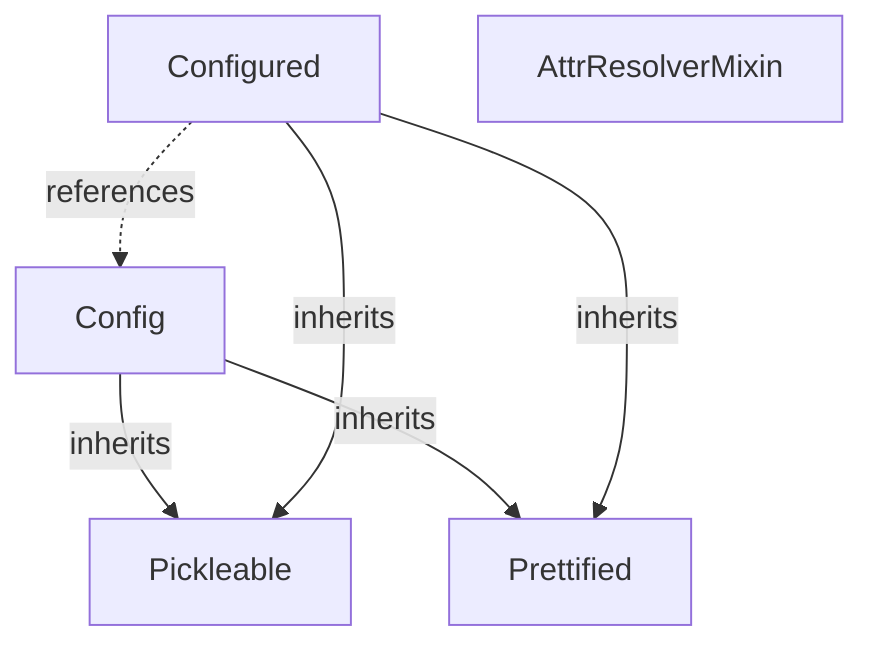

# Vectorbtpro_Docs - Fundamentals

**Pages:** 3

---

## Building blocks

**URL:** https://vectorbt.pro/pvt_ff8edc14/documentation/building-blocks.md

**Contents:**
- Utilities
  - Formatting
  - Pickling
  - Configuring
  - Attribute resolution
  - Templating
- Base
  - Grouping
  - Indexing
  - Wrapping

In the following sections, we will explore some sub-packages, modules, and especially classes that serve as building blocks for advanced functionalities in VBT, such as [Portfolio](https://vectorbt.pro/pvt_ff8edc14/api/portfolio/base/#vectorbtpro.portfolio.base.Portfolio). To demonstrate this, we will gradually build a custom class, `CorrStats`, which enables us to analyze the correlation between two arrays in the most efficient and flexible way :brain:

(Reload the page if the diagram does not appear.)

VBT uses a modular project structure composed of several subpackages. Each subpackage is designed for a specific area of analysis.

The [utils](https://vectorbt.pro/pvt_ff8edc14/api/utils/) subpackage provides a set of utilities that power every part of VBT :zap: These utilities are loosely connected and offer small but powerful reusable code snippets that can be used independently of other functionality.

!!! info The main reason we avoid importing third-party packages and instead implement many utilities from scratch is to maintain full control over execution and code quality.

VBT includes its own formatting engine that can pretty-print any Python object. It is much more advanced than formatting with [JSON](https://en.wikipedia.org/wiki/JSON) because it recognizes native Python data types and adds intelligent formatting for more structured data types, such as `np.dtype` and `namedtuple`. In many cases, you can even convert the formatted string back into a Python object using `eval`.

Let's beautify a nested dictionary using [prettify](https://vectorbt.pro/pvt_ff8edc14/api/utils/formatting/#vectorbtpro.utils.formatting.prettify) and then convert the string back into an object:

!!! tip Curious why we used `vbt.prettify` instead of `vbt.utils.formatting.prettify`? Any utility that may be useful to the end user can be accessed directly from `vbt`.

The [Prettified](https://vectorbt.pro/pvt*ff8edc14/api/utils/pickling/#vectorbtpro.utils.formatting.Prettified) class implements the abstract method [Prettified.prettify](https://vectorbt.pro/pvt*ff8edc14/api/utils/formatting/#vectorbtpro.utils.formatting.Prettified.prettify), which can be overridden by a subclass to pretty-print an instance using [prettify](https://vectorbt.pro/pvt_ff8edc14/api/utils/formatting/#vectorbtpro.utils.formatting.prettify). Read below to learn how this method can be used to introspect instances of various classes.

Pickling is the process of converting a Python object into a byte stream to store it in a file or database. The [Pickleable](https://vectorbt.pro/pvt*ff8edc14/api/utils/pickling/#vectorbtpro.utils.pickling.Pickleable) class enables pickling of objects of any complexity using [Dill](https://dill.readthedocs.io/en/latest/) (or [pickle](https://docs.python.org/3/library/pickle.html) if Dill is not installed). Each subclass inherits ready-to-use methods for serializing, deserializing, saving to a file, and loading from a file. This is especially powerful because it allows us to persist objects containing any type of data, including instances of [Data](https://vectorbt.pro/pvt*ff8edc14/api/data/base/#vectorbtpro.data.base.Data) and [Portfolio](https://vectorbt.pro/pvt_ff8edc14/api/portfolio/base/#vectorbtpro.portfolio.base.Portfolio).

VBT relies heavily on automation driven by specifications. The specification for most repetitive tasks is usually stored in "configs," which serve as settings for specific tasks, data structures, or even classes. This approach makes most parts of VBT transparent, easily traversable, and programmatically changeable.

The [Config](https://vectorbt.pro/pvt*ff8edc14/api/utils/config/#vectorbtpro.utils.config.Config) class is like a dictionary on steroids: it extends Python's `dict` with various configuration features, such as frozen keys, read-only values, dot notation access to keys, and nested updates. The most notable feature is the ability to reset a config to its initial state and even create checkpoints, which is especially useful for settings. In addition, since [Config](https://vectorbt.pro/pvt*ff8edc14/api/utils/config/#vectorbtpro.utils.config.Config) inherits from [Pickleable](https://vectorbt.pro/pvt*ff8edc14/api/utils/pickling/#vectorbtpro.utils.pickling.Pickleable), we can save any configuration to disk, and by subclassing [Prettified](https://vectorbt.pro/pvt*ff8edc14/api/utils/pickling/#vectorbtpro.utils.formatting.Prettified) we can beautify it (this approach is used to generate the API reference):

Configs are very common structures in VBT. There are three main types of configs (that either subclass or partially use [Config](https://vectorbt.pro/pvt_ff8edc14/api/utils/config/#vectorbtpro.utils.config.Config)) used throughout VBT:

that are not meant to be modified, such as [nb*config](https://vectorbt.pro/pvt*ff8edc14/api/generic/accessors/#vectorbtpro.generic.accessors.nb*config), which is used to attach a number of Numba-compiled functions to [GenericAccessor](https://vectorbt.pro/pvt*ff8edc14/api/generic/accessors/#vectorbtpro.generic.accessors.GenericAccessor) only once when importing VBT. Since modifications would have no effect anyway, these configs are locked.

that are intended to be modified. The best examples are [Portfolio.metrics](https://vectorbt.pro/pvt*ff8edc14/api/portfolio/base/#vectorbtpro.portfolio.base.Portfolio.metrics) and [Portfolio.subplots](https://vectorbt.pro/pvt*ff8edc14/api/portfolio/base/#vectorbtpro.portfolio.base.Portfolio.subplots), which list all the metrics and subplots supported by [Portfolio](https://vectorbt.pro/pvt_ff8edc14/api/portfolio/base/#vectorbtpro.portfolio.base.Portfolio). They can be easily changed and extended, and reset if you make breaking changes.

defined in [*settings](https://vectorbt.pro/pvt*ff8edc14/api/*settings/). It is a custom subclass of [Config](https://vectorbt.pro/pvt*ff8edc14/api/utils/config/#vectorbtpro.utils.config.Config) that can change Plotly themes and convert any sub-configs of type `dict` to smaller settings accessible via dot notation (`vbt.settings.portfolio.log` instead of `vbt.settings['portfolio']['log']`).

You can create a config just like a regular `dict`. To provide options for the config, use the `options_` argument (note the trailing underscore):

In addition to the cases above, [Config](https://vectorbt.pro/pvt*ff8edc14/api/utils/config/#vectorbtpro.utils.config.Config) is also used by the [Configured](https://vectorbt.pro/pvt*ff8edc14/api/utils/config/#vectorbtpro.utils.config.Configured) class, which is a base class for most core classes in VBT. This read-only class holds a config of type [Config](https://vectorbt.pro/pvt*ff8edc14/api/utils/config/#vectorbtpro.utils.config.Config) containing all arguments passed during initialization. Any time you initialize a subclass of [Configured](https://vectorbt.pro/pvt*ff8edc14/api/utils/config/#vectorbtpro.utils.config.Configured), all named arguments you pass to the initializer (`**init**`) are stored inside [Configured.config](https://vectorbt.pro/pvt_ff8edc14/api/utils/config/#vectorbtpro.utils.config.Configured.config). In this way, the created instance is described and managed entirely by its config:

(`new*instance = ConfiguredClass(**old*instance.config)`).

The main requirement for all of this to work correctly is **immutability**. This brings us to an important design decision: most classes in VBT to be immutable (read-only), and it is discouraged to change any attribute unless it is listed in a special variable called `*writeable*attrs`. There are several reasons why immutability is required:

Let's create a custom class that returns some correlation statistics of two arrays. Specifically, it will compute the Pearson correlation coefficient and its rolling version using Pandas.

This is how most configured classes in VBT, such as [Portfolio](https://vectorbt.pro/pvt*ff8edc14/api/portfolio/base/#vectorbtpro.portfolio.base.Portfolio), are designed. Any argument passed to `CorrStats` is forwarded to [Configured](https://vectorbt.pro/pvt*ff8edc14/api/utils/config/#vectorbtpro.utils.config.Configured) to create a new config:

Access to any attribute is read-only. If you try to set a read-only property or modify the config, an expected error will be raised:

However, it will not (and cannot) throw an error when setting a private attribute (with a leading underscore) or if any of the attributes are modified in place, which is a common pitfall to avoid.

!!! warning VBT assumes that the data in a configured instance always remains the same. If there is a change to the data, VBT will not register it, and this can result in erroneous outcomes later.

To change any data, pass the new value to [Configured.replace](https://vectorbt.pro/pvt_ff8edc14/api/utils/config/#vectorbtpro.utils.config.Configured.replace), which takes the same arguments as the class, but as keyword-only arguments. These are merged with the old config and then passed as keyword arguments to the class for instantiation.

Now that all of our data is stored inside a config, we can perform actions on the instance just as we would on the config itself, such as saving to disk (thanks to [Pickling](#pickling)):

Attribute resolution is useful for accessing attributes by strings or based on specific logic, which is implemented by the [AttrResolverMixin](https://vectorbt.pro/pvt*ff8edc14/api/utils/attr*/#vectorbtpro.utils.attr*.AttrResolverMixin). You can think of it as adding custom logic to the `getattr` operation. It is used extensively in [StatsBuilderMixin](https://vectorbt.pro/pvt*ff8edc14/api/generic/stats*builder/#vectorbtpro.generic.stats*builder.StatsBuilderMixin) and [PlotsBuilderMixin](https://vectorbt.pro/pvt*ff8edc14/api/generic/plots*builder/#vectorbtpro.generic.plots*builder.PlotsBuilderMixin) to execute metrics and subplots as chains of commands. In other classes, such as [Portfolio](https://vectorbt.pro/pvt*ff8edc14/api/portfolio/base/#vectorbtpro.portfolio.base.Portfolio), it is used for accessing shortcut properties, caching attribute access, and more. It works with [deep*getattr](https://vectorbt.pro/pvt*ff8edc14/api/utils/attr*/#vectorbtpro.utils.attr*.deep_getattr), which accesses a chain of attributes provided as a specification.

Let's compute the minimum of the rolling mean using only Pandas and deep attribute resolution:

If any of the above operations were performed on a subclass of [AttrResolverMixin](https://vectorbt.pro/pvt*ff8edc14/api/utils/attr*/#vectorbtpro.utils.attr_.AttrResolverMixin), they could be easily preprocessed and postprocessed.

Templates play an important role in the VBT stem. They allow you to postpone data resolution until more information becomes available. There are several templating classes, such as [Rep](https://vectorbt.pro/pvt*ff8edc14/api/utils/template/#vectorbtpro.utils.template.Rep) for replacing an entire string, and [Sub](https://vectorbt.pro/pvt*ff8edc14/api/utils/template/#vectorbtpro.utils.template.Sub) for substituting only parts of a string (those starting with `$`).

You can think of templates as callbacks that are executed at some point during execution, usually after broadcasting or merging keyword arguments. Some functions provide multiple possible substitution points; in such cases, they may try to substitute the template multiple times until successful, or match the template with a specific evaluation id (`eval*id`), if given. The actual evaluation is performed by [substitute*templates](https://vectorbt.pro/pvt*ff8edc14/api/utils/template/#vectorbtpro.utils.template.substitute*templates).

The [base](https://vectorbt.pro/pvt*ff8edc14/api/base/) subpackage is the non-computational core of VBT. It offers a variety of modules for working with and converting between Pandas and NumPy objects. In particular, it provides functions and classes for broadcasting, combining, and wrapping NumPy arrays, grouping columns, managing [MultiIndex](https://pandas.pydata.org/pandas-docs/stable/user*guide/advanced.html), and more. These operations are essential for extending Pandas and reproducing some of its functionality in custom classes.

Since VBT is often used to process multi-column data, where each column (or "line") represents a separate backtesting instance, being able to group these columns into different groups is an essential feature.

The [Grouper](https://vectorbt.pro/pvt_ff8edc14/api/base/grouping/#vectorbtpro.base.grouping.base.Grouper) class provides functionality to validate and build groups from any Pandas Index, especially columns. It can translate various metadata, such as [GroupBy objects](https://pandas.pydata.org/docs/reference/groupby.html) and column levels, into special NumPy arrays that can be used by Numba-compiled functions to aggregate multiple columns of data. This is particularly useful for multi-asset portfolios, where each group contains one or more assets.

In VBT, the main purpose of indexing is to provide Pandas-style indexing to any custom class that holds Pandas-like objects, allowing you to select rows, columns, and groups in each object. This is done by forwarding a Pandas indexing operation to each Pandas-like object and instantiating the class using them. This can be done easily with [Configured](https://vectorbt.pro/pvt_ff8edc14/api/utils/config/#vectorbtpro.utils.config.Configured). With this approach, you can index complex classes that contain many Pandas-like objects using a single command.

The main indexer class, [PandasIndexer](https://vectorbt.pro/pvt*ff8edc14/api/base/indexing/#vectorbtpro.base.indexing.PandasIndexer), mimics a regular Pandas object by exposing the properties [PandasIndexer.iloc](https://vectorbt.pro/pvt*ff8edc14/api/base/indexing/#vectorbtpro.base.indexing.PandasIndexer.iloc), [PandasIndexer.loc](https://vectorbt.pro/pvt*ff8edc14/api/base/indexing/#vectorbtpro.base.indexing.PandasIndexer.loc), and [PandasIndexer.xs](https://vectorbt.pro/pvt*ff8edc14/api/base/indexing/#vectorbtpro.base.indexing.PandasIndexer.xs). To use this, simply subclass this class and override [IndexingBase.indexing*func](https://vectorbt.pro/pvt*ff8edc14/api/base/indexing/#vectorbtpro.base.indexing.IndexingBase.indexing*func), which should accept `pd*indexing_func`, apply it to each Pandas-like object, and initialize a new instance.

Let's extend our previously created `CorrStats` class with Pandas indexing:

We just indexed two Pandas objects as a single entity. Yay!

Remember that VBT specializes in taking a Pandas object, extracting its NumPy array, processing the array, and converting the results back to a Pandas format? The last part is handled by the [ArrayWrapper](https://vectorbt.pro/pvt*ff8edc14/api/base/wrapping/#vectorbtpro.base.wrapping.ArrayWrapper) class, which captures all the necessary metadata, such as the index, columns, and number of dimensions, and provides methods like [ArrayWrapper.wrap](https://vectorbt.pro/pvt*ff8edc14/api/base/wrapping/#vectorbtpro.base.wrapping.ArrayWrapper.wrap) to convert a NumPy object back into a Pandas format.

The [ArrayWrapper](https://vectorbt.pro/pvt_ff8edc14/api/base/wrapping/#vectorbtpro.base.wrapping.ArrayWrapper) class integrates many concepts we discussed earlier to behave like a (supercharged) Pandas object. Notably, it uses [Grouping](#grouping) to build and manage groups of columns and [Indexing](#indexing) to select rows, columns, and groups with Pandas-style indexing. Some of the most powerful features of an array wrapper are 1) the ability to behave like a grouped object, which is not possible with Pandas alone, and 2) the ability to translate a Pandas indexing operation into a range of integer arrays that can be used to index NumPy arrays. This allows for indexing without having to hold Pandas objects, just the wrapper.

You can construct a wrapper in several ways, with the easiest being from a Pandas object:

Now, let's create a function that sums all elements in each column using NumPy and returns a standard Pandas object:

The function above is already 20x faster than Pandas :exploding_head:

Since [ArrayWrapper](https://vectorbt.pro/pvt_ff8edc14/api/base/wrapping/#vectorbtpro.base.wrapping.ArrayWrapper) can manage groups of columns, let's adapt our function to sum all elements over each group of columns:

To avoid creating multiple array wrappers with the same metadata, the [Wrapping](https://vectorbt.pro/pvt*ff8edc14/api/base/wrapping/#vectorbtpro.base.wrapping.Wrapping) class binds a single instance of [ArrayWrapper](https://vectorbt.pro/pvt*ff8edc14/api/base/wrapping/#vectorbtpro.base.wrapping.ArrayWrapper) to manage any number of array-like objects with compatible shapes. Instead of accepting multiple Pandas objects, it takes an array wrapper and any number of objects and arrays in any format (preferably NumPy), and wraps them using this wrapper. In addition, any [Wrapping](https://vectorbt.pro/pvt*ff8edc14/api/base/wrapping/#vectorbtpro.base.wrapping.Wrapping) subclass can use its wrapper to perform Pandas indexing on any kind of object, including NumPy arrays. This is possible because [ArrayWrapper](https://vectorbt.pro/pvt*ff8edc14/api/base/wrapping/#vectorbtpro.base.wrapping.ArrayWrapper) can translate a Pandas indexing operation into universal row, column, and group indices.

Returning to our `CorrStats` class, there are two issues with the current implementation:

Let's upgrade our `CorrStats` class to work on NumPy arrays and with an array wrapper:

(or set `*expected*keys=None` to disable).

rows and columns, applies them to both NumPy arrays, and creates a new `CorrStats` instance.

As you may have noticed, we replaced the superclasses [Configured](https://vectorbt.pro/pvt*ff8edc14/api/utils/config/#vectorbtpro.utils.config.Configured) and [PandasIndexer](https://vectorbt.pro/pvt*ff8edc14/api/base/indexing/#vectorbtpro.base.indexing.PandasIndexer) with the single superclass [Wrapping](https://vectorbt.pro/pvt*ff8edc14/api/base/wrapping/#vectorbtpro.base.wrapping.Wrapping), which already inherits both. Another change is in the arguments taken by `CorrStats`: instead of taking two Pandas objects, it now accepts a `wrapper` of type [ArrayWrapper](https://vectorbt.pro/pvt*ff8edc14/api/base/wrapping/#vectorbtpro.base.wrapping.ArrayWrapper) along with the NumPy arrays `obj1` and `obj2`. This has several benefits: we keep the Pandas metadata consistent and managed by a single variable, while all calculations are efficiently performed using only NumPy. Whenever we need to present results, we can call [ArrayWrapper.wrap*reduced](https://vectorbt.pro/pvt*ff8edc14/api/base/wrapping/#vectorbtpro.base.wrapping.ArrayWrapper.wrap*reduced) and [ArrayWrapper.wrap](https://vectorbt.pro/pvt*ff8edc14/api/base/wrapping/#vectorbtpro.base.wrapping.ArrayWrapper.wrap) to convert them back into Pandas format, as is done inside the `CorrStats.corr` and `CorrStats.rolling_corr` methods.

Since we do not want to require users (or ourselves) to create an array wrapper manually, we also implemented the `CorrStats.from_objs` class method, which broadcasts both arrays and instantiates `CorrStats`. With this, you can provide any array-like objects, and `CorrStats` will automatically build the wrapper for you. Let's illustrate this by computing the correlation coefficient for `df1` and `df2`, and then for `df1` and a parameterized `df2`:

Here is why we switched from Pandas to Numba:

There is also an improvement regarding indexing. Because `obj1` and `obj2` are no longer regular Pandas objects, we cannot simply apply `pd*indexing*func` to them. Instead, we use the method [ArrayWrapper.indexing*func*meta](https://vectorbt.pro/pvt*ff8edc14/api/base/wrapping/#vectorbtpro.base.wrapping.ArrayWrapper.indexing*func_meta) to obtain the rows, columns, and groups that this operation would select. We then apply those arrays to both NumPy objects. This approach is especially useful because we can now select any data from the final shape.

!!! note Not all classes support indexing on rows. To ensure you can select rows, check whether the instance property `column*only*select` is False.

This demonstrates how most high-tier classes in VBT are built. As a general rule:

Pandas :arrow*right: NumPy/Numba :arrow*right: Pandas. The first stage builds a wrapper from Pandas objects, and the last stage uses the wrapper to present results to the user.

For example, `wrapper.ndim` returns the number of dimensions held by the current instance.

The constructor `**init**` is most likely reserved for internal use during indexing. (This is why we use `vbt.MA.run()` instead of `vbt.MA()`.)

even those with more complex layouts (see [Records](https://vectorbt.pro/pvt_ff8edc14/api/records/base/#vectorbtpro.records.base.Records)).

This subpackage also provides the [BaseAccessor](https://vectorbt.pro/pvt*ff8edc14/api/base/accessors/#vectorbtpro.base.accessors.BaseAccessor), which exposes many basic operations to the end user and serves as the superclass for all other accessors. It inherits from [Wrapping](https://vectorbt.pro/pvt*ff8edc14/api/base/wrapping/#vectorbtpro.base.wrapping.Wrapping), so it supports everything you can do with a custom `CorrStats` class. Why is it called the "base" accessor? Because it is the parent class for all other VBT accessors and provides core combining, reshaping, and indexing features. This includes functions such as [BaseAccessor.to*2d*array](https://vectorbt.pro/pvt*ff8edc14/api/base/accessors/#vectorbtpro.base.accessors.BaseAccessor.to*2d_array), which converts a Pandas object to a two-dimensional NumPy array.

Accessing the accessor is straightforward:

In this example, [Vbt*DFAccessor](https://vectorbt.pro/pvt*ff8edc14/api/accessors/#vectorbtpro.accessors.Vbt*DFAccessor) is the main accessor for DataFrames, and as you can see from its definition, [BaseAccessor](https://vectorbt.pro/pvt*ff8edc14/api/base/accessors/#vectorbtpro.base.accessors.BaseAccessor) is one of its superclasses.

Perhaps the most interesting method is [BaseAccessor.combine](https://vectorbt.pro/pvt*ff8edc14/api/base/accessors/#vectorbtpro.base.accessors.BaseAccessor.combine), which allows you to broadcast and combine the current Pandas object with any number of other array-like objects using the function `combine*func` (mainly with NumPy).

[BaseAccessor](https://vectorbt.pro/pvt*ff8edc14/api/base/accessors/#vectorbtpro.base.accessors.BaseAccessor) also implements a range of [unary](https://vectorbt.pro/pvt*ff8edc14/api/utils/magic*decorators/#vectorbtpro.utils.magic*decorators.unary*magic*config) and [binary](https://vectorbt.pro/pvt*ff8edc14/api/utils/magic*decorators/#vectorbtpro.utils.magic*decorators.binary*magic_config) magic methods using this feature. For example, let's call `BaseAccessor.**add**`, which implements addition:

!!! tip To learn more about :magic_wand: methods, see [A Guide to Python's Magic Methods](https://rszalski.github.io/magicmethods/).

All of these magic methods were added using class decorators. There are many class decorators for various tasks in VBT. Usually, they take a config and attach many attributes at once in an automated way.

The [generic](https://vectorbt.pro/pvt*ff8edc14/api/generic/) subpackage serves as the computational core of VBT. It includes modules for processing and plotting time series and numeric data in a broader sense. Most importantly, it provides an [arsenal](https://vectorbt.pro/pvt*ff8edc14/api/generic/nb/) of Numba-compiled functions to accelerate and extend Pandas! These functions power many features of VBT, from indicators to portfolio analysis. For now, let's focus on classes that could enhance our `CorrStats` class.

Builder [mixins](https://en.wikipedia.org/wiki/Mixin) are classes that, when subclassed by another class, enable building specific functionality from that class's attributes. Two main examples are [StatsBuilderMixin](https://vectorbt.pro/pvt*ff8edc14/api/generic/stats*builder/#vectorbtpro.generic.stats*builder.StatsBuilderMixin) and [PlotsBuilderMixin](https://vectorbt.pro/pvt*ff8edc14/api/generic/plots*builder/#vectorbtpro.generic.plots*builder.PlotsBuilderMixin). The first provides the method [StatsBuilderMixin.stats](https://vectorbt.pro/pvt*ff8edc14/api/generic/stats*builder/#vectorbtpro.generic.stats*builder.StatsBuilderMixin.stats) to compute various metrics. The second provides the method [PlotsBuilderMixin.plots](https://vectorbt.pro/pvt*ff8edc14/api/generic/plots*builder/#vectorbtpro.generic.plots*builder.PlotsBuilderMixin.plots) to display different subplots. Nearly every class that can analyze data subclasses both.

The [Analyzable](https://vectorbt.pro/pvt*ff8edc14/api/generic/analyzable/#vectorbtpro.generic.analyzable.Analyzable) class combines [Wrapping](https://vectorbt.pro/pvt*ff8edc14/api/base/wrapping/#vectorbtpro.base.wrapping.Wrapping) and the [Builder mixins](#builder-mixins). It brings together everything mentioned above to build a solid foundation for seamless data analysis. This is why it is subclassed by many high-level classes, such as [Portfolio](https://vectorbt.pro/pvt*ff8edc14/api/portfolio/base/#vectorbtpro.portfolio.base.Portfolio) and [Records](https://vectorbt.pro/pvt*ff8edc14/api/records/base/#vectorbtpro.records.base.Records).

So what are we waiting for? Let's adapt our `CorrStats` class to be analyzable!

We made a few changes: we replaced `Wrapping` with `Analyzable` and added some metrics and subplots based on `CorrStats.corr` and `CorrStats.rolling*corr`. That's all! Now we can pass any array-like objects to `CorrStats.from*objs`, which will return an instance ready to analyze the correlation between the objects. In particular, you can use `CorrStats.stats` and `CorrStats.plots`:

{: .iimg loading=lazy } {: .iimg loading=lazy }

There is nothing more satisfying than not having to write boilerplate code. Thanks to [Analyzable](https://vectorbt.pro/pvt_ff8edc14/api/generic/analyzable/#vectorbtpro.generic.analyzable.Analyzable), we can focus entirely on analysis while VBT takes care of everything else.

You do not have to look far to find a class that inherits from [Analyzable](https://vectorbt.pro/pvt*ff8edc14/api/generic/analyzable/#vectorbtpro.generic.analyzable.Analyzable): the [GenericAccessor](https://vectorbt.pro/pvt*ff8edc14/api/generic/accessors/#vectorbtpro.generic.accessors.GenericAccessor) class extends [BaseAccessor](https://vectorbt.pro/pvt_ff8edc14/api/base/accessors/#vectorbtpro.base.accessors.BaseAccessor) to provide statistics and plots for any numeric data. It is a one-size-fits-all class whose goal is to replicate, accelerate, and extend Pandas core functionality. It implements custom rolling, mapping, reducing, splitting, plotting, and many other methods, which can be used with any Series or DataFrame.

In short, [GenericAccessor](https://vectorbt.pro/pvt_ff8edc14/api/generic/accessors/#vectorbtpro.generic.accessors.GenericAccessor) offers the following:

as methods that mimic some of Pandas' most popular functions. Some have meta versions (accepting UDFs that take metadata instead of arrays) or can be used on grouped data.

[pandas.DataFrame.describe](https://pandas.pydata.org/docs/reference/api/pandas.DataFrame.describe.html).

Some methods even support interactive controls for analyzing groups of data.

Just like the [Base accessor](#base-accessor), the generic accessor uses [class decorators](https://vectorbt.pro/pvt*ff8edc14/api/generic/decorators/) and [configs](https://vectorbt.pro/pvt*ff8edc14/api/generic/accessors/#vectorbtpro.generic.accessors.nb_config) to attach many Numba-compiled and scikit-learn functions at once.

Usage is similar to `CorrStats`, except you can use the generic accessor directly on Pandas objects, since it is directly subclassed by [Vbt*DFAccessor](https://vectorbt.pro/pvt*ff8edc14/api/accessors/#vectorbtpro.accessors.Vbt_DFAccessor)!

Records are [structured arrays](https://numpy.org/doc/stable/user/basics.rec.html), which are NumPy arrays that can hold different data types, much like a Pandas DataFrame. Records have a major advantage over DataFrames: they are well supported by Numba, making it possible to generate and use them efficiently. So, what is the drawback? Records do not have (index) labels, and their API is very limited. As we [discussed](https://vectorbt.pro/pvt_ff8edc14/documentation/fundamentals/), VBT does not favor heterogeneous data and instead prefers to work with multiple homogeneous arrays (such as splitting OHLC into O, H, L, and C). Even so, records play an important role in our ecosystem as containers for event data.

Trading revolves around events: executing trades, combining them into positions, analyzing drawdowns, and more. Each event is a complex piece of data that needs a container optimized for fast writes and reads, especially inside Numba-compiled code (but do not use a list of dictionaries, as that is **very inefficient**). Structured arrays are the data structure we need! Each event is a record that holds all the necessary information, such as the column and row where it originally occurred.

Because structured arrays can be difficult to analyze, there is a dedicated class for this purpose: [Records](https://vectorbt.pro/pvt*ff8edc14/api/records/base/#vectorbtpro.records.base.Records)! By subclassing [Analyzable](https://vectorbt.pro/pvt*ff8edc14/api/generic/analyzable/#vectorbtpro.generic.analyzable.Analyzable), it wraps a structured NumPy array and provides useful tools for analysis. Every [Records](https://vectorbt.pro/pvt_ff8edc14/api/records/base/#vectorbtpro.records.base.Records) instance can be indexed like a regular Pandas object and can compute various metrics and plot graphs.

Let's generate [Drawdowns](https://vectorbt.pro/pvt_ff8edc14/api/generic/drawdowns/#vectorbtpro.generic.drawdowns.Drawdowns) records for two columns of time series data:

That's a lot of information! Each field is a standard NumPy array, so where does all this rich information come from? Surprisingly, the labels of the DataFrames above were automatically generated from the metadata that [Drawdowns](https://vectorbt.pro/pvt*ff8edc14/api/generic/drawdowns/#vectorbtpro.generic.drawdowns.Drawdowns) contains. This metadata is called a "field config," which is a regular [Config](https://vectorbt.pro/pvt*ff8edc14/api/utils/config/#vectorbtpro.utils.config.Config) describing each field (for example, [Drawdowns.field*config](https://vectorbt.pro/pvt*ff8edc14/api/generic/drawdowns/#vectorbtpro.generic.drawdowns.Drawdowns.field*config)). This setup enables automating and enhancing the behavior of each field. The class [Records](https://vectorbt.pro/pvt*ff8edc14/api/records/base/#vectorbtpro.records.base.Records), which is the base for all record classes, includes many methods to read and interpret this config.

Records are one-dimensional structured NumPy arrays. Records from multiple columns are concatenated into a single array, so we need a way to group them by column or group. For example, we might want to aggregate values by column. This is not a trivial task because finding which records correspond to a specific column requires searching through all records, which can be slow if done repeatedly. The [ColumnMapper](https://vectorbt.pro/pvt*ff8edc14/api/records/col*mapper/#vectorbtpro.records.col*mapper.ColumnMapper) class addresses this by indexing all columns just once and caching the results (see [ColumnMapper.col*map](https://vectorbt.pro/pvt*ff8edc14/api/records/col*mapper/#vectorbtpro.records.col*mapper.ColumnMapper.col*map)). A column mapper provides at least two more advantages: it allows for grouping columns and enables efficient [Indexing](#indexing).

The column map above tells us that column `a` has two records at indices 0 and 1, while column `b` has one record at index 2.

If [Records](https://vectorbt.pro/pvt*ff8edc14/api/records/base/#vectorbtpro.records.base.Records) is like our own DataFrame for events, then [MappedArray](https://vectorbt.pro/pvt*ff8edc14/api/records/mapped*array/#vectorbtpro.records.mapped*array.MappedArray) is like our own Series! Each field in records can be mapped into a *mapped* array. In fact, most calculations happen on a mapped array. It is similar to [GenericAccessor](https://vectorbt.pro/pvt_ff8edc14/api/generic/accessors/#vectorbtpro.generic.accessors.GenericAccessor), but it represents data in a completely different way: one-dimensional and clustered, rather than two-dimensional and column-wise. We can even seemingly convert between both representations. Why not simply convert a mapped array into a standard Series and do all analyses there? There are several reasons:

50 values than to convert them back and manage 9,999,950 NaNs.

Let's analyze the drawdown values in `drawdowns`:

Thanks to [ColumnMapper](https://vectorbt.pro/pvt*ff8edc14/api/records/col*mapper/#vectorbtpro.records.col*mapper.ColumnMapper) and [Analyzable](https://vectorbt.pro/pvt*ff8edc14/api/generic/analyzable/#vectorbtpro.generic.analyzable.Analyzable), we can select rows and columns from a mapped array just like from records or any regular Pandas object:

Thank you for following along all the way down here! The classes we just discussed form a solid foundation for data analysis with VBT. They implement design patterns that you will encounter in many other places throughout the codebase, making them easy to recognize and extend. In fact, the most advanced class, [Portfolio](https://vectorbt.pro/pvt_ff8edc14/api/portfolio/base/#vectorbtpro.portfolio.base.Portfolio), is very similar to our `CorrStats`.

You are now more than ready to use VBT, soldier :star2:

[:material-language-python: Python code](https://vectorbt.pro/pvt*ff8edc14/assets/jupytext/documentation/building-blocks.py.txt){ .md-button target="blank*" }

**Examples:**

Example 1 (mermaid):


Example 2 (pycon):
```pycon
>>> from vectorbtpro import *

>>> dct = {'planet' : {'has': {'plants': 'yes', 'animals': 'yes', 'cryptonite': 'no'}, 'name': 'Earth'}}
>>> print(vbt.prettify(dct))
{
    'planet': {
        'has': {
            'plants': 'yes',
            'animals': 'yes',
            'cryptonite': 'no'
        },
        'name': 'Earth'
    }
}

>>> eval(vbt.prettify(dct)) == dct
True
```

Example 3 (text):
```text
To see which utilities are accessible from the root of the package, visit
[vectorbtpro/utils/\_\_init\_\_.py](https://github.com/polakowo/vectorbt.pro/blob/main/vectorbtpro/utils/__init__.py)
or any other subpackage, and look for the objects that are listed in `__all__`.
```

Example 4 (pycon):
```pycon
>>> print(vbt.Records.field_config)
Config(
    dtype=None,
    settings={
        'id': {
            'name': 'id',
            'title': 'Id'
        },
        'col': {
            'name': 'col',
            'title': 'Column',
            'mapping': 'columns'
        },
        'idx': {
            'name': 'idx',
            'title': 'Timestamp',
            'mapping': 'index'
        }
    }
)
```

---

## Fundamentals

**URL:** https://vectorbt.pro/pvt_ff8edc14/documentation/fundamentals.md

**Contents:**
- Stack
- Accessors
- Multidimensionality
- Labels
- Broadcasting
- Flexible indexing

VBT was designed to address common performance challenges present in many backtesting libraries. It is built on the idea that each trading strategy instance can be represented in a vectorized format. This method allows multiple strategy instances to be combined into a single multi-dimensional array, enabling highly efficient processing and straightforward analysis.

Since trading data is time-series based, most aspects of backtesting can be represented as arrays. In particular, VBT works with [NumPy arrays](https://numpy.org/doc/stable/user/quickstart.html), which are ***very fast*** thanks to optimized, pre-compiled C code. NumPy arrays are supported by many scientific packages in the dynamic Python ecosystem, including Pandas, NumPy, and Numba. There is a good chance you have already used some of these packages!

While NumPy offers excellent performance, it is not always the most intuitive tool for time series analysis. Consider the following moving average example using NumPy:

While this approach is very fast, it can take some time to understand what is happening, and it requires experience to write such vectorized code correctly. What about other rolling functions used in more advanced indicators? And what about resampling, grouping, and other operations involving dates and times?

This is where [Pandas](https://pandas.pydata.org/docs/getting_started/overview.html) comes to the rescue! Pandas offers rich time series features, data alignment, NA-friendly statistics, groupby, merge and join methods, and many other useful tools. It has two primary data structures: [Series](https://pandas.pydata.org/docs/reference/api/pandas.Series.html) (one-dimensional) and [DataFrame](https://pandas.pydata.org/docs/reference/api/pandas.DataFrame.html) (two-dimensional). You can think of them as NumPy arrays enhanced with valuable information like timestamps and column names. Our moving average can be written in a single line:

VBT depends heavily on Pandas, but not in the way you might expect. Pandas has one major limitation for our purposes: it becomes slow when working with large datasets and user-defined functions. Many built-in functions like the rolling mean use [Cython](https://cython.org/) under the hood, making them fast enough. However, when you try to implement a more complex function, such as a rolling ranking metric involving multiple time series, things become complicated and slow. Additionally, what about functions that cannot be vectorized? For example, a portfolio strategy with money management cannot be simulated directly with vector calculations. In such cases, we need to write fast, iterative code that processes data element-by-element.

What if I told you there is a Python package that lets you run for-loops at machine code speed? And that it works seamlessly with NumPy and does not require you to heavily modify your Python code? This would solve many of our problems: our code would become incredibly fast while remaining easy to read. This package is [Numba](https://numba.pydata.org/numba-doc/latest/user/5minguide.html). Numba converts a subset of Python and NumPy code into efficient machine code.

Now we can clearly see what is happening: we loop over the time series one timestamp at a time, check if there is enough data in the window, and if so, calculate its mean. Not only does Numba help produce more readable and less error-prone code, it is also as fast as [C](https://en.wikipedia.org/wiki/C*(programming*language))!

!!! tip If you are curious about how VBT uses Numba, look for any directory or file named `nb`. [This sub-package](https://github.com/polakowo/vectorbt.pro/blob/main/vectorbtpro/generic/nb/) contains all the basic functions, while [this module](https://github.com/polakowo/vectorbt.pro/blob/main/vectorbtpro/portfolio/nb/from*order*func.py) handles some advanced topics (:warning: adults only).

So, where is the catch? Unfortunately, Numba only understands NumPy, not Pandas. This means we lose the datetime index and other features essential for time series analysis. This is where VBT comes in: it replicates many Pandas functions using Numba and even adds new features to them. As a result, we not only make a subset of Pandas faster, but also more powerful!

Here is how it works:

Notice how `vbt` is attached directly to the Series object? This is called [an accessor](https://pandas.pydata.org/docs/development/extending.html#registering-custom-accessors) – a convenient way to extend Pandas objects without subclassing them. With an accessor, you can easily switch between native Pandas and VBT functionality. In addition, each VBT method is flexible with inputs and can work on both Series and DataFrames.

You can learn more about VBT's accessors [here](https://vectorbt.pro/pvt*ff8edc14/api/accessors/). For example, `rolling*mean` is part of the accessor [GenericAccessor](https://vectorbt.pro/pvt*ff8edc14/api/generic/accessors/#vectorbtpro.generic.accessors.GenericAccessor), which you can access directly using `vbt`. Another popular accessor, [ReturnsAccessor](https://vectorbt.pro/pvt*ff8edc14/api/returns/accessors/#vectorbtpro.returns.accessors.ReturnsAccessor), is used for processing returns. It is a subclass of `GenericAccessor` and can be accessed using `vbt.returns`.

!!! important Each accessor expects the data to be in a ready-to-use format. For example, the accessor for working with returns expects the data to be returns, not prices!

Remember that VBT differs from traditional backtesters by handling trading data as multi-dimensional arrays. Specifically, VBT treats each column as a separate backtesting instance rather than a feature. Consider a simple OHLC DataFrame:

Here, the columns are separate features describing the same abstract object: price. Although it may feel natural to pass this DataFrame to VBT (as you might with [scikit-learn](https://scikit-learn.org/stable/) and other ML tools that expect DataFrames with features as columns), this approach has several drawbacks in backtesting:

replicated across all backtests, resulting in memory waste.

VBT manages this variability of features by processing them as separate arrays. So, instead of passing one large DataFrame, you provide each feature independently:

Now, if you want to process multiple abstract objects, such as ticker symbols, you can simply pass DataFrames instead of Series:

Here, each column (sometimes called a "line" in VBT) in each feature DataFrame represents a separate backtesting instance and creates a separate equity curve. So, adding another backtest is as easy as adding another column to the features :sparkles:

Keeping features separate has another major advantage: it lets us combine them easily. Even better, we can combine all backtesting instances at once using vectorization. For example, here we place an entry signal whenever the previous candle was green and an exit signal whenever the previous candle was red (this is a basic example for illustration):

The Pandas objects `multi*close` and `multi*open` can be Series or DataFrames of any shape, and our micro-pipeline will continue to work as expected.

In the example above, we created our multi-OHLC DataFrames with two columns, `p1` and `p2`, so we can easily identify them later during the analysis phase. For this reason, VBT ensures that these columns are preserved throughout the entire backtesting pipeline, from signal generation to performance modeling.

But what if individual columns represent more complex configurations, such as those involving multiple hyperparameter combinations? Storing complex objects as column labels would not work well in such cases. Fortunately, Pandas offers [hierarchical columns](https://pandas.pydata.org/pandas-docs/stable/user_guide/advanced.html), which are similar to regular columns but are stacked in multiple layers. Each level in this hierarchy can help us identify a specific input or parameter.

Take a simple crossover strategy as an example: it depends on the lengths of the fast and slow windows. Each of these hyperparameters becomes an additional dimension for manipulating data and is stored as a separate column level. Below is a more complex example showing the column hierarchy of a MACD indicator:

The columns above represent two different backtesting configurations that can now be easily analyzed and compared using Pandas. This is a powerful way to analyze data. For example, you could group your performance by `macd*fast*window` to see how the size of the fast window affects your strategy's profitability. Pretty magical, right?

One of the most important concepts in VBT is broadcasting. Since VBT functions take time series as independent arrays, they need to know how to connect elements across those arrays so that there is 1) complete information, 2) across all arrays, and 3) at each time step.

If all arrays are the same size, VBT can easily perform operations on an element-by-element basis. If any array is smaller in size, VBT tries to "stretch" it to match the length of the other arrays. This approach is heavily inspired by (and internally based on) [NumPy's broadcasting](https://numpy.org/doc/stable/user/basics.broadcasting.html). The main difference from NumPy is that one-dimensional arrays are always specified per row, since we are primarily working with time series data.

Why is broadcasting important? Because it allows you to pass array-like objects of any shape to almost every function in VBT, whether they are constants or full DataFrames, and VBT will automatically determine where each element belongs.

!!! tip As a rule of thumb:

Unlike NumPy and Pandas, VBT knows how to broadcast labels: if columns or individual column levels in both objects are different, they are stacked together. For example, you can check whenever the fast moving average is higher than the slow moving average, using the following window combinations: (2, 3) and (3, 4).

!!! tip Appending `.vbt` to a Pandas object on the left will broadcast both operands with VBT and execute the operation with NumPy/Numba. This gives you the ultimate combination of power and convenience :firecracker:

In contrast to Pandas, VBT broadcasts rows and columns by their absolute positions, not by their labels. This broadcasting style is very similar to how NumPy handles broadcasting:

!!! important If you pass multiple arrays of data to VBT, make sure that their columns line up positionally!

Another feature of VBT is its ability to broadcast objects with incompatible shapes but overlapping multi-index levels, meaning those that share the same name or values. Continuing with the previous example, let's check when the fast moving average is higher than the price:

And here is even more (stay with me): you can easily test multiple scalar-like hyperparameters by passing them as a Pandas Index. Let's see whether the price is within certain thresholds:

As you can see, smart broadcasting is :gem: when it comes to merging information. See [broadcast](https://vectorbt.pro/pvt_ff8edc14/api/base/reshaping/#vectorbtpro.base.reshaping.broadcast) to learn more about broadcasting principles and new ways to combine arrays.

Broadcasting many large arrays can use a lot of RAM and eventually slow down processing. That's why VBT introduces the concept of "flexible indexing", which selects one element from a one-dimensional or two-dimensional array of any shape. For example, if a one-dimensional array has only one element and needs to be broadcast along 1000 rows, VBT will return that one element regardless of which row is being queried, since this array would broadcast against any shape:

This is equivalent to:

Two-dimensional arrays offer more flexibility. Consider an example where you want to process 1000 columns, and you have several parameters to apply to each element. Some parameters might be scalars that are the same for every element, some might be one-dimensional arrays that repeat for each column, and some might be the same for each row. Instead of broadcasting these arrays fully, you can simply keep the number of their elements and expand them to two dimensions as needed so they will broadcast correctly with NumPy:

One nice feature of this approach is that such an operation adds almost no additional memory overhead and can broadcast in any direction, no matter how large the shape gets. This is one of the keys to how [Portfolio.from*signals](https://vectorbt.pro/pvt*ff8edc14/api/portfolio/base/#vectorbtpro.portfolio.base.Portfolio.from_signals) can broadcast more than 50 arguments without any loss of memory efficiency or performance :wink:

[:material-language-python: Python code](https://vectorbt.pro/pvt*ff8edc14/assets/jupytext/documentation/fundamentals.py.txt){ .md-button target="blank*" }

**Examples:**

Example 1 (pycon):
```pycon
>>> from vectorbtpro import *

>>> def rolling_window(a, window):
...     shape = a.shape[:-1] + (a.shape[-1] - window + 1, window)
...     strides = a.strides + (a.strides[-1],)
...     return np.lib.stride_tricks.as_strided(a, shape=shape, strides=strides)

>>> np.mean(rolling_window(np.arange(10), 3), axis=1)
array([1., 2., 3., 4., 5., 6., 7., 8.])
```

Example 2 (pycon):
```pycon
>>> index = vbt.date_range("2020-01-01", periods=10)
>>> sr = pd.Series(range(len(index)), index=index)
>>> sr.rolling(3).mean()
2020-01-01    NaN
2020-01-02    NaN
2020-01-03    1.0
2020-01-04    2.0
2020-01-05    3.0
2020-01-06    4.0
2020-01-07    5.0
2020-01-08    6.0
2020-01-09    7.0
2020-01-10    8.0
Freq: D, dtype: float64
```

Example 3 (pycon):
```pycon
>>> @njit
... def moving_average_nb(a, window_len):
...     b = np.empty_like(a, dtype=float_)
...     for i in range(len(a)):
...         window_start = max(0, i + 1 - window_len)
...         window_end = i + 1
...         if window_end - window_start < window_len:
...             b[i] = np.nan
...         else:
...             b[i] = np.mean(a[window_start:window_end])
...     return b

>>> moving_average_nb(np.arange(10), 3)
array([nan, nan, 1., 2., 3., 4., 5., 6., 7., 8.])
```

Example 4 (pycon):
```pycon
>>> big_a = np.arange(1000000)
>>> %timeit moving_average_nb.py_func(big_a, 10)  # (1)!
6.54 s ± 142 ms per loop (mean ± std. dev. of 7 runs, 1 loop each)

>>> %timeit np.mean(rolling_window(big_a, 10), axis=1)  # (2)!
24.7 ms ± 173 µs per loop (mean ± std. dev. of 7 runs, 10 loops each)

>>> %timeit pd.Series(big_a).rolling(10).mean()  # (3)!
10.2 ms ± 309 µs per loop (mean ± std. dev. of 7 runs, 100 loops each)

>>> %timeit moving_average_nb(big_a, 10)  # (4)!
5.12 ms ± 7.21 µs per loop (mean ± std. dev. of 7 runs, 100 loops each)
```

---

## Overview

**URL:** https://vectorbt.pro/pvt_ff8edc14/documentation/overview.md

Welcome to our documentation hub, your central resource for in-depth information about VBT's main features and functionalities. Here, you will find a list of the major documentation sections:

<div class="grid cards" markdown>

---
