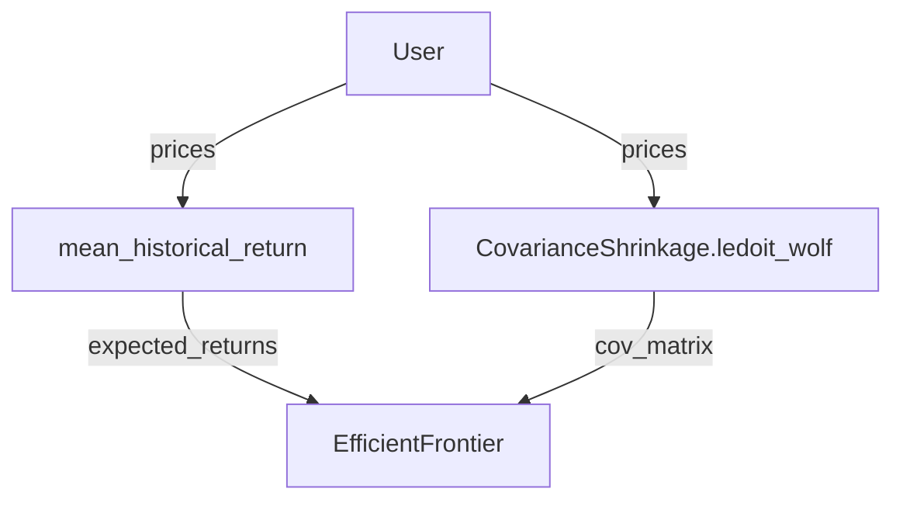

# Vectorbtpro_Docs - Optimization

**Pages:** 4

---

## Integrations

**URL:** https://vectorbt.pro/pvt_ff8edc14/tutorials/portfolio-optimization/integrations.md

**Contents:**
- PyPortfolioOpt
  - Parsing
  - Auto-optimization
  - Argument groups
  - Periodically
    - Manually
- Riskfolio-Lib
  - Parsing
  - Auto-optimization
  - Periodically

[PortfolioOptimizer](https://vectorbt.pro/pvt_ff8edc14/api/portfolio/pfopt/base/#vectorbtpro.portfolio.pfopt.base.PortfolioOptimizer) integrates smoothly with a variety of third-party libraries.

PyPortfolioOpt offers a variety of optimization methods that are very straightforward to use. The optimization process consists of several distinct steps, though some steps may be skipped depending on the optimizer:

base class in `pypfopt.base_optimizer`), including objectives, constraints, and the target.

For example, here is how to use mean-variance optimization (MVO) to maximize the Sharpe ratio:

Thanks to the excellent work of @robertmartin8, almost the entire PyPortfolioOpt codebase (with a few exceptions) uses consistent argument and function names. This consistency allows us to create a semantic graph of functions that serve as inputs to other functions. Why is this important? Because the user only needs to provide the target function (for example, `EfficientFrontier.max_sharpe`), and we can automatically determine the entire call stack using just the pricing data! If the user provides any additional keyword arguments, we can identify which functions in the stack accept those arguments and pass them automatically.

For the example above, the graph looks like this:

(Reload the page if the diagram does not appear.)

This is where VBT comes into play. It implements the function [resolve*pypfopt*func*kwargs](https://vectorbt.pro/pvt*ff8edc14/api/portfolio/pfopt/base/#vectorbtpro.portfolio.pfopt.base.resolve*pypfopt*func_kwargs), which accepts any PyPortfolioOpt function and resolves its arguments. When a user-provided argument matches an argument in the function's signature, it marks that argument to be passed to the function. Let's try this out with expected returns:

Now, let's try this with `EfficientFrontier`:

Here, VBT automatically resolved the `expected*returns` and `cov*matrix` arguments using [resolve*pypfopt*expected*returns](https://vectorbt.pro/pvt*ff8edc14/api/portfolio/pfopt/base/#vectorbtpro.portfolio.pfopt.base.resolve*pypfopt*expected*returns) and [resolve*pypfopt*cov*matrix](https://vectorbt.pro/pvt*ff8edc14/api/portfolio/pfopt/base/#vectorbtpro.portfolio.pfopt.base.resolve*pypfopt*cov*matrix), respectively. If you provide these arguments manually, VBT will use them directly. You can also specify these arguments as strings to select the function used to generate them:

With the ability to parse and resolve function arguments, VBT provides the [pypfopt*optimize](https://vectorbt.pro/pvt*ff8edc14/api/portfolio/pfopt/base/#vectorbtpro.portfolio.pfopt.base.pypfopt_optimize) function, which takes user requirements and translates them into function calls. Using this function is very straightforward!

In summary, [pypfopt*optimize](https://vectorbt.pro/pvt*ff8edc14/api/portfolio/pfopt/base/#vectorbtpro.portfolio.pfopt.base.pypfopt*optimize) first resolves the optimizer by calling [resolve*pypfopt*optimizer](https://vectorbt.pro/pvt*ff8edc14/api/portfolio/pfopt/base/#vectorbtpro.portfolio.pfopt.base.resolve*pypfopt*optimizer). This triggers a cascade of argument resolutions by [parsing arguments](#parsing), including computing expected returns and the risk model for asset risk. It then adds objectives and constraints to the optimizer instance. Finally, it calls the target metric method (such as `max_sharpe`) or a custom convex or non-convex objective using the same parsing procedure as shown above. If desired, it can also convert continuous weights into discrete ones using `DiscreteAllocation`.

Since multiple PyPortfolioOpt functions may require the same argument that needs to be pre-computed, [pypfopt*optimize](https://vectorbt.pro/pvt*ff8edc14/api/portfolio/pfopt/base/#vectorbtpro.portfolio.pfopt.base.pypfopt*optimize) uses a built-in caching mechanism. If any provided arguments are not used, it issues a warning (which you can hide by setting `silence*warnings` to True) stating that the argument was not required by any function in the call stack.

Below, we will demonstrate different optimizations using both PyPortfolioOpt and VBT. For example, optimizing a long/short portfolio to minimize total variance:

=== "PyPortfolioOpt"

Optimizing a portfolio to maximize the Sharpe ratio, with direction constraints:

=== "PyPortfolioOpt"

Optimizing a portfolio to maximize the Sharpe ratio with sector constraints:

=== "PyPortfolioOpt"

Optimizing a portfolio to maximize return for a given risk, with sector constraints and an L2 regularization objective:

=== "PyPortfolioOpt"

Optimizing along the mean-semivariance frontier:

=== "PyPortfolioOpt"

Minimizing transaction costs:

=== "PyPortfolioOpt"

Custom convex objective:

=== "PyPortfolioOpt"

Custom non-convex objective:

=== "PyPortfolioOpt"

Black-Litterman Allocation ([read more](https://pyportfolioopt.readthedocs.io/en/latest/BlackLitterman.html)):

=== "PyPortfolioOpt"

Hierarchical Risk Parity ([read more](https://pyportfolioopt.readthedocs.io/en/latest/OtherOptimizers.html#hierarchical-risk-parity-hrp)):

=== "PyPortfolioOpt"

If you need to provide two functions with an argument that has the same name but requires different values, pass the argument as an instance of [pfopt*func*dict](https://vectorbt.pro/pvt*ff8edc14/api/portfolio/pfopt/base/#vectorbtpro.portfolio.pfopt.base.pfopt*func_dict). The keys should be the functions or their names, and the values should be the corresponding argument values:

So, why does VBT implement a special parser for PyPortfolioOpt instead of relying on the original, modular API of the library?

Using a single function that addresses all requirements makes it much simpler to use as an optimization function. For example, VBT applies sensible defaults for expected returns and other variables, and understands where each variable should be utilized. Also, passing arbitrary keyword arguments and having VBT distribute them across the relevant functions makes it easy to test multiple argument combinations using groups.

Let's see this in action with [PortfolioOptimizer.from*pypfopt](https://vectorbt.pro/pvt*ff8edc14/api/portfolio/pfopt/base/#vectorbtpro.portfolio.pfopt.base.PortfolioOptimizer.from*pypfopt), which uses [pypfopt*optimize](https://vectorbt.pro/pvt*ff8edc14/api/portfolio/pfopt/base/#vectorbtpro.portfolio.pfopt.base.pypfopt*optimize) as its `optimize_func`. Optimize for maximum Sharpe in each week:

{: .iimg loading=lazy } {: .iimg loading=lazy }

Now, see how easy it is to test several values for the `target` argument:

[PortfolioOptimizer](https://vectorbt.pro/pvt_ff8edc14/api/portfolio/pfopt/base/#vectorbtpro.portfolio.pfopt.base.PortfolioOptimizer) instance is always grouped.

[=100% "Group 3/3"]{: .candystripe .candystripe-animate }

{: .iimg loading=lazy } {: .iimg loading=lazy }

You can see that optimizing for maximum Sharpe provides the highest out-of-sample Sharpe. Great!

You can also manually wrap the [pypfopt*optimize](https://vectorbt.pro/pvt*ff8edc14/api/portfolio/pfopt/base/#vectorbtpro.portfolio.pfopt.base.pypfopt_optimize) function. This is useful, for example, when you want to preprocess the data or postprocess the weights:

Like PyPortfolioOpt, Riskfolio-Lib also offers a variety of portfolio optimization tools. A typical optimization workflow follows these steps:

that pre-calculate various statistics required for the optimization.

For example, here is how to perform mean-variance optimization (MVO) to maximize the Sharpe ratio:

!!! tip Why does `assets_stats` not return anything? It is because it calculates `mu` and `cov` and updates the portfolio attributes `port.mu` and `port.cov` in place.

The method described above for generating a vector of weights from vectors of returns works well, but splitting the optimization process across several function calls can make parameterization more challenging. Ideally, we want a single function that can express any Riskfolio-Lib setup, preferably using only keyword arguments. To create such a function that covers many cases, we need to identify the inputs and outputs of each function and understand how these functions connect. Thanks to the consistent naming of arguments and functions in Riskfolio-Lib (kudos to @dcajasn!), along with the [comprehensive tutorials](https://riskfolio-lib.readthedocs.io/en/latest/examples.html), we can determine the required order of function calls for each optimization task.

For example, the optimization method [Portfolio.optimization](https://riskfolio-lib.readthedocs.io/en/latest/portfolio.html#Portfolio.Portfolio.optimization) with the "Classic" model requires the statistics method [Portfolio.assets*stats](https://riskfolio-lib.readthedocs.io/en/latest/portfolio.html#Portfolio.Portfolio.assets*stats) to be called first. The "FM" model, on the other hand, requires both [Portfolio.assets*stats](https://riskfolio-lib.readthedocs.io/en/latest/portfolio.html#Portfolio.Portfolio.assets*stats) and [Portfolio.factors*stats](https://riskfolio-lib.readthedocs.io/en/latest/portfolio.html#Portfolio.Portfolio.factors*stats). If the user provides constraints, we need to pre-process them using the corresponding [constraints function](https://riskfolio-lib.readthedocs.io/en/latest/constraints.html).

Once we have established the call stack, how do we assign arguments to each function? We can check the signature of each function:

If the user provides an argument called `method*mu`, it should be passed to this function and any other function that lists this argument, since it likely serves the same purpose. To determine which arguments need to be given to a particular Riskfolio-Lib function, you can use the handy [resolve*riskfolio*func*kwargs](https://vectorbt.pro/pvt*ff8edc14/api/portfolio/pfopt/base/#vectorbtpro.portfolio.pfopt.base.resolve*riskfolio*func*kwargs) function:

If you need to override any argument for a specific function only, you can provide a `func_kwargs` dictionary with functions as keys and keyword arguments as values:

In this way, you can let VBT distribute the arguments automatically, but still have the option to manage it manually using `func_kwargs`.

Now that we know how to parse and resolve function arguments, VBT provides a function that can take a single set of keyword arguments and translate them into an optimization procedure: [riskfolio*optimize](https://vectorbt.pro/pvt*ff8edc14/api/portfolio/pfopt/base/#vectorbtpro.portfolio.pfopt.base.riskfolio_optimize). This function is just as easy to use as the one for PyPortfolioOpt!

Under the hood, the function first determines the portfolio class using the `port*cls` argument. It then creates a new portfolio instance, passing any keyword arguments that match the constructor method `**init**`. Next, it identifies the optimization method from the `opt*method` argument, which is set to `"optimization"` by default. Given the optimization method and the model (provided through the `model` argument), it can determine which statistics methods to run beforehand and in what order. The names of these statistics methods are stored in `stats*methods`, unless the user has already specified them. The next step is to resolve any asset classes, constraints, and views, translating them into keyword arguments suitable for the following functions in the call stack. For example, asset classes are pre-processed using [resolve*asset*classes](https://vectorbt.pro/pvt*ff8edc14/api/portfolio/pfopt/base/#vectorbtpro.portfolio.pfopt.base.resolve*asset*classes), which allows users to pass `asset_classes` using various formats that Riskfolio-Lib does not otherwise support. Once all keyword arguments are prepared, the function runs the statistics methods (if any), followed by the optimization method. It then returns the weights as a dictionary, using the column names (i.e., asset names) from the returns array as keys.

Below, we demonstrate several optimizations using both Riskfolio-Lib and VBT. Ulcer Index Portfolio Optimization for Mean Risk ([notebook](https://nbviewer.org/github/dcajasn/Riskfolio-Lib/tree/master/examples/)):

Worst Case Mean Variance Portfolio Optimization using box and elliptical uncertainty sets ([notebook](https://nbviewer.org/github/dcajasn/Riskfolio-Lib/tree/master/examples/)):

=== "VBT (using func_kwargs)"

Mean Variance Portfolio with Short Weights ([notebook](https://nbviewer.org/github/dcajasn/Riskfolio-Lib/tree/master/examples/)):

Constraints on Assets ([notebook](https://nbviewer.org/github/dcajasn/Riskfolio-Lib/tree/master/examples/)):

Constraints on Asset Classes ([notebook](https://nbviewer.org/github/dcajasn/Riskfolio-Lib/tree/master/examples/)):

Nested Clustered Optimization (NCO) ([notebook](https://nbviewer.org/github/dcajasn/Riskfolio-Lib/tree/master/examples/)):

!!! note If you receive the message "The problem doesn't have a solution with actual input parameters" when using the "MOSEK" solver, make sure you have installed and activated [MOSEK](https://www.mosek.com/). You can also try using "ECOS".

As mentioned earlier, having a single function to handle everything is not only easier to use, but its main advantage is that it can be parameterized and leveraged for rebalancing with [PortfolioOptimizer](https://vectorbt.pro/pvt*ff8edc14/api/portfolio/pfopt/base/#vectorbtpro.portfolio.pfopt.base.PortfolioOptimizer). Specifically, the optimization function shown above is used by the method [PortfolioOptimizer.from*riskfolio](https://vectorbt.pro/pvt*ff8edc14/api/portfolio/pfopt/base/#vectorbtpro.portfolio.pfopt.base.PortfolioOptimizer.from*riskfolio), which calls it on a periodic basis. Let's demonstrate its flexibility by optimizing for maximum Sharpe in the previous week:

{: .iimg loading=lazy } {: .iimg loading=lazy }

What about parameters? We can wrap any argument, even nested ones, with [Param](https://vectorbt.pro/pvt_ff8edc14/api/utils/params/#vectorbtpro.utils.params.Param) to test multiple parameter combinations. For example, let's test different maximum `BTCUSDT` weights to ensure constraints behave as expected:

[=100% "Group 3/3"]{: .candystripe .candystripe-animate }

It works perfectly :ok_hand:

!!! note To install this package, first install VBT, and then install universal-portfolios, not both together. Because its dependency versions are quite strict, you may want to ignore its dependencies altogether by running `pip install -U universal-portfolios --no-deps`.

Unlike PyPortfolioOpt, which generates weights for a specific time range, OLPS aims to select portfolio weights for each period to maximize final wealth. This means the generated weights always have the same shape as the original array.

Let's look at the uniform allocation (UCRP):

As you can see, Universal Portfolios generates and allocates weights at every single timestamp, which is not realistic in practice since rebalancing that frequently is unsustainable unless the data frequency is low. Also, iterating over this amount of data with this library is usually **quite slow**.

To address this, we should downsample the pricing array to a longer time frame, then upsample back to the original index. Let's try this with the `DynamicCRP` algorithm by first downsampling to a daily frequency:

Notice that the calculation still takes quite a bit of time, even though we have reduced the total number of reallocation timestamps by a factor of 24.

Next, let's bring these weights back to the original time frame:

This array is now ready to be used in a simulation.

To simplify this workflow, VBT provides the class method [PortfolioOptimizer.from*universal*algo](https://vectorbt.pro/pvt*ff8edc14/api/portfolio/pfopt/base/#vectorbtpro.portfolio.pfopt.base.PortfolioOptimizer.from*universal_algo), which runs the full simulation with Universal Portfolios and, once finished, selects allocations at specific dates from the resulting DataFrame. By default, it selects timestamps with non-NA, non-repeating weights. The method requires an algorithm (`algo`) and the pricing data (`S`) as input. The algorithm can be provided in several forms: as the name or instance of the algorithm class (which must be a subclass of `universal.algo.Algo`), or as the result of the algorithm (a `universal.result.AlgoResult` object).

Let's run the same algorithm as above, but now using [PortfolioOptimizer](https://vectorbt.pro/pvt_ff8edc14/api/portfolio/pfopt/base/#vectorbtpro.portfolio.pfopt.base.PortfolioOptimizer). We will also try several values for `n`:

[=100% "Group 4/4"]{: .candystripe .candystripe-animate }

{: .iimg loading=lazy } {: .iimg loading=lazy }

You can upsample the optimizer back to the original time frame by creating an instance of [Resampler](https://vectorbt.pro/pvt*ff8edc14/api/base/resampling/base/#vectorbtpro.base.resampling.base.Resampler) and passing it to [PortfolioOptimizer.resample](https://vectorbt.pro/pvt*ff8edc14/api/portfolio/pfopt/base/#vectorbtpro.portfolio.pfopt.base.PortfolioOptimizer.resample):

!!! note An allocation made at the end of a daily bar will be placed at the end of the first hourly bar on that day. This may not be desired if the allocation uses information from that daily bar. To address this, calculate and use the right bounds of both indexes with [Resampler.get*rbound*index](https://vectorbt.pro/pvt*ff8edc14/api/base/resampling/base/#vectorbtpro.base.resampling.base.Resampler.get*rbound_index).

Finally, use the new optimizer in a simulation:

Let's create a mean-reversion algorithm using Universal Portfolios. The idea is that stocks that have performed poorly will revert to the mean and may achieve higher returns than those trading above their mean.

{: .iimg loading=lazy } {: .iimg loading=lazy }

Now it's your turn: try creating and implementing a simple optimization strategy that could work in the real world. You may be surprised by how complex and fascinating some strategies can become after starting with something very basic :slightly*smiling*face:

[:material-language-python: Python code](https://vectorbt.pro/pvt*ff8edc14/assets/jupytext/tutorials/portfolio-optimization/integrations.py.txt){ .md-button target="blank*" } [:material-notebook-outline: Notebook](https://github.com/polakowo/vectorbt.pro/blob/notebooks/PortfolioOptimization.ipynb){ .md-button target="blank_" }

**Examples:**

Example 1 (pycon):
```pycon
>>> from pypfopt.expected_returns import mean_historical_return
>>> from pypfopt.risk_models import CovarianceShrinkage
>>> from pypfopt.efficient_frontier import EfficientFrontier

>>> expected_returns = mean_historical_return(data.get("Close"))
>>> cov_matrix = CovarianceShrinkage(data.get("Close")).ledoit_wolf()
>>> optimizer = EfficientFrontier(expected_returns, cov_matrix)
>>> weights = optimizer.max_sharpe()
>>> weights
OrderedDict([('ADAUSDT', 0.1166001117223088),
             ('BNBUSDT', 0.0),
             ('BTCUSDT', 0.0),
             ('ETHUSDT', 0.8833998882776911),
             ('XRPUSDT', 0.0)])
```

Example 2 (mermaid):


Example 3 (pycon):
```pycon
>>> from vectorbtpro.portfolio.pfopt.base import resolve_pypfopt_func_kwargs

>>> vbt.phelp(mean_historical_return)  # (1)!
mean_historical_return(
    prices,
    returns_data=False,
    compounding=True,
    frequency=252,
    log_returns=False
):
    Calculate annualised mean (daily) historical return from input (daily) asset prices.
    Use ``compounding`` to toggle between the default geometric mean (CAGR) and the
    arithmetic mean.

>>> print(vbt.prettify(resolve_pypfopt_func_kwargs(
...     mean_historical_return, 
...     prices=data.get("Close"),  # (2)!
...     freq="1h",  # (3)!
...     year_freq="365d",
...     other_arg=100  # (4)!
... )))
{
    'prices': <pandas.core.frame.DataFrame object at 0x7f9428052c50 of shape (8767, 5)>,
    'returns_data': False,
    'compounding': True,
    'frequency': 8760.0,
    'log_returns': False
}
```

Example 4 (pycon):
```pycon
>>> print(vbt.prettify(resolve_pypfopt_func_kwargs(
...     EfficientFrontier, 
...     prices=data.get("Close")
... )))
{
    'expected_returns': <pandas.core.series.Series object at 0x7f9479927128 of shape (5,)>,
    'cov_matrix': <pandas.core.frame.DataFrame object at 0x7f94280528d0 of shape (5, 5)>,
    'weight_bounds': (
        0,
        1
    ),
    'solver': None,
    'verbose': False,
    'solver_options': None
}
```

---

## pfopt

**URL:** https://vectorbt.pro/pvt_ff8edc14/api/portfolio/pfopt.md

**Contents:**
- Sub-modules

Package providing classes and utilities for portfolio optimization.

!!! info For default settings, see [pfopt](https://vectorbt.pro/pvt*ff8edc14/api/*settings/#vectorbtpro.*settings.pfopt "vectorbtpro.*settings.pfopt").

---

## Optimization

**URL:** https://vectorbt.pro/pvt_ff8edc14/features/optimization.md

**Contents:**
- Purged CV
- Paramables
- Lazy parameter grids
- Mono-chunks
- CV decorator
- Split decorator
- Conditional parameters
- Splitter
- Random search
- Parameterized decorator

{ loading=lazy }

CV with purging and embargoing, based on Marcos Lopez de Prado's [Advances in Financial Machine Learning](https://www.wiley.com/en-us/Advances+in+Financial+Machine+Learning-p-9781119482086).

{: .iimg loading=lazy } {: .iimg loading=lazy }

{ loading=lazy }

items, which are multiple objects of the same type, each containing only one column or group. This makes it possible to use VBT objects as standalone parameters and process only a subset of information at a time, such as a symbol in a data instance or a parameter combination in an indicator.

instances with only one column. Also, remove all columns where the fast window is greater than or equal to the slow window.

{ loading=lazy }

parameter grids if you are only interested in a subset of all parameter combinations. This change enables the generation of random parameter combinations almost instantly, no matter how large the total number of possible combinations is.

{ loading=lazy }

combinations into "mono-chunks," merging the parameter values within each chunk into a single value, and running the entire chunk with a single function call. This means you are no longer limited to processing only one parameter combination at a time :cloud_tornado: Keep in mind that your function must be adapted to handle multiple parameter values, and you should modify the merging function as needed.

{: .iimg loading=lazy } {: .iimg loading=lazy }

{ loading=lazy }

selecting the best parameter combination, and validating it on the test data. This process must be repeated for each split. The cross-validation decorator combines the parameterized and split decorators to automate this task.

!!! example "Tutorial" Learn more in the [Cross-validation](https://vectorbt.pro/pvt_ff8edc14/tutorials/cross-validation) tutorial.

[=100% "Split 7/7"]{: .candystripe .candystripe-animate }

{ loading=lazy }

at the input data provided to the function. This means that each time the input data changes, you must recreate the splitter. The split decorator automates this process by wrapping the function, giving it access to all arguments so it can make splitting decisions as needed. Essentially, it can "infect" any Python function with splitting functionality :microbe:

!!! example "Tutorial" Learn more in the [Cross-validation](https://vectorbt.pro/pvt_ff8edc14/tutorials/cross-validation) tutorial.

{ loading=lazy }

it makes no sense to test a fast window that is longer than the slow window. By filtering out such cases, you only need to evaluate about half as many parameter combinations.

{ loading=lazy }

and rule-based trading strategies. VBT provides a juggernaut class that supports many splitting schemes that are safe for backtesting, including rolling windows, expanding windows, time-anchored windows, random windows for block bootstraps, and even Pandas-native `groupby` and `resample` instructions such as "M" for monthly frequency. As a bonus, the produced splits can be easily analyzed and visualized! For example, you can detect any split or set overlaps, convert all splits into a single boolean mask for custom analysis, group splits and sets, and analyze their distribution relative to each other. This class contains more lines of code than the entire [backtesting.py](https://github.com/kernc/backtesting.py) package, so do not underestimate the new king in town! :rhinoceros:

!!! example "Tutorial" Learn more in the [Cross-validation](https://vectorbt.pro/pvt_ff8edc14/tutorials/cross-validation) tutorial.

{: .iimg loading=lazy } {: .iimg loading=lazy }

{ loading=lazy }

and tests random combinations of hyperparameters. This is especially useful when there is a huge number of parameter combinations. Random search has also been shown to find equal or better values than grid search with fewer function evaluations. The indicator factory, parameterized decorator, and any method that performs broadcasting now support random search out of the box.

{ loading=lazy }

parameter combinations, even if the function itself supports only one. The decorator wraps the function, gains access to its arguments, identifies all arguments acting as parameters, builds a grid from them, and calls the underlying function on each parameter combination from that grid. The execution can be easily parallelized. Once all outputs are ready, it merges them into a single object. Use cases are endless: from running indicators that cannot be wrapped with the indicator factory, to parameterizing entire pipelines! :magic_wand:

=== "Example 1: Basic SMA indicator"

=== "Example 2: Bollinger Bands pipeline"

{ loading=lazy }

for portfolio optimization that has been integrated into VBT. Integration was done by automating typical workflows inside Riskfolio-Lib and putting them into a single function, so many portfolio optimization problems can be expressed using a single set of keyword arguments and easily parameterized.

!!! example "Tutorial" Learn more in the [Portfolio optimization](https://vectorbt.pro/pvt_ff8edc14/tutorials/portfolio-optimization) tutorial.

{: .iimg loading=lazy } {: .iimg loading=lazy }

{ loading=lazy }

in VBT, such as SL and TP, are array-like and can be provided per row, per column, or even per element. Internally, even a scalar is treated as a regular time series and is broadcast along with other proper time series. Previously, to test multiple parameter combinations, you had to tile other time series so that all shapes matched perfectly. With this feature, the tiling procedure is performed automatically!

{: .iimg loading=lazy } {: .iimg loading=lazy }

{ loading=lazy }

{ loading=lazy }

and minimize risk. Usually, this process is performed periodically and involves generating new weights to rebalance an existing portfolio. As with most things in VBT, the weight generation step is implemented as a callback by the user, while the optimizer calls that callback periodically. The final result is a collection of returned weight allocations that can be analyzed, visualized, and used in actual simulations :pie:

!!! example "Tutorial" Learn more in the [Portfolio optimization](https://vectorbt.pro/pvt_ff8edc14/tutorials/portfolio-optimization) tutorial.

{: .iimg loading=lazy } {: .iimg loading=lazy }

{ loading=lazy }

optimization package that includes both classical methods (Markowitz 1952 and Black-Litterman), suggested best practices (such as covariance shrinkage), and many recent developments and novel features, like L2 regularization, shrunk covariance, and hierarchical risk parity.

!!! example "Tutorial" Learn more in the [Portfolio optimization](https://vectorbt.pro/pvt_ff8edc14/tutorials/portfolio-optimization) tutorial.

{: .iimg loading=lazy } {: .iimg loading=lazy }

{ loading=lazy }

brings together various Online Portfolio Selection (OLPS) algorithms.

!!! example "Tutorial" Learn more in the [Portfolio optimization](https://vectorbt.pro/pvt_ff8edc14/tutorials/portfolio-optimization) tutorial.

{: .iimg loading=lazy } {: .iimg loading=lazy }

[:material-language-python: Python code](https://vectorbt.pro/pvt*ff8edc14/assets/jupytext/features/optimization.py.txt){ .md-button target="blank*" }

**Examples:**

Example 1 (text):
```text
>>> splitter = vbt.Splitter.from_purged_kfold(
...     vbt.date_range("2024", "2025"), 
...     n_folds=10,
...     n_test_folds=2, 
...     purge_td="3 days",
...     embargo_td="3 days"
... )
>>> splitter.plots().show()
```

Example 2 (text):
```text
>>> @vbt.parameterized(merge_func="column_stack")
... def get_signals(fast_sma, slow_sma):  # (1)!
...     entries = fast_sma.crossed_above(slow_sma)
...     exits = fast_sma.crossed_below(slow_sma)
...     return entries, exits

>>> data = vbt.YFData.pull(["BTC-USD", "ETH-USD"])
>>> sma = data.run("talib:sma", timeperiod=range(20, 50, 2))  # (2)!
>>> fast_sma = sma.rename_levels({"sma_timeperiod": "fast"})  # (3)!
>>> slow_sma = sma.rename_levels({"sma_timeperiod": "slow"})
>>> entries, exits = get_signals(
...     vbt.Param(fast_sma, condition="__fast__ < __slow__"),  # (4)!
...     vbt.Param(slow_sma)
... )
>>> entries.columns
MultiIndex([(20, 22, 'BTC-USD'),
            (20, 22, 'ETH-USD'),
            (20, 24, 'BTC-USD'),
            (20, 24, 'ETH-USD'),
            (20, 26, 'BTC-USD'),
            (20, 26, 'ETH-USD'),
            ...
            (44, 46, 'BTC-USD'),
            (44, 46, 'ETH-USD'),
            (44, 48, 'BTC-USD'),
            (44, 48, 'ETH-USD'),
            (46, 48, 'BTC-USD'),
            (46, 48, 'ETH-USD')],
           names=['fast', 'slow', 'symbol'], length=210)
```

Example 3 (text):
```text
>>> @vbt.parameterized(merge_func="concat")
... def test_combination(data, n, sl_stop, tsl_stop, tp_stop):
...     return data.run(
...         "from_random_signals", 
...         n=n, 
...         sl_stop=sl_stop,
...         tsl_stop=tsl_stop,
...         tp_stop=tp_stop,
...     ).total_return

>>> n = np.arange(10, 100)
>>> sl_stop = np.arange(1, 1000) / 1000
>>> tsl_stop = np.arange(1, 1000) / 1000
>>> tp_stop = np.arange(1, 1000) / 1000
>>> len(n) * len(sl_stop) * len(tsl_stop) * len(tp_stop)
89730269910

>>> test_combination(
...     vbt.YFData.pull("BTC-USD"),
...     n=vbt.Param(n),
...     sl_stop=vbt.Param(sl_stop),
...     tsl_stop=vbt.Param(tsl_stop),
...     tp_stop=vbt.Param(tp_stop),
...     _random_subset=10
... )
n   sl_stop  tsl_stop  tp_stop
34  0.188    0.916     0.749       6.869901
44  0.176    0.734     0.550       6.186478
50  0.421    0.245     0.253       0.540188
51  0.033    0.951     0.344       6.514647
    0.915    0.461     0.322       2.915987
73  0.057    0.690     0.008      -0.204080
74  0.368    0.360     0.935      14.207262
76  0.771    0.342     0.187      -0.278499
83  0.796    0.788     0.730       6.450076
96  0.873    0.429     0.815      18.670965
dtype: float64
```

Example 4 (text):
```text
>>> @vbt.parameterized(
...     merge_func="concat", 
...     mono_chunk_len=100,  # (1)!
...     chunk_len="auto",  # (2)!
...     engine="threadpool",  # (3)!
...     warmup=True  # (4)!
... )  
... @njit(nogil=True)
... def test_stops_nb(close, entries, exits, sl_stop, tp_stop):
...     sim_out = vbt.pf_nb.from_signals_nb(
...         target_shape=(close.shape[0], sl_stop.shape[1]),
...         group_lens=np.full(sl_stop.shape[1], 1),
...         close=close,
...         long_entries=entries,
...         short_entries=exits,
...         sl_stop=sl_stop,
...         tp_stop=tp_stop,
...         save_returns=True
...     )
...     return vbt.ret_nb.total_return_nb(sim_out.in_outputs.returns)

>>> data = vbt.YFData.pull("BTC-USD", start="2020")  # (5)!
>>> entries, exits = data.run("randnx", n=10, hide_params=True, unpack=True)  # (6)!
>>> sharpe_ratios = test_stops_nb(
...     vbt.to_2d_array(data.close),
...     vbt.to_2d_array(entries),
...     vbt.to_2d_array(exits),
...     sl_stop=vbt.Param(np.arange(0.01, 1.0, 0.01), mono_merge_func=np.column_stack),  # (7)!
...     tp_stop=vbt.Param(np.arange(0.01, 1.0, 0.01), mono_merge_func=np.column_stack)
... )
>>> sharpe_ratios.vbt.heatmap().show()
```

---

## Optimization

**URL:** https://vectorbt.pro/pvt_ff8edc14/cookbook/optimization.md

**Contents:**
- Parameterization
  - Decoration
  - Merging
  - Generation
    - Pre-generation
  - Execution
  - Total or partial?
  - Flat or nested?
  - Skipping
- Hybrid (mono-chunks)

Optimization involves running a function with various configurations to improve the performance of a strategy or to enhance the CPU or RAM efficiency of a pipeline.

!!! question Learn more in [Pairs trading tutorial](https://vectorbt.pro/pvt_ff8edc14/tutorials/pairs-trading/).

The simplest approach is to test one parameter combination at a time. This method uses minimal RAM, but it may take longer to run if the function is not written in pure Numba and has a fixed overhead (such as converting from Pandas to NumPy and back), which increases the total execution time for each run. To use this approach, create a pipeline function that accepts individual parameter values and decorate it with [`@vbt.parameterized`](https://vectorbt.pro/pvt*ff8edc14/api/utils/params/#vectorbtpro.utils.params.parameterized). To test multiple parameters, wrap each parameter argument with [Param](https://vectorbt.pro/pvt*ff8edc14/api/utils/params/#vectorbtpro.utils.params.Param).

!!! example See an example in [Parameterized decorator](https://vectorbt.pro/pvt_ff8edc14/features/optimization/#parameterized-decorator).

To parameterize any function, decorate (or wrap) it with `@vbt.parameterized`. This returns a new function with the same name and arguments as the original. The only difference is that the new function processes the provided arguments, builds all parameter combinations, invokes the original function for each combination, and merges the results of all combinations.

`fast*window` and `slow*window`. The decorator will pass them as single values.

<div class="separator-container"> <hr class="separator"> <span class="separator-text">+</span> <hr class="separator"> </div>

To keep the original function separate from the decorated one, you can apply the decorator after defining the function and assign the decorated function to a different name.

The code above returns a list of results, one for each parameter combination. To also return the grid of parameter combinations, pass `return*param*index=True` to the decorator. Alternatively, you can have VBT merge the results into one or more Pandas objects and attach the grid to their index or columns by specifying a merging function (see [resolve*merge*func](https://vectorbt.pro/pvt*ff8edc14/api/base/reshaping/#vectorbtpro.base.merging.resolve*merge_func)).

the parameter combinations as the index. This is useful for returning metrics like Sharpe ratio.

using the parameter combinations as the outermost column level. This is useful for indicator arrays.

DataFrame, using the parameter combinations as the outermost index level. Useful for cross-validation.

of arrays stacked along columns.

<div class="separator-container"> <hr class="separator"> <span class="separator-text">+</span> <hr class="separator"> </div>

You can also use annotations to specify the merging function or functions.

You can control the grid of parameter combinations using individual parameters. By default, VBT builds a Cartesian product of all parameters. To avoid building the product between certain parameters, assign them to the same product `level`. To filter out unwanted parameter configurations, specify a `condition` as a boolean expression using parameter names as variables. This condition is evaluated for each parameter combination, and only those returning True are kept. To change how a parameter appears in the parameter index, provide `keys` with human-readable strings. A parameter can also be hidden entirely by setting `hide=True`.

slow window (for example, 20 and 50 is valid, but 50 and 20 does not make sense).

same level and will not create another product.

and only one `threshold` level is displayed in the parameter index. Also, select a random subset of 1,000 parameter combinations.

prepending an underscore.

!!! example See an example in [Conditional parameters](https://vectorbt.pro/pvt_ff8edc14/features/optimization/#conditional-parameters).

!!! warning Testing 6 parameters with 10 values each generates a huge 1 million parameter combinations, so be careful not to make your grids too large. Otherwise, the grid generation alone will take a long time. This warning does not apply if you use `random*subset`. In that case, VBT selects random combinations dynamically instead of building the full grid. See [Lazy parameter grids](https://vectorbt.pro/pvt*ff8edc14/features/optimization/#lazy-parameter-grids) for an example.

<div class="separator-container"> <hr class="separator"> <span class="separator-text">+</span> <hr class="separator"> </div>

You can also use annotations to specify which arguments are parameters and their default configuration.

To obtain the generated parameter combinations before (or without) calling the `@vbt.parameterized` decorator, you can pass the same parameters to [combine*params](https://vectorbt.pro/pvt*ff8edc14/api/utils/params/#vectorbtpro.utils.params.combine_params).

Each parameter combination results in a single call to the pipeline function. To execute multiple calls in parallel, provide a dictionary named `execute*kwargs` containing keyword arguments that will be forwarded to the [execute](https://vectorbt.pro/pvt*ff8edc14/api/utils/execution/#vectorbtpro.utils.execution.execute) function, which handles chunking and execution of the function calls.

combinations within each chunk in parallel using multithreading (one parameter combination per thread), while executing chunks serially.

using multiprocessing (one chunk per process), while executing parameter combinations within each chunk serially.

`execute_kwargs` and passing it directly to the function.

wrap any of the dictionaries with `vbt.atomic_dict`.

!!! note Threads are easier and faster to spawn than processes. To execute a function in its own process, all inputs and parameters must be serialized and then deserialized, which adds overhead. Multithreading is preferred, but the function needs to release the GIL, so use Numba compiled functions with `nogil=True`, or only use NumPy.

<div class="separator-container"> <hr class="separator"> <span class="separator-text">+</span> <hr class="separator"> </div>

To run code before or after the entire process, or even before or after each individual chunk, [execute](https://vectorbt.pro/pvt_ff8edc14/api/utils/execution/#vectorbtpro.utils.execution.execute) provides several callbacks.

!!! tip This works not just with `@vbt.parameterized`, but also with other functions that use [execute](https://vectorbt.pro/pvt_ff8edc14/api/utils/execution/#vectorbtpro.utils.execution.execute) along with chunking!

You often need to decide whether your pipeline should be totally or partially parameterized. Total parameterization means running the entire pipeline for each parameter combination. This approach is simplest and is most suitable when parameters are used across several components of the pipeline, or when you want to sacrifice some speed for reduced memory usage.

<div class="separator-container"> <hr class="separator"> <span class="separator-text">+</span> <hr class="separator"> </div>

Partial parameterization is a good option when only a small part of the pipeline uses parameters, and the rest can process results from those parameterized components. This can lead to faster execution, but often results in higher memory usage.

Another decision to make is whether to use one decorator for all parameters (flat parameterization) or to place parameters across multiple decorators to implement a parameter hierarchy (nested parameterization). Use the former if you want to treat all parameters equally and combine them together for generation and processing. In this case, the order of the parameter combinations is determined by the order in which parameters are passed to the function. For example, the values of the first parameter will be processed sequentially, while the values of any additional parameter will be rotated.

`symbol`, `fast*window`, and `slow*window`—often unnecessarily!

<div class="separator-container"> <hr class="separator"> <span class="separator-text">+</span> <hr class="separator"> </div>

The second approach should be used if you want to set up your own custom parameter hierarchy. For example, you may want to process some parameters (such as in parallel) differently, limit the number of times certain parameters are invoked, or add special preprocessing or postprocessing to specific parameters.

Parameter combinations can be skipped dynamically by returning [NoResult](https://vectorbt.pro/pvt_ff8edc14/api/utils/params/#vectorbtpro.utils.params.NoResult) instead of an actual result.

The approach above calls the original function for each individual parameter combination, which can be slow when working with many combinations, especially if each function call comes with overhead, such as when converting a NumPy array to a Pandas object. Keep in mind that 1 millisecond of overhead adds up to about 17 minutes of extra execution time for one million combinations.

For functions that accept only one combination at a time, there is nothing (aside from parallelization) that can be done to speed them up. However, if your function can be modified to accept multiple combinations at once—where each parameter argument is an array rather than a single value—you can instruct `@vbt.parameterized` to merge all combinations into chunks and call the function on each chunk. This approach can greatly reduce the number of function calls.

of chunks, `mono*chunk*len` to specify the maximum combinations per chunk, or `mono*chunk*meta` to define chunk metadata directly.

single values like `fast*window` and `slow*window`. Each set of values contains combinations within the same chunk.

(which should include an outcome for each combination).

<div class="separator-container"> <hr class="separator"> <span class="separator-text">+</span> <hr class="separator"> </div>

By default, parameter values are passed as lists to the original function. To pass them as arrays, or in another format, set a merging function `mono*merge*func` for each parameter.

Execution works the same way as in [Parameterization](#parameterization), and chunks can be easily parallelized. However, keep an eye on RAM usage since multiple parameter combinations are processed at the same time.

!!! example Check out an example in [Mono-chunks](https://vectorbt.pro/pvt_ff8edc14/features/optimization/#mono-chunks).

Chunking is the process of splitting a value (such as an array) of one or more arguments into smaller parts (called chunks), running the function on each part, and then merging the results back together. This allows VBT to process only a subset of data at a time, which helps reduce RAM usage and improves performance through parallelization. Chunking is also highly convenient— most of the time, you do not need to modify your function, and you will get the same results whether or not chunking is enabled. To use chunking, create a pipeline function, decorate it with [`@vbt.chunked`](https://vectorbt.pro/pvt_ff8edc14/api/chunking/core/#vectorbtpro.chunking.core.chunked), and specify how arguments should be chunked and how results should be merged.

!!! example See an example in [Chunking](https://vectorbt.pro/pvt_ff8edc14/features/performance/#chunking).

To make any function chunkable, decorate (or wrap) it with `@vbt.chunked`. This returns a new function with the same name and arguments as the original. The only difference is that this new function processes the arguments, chunks them, calls the original function on each chunk, and then merges the results from all chunks.

as in [Hybrid (mono-chunks)](#hybrid-mono-chunks).

<div class="separator-container"> <hr class="separator"> <span class="separator-text">+</span> <hr class="separator"> </div>

To keep the original function separate from the decorated one, you can decorate it after its definition and assign a different name to the decorated function.

To chunk an argument, you need to provide a chunking specification for that argument. There are three main ways to specify this.

Approach 1: Pass a dictionary `arg*take*spec` to the decorator. This is the most versatile approach, as it allows chunking of any nested objects of arbitrary depth, such as lists inside lists.

optional, as newer versions of VBT can determine it automatically.

<div class="separator-container"> <hr class="separator"> <span class="separator-text">+</span> <hr class="separator"> </div>

Approach 2: Annotate the function. This is the most convenient approach, allowing you to specify chunking rules right next to each argument in the function definition.

a chunking annotation is a class or an instance. Providing the sizer is mostly optional, as newer versions of VBT can determine it automatically.

<div class="separator-container"> <hr class="separator"> <span class="separator-text">+</span> <hr class="separator"> </div>

Approach 3: Wrap argument values directly. This lets you switch chunking rules on the fly.

Merging and execution work in the same way as in [Parameterization](#parameterization).

You can combine the [parameterized decorator](#parameterization) and the chunked decorator to process only a subset of parameter combinations at a time, without needing to change the function's design as in [Hybrid (mono-chunks)](#hybrid-mono-chunks). Although super-chunking may not be as fast as mono-chunking, it is still useful when you want to process only part of the parameter combinations at a time (but not all; otherwise, you should just use `distribute="chunks"` in the parameterized decorator without the chunked decorator) to manage RAM usage, or when you need to perform preprocessing and/or postprocessing, such as flushing per batch of parameter combinations.

and super-chunks themselves execute in sequence.

of values. All sequences must have the same length.

Whenever VBT needs to execute a function on multiple sets of arguments, it uses the [execute](https://vectorbt.pro/pvt*ff8edc14/api/utils/execution/#vectorbtpro.utils.execution.execute) function. This function takes a list of tasks (functions and their arguments) and runs them using the engine selected by the user. It accepts all the same arguments that you usually provide in `execute*kwargs`.

<div class="separator-container"> <hr class="separator"> <span class="separator-text">+</span> <hr class="separator"> </div>

To parallelize a workflow inside a for-loop, place it in a function and decorate the function with [iterated](https://vectorbt.pro/pvt_ff8edc14/api/utils/execution/#vectorbtpro.utils.execution.iterated). Then, when you execute the decorated function, pass the total number of iterations or a range to the argument where you expect the iteration variable.

**Examples:**

Example 1 (text):
```text
@vbt.parameterized
def my_pipeline(data, fast_window, slow_window):  # (1)!
    ...
    return result  # (2)!

results = my_pipeline(  # (3)!
    data,
    vbt.Param(fast_windows),  # (4)!
    vbt.Param(slow_windows)
)
```

Example 2 (text):
```text
def my_pipeline(data, fast_window, slow_window):
    ...
    return result

my_param_pipeline = vbt.parameterized(my_pipeline)
results = my_param_pipeline(...)
```

Example 3 (text):
```text
@vbt.parameterized(return_param_index=True)  # (1)!
def my_pipeline(...):
    ...
    return result
    
results, param_index = my_pipeline(...)

# ______________________________________________________________

@vbt.parameterized(merge_func="concat")  # (2)!
def my_pipeline(...):
    ...
    return pf.sharpe_ratio
    
sharpe_ratio = my_pipeline(...)

# ______________________________________________________________

@vbt.parameterized(merge_func="concat")
def my_pipeline(...):
    ...
    return pf.sharpe_ratio, pf.win_rate
    
sharpe_ratio, win_rate = my_pipeline(...)

# ______________________________________________________________
    
@vbt.parameterized(merge_func="column_stack")  # (3)!
def my_pipeline(...):
    ...
    return entries, exits
    
entries, exits = my_pipeline(...)

# ______________________________________________________________

@vbt.parameterized(merge_func="row_stack")  # (4)!
def my_pipeline(...):
    ...
    return pf.value
    
value = my_pipeline(...)

# ______________________________________________________________

@vbt.parameterized(merge_func=("concat", "column_stack"))  # (5)!
def my_pipeline(...):
    ...
    return pf.sharpe_ratio, pf.value
    
sharpe_ratio, value = my_pipeline(...)

# ______________________________________________________________

def merge_func(results, param_index):
    return pd.Series(results, index=param_index)
    
@vbt.parameterized(
    merge_func=merge_func,  # (6)!
    merge_kwargs=dict(param_index=vbt.Rep("param_index"))  # (7)!
)
def my_pipeline(...):
    ...
    return pf.sharpe_ratio
    
sharpe_ratio = my_pipeline(...)
```

Example 4 (python):
```python
@vbt.parameterized
def my_pipeline(...) -> "concat":  # (1)!
    ...
    return result

# ______________________________________________________________

@vbt.parameterized
def my_pipeline(...) -> ("concat", "column_stack"):  # (2)!
    ...
    return result1, result2

# ______________________________________________________________

@vbt.parameterized
def my_pipeline(...) -> (  # (3)!
    vbt.MergeFunc("concat", wrap=False), 
    vbt.MergeFunc("column_stack", wrap=False)
):
    ...
    return result1, result2
```

---
