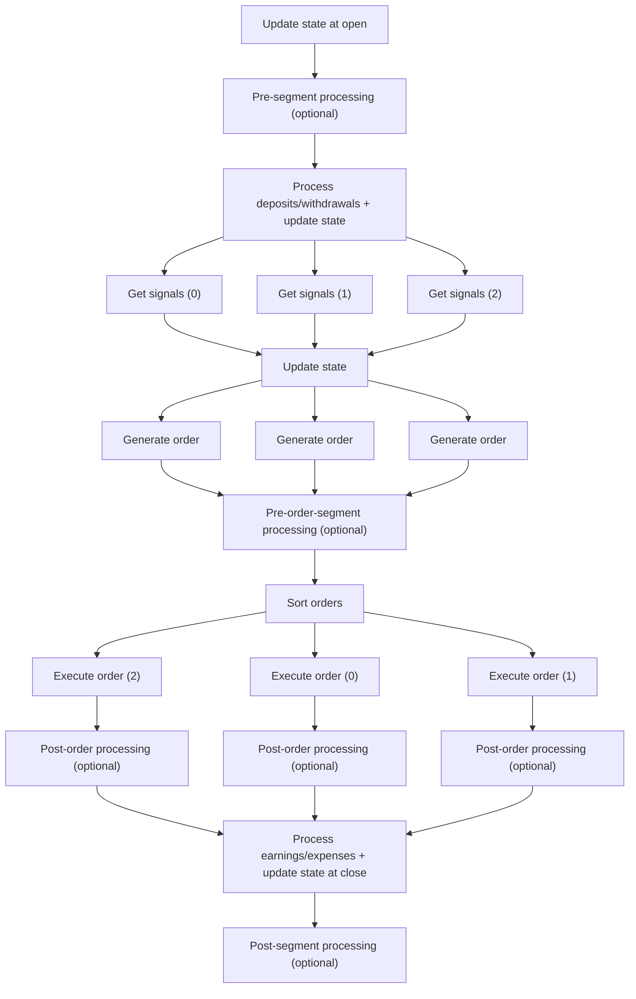

# Vectorbtpro_Docs - Portfolio

**Pages:** 11

---

## portfolio

**URL:** https://vectorbt.pro/pvt_ff8edc14/api/portfolio.md

**Contents:**
- Sub-packages
- Sub-modules

Package for portfolio management.

This package includes submodules that provide core functionality for portfolio management, including optimization, order sequencing, logging, and trade execution.

---

## call_seq

**URL:** https://vectorbt.pro/pvt_ff8edc14/api/portfolio/call_seq.md

**Contents:**
- build_call_seq <span class="dobjtype">function</span><a class="githublink" href="https://github.com/polakowo/vectorbt.pro/blob/6e18cf0aa37849cfc20848f40f1d26ecfdc771b4/vectorbtpro/portfolio/call_seq.py#L146-L178" target="_blank" title="Jump to source">:material-github:</a> { #vectorbtpro.portfolio.call_seq.build_call_seq data-toc-label="build\_call\_seq" }
- build_call_seq_nb <span class="dobjtype">function</span><a class="githublink" href="https://github.com/polakowo/vectorbt.pro/blob/6e18cf0aa37849cfc20848f40f1d26ecfdc771b4/vectorbtpro/portfolio/call_seq.py#L80-L131" target="_blank" title="Jump to source">:material-github:</a> { #vectorbtpro.portfolio.call_seq.build_call_seq_nb data-toc-label="build\_call\_seq\_nb" }
- require_call_seq <span class="dobjtype">function</span><a class="githublink" href="https://github.com/polakowo/vectorbt.pro/blob/6e18cf0aa37849cfc20848f40f1d26ecfdc771b4/vectorbtpro/portfolio/call_seq.py#L134-L143" target="_blank" title="Jump to source">:material-github:</a> { #vectorbtpro.portfolio.call_seq.require_call_seq data-toc-label="require\_call\_seq" }
- shuffle_call_seq_nb <span class="dobjtype">function</span><a class="githublink" href="https://github.com/polakowo/vectorbt.pro/blob/6e18cf0aa37849cfc20848f40f1d26ecfdc771b4/vectorbtpro/portfolio/call_seq.py#L31-L77" target="_blank" title="Jump to source">:material-github:</a> { #vectorbtpro.portfolio.call_seq.shuffle_call_seq_nb data-toc-label="shuffle\_call\_seq\_nb" }

Module providing functions for working with call sequence arrays.

!!! warning This Numba module has a Rust mirror that must be maintained in parallel.

Build a call sequence array using a faster, non-jitted implementation.

**```target_shape```** :&ensp;`Shape` :   Base dimensions (rows, columns).

**```group_lens```** :&ensp;`GroupLens` :   Array defining the number of columns in each group.

**```call*seq*type```** :&ensp;`int` :   Identifier for the type of call sequence construction.

**```seed```** :&ensp;`Optional[int]` :   Random seed for deterministic output.

**```seed_offset```** :&ensp;`int` :   Offset added for random seed derivation.

`Array2d` :   Call sequence array constructed based on the provided parameters.

??? benchmark "Benchmarks"

<div class="api-tags" markdown="span"> <span class="api-tag api-tag--nb" title="Numba parallel">:simple-numba: `can*parallel`</span> <span class="api-tag api-tag--rs" title="Rust backend">:simple-rust: `vectorbtpro*rust.portfolio.call*seq.build*call*seq*rs`</span> <span class="api-tag api-tag--rs" title="Rust parallel">:simple-rust: `can_parallel`</span> </div>

Build a call sequence array with specified structure.

**```target_shape```** :&ensp;`Shape` :   Base dimensions (rows, columns).

**```group_lens```** :&ensp;`GroupLens` :   Array defining the number of columns in each group.

**```call*seq*type```** :&ensp;`int` :   Identifier for the type of call sequence construction.

**```seed```** :&ensp;`Optional[int]` :   Random seed for deterministic output.

**```seed_offset```** :&ensp;`int` :   Offset added for random seed derivation.

`Array2d` :   Call sequence array constructed based on the provided parameters.

??? benchmark "Benchmarks"

Ensure the call sequence array meets required conditions.

**```call_seq```** :&ensp;`Array2d` :   Call sequence array to validate.

`Array2d` :   Validated call sequence array.

<div class="api-tags" markdown="span"> <span class="api-tag api-tag--nb" title="Numba parallel">:simple-numba: `can*parallel`</span> <span class="api-tag api-tag--rs" title="Rust backend">:simple-rust: `vectorbtpro*rust.portfolio.call*seq.shuffle*call*seq*rs`</span> <span class="api-tag api-tag--rs" title="Rust parallel">:simple-rust: `can_parallel`</span> </div>

Shuffle segments of the call sequence array in place.

**```call_seq```** :&ensp;`Array2d` :   Array representing the call sequence.

**```group_lens```** :&ensp;`GroupLens` :   Array defining the number of columns in each group.

**```seed```** :&ensp;`Optional[int]` :   Random seed for deterministic output.

**```seed_offset```** :&ensp;`int` :   Offset added for random seed derivation.

`None` :   Function modifies `call_seq` in place.

??? benchmark "Benchmarks"

**Examples:**

Example 1 (python):
```python
build_call_seq(
    target_shape,
    group_lens,
    call_seq_type=0,
    seed=None,
    seed_offset=0
)
```

Example 2 (text):
```text
See [CallSeqType](https://vectorbt.pro/pvt_ff8edc14/api/portfolio/enums/#vectorbtpro.portfolio.enums.CallSeqType "vectorbtpro.portfolio.enums.CallSeqType").
```

Example 3 (text):
```text
Runtime by backend and input shape.

| Backend | 100x1 | 1Kx1 | 10Kx1 | 100Kx1 | 1Mx1 | 100x10 | 1Kx10 | 10Kx10 | 100Kx10 | 100x100 | 1Kx100 | 10Kx100 |
| --- | --- | --- | --- | --- | --- | --- | --- | --- | --- | --- | --- | --- |
| nb_serial | 19.79 us | 22.04 us | 28.46 us | 103.46 us | 855.00 us | 20.92 us | 24.46 us | 66.38 us | 645.79 us | 27.92 us | 70.04 us | 844.58 us |
| rs_serial | 2.04 us | 2.67 us | 7.92 us | 58.50 us | 615.88 us | 2.33 us | 4.13 us | 21.29 us | 331.12 us | 3.62 us | 12.79 us | 345.00 us |
| rs_raw_serial | 333.18 ns | 833.07 ns | 5.96 us | 56.58 us | 610.42 us | 499.89 ns | 2.25 us | 19.50 us | 328.33 us | 1.58 us | 11.04 us | 342.08 us |
| ab_serial | 14.08 us | 14.63 us | 19.75 us | 69.79 us | 602.12 us | 14.00 us | 15.87 us | 32.96 us | 244.58 us | 14.92 us | 24.63 us | 404.62 us |
| ab_raw_serial | 11.29 us | 12.17 us | 17.21 us | 67.33 us | 600.25 us | 11.71 us | 13.37 us | 30.33 us | 241.37 us | 12.54 us | 22.17 us | 400.50 us |
| nb_parallel | 31.17 us | 28.33 us | 50.21 us | 95.33 us | 596.63 us | 29.75 us | 31.58 us | 56.42 us | 193.25 us | 34.08 us | 63.96 us | 194.38 us |
| rs_parallel | 2.50 us | 3.13 us | 8.33 us | 61.21 us | 799.29 us | 22.87 us | 28.54 us | 36.21 us | 176.83 us | 21.63 us | 36.50 us | 201.08 us |
| rs_raw_parallel | 333.18 ns | 874.98 ns | 6.21 us | 56.63 us | 796.04 us | 15.50 us | 19.63 us | 30.96 us | 157.92 us | 16.58 us | 39.75 us | 251.58 us |
| ab_parallel | 15.29 us | 15.50 us | 20.38 us | 70.88 us | 657.13 us | 33.00 us | 40.08 us | 71.38 us | 240.75 us | 36.67 us | 54.46 us | 154.04 us |
| ab_raw_parallel | 12.21 us | 12.42 us | 17.37 us | 67.92 us | 610.00 us | 32.87 us | 45.42 us | 58.87 us | 401.42 us | 34.21 us | 39.25 us | 159.54 us |
| abm | 22.50 us | 17.12 us | 20.21 us | 75.50 us | 684.87 us | 14.58 us | 18.71 us | 45.87 us | 496.21 us | 15.54 us | 24.58 us | 183.38 us |
| abm_raw | 18.79 us | 13.96 us | 17.92 us | 72.83 us | 599.67 us | 12.38 us | 15.75 us | 42.50 us | 360.63 us | 12.79 us | 22.38 us | 405.00 us |
```

Example 4 (python):
```python
build_call_seq_nb(
    target_shape,
    group_lens,
    call_seq_type=0,
    seed=None,
    seed_offset=0
)
```

---

## Portfolio

**URL:** https://vectorbt.pro/pvt_ff8edc14/cookbook/portfolio.md

**Contents:**
- From data
- From signals
  - Callbacks
    - Memory
    - Position rules
    - Stop orders
    - Custom order logic
    - Cash management
- Records
- Metrics

!!! question Find more information in the [Portfolio documentation](https://vectorbt.pro/pvt_ff8edc14/documentation/portfolio/).

To quickly simulate a portfolio from any OHLC data, you can use [Data.run](https://vectorbt.pro/pvt*ff8edc14/api/data/base/#vectorbtpro.data.base.Data.run) or pass the data instance (or simply a symbol or `class*name:symbol`) to the simulation method.

This simulation method is easy to use yet powerful, as long as your strategy can be defined using signals, such as buy, sell, short sell, and buy to cover.

position when `short*entries` is True, and exit it when `short*exits` is True.

<div class="separator-container"> <hr class="separator"> <span class="separator-text">+</span> <hr class="separator"> </div>

To set different prices or other arguments for long and short signals, create an empty array and use each signal type as a mask to assign the corresponding value.

If you want to replace `data.close` with a NumPy array, use `arr[entries]` on the right side as well.

<div class="separator-container"> <hr class="separator"> <span class="separator-text">+</span> <hr class="separator"> </div>

To exit a trade after a specific amount of time or number of rows, use the `td_stop` argument. The measurement starts from the opening time of the entry row.

[`pd.TimedeltaIndex`](https://pandas.pydata.org/docs/reference/api/pandas.TimedeltaIndex.html).

<div class="separator-container"> <hr class="separator"> <span class="separator-text">+</span> <hr class="separator"> </div>

To exit a trade at a specific time or row count, use the `dt*stop` argument. If you pass a timedelta (as above), the position will be exited at the last bar *before* the target date. Otherwise, if you provide an exact date or time, the position will be exited *at* or *after_ that point. You can override this behavior using the argument config.

[`pd.DatetimeIndex`](https://pandas.pydata.org/docs/reference/api/pandas.DatetimeIndex.html).

!!! note Do not confuse `td*stop` with `dt*stop`. "td" stands for timedelta, while "dt" stands for datetime.

<div class="separator-container"> <hr class="separator"> <span class="separator-text">+</span> <hr class="separator"> </div>

To perform multiple actions within a single bar, split each bar into three sub-bars: opening nanosecond, middle, and closing nanosecond. For example, you can execute your signals at the end of the bar, and your stop orders will be guaranteed to execute at the first two sub-bars. This lets you close out a position and enter a new one within the same bar.

To save a piece of information at one timestamp and reuse it at a later timestamp in a callback, create a NumPy array and pass it to the callback. The array should be one-dimensional and have the same number of elements as there are columns. You can then read and write the element under the current column using the same method as accessing the latest position via `c.last_position[c.col]`. If you need to store more pieces of information, use additional arrays or a single structured array. For convenience, you can combine multiple arrays into a named tuple.

<div class="separator-container"> <hr class="separator"> <span class="separator-text">+</span> <hr class="separator"> </div>

If signals are generated dynamically and only a subset are actually executed, you may want to keep track of all generated signals for later analysis. To do this, use function templates to create **global** custom arrays and fill these arrays during the simulation.

<div class="separator-container"> <hr class="separator"> <span class="separator-text">+</span> <hr class="separator"> </div>

To access the running total return during the simulation, create an empty array for cumulative returns and update it within the `post*segment*func_nb` callback. The same array can be accessed by other callbacks to get the total return at any time step.

<div class="separator-container"> <hr class="separator"> <span class="separator-text">+</span> <hr class="separator"> </div>

You can use the same process to access the running trade records during the simulation.

If you expect fewer trades, you can limit the number of rows in the shape.

To limit the number of active positions within a group, disable any entry signal in a custom signal function whenever the limit has been reached. The exit signal should be allowed to execute at any time.

<div class="separator-container"> <hr class="separator"> <span class="separator-text">+</span> <hr class="separator"> </div>

To access information on the current or previous position, query the position information records.

should be converted to nanoseconds before execution.

To dynamically determine and apply an optimal position size, create an empty size array filled with NaN. Then, in a callback, calculate the target size and write it to the size array.

<div class="separator-container"> <hr class="separator"> <span class="separator-text">+</span> <hr class="separator"> </div>

To activate a stop-loss (SL) or another stop order after a certain condition is met, set it initially to infinity. Then, update the stop value in a callback once the condition is satisfied.

<div class="separator-container"> <hr class="separator"> <span class="separator-text">+</span> <hr class="separator"> </div>

The stop value can be updated not just once, but on every bar.

<div class="separator-container"> <hr class="separator"> <span class="separator-text">+</span> <hr class="separator"> </div>

To set a ladder dynamically, use `stop_ladder="dynamic"` and then use the current ladder step in a callback to pull information from a custom array and override the stop information with that value.

<div class="separator-container"> <hr class="separator"> <span class="separator-text">+</span> <hr class="separator"> </div>

Position metrics, such as the current open P&L and return, are available through the `last*pos*info` context field. This is an array with one record per column, using the data type [trade*dt](https://vectorbt.pro/pvt*ff8edc14/api/portfolio/enums/#vectorbtpro.portfolio.enums.trade_dt).

(for example, 10% and 10% -> 0% final return).

<div class="separator-container"> <hr class="separator"> <span class="separator-text">+</span> <hr class="separator"> </div>

To ensure SL/TP considers the average entry price, rather than just the first order entry price, when accumulation is enabled, set the initial price of the stop record to the position's entry price.

<div class="separator-container"> <hr class="separator"> <span class="separator-text">+</span> <hr class="separator"> </div>

To have SL/TP orders be based on the portfolio value instead of the price, calculate and store the target SL/TP value in memory when opening a position and then manually check whether this value has been hit on each bar.

<div class="separator-container"> <hr class="separator"> <span class="separator-text">+</span> <hr class="separator"> </div>

To prevent stop and limit orders from executing for a specific bar and asset, you can deactivate them in the stop/limit information record within a callback.

To overcome the limitation of having only one active built-in limit order at a time, you can create custom limit orders. This allows you to have multiple active orders at once. Store relevant data in memory and manually check if the limit order price has been reached on each bar. When the price is hit, simply generate a signal.

<div class="separator-container"> <hr class="separator"> <span class="separator-text">+</span> <hr class="separator"> </div>

To execute an SL (or any other order type) on the same bar as the entry, you can check whether the stop order is triggered on this bar and, if so, execute it as a regular signal on the next bar.

<div class="separator-container"> <hr class="separator"> <span class="separator-text">+</span> <hr class="separator"> </div>

To create, delete, or modify orders after they have been generated but before they are executed, use a pre-order segment callback. Use this to implement custom order logic.

<div class="separator-container"> <hr class="separator"> <span class="separator-text">+</span> <hr class="separator"> </div>

To change the sequence of order execution, for example, to execute exit orders before entry orders, change the `call_seq` parameter dynamically during the simulation using a pre-order segment callback.

signals have been generated but before orders are executed.

current segment (i.e., the current bar and group of columns).

positive values indicate entry orders.

call sequence as a starting point.

!!! warning In the above example, we assume that all orders are executed at the same time within a bar; that is, either at open, in the middle, or at close. Once you start mixing different execution times, such as by using stop or limit orders, the order of execution may not be guaranteed. See the next example for a more robust solution.

<div class="separator-container"> <hr class="separator"> <span class="separator-text">+</span> <hr class="separator"> </div>

To sort orders by both type (exit before entry) and time (earliest before latest), use two sorting passes in the pre-order segment callback. The same mechanism is used internally by VBT when `call_seq="auto"` is set.

return it as a tuple to be passed to the pre-order segment callback. This callback is called once per group.

!!! note The `pre*group*func*nb` is used to initialize temporary memory for each group. This memory is then passed to the `pre*segment*func*nb`, which then forwards it to the `signal*func*nb`, `pre*order*segment*func*nb`, and `post*segment*func_nb` callbacks. If any of these callbacks have been defined, make sure to include the temporary memory parameter in their signatures and pass it down if necessary. For example, if you want to use the default signal function, use the following signature:

To implement a DCA strategy where cash is added periodically, change the `cash_deposits` parameter dynamically during the simulation using a pre-segment callback.

<div class="separator-container"> <hr class="separator"> <span class="separator-text">+</span> <hr class="separator"> </div>

To check at the end of a bar whether an order has been executed, use `post*order*func*nb` or `post*segment*func*nb`. The first is called right after an order is executed and can access the result of the executed order through `c.order_result`. The second is called after all columns in the current group have been processed (just one column if there is no grouping), cash deposits and earnings have been applied, and the portfolio value and returns have been updated.

!!! tip An alternative approach after creating the portfolio:

There are several ways to examine the orders, trades, and positions generated by a simulation. Each one corresponds to a different concept in VBT. Be sure to understand their differences by reviewing the examples at the top of the [trades](https://vectorbt.pro/pvt_ff8edc14/api/portfolio/trades/) module.

By default, the year frequency is set to 365 days, assuming each trading day lasts 24 hours. However, for stocks or other securities, you should change it to 252 days or less. Also, consider trading hours when working with sub-daily data frequency.

!!! info The year frequency will be divided by the frequency of your data to calculate the annualization factor. For example, `pd.Timedelta(hours=6.5) * 252` divided by `15 minutes` will result in a factor of 6552.

<div class="separator-container"> <hr class="separator"> <span class="separator-text">+</span> <hr class="separator"> </div>

To tell VBT to place zero instead of infinity and NaN in any generated returns, create a [configuration](https://vectorbt.pro/pvt_ff8edc14/cookbook/configuration/#settings) file with the following content:

!!! note If this does not work, run `vbt.clear_pycache()` and restart the kernel.

<div class="separator-container"> <hr class="separator"> <span class="separator-text">+</span> <hr class="separator"> </div>

To compute a metric based on the returns or other time series of each trade, rather than for the entire equity, use projections to extract the time series range corresponding to each trade.

<div class="separator-container"> <hr class="separator"> <span class="separator-text">+</span> <hr class="separator"> </div>

To calculate a trade metric purely in Numba, convert order records to trade records, compute the column map for the trade records, and then reduce each column to a single number.

<div class="separator-container"> <hr class="separator"> <span class="separator-text">+</span> <hr class="separator"> </div>

The same method applies to drawdown records, which are based on cumulative returns.

<div class="separator-container"> <hr class="separator"> <span class="separator-text">+</span> <hr class="separator"> </div>

Return metrics are not based on records and can be calculated directly from returns.

You can access the columns and groups of the portfolio through its wrapper and grouper, respectively.

??? youtube "Multi Strategy Portfolios on YouTube" <iframe class="youtube-video" src="https://www.youtube.com/embed/q4W3fkjB1aw?si=x4cXvW7ck8nLkcaJ" title="YouTube video player" frameborder="0" allow="accelerometer; autoplay; clipboard-write; encrypted-media; gyroscope; picture-in-picture; web-share" referrerpolicy="strict-origin-when-cross-origin" allowfullscreen></iframe>

Multiple compatible array-based strategies can be included in the same portfolio by stacking their respective arrays along the columns.

<div class="separator-container"> <hr class="separator"> <span class="separator-text">+</span> <hr class="separator"> </div>

You can also stack multiple incompatible strategies—such as those requiring different simulation methods or argument combinations—by simulating them independently and then stacking them for joint analysis. This combines their data, order records, initial states, in-place output arrays, and more as if they were stacked before simulation, with grouping disabled.

If you want to simulate multiple columns (without cash sharing) or multiple groups (with or without cash sharing), you can easily parallelize execution in several ways.

You can also parallelize statistics after your portfolio has been simulated.

**Examples:**

Example 1 (text):
```text
pf = data.run("from_holding")  # (1)!
pf = data.run("from_random_signals", n=10)  # (2)!

pf = vbt.PF.from_holding(data)  # (3)!
pf = vbt.PF.from_holding("BTC-USD")  # (4)!
pf = vbt.PF.from_holding("BinanceData:BTCUSDT")  # (5)!
```

Example 2 (text):
```text
pf = vbt.PF.from_signals(data, ...)  # (1)!
pf = vbt.PF.from_signals(open=open, high=high, low=low, close=close, ...)  # (2)!
pf = vbt.PF.from_signals(close, ...)  # (3)!

pf = vbt.PF.from_signals(data, entries, exits)  # (4)!
pf = vbt.PF.from_signals(data, entries, exits, direction="shortonly")  # (5)!
pf = vbt.PF.from_signals(data, entries, exits, direction="both")  # (6)!
pf = vbt.PF.from_signals(  # (7)!
    data, 
    long_entries=long_entries, 
    long_exits=long_exits,
    short_entries=short_entries, 
    short_exits=short_exits,
)
```

Example 3 (text):
```text
price = data.symbol_wrapper.fill()
price[entries] = data.close * (1 + 0.01)  # (1)!
price[exits] = data.close * (1 - 0.01)
```

Example 4 (text):
```text
price = (bid_price + ask_price) / 2
price[entries] = ask_price
price[exits] = bid_price
```

---

## Portfolio

**URL:** https://vectorbt.pro/pvt_ff8edc14/features/portfolio.md

**Contents:**
- Contract multiplier
- Negative price
- Chaining simulations
- Full callback support
- Asset weighting
- Position views
- Index records
- Portfolio preparers
- Stop laddering
- Staticization

{ loading=lazy }

making it straightforward to model futures contracts and other derivatives where one contract represents multiple units of the underlying asset.

=== "Example 1: E-mini S&P 500 futures"

=== "Example 2: Mixed futures portfolio"

{ loading=lazy }

it impossible to model instruments whose price can legally go below zero (such as the infamous April 2020 WTI crude oil event). Negative prices are now fully supported across the entire pipeline.

and exit on May 4 once prices begin recovering.

{ loading=lazy }

including the last cash, position, pending order(s), and other relevant information. This state can be passed to the next simulation run, allowing you to continue from where the previous run ended. This enables seamless chaining of simulations across different time periods or datasets.

=== "Example 1: Monthly"

=== "Example 2: Live data stream"

{ loading=lazy }

This includes pre-processing and post-processing callbacks for the simulation as a whole, as well as per-group and per-segment callbacks, and even an order modification callback. This allows you to customize the simulation behavior to a great extent.

!!! example "Documentation" Learn more in the [Documentation](https://vectorbt.pro/pvt_ff8edc14/documentation/) → Portfolio → From signals → Callbacks.

This callback is called before processing each group (asset in this case because grouping is disabled). The variables are returned as a tuple to be passed to the pre-segment callback.

for each group at the beginning of each bar, before generating signals for each asset in the group. The variables that are required by either the signal or post-order callbacks are returned as a tuple.

If in DCA-in mode, a buy signal is generated; otherwise, a sell signal is generated. The order size is set to the DCA amount.

our take-profit order is updated to exit the initial investment when the position doubles in price. If the take-profit order was executed, the DCA mode is switched to DCA-out.

(number of bars x number of assets) such that they can be modified in the callbacks.

{: .iimg loading=lazy } {: .iimg loading=lazy }

{ loading=lazy }

portfolio, giving you enhanced control over your portfolio's overall performance. The key benefit is that these weights are not limited to returns—they are consistently applied to all time series and metrics, including orders, cash flows, and more. This comprehensive approach ensures that every aspect of your portfolio stays precisely aligned.

{ loading=lazy }

providing a clear and distinct perspective for each investment strategy.

{: .iimg loading=lazy } {: .iimg loading=lazy }

{ loading=lazy }

Typically, you would need to build a full array and set each detail manually. Now, there is a simpler way: with preparers and redesigned smart indexing, you can provide all information in a compressed record format! Behind the scenes, the record array is translated into a set of [index dictionaries](https://vectorbt.pro/pvt_ff8edc14/features/productivity/#index-dictionaries)—one for each argument.

"datetime". Columns can be specified with "col", "column", or "symbol". If you do not provide a row or column, the entire row or column will be set, respectively. If neither is provided, the whole array will be set. Rows and columns can be given as integer positions, labels, datetimes, or even complex indexers!

also be provided to serve as defaults.

{ loading=lazy }

it goes through a complex preparation pipeline to convert it into a format suitable for Numba. This pipeline usually involves enum mapping, broadcasting, data type checks, template substitution, and many other steps. To make VBT more transparent, this pipeline has been moved to a separate class, giving you full control over the arguments that reach the Numba functions! You can even extend the preparers to automatically prepare arguments for your own simulators.

`nested_`. The result is a new instance of `PFPrepResult`.

{ loading=lazy }

a single stop value to close a position, you can provide an array of stop values, with each one removing a certain amount of the position when triggered. You can control this amount by choosing a different ladder mode. Thanks to a new broadcasting feature that allows arrays to broadcast along just one axis, the stop values do not need to have the same shape as the data. You can even provide stop arrays of different shapes as parameters!

{: .iimg loading=lazy } {: .iimg loading=lazy }

{ loading=lazy }

make the main function uncacheable, forcing it to be recompiled in every new runtime, again and again. This especially affects the performance of simulator functions, as they can take up to a minute to compile. Thankfully, there is a new trick available: "staticization". Here is how it works. First, the source code of a function is annotated with a special syntax. The annotated code is then extracted (also called "cutting" :scissors:), modified into a cacheable version by removing any callbacks from the arguments, and saved to a Python file. Once the function is called again, the cacheable version is executed. Sound complicated? Take a look below!

{ loading=lazy }

{ loading=lazy }

period of time or on a specific date.

Datetime-based stops can be periods ("D"), timestamps ("2023-01-01"), and even specific times ("18:00").

{ loading=lazy }

stop and limit order functionality. This is especially useful, for example, in portfolio optimization.

making it impossible to establish the correct order of execution.

{: .iimg loading=lazy } {: .iimg loading=lazy }

{ loading=lazy }

{ loading=lazy }

modes: `lazy` (enables leverage only if there is not enough cash) and `eager` (enables leverage while using only part of the available cash). Allows setting leverage per order, and can also determine the optimal leverage value automatically to fulfill any order requirement! :person*lifting*weights:

{: .iimg loading=lazy } {: .iimg loading=lazy }

{ loading=lazy }

execution to the next bar, you had to manually shift all order-related arrays by one bar, which made the process error-prone. Now, you can simply specify how many bars in the past should be used to take order information from. In addition, the price argument now supports "nextopen" and "nextclose" as options, providing a one-line solution.

{: .iimg loading=lazy } {: .iimg loading=lazy }

{ loading=lazy }

the current backtesting environment? Two new callbacks now bring simulator flexibility to the next level: one lets you generate or override signals for each asset at every bar, and another allows you to compute user-defined metrics for the entire group at the end of each bar. Both accept a "context" that contains information about the current simulation state, enabling trading decisions to be made in a way similar to event-driven backtesters.

{: .iimg loading=lazy } {: .iimg loading=lazy }

{ loading=lazy }

(TIF) orders such as DAY, GTC, GTD, LOO, and FOK :alarm_clock: You can also reverse a limit order or create it using a delta for easier testing.

expressed as a percentage. The higher the delta, the lower the chance it will eventually be hit.

{: .iimg loading=lazy } {: .iimg loading=lazy }

{ loading=lazy }

it often required extra transformations for arrays. For example, setting SL to ATR meant you needed to know the entry price. More generally, to lock in a specific dollar amount of a trade, you might want to use a fixed price trailing stop. To address this, VBT now offers multiple stop value formats ("delta formats") to choose from.

{: .iimg loading=lazy } {: .iimg loading=lazy }

{ loading=lazy }

often resulting in significant speedups for strategies with sparsely distributed orders.

{ loading=lazy }

This allows you to design more complex signal strategies with less namespace pollution.

!!! example "Tutorial" Learn more in the [Signal development](https://vectorbt.pro/pvt_ff8edc14/tutorials/signal-development) tutorial.

{ loading=lazy }

usually processed much faster than processing a 1-column dataset 1000 times. However, the first dataset also requires 1000 times more memory than the second. That's why, during the simulation phase, VBT primarily generates orders, while other portfolio attributes such as balances, equity, and returns are reconstructed later during the analysis phase if the user needs them. For cases where performance is the main concern, arguments are now available that let you pre-compute these attributes during simulation! :fast_forward:

{ loading=lazy }

{ loading=lazy }

{: .iimg loading=lazy } {: .iimg loading=lazy }

{ loading=lazy }

such as signals. In-place output arrays can broadcast together with regular arrays using templates and broadcastable named arguments. Additionally, VBT will (semi-)automatically determine how to correctly wrap and index each array, for example, whenever you select a column from the entire portfolio.

{ loading=lazy }

This gives you greater control over post-simulation analysis, such as overriding some simulation data, testing hyperparameters without re-simulating the entire portfolio, or avoiding repeated reconstruction when caching is disabled.

{ loading=lazy }

will automatically pick the pre-computed array and perform all future calculations using this array, avoiding redundant reconstruction.

[:material-language-python: Python code](https://vectorbt.pro/pvt*ff8edc14/assets/jupytext/features/portfolio.py.txt){ .md-button target="blank*" }

**Examples:**

Example 1 (text):
```text
    >>> data = vbt.YFData.pull("ES=F", start="2023", end="2024")  # (1)!

    >>> fast_sma = data.run("talib_func:sma", timeperiod=10)  # (2)!
    >>> slow_sma = data.run("talib_func:sma", timeperiod=30)
    >>> entries = fast_sma.vbt.crossed_above(slow_sma)
    >>> exits = fast_sma.vbt.crossed_below(slow_sma)

    >>> pf_stock = vbt.PF.from_signals(  # (3)!
    ...     data,
    ...     entries=entries,
    ...     exits=exits,
    ...     size=1,
    ...     init_cash=500_000,
    ... )

    >>> pf_futures = vbt.PF.from_signals(  # (4)!
    ...     data,
    ...     entries=entries,
    ...     exits=exits,
    ...     size=1,
    ...     multiplier=50,
    ...     init_cash=500_000,
    ... )

    >>> print(pf_stock.total_profit)
    627.25
    >>> print(pf_futures.total_profit)  # (5)!
    31362.5
    >>> print(pf_futures.trades.readable[["Avg Entry Price", "Avg Exit Price", "PnL", "Return"]])
       Avg Entry Price  Avg Exit Price      PnL    Return
    0          4057.50         4138.00   4025.0  0.019840
    1          4212.00         4480.75  13437.5  0.063806
    2          4490.25         4378.75  -5575.0 -0.024832
    3          4430.50         4820.00  19475.0  0.087913
```

Example 2 (text):
```text
1. Pull daily E-mini S&P 500 futures data for 2023 from Yahoo Finance.
2. Generate long entry/exit signals from a 10/30 SMA crossover. The same logic works for
any instrument; only the multiplier changes the dollar impact.
3. Simulate without a multiplier, as if trading a single share of a stock tracking the index.
Each point move is worth exactly $1.
4. Add a multiplier to reflect the actual E-mini S&P 500 contract spec, where
one contract controls 50 times the index value, so each point move is worth $50.
5. Profit scales exactly 50x relative to the stock-like simulation.
```

Example 3 (text):
```text
    >>> data = vbt.YFData.pull(  # (1)!
    ...     ["ES=F", "NQ=F"],
    ...     start="2023",
    ...     end="2024",
    ... )

    >>> fast_sma = data.run("talib_func:sma", timeperiod=10)
    >>> slow_sma = data.run("talib_func:sma", timeperiod=30)
    >>> entries = fast_sma.vbt.crossed_above(slow_sma)
    >>> exits = fast_sma.vbt.crossed_below(slow_sma)

    >>> pf = vbt.PF.from_signals(  # (2)!
    ...     data,
    ...     entries=entries,
    ...     exits=exits,
    ...     size=1,
    ...     multiplier=[50, 20],
    ...     init_cash=1_000_000,
    ... )

    >>> print(pf.total_profit)  # (3)!
    symbol
    ES=F    31362.5
    NQ=F    55995.0
    dtype: float64
```

Example 4 (text):
```text
1. Pull daily data for E-mini S&P 500 (ES, x50) and Micro E-mini Nasdaq-100 (NQ, x20) futures.
2. Pass multiplier as a list to assign the correct contract spec to each symbol.
Signals and strategy logic are identical; only the dollar value of a point differs.
3. Each column's PnL reflects its own multiplier, letting you compare instruments on an
equal-notional footing without any manual scaling.
```

---

## From orders

**URL:** https://vectorbt.pro/pvt_ff8edc14/documentation/portfolio/from-orders.md

**Contents:**
- Numba
  - Order fields
  - Grouping
  - Call sequence
  - Filling returns
  - Initial state
  - Cash deposits
  - Cash earnings
  - Max record count
  - Jitting

Instead of building a custom simulator from scratch, you can use one of the preset simulation methods provided by VBT. There are three main methods: [Portfolio.from*orders](https://vectorbt.pro/pvt*ff8edc14/api/portfolio/base/#vectorbtpro.portfolio.base.Portfolio.from*orders), [Portfolio.from*signals](https://vectorbt.pro/pvt*ff8edc14/api/portfolio/base/#vectorbtpro.portfolio.base.Portfolio.from*signals), and [Portfolio.from*order*func](https://vectorbt.pro/pvt*ff8edc14/api/portfolio/base/#vectorbtpro.portfolio.base.Portfolio.from*order_func). Each method has its own advantages and disadvantages, but all follow the same iteration scheme discussed earlier: they iterate over the rows and columns, and at each step, convert the current element of all user-provided input data into an order request. They then process the request by updating the current simulation state and appending the filled order record to an array. This array, along with other information, can later be used during the reconstruction phase to analyze the simulation.

[Portfolio.from*orders](https://vectorbt.pro/pvt*ff8edc14/api/portfolio/base/#vectorbtpro.portfolio.base.Portfolio.from*orders) is the simplest of the three methods: it does not accept any UDFs and allows you to provide every detail about orders as separate, broadcastable arrays. Every element across all provided arrays is converted into an instance of [Order](https://vectorbt.pro/pvt*ff8edc14/api/portfolio/enums/#vectorbtpro.portfolio.enums.Order) and processed as usual. Since the number of orders is limited by the number of elements in the arrays, you can issue and execute only one order per timestamp and asset.

For example, passing `[0.1, -0.1, np.nan]` as the order size array and `[11, 10, 12]` as the order price array will generate three orders at three consecutive timestamps:

!!! tip This method should be used when you know exactly what to order at each timestamp. In practice, many types of signals and other inputs can be successfully converted to an order format for a significant speedup. For example, if your entries and exits are cleaned (meaning one exit comes exactly after one entry and vice versa), you can convert them to order size using `entries.astype(int) - exits.astype(int)`. This will order 1 share whenever a signal is encountered, in either direction.

The core of this method is the Numba-compiled function [from*orders*nb](https://vectorbt.pro/pvt*ff8edc14/api/portfolio/nb/from*orders/#vectorbtpro.portfolio.nb.from*orders.from*orders_nb), which is the fastest of the three simulation functions. It is also the only one that can be (and is) safely cached in Numba, since it does not depend on any complex or global data. It uses flexible indexing, is registered as a chunkable function, and can be parallelized by Numba with a single command.

This simulation function's arguments include some that we have already discussed in the documentation on simulation: target shape, group lengths, initial cash, and others. Some of the new arguments here include the call sequence array, initial state arrays (such as `init*position`), continuous state change arrays (such as `cash*deposits`), order information arrays (such as `size`), and various flags for controlling the simulation process (such as `save*returns`). Most arguments also have carefully chosen default values that are consistent across most Numba-compiled functions defined in [portfolio.nb](https://vectorbt.pro/pvt*ff8edc14/api/portfolio/nb/).

Each field in the named tuple [Order](https://vectorbt.pro/pvt_ff8edc14/api/portfolio/enums/#vectorbtpro.portfolio.enums.Order) is available as an argument in this simulation function's signature and can be provided in a format suitable for flexible indexing.

Let's simulate the three orders mentioned above:

ones (one group per column).

The simulation returns an instance of the named tuple [SimulationOutput](https://vectorbt.pro/pvt_ff8edc14/api/portfolio/enums/#vectorbtpro.portfolio.enums.SimulationOutput), which contains the filled order and log records, along with other supporting information for post-analysis:

!!! info Even though we did not instruct VBT to create arrays for log records, cash deposits, or cash earnings, these arrays still appear in the simulation output. Because Numba has difficulty processing optional writable arrays, these outputs cannot be set to `None`. Instead, VBT creates empty arrays with ultra-small shapes to indicate that they should be ignored during post-analysis.

Here is a basic helper function to pretty-print order records:

To apply information to **every** element, you can provide a scalar. This works because most simulation methods automatically convert any scalar into a two-dimensional array suitable for [flexible indexing](https://vectorbt.pro/pvt_ff8edc14/documentation/portfolio/#flexible-indexing). You can also specify information per row, such as price, using a one-dimensional array, like this:

!!! important The broadcasting rules in VBT differ slightly from NumPy's broadcasting rules. In NumPy, `(3,)` arrays are treated as specified per column (and broadcast along rows) in the shape `(3, 1)`, but VBT assumes that flexible two-dimensional arrays are always time series and are specified per row (and broadcast along columns).

To provide information per column, always wrap it in a two-dimensional array. You can also make this array have only one row to apply information to all rows. Let's test multiple size values specified per column, while the price is given per row:

possible at every timestamp, a size of `np.nan` will be ignored at every timestamp, and a size of `-np.inf` will short sell as much as possible at every timestamp.

This approach works the same way as if you manually broadcasted all arrays before passing them.

Notice that all arrays have the same shape `(3, 3)`, which becomes the target shape.

!!! important Do not use `np.broadcast_arrays` here. In NumPy, one-dimensional arrays are assumed to be specified per column.

!!! info To learn more about the different arguments and their meanings, visit the API documentation for [Order](https://vectorbt.pro/pvt_ff8edc14/api/portfolio/enums/#vectorbtpro.portfolio.enums.Order).

If any element in the array `group_lens` is greater than 1, VBT assumes that the columns are grouped and enables cash sharing by default. Let's simulate a portfolio with two assets where we try to order as many shares as possible in both assets:

We see that the first asset used all the available cash, leaving the second asset without funds.

One useful feature of [from*orders*nb](https://vectorbt.pro/pvt*ff8edc14/api/portfolio/nb/from*orders/#vectorbtpro.portfolio.nb.from*orders.from*orders*nb) is that you can supply your own call sequence to change the order in which columns are processed within their groups. Without a call sequence, the default order is *from left to right_. For example, let's perform two rebalancing steps using the default call sequence: allocate 100% to the second asset at the first timestamp, then close out the position and allocate 100% to the first asset at the second timestamp.

We see that only column `1` has been processed. This is because we tried to allocate 100% to the first asset without first closing out the second asset at the second timestamp. To control this order, we can pass our own call sequence:

process the second asset first, then the first. Note that a call sequence must provide exactly one position per timestamp and asset, so its shape must match `target_shape`.

!!! info Order records are partitioned by column and always appear in the order they were filled within each column. Also, order ids (the first field) are generated per column, not globally.

At the second timestamp, the first asset now has the funds needed to go long.

To avoid manually providing the call sequence, you can leave it as `None` and enable `auto*call*seq` instead. In this case, VBT will automatically sort the columns by their approximated order value:

Sometimes, you may want to view the sequence in which orders were processed, which is not shown in the order records. For this, you can provide your own call sequence and let VBT modify it in place, then return it as a field in the [SimulationOutput](https://vectorbt.pro/pvt*ff8edc14/api/portfolio/enums/#vectorbtpro.portfolio.enums.SimulationOutput) named tuple. The call sequence array must be pre-filled with indices in strict order from 0 to `n`, where `n` is the length of the respective group of columns. You can easily build such an array using the function [build*call*seq](https://vectorbt.pro/pvt*ff8edc14/api/portfolio/call*seq/#vectorbtpro.portfolio.call*seq.build*call*seq), which takes the target shape, group lengths, and the call sequence type from [CallSeqType](https://vectorbt.pro/pvt_ff8edc14/api/portfolio/enums/#vectorbtpro.portfolio.enums.CallSeqType):

The generated and then sorted call sequence exactly matches the one we constructed manually earlier.

!!! tip There is usually little reason to provide your own call sequence. Keeping it as `None` (default) and enabling the `auto*call*seq` flag will find the best call sequence in the most resource-efficient way.

In addition to returning order records, you can instruct VBT to also fill the return based on portfolio value at the end of each bar. The resulting series will be available under the `returns` field of [SimulationOutput.in*outputs](https://vectorbt.pro/pvt*ff8edc14/api/portfolio/enums/#vectorbtpro.portfolio.enums.SimulationOutput.in_outputs), and can be used to calculate various metrics, such as the Sharpe ratio. Let's do the following: fetch the BTC price and calculate the return of a simple buy-and-hold strategy, and see that the filled returns closely match the returns calculated directly from the price.

Returns are calculated from the value of each group, so the number of columns in the returned time series matches the number of groups in `group_lens`:

with the single group we created above.

The initial state defines the starting conditions for the entire trading environment. It mainly consists of three variables: initial cash, initial position, and the average entry price of the initial position. Each variable is at most one-dimensional and is defined either per column or per group.

Of these, initial cash is the most important, and can be set as a flexible array `init*cash` with values per column or per group if cash sharing is enabled. As a rule of thumb, it should be either a scalar or a one-dimensional array with the same number of elements as in `group*lens`.

Let's create a group of two columns and allocate 50% to each column, along with two additional groups with one column and 100% allocation each. This lets us perform two independent backtests: one with grouping and one without. If you supply the initial cash as a single number ($100 by default), the first group will split it among two assets, making the starting condition of the grouped columns different from that of the columns without grouping. This is not ideal if you want fair statistical experiments.

information must be provided per column (asset), not per group.

Let's fix this by providing the first group with twice as much capital:

Besides initial cash, you can also set the initial position of each asset at the start of simulation. Let's start the simulation with 1 BTC and 1 ETH, and calculate the returns:

The first data point is NaN because VBT cannot calculate the initial value of each portfolio instance without the entry price for each initial position. To fix this, set the entry price to the first open price:

!!! important Make sure to distinguish between a column and a group.

!!! tip If you are unsure whether an argument should be a one-dimensional or two-dimensional array, check the function's source code. One-dimensional arrays are annotated with `FlexArray1dLike`, and two-dimensional arrays with `FlexArray2dLike`. If an argument is required to be strictly one-dimensional or two-dimensional (that is, a scalar is not allowed), it is annotated with `FlexArray1d` and `FlexArray2d` respectively. If an argument is not flexible at all (meaning it must match `target_shape`), it will be just `Array1d` or `Array2d` accordingly.

In addition to providing the initial cash, you can also deposit or withdraw arbitrary cash amounts throughout the simulation. Like `init*cash`, the argument `cash*deposits` must be specified per group. The difference is that this array can now be specified per row **and** per column, allowing you to specify the deposited or withdrawn amount at each timestamp. Thanks to flexible indexing, you can apply the amount to each element, each row, each group, or the entire frame. The actual operation takes place at the beginning of each bar.

Let's simulate a simple [DCA](https://www.investopedia.com/terms/d/dollarcostaveraging.asp) strategy where we deposit $100 at the beginning of each year and invest it right away:

and set elements at an annual frequency to 100.

Below, we do the same but for a group with two assets and equal allocations. Since the array `cash_deposits` changes the cash balance, it must have the same number of columns as the number of groups (with cash sharing).

To withdraw cash, provide a negative amount. If the amount of cash to be withdrawn exceeds the available cash in your account, only the available cash will be withdrawn. Let's start with 1 BTC, sell 10% each year, and continuously withdraw the entire cash balance:

as a scalar to be applied to each element using flexible indexing.

As you can see, on the first date of each year, we sold 10% of our position. Since any changes related to cash are applied only at the beginning of each bar, the cash generated from the transaction can only be withdrawn on the following date. Also, whenever you specify cash deposits, VBT will create a full-scale array [SimulationOutput.cash*deposits](https://vectorbt.pro/pvt*ff8edc14/api/portfolio/enums/#vectorbtpro.portfolio.enums.SimulationOutput.cash_deposits) to record values that could not be met, such as `-np.inf`, which was replaced by the cash balance at each timestamp. Without this array, we would be unable to properly reconstruct the simulation during the post-analysis phase.

Unlike cash deposits, cash earnings (`cash*earnings`) refer to cash that is either inflowing to or outflowing from the user and thus has a direct effect on profitability. Cash earnings are also applied at the end of each bar. For example, you can use (negative) cash earnings to charge a fixed commission during a set period of time, or to simulate profit-taking from staking cryptocurrency. One of the most useful applications of cash earnings is for cash dividends, which are handled with a separate argument, `cash*dividends`. Cash dividends are multiplied by the current position size and added to cash earnings. Just like with cash deposits, VBT creates a separate array for cash earnings whenever it finds any non-zero value in either cash earnings or cash dividends provided by the user, and writes final operations to this array, which is available under [SimulationOutput.cash*earnings](https://vectorbt.pro/pvt*ff8edc14/api/portfolio/enums/#vectorbtpro.portfolio.enums.SimulationOutput.cash_earnings).

Let's simulate investing in Apple and keeping the dividends:

By default, since VBT does not know how many order records will be needed in advance, it creates an empty array with the same shape as `target*shape` and gradually "appends" new records. If there are hundreds of thousands or even millions of elements in the target shape, you may run out of memory trying to create such a large empty array with a complex data type. To avoid putting too much stress on your RAM, you can specify the maximum number of potential records for each column using `max*order*records` for order records and `max*log_records` for log records.

For example, if you have tick data with one million data points and want to simulate a simple strategy where you buy at the first timestamp and sell at the last timestamp, it makes sense to restrict the number of possible orders in each column to just 2:

Exceeding this limit will cause an error:

You can also completely disable filling order records by setting `max*order*records` to zero:

!!! note `max*order*records` and `max*log*records` apply to each column. If one column needs to generate 2 records and another needs 1000 records, use the value 1000. Also, do not reduce the maximum number of log records (except for setting it to zero) since logs are generated at every timestamp.

Every simulation function, including [from*orders*nb](https://vectorbt.pro/pvt*ff8edc14/api/portfolio/nb/from*orders/#vectorbtpro.portfolio.nb.from*orders.from*orders*nb), is registered as a jittable function in the [JITRegistry](https://vectorbt.pro/pvt*ff8edc14/api/jitting/registry/#vectorbtpro.jitting.registry.JITRegistry) once VBT is imported. The so-called "jittable setup" resulting from the registration includes various details about compilation and decoration, such as which arguments were passed to Numba's `@njit` decorator. At any time, you can instruct the registry to redecorate the function while keeping the other decoration arguments at their defaults. For example, to disable Numba and run the simulator as a normal Python function:

To enable automatic parallelization:

!!! tip All returned functions can be used exactly the same way as `from*orders*nb`. The two latter functions can also be called from within Numba.

The same principle applies to chunking: each simulation function is registered as a chunkable function in the [ChunkableRegistry](https://vectorbt.pro/pvt*ff8edc14/api/chunking/registry/#vectorbtpro.chunking.registry.ChunkableRegistry), and all arguments in [from*orders*nb](https://vectorbt.pro/pvt*ff8edc14/api/portfolio/nb/from*orders/#vectorbtpro.portfolio.nb.from*orders.from*orders*nb) are perfectly chunkable across **groups** (not rows or columns!). However, since Numba-compiled functions are intended to be used by other Numba-compiled functions, and Numba cannot call regular Python functions, they have not yet been decorated with the [chunked](https://vectorbt.pro/pvt_ff8edc14/api/chunking/core/#vectorbtpro.chunking.core.chunked) decorator. To decorate the function, you need to explicitly tell the registry:

!!! tip The returned function can be used just like `from*orders*nb`, but not within Numba, since it is now wrapped with a regular Python function for chunking.

Let's go all in on BTC and ETH while using chunking. This approach will produce two fully isolated simulations. Internally, the process splits `group*lens` into two arrays (`[1]` and `[1]`), then separates each argument value into chunks so that each chunk contains information only for one group. It then runs the same function on different chunks with [Dask](https://dask.org/), and finally merges the results from both simulations as if they were generated by a single, monolithic simulation :magic*wand:

[chunked](https://vectorbt.pro/pvt_ff8edc14/api/chunking/core/#vectorbtpro.chunking.core.chunked).

Chunking can even split flexible arrays!

Often, using the Numba-compiled simulation function directly can be cumbersome because many inputs are scalars or Pandas objects that need to be converted to NumPy arrays. However, understanding how inputs are handled at the most fundamental level is essential for learning how VBT works behind the scenes. To make this process easier, VBT wraps each simulation function with a class method, such as [Portfolio.from*orders](https://vectorbt.pro/pvt*ff8edc14/api/portfolio/base/#vectorbtpro.portfolio.base.Portfolio.from*orders) for [from*orders*nb](https://vectorbt.pro/pvt*ff8edc14/api/portfolio/nb/from*orders/#vectorbtpro.portfolio.nb.from*orders.from*orders*nb). This wrapper automates some input pre-processing and output post-processing.

For example, here is how simple it is to test the three orders mentioned at the beginning:

But the simplest example is just a single order (for $10, buy 1 share):

Each class method acts as a small pipeline that retrieves default argument values from global settings, broadcasts arguments, checks argument data types, redecorates the simulation function for jitting and chunking, runs the simulation, and finally creates a new [Portfolio](https://vectorbt.pro/pvt_ff8edc14/api/portfolio/base/#vectorbtpro.portfolio.base.Portfolio) instance based on the simulation result. This instance is ready for analysis. Most importantly, it leverages Pandas, including datetime indexes and column hierarchies—because nobody wants to work with only NumPy arrays!

Unlike their Numba-compiled counterparts, the class methods require you to provide the close price. This requirement is tied to the post-analysis stage: many metrics and time series, such as the equity curve, can only be reliably calculated using the latest price at each bar. These metrics rely on information available during the bar, and we want to avoid referencing future data, such as the open price or other intermediate points.

If you examine the signature of [Portfolio.from*orders](https://vectorbt.pro/pvt*ff8edc14/api/portfolio/base/#vectorbtpro.portfolio.base.Portfolio.from_orders), you will notice many arguments have a default value of `None`. The value `None` has a specific meaning and typically instructs VBT to replace it with the appropriate default from the global settings.

The global settings for [Portfolio](https://vectorbt.pro/pvt*ff8edc14/api/portfolio/base/#vectorbtpro.portfolio.base.Portfolio) are found in the config [settings.portfolio](https://vectorbt.pro/pvt*ff8edc14/api/*settings/#vectorbtpro.*settings.portfolio). For example, by default, VBT uses the close price as the order price (remember that negative infinity means the open price and positive infinity means the close price?):

To change a default, you can override it directly in the settings. For example, let's introduce a fixed commission of $1 to every order:

Settings can be reset just like any other [config](https://vectorbt.pro/pvt_ff8edc14/api/utils/config/#vectorbtpro.utils.config.Config):

In general, global defaults follow the same pattern as the keyword arguments across most simulation functions. For example, `price` defaults to `np.array(np.inf)` almost everywhere in Numba. If you cannot find an argument in the global settings, it means there is no default for that argument, and `None` is a valid value.

Within the VBT ecosystem, many arguments are of an enumerated type. Enums are regular integers that act as categorical variables. Like contexts, they are also represented by named tuples, but these tuples are already initialized with values, usually ranging from 0 to the total number of categories in the enum. As an example, consider [SizeType](https://vectorbt.pro/pvt_ff8edc14/api/portfolio/enums/#vectorbtpro.portfolio.enums.SizeType):

Instead of requiring users to provide each value as an integer, you can pass the name of the field and convert it to an integer using [map*enum*fields](https://vectorbt.pro/pvt*ff8edc14/api/utils/enum*/#vectorbtpro.utils.enum*.map*enum_fields). This function takes the field name and the enumerated type and returns the corresponding value. Additionally, it lets you convert entire collections of fields, such as lists or Pandas objects.

Internally, this function uses [apply*mapping](https://vectorbt.pro/pvt*ff8edc14/api/utils/mapping/#vectorbtpro.utils.mapping.apply_mapping), which provides options like ignoring the input if it is already an integer:

By default, it also ignores case and removes all non-alphanumeric characters:

That's the magic behind [Portfolio.from*orders](https://vectorbt.pro/pvt*ff8edc14/api/portfolio/base/#vectorbtpro.portfolio.base.Portfolio.from_orders) and other simulation methods knowing how to handle string options! For example, let's enter a position of one share at one bar and then sell 50 percent of it at the next bar:

!!! note Conversion is not vectorized. For large arrays, it is best to use integers directly to avoid performance penalties.

Once argument values are resolved, VBT identifies all arguments that should broadcast against the target shape and passes them to the function [broadcast](https://vectorbt.pro/pvt_ff8edc14/api/base/reshaping/#vectorbtpro.base.reshaping.broadcast).

Broadcasting is one of the most important features in VBT because it allows you to provide arrays with various shapes and types, including NumPy arrays, Pandas Series and DataFrames, and even regular lists. Whenever we iterate over rows (timestamps) and columns (assets), the simulator needs to know which element to pick from each array. Instead of providing large arrays with every element set, you can pass some arrays with elements per row, some per column, and some as scalars, and the broadcaster will ensure they align perfectly with the target shape over which the simulator iterates.

Let's manually broadcast some arrays. In this example, we have one column in the price array and want to test multiple combinations of order size by making `size` a DataFrame with one row and multiple columns:

Thanks to flexible indexing, you do not have to expand each argument to the full shape or materialize it. To avoid high memory usage, each simulation method passes `keep_flex=True` to the broadcaster, keeping all arguments in their original form for flexible indexing. For these arguments, the broadcaster only checks whether they **can broadcast** to the desired shape. Since you can broadcast not only NumPy arrays but also Pandas objects, the broadcaster returns the wrapper resulting from the broadcasting operation, which contains the final shape and Pandas metadata, including the index and columns:

!!! tip Even though we passed `fees` as a scalar, the broadcaster automatically wrapped it in a NumPy array and expanded it to two dimensions for Numba. For the same reason, it also converted Pandas to NumPy.

Some arrays, such as `init*cash` and `cash*deposits`, cannot be broadcasted together with `close` because their final shape depends on the number of groups or because they are inherently one-dimensional. Therefore, after all regular arrays have been aligned, the wrapper has been created, and the target shape has been established, VBT will first create the group lengths array, and then individually broadcast all arrays that cannot be broadcasted against `target_shape`. For example, to broadcast the initial position array:

All of this is handled automatically by [Portfolio.from*orders](https://vectorbt.pro/pvt*ff8edc14/api/portfolio/base/#vectorbtpro.portfolio.base.Portfolio.from_orders)!

To control the broadcasting process, you can pass additional arguments to [broadcast](https://vectorbt.pro/pvt*ff8edc14/api/base/reshaping/#vectorbtpro.base.reshaping.broadcast) using `broadcast*kwargs`. For example, let's set custom final columns:

You can also wrap any argument with the class [BCO](https://vectorbt.pro/pvt*ff8edc14/api/base/reshaping/#vectorbtpro.base.reshaping.BCO) to provide broadcasting-related keyword arguments specifically for that object, or with the class [Param](https://vectorbt.pro/pvt*ff8edc14/api/utils/params/#vectorbtpro.utils.params.Param) to mark the object as a parameter. Below, we are testing the Cartesian product of two parameters: size and fees.

Furthermore, you can broadcast differently shaped Pandas DataFrames if their column levels overlap. Suppose you have two assets and want to test using both the open and close price as the order price. For this, create a Pandas DataFrame for the order price with four columns, one for each price type per asset:

Even though both shapes (1524, 2) and (1524, 4) are [not broadcastable](https://numpy.org/doc/stable/user/basics.broadcasting.html) (!) in NumPy, VBT recognizes that both DataFrames share the same column level `symbol` and aligns them based on that level using [align*pd*arrays](https://vectorbt.pro/pvt*ff8edc14/api/base/reshaping/#vectorbtpro.base.reshaping.align*pd_arrays), which results in a successful simulation:

!!! info See the API documentation for [broadcast](https://vectorbt.pro/pvt_ff8edc14/api/base/reshaping/#vectorbtpro.base.reshaping.broadcast) for more examples on broadcasting.

Even though [Portfolio.from*orders](https://vectorbt.pro/pvt*ff8edc14/api/portfolio/base/#vectorbtpro.portfolio.base.Portfolio.from_orders) is the most basic simulation method, it already accepts dozens of broadcastable array-like arguments. So, how do you know exactly which argument is broadcastable?

To determine which arguments can be broadcasted, check the API documentation for the argument, or look at the annotation of the argument in the source code. If its type is `ArrayLike`, it can be provided both as a scalar and as an array. You can also examine the argument annotations of the Numba-compiled simulation function (in this case, [from*orders*nb](https://vectorbt.pro/pvt*ff8edc14/api/portfolio/nb/from*orders/#vectorbtpro.portfolio.nb.from*orders.from*orders*nb)) and look for the `FlexArray` prefix. Finally, the last and probably most underrated method is to check the argument-taking specification of the chunking decorator: arguments that are chunked using [FlexArraySlicer](https://vectorbt.pro/pvt*ff8edc14/api/base/chunking/#vectorbtpro.base.chunking.FlexArraySlicer) or have `flex` in the specification name are broadcastable by nature. The specification also reveals the shape against which the argument should broadcast.

Here, the argument `close` is expected as a flexible array that is chunked along the column axis using the group lengths mapper. Since the simulation function is always chunked by its groups, and this argument's columns are mapped to those groups, it should be specified per column in `target*shape` instead of per group in `group*lens`. Arguments that have no mapper, such as `cash_deposits`, are always specified per group:

!!! tip As a rule of thumb: if you examine the source code of [from*orders*nb](https://vectorbt.pro/pvt*ff8edc14/api/portfolio/nb/from*orders/#vectorbtpro.portfolio.nb.from*orders.from*orders*nb), only the arguments with `portfolio*ch.flex*array*gl_slicer` as their specification are broadcasted together and build the target shape. All other flexible arguments broadcast individually once the target shape has been established.

Since the target shape is now generated from broadcasting instead of being passed manually by the user, the user cannot provide the group lengths directly. Instead, VBT uses a grouping instruction to create this array for you. Grouping is performed by constructing a [Grouper](https://vectorbt.pro/pvt*ff8edc14/api/base/grouping/base/#vectorbtpro.base.grouping.base.Grouper) instance, which takes the broadcasted columns and a group-by object (`group*by`). It then uses the group-by object to assign the columns to groups and generate the group lengths array. See the API documentation for [Grouper](https://vectorbt.pro/pvt*ff8edc14/api/base/grouping/base/#vectorbtpro.base.grouping.base.Grouper) to learn about the different group-by options. For example, you can pass `group*by=True` to put all columns into a single group, or specify the column level by which the columns should be grouped.

And although [from*orders*nb](https://vectorbt.pro/pvt*ff8edc14/api/portfolio/nb/from*orders/#vectorbtpro.portfolio.nb.from*orders.from*orders*nb) automatically enables cash sharing whenever it detects multiple columns in a group, you must explicitly enable cash sharing with `cash*sharing` in the class method, or grouping will not be performed during the simulation! This is because a [Portfolio](https://vectorbt.pro/pvt*ff8edc14/api/portfolio/base/#vectorbtpro.portfolio.base.Portfolio) instance can also group its columns during the post-analysis phase, and `cash*sharing` is a special flag that tells VBT to group during the simulation as well.

Let's demonstrate how investing all the initial cash into two assets behaves with no grouping, with grouping, and with grouping plus cash sharing:

However, during the post-analysis phase, VBT concatenates both columns to analyze them as a single group, so the first value appears as $200 instead of $100.

invested the entire amount, leaving the second column with insufficient funds, so the value effectively reflects only the first asset.

Passing `group_by=True` is only suitable when all columns represent different assets and there are no parameter combinations. So, what happens when there are multiple assets and parameter combinations?

Let's experiment with different group-by instructions on the `mult*close` and `mult*price` arrays we created earlier. The resulting broadcasted shape has 4 columns: each price type for each asset. Our goal is to create two groups, each containing the assets for one parameter combination. We cannot use `group*by=True` because it would combine all 4 columns. We also cannot group by the column level `symbol`, as this would group by asset and place all columns with `BTC-USD` (such as `(Open, BTC-USD)` and `(Close, BTC-USD)`) together, and all `ETH-USD` columns together. Instead, we need to group `(Open, BTC-USD)` and `(Open, ETH-USD)` together, and `(Close, BTC-USD)` and `(Close, ETH-USD)` together; meaning, we need to use all column levels **except for symbols** as `group*by`. This can be done in multiple ways:

will be converted into a column level. It must have the same length as the number of columns in the target shape.

when there are multiple levels, meaning the column index is a `pd.MultiIndex`. The grouped column levels will be shown in the final column hierarchy.

to group all column levels except that one. This approach works with any column index and is the most flexible option.

!!! important To ensure the grouping operation on assets worked as expected, the final column hierarchy should include all column levels except the one for asset symbols. For example, passing `group*by=True` will hide all column levels, while passing `group*by='symbol'` will display only the asset symbol column level :x:

Similar to grouping, the class method makes handling call sequences easier. There is an argument `call*seq` that not only accepts a (broadcastable) array, but can also take a value from the enum [CallSeqType](https://vectorbt.pro/pvt*ff8edc14/api/portfolio/enums/#vectorbtpro.portfolio.enums.CallSeqType). For example, you can set it to "auto" to automatically sort the call sequence so assets that should be sold are executed before assets that should be bought. This is an important requirement for rebalancing. Let's create an equally-weighted portfolio that is rebalanced each month:

{: .iimg loading=lazy } {: .iimg loading=lazy }

!!! tip By the way, this is exactly how [Portfolio.from*optimizer](https://vectorbt.pro/pvt*ff8edc14/api/portfolio/base/#vectorbtpro.portfolio.base.Portfolio.from*optimizer) uses [Portfolio.from*orders](https://vectorbt.pro/pvt*ff8edc14/api/portfolio/base/#vectorbtpro.portfolio.base.Portfolio.from*orders) for rebalancing!

To access the sorted call sequence after the simulation, you can pass `attach*call*seq` and then use the property [Portfolio.call*seq](https://vectorbt.pro/pvt*ff8edc14/api/portfolio/base/#vectorbtpro.portfolio.base.Portfolio.call_seq):

When backtesting many trading strategies and parameter combinations, cash can quickly become a limiting factor. Choosing the right amount of starting capital can also be a challenge on its own. Fortunately, there are several options that let's backtest a trading strategy without worrying about cash constraints. One common approach is to pass `np.inf` as `init*cash` to simulate an unlimited cash balance. Welcome to the billionaires club :money*with_wings:

However, this approach would cause issues during post-analysis because the portfolio value at each timestamp would be infinite. To address this, we can tell VBT to simulate unlimited cash during the backtest, and then analyze the actual expenditures afterward to determine the optimal starting capital needed. If desired, we can then rerun the simulation with the calculated amount. To facilitate this, we can pass an option from [InitCashMode](https://vectorbt.pro/pvt*ff8edc14/api/portfolio/enums/#vectorbtpro.portfolio.enums.InitCashMode) as `init*cash`. Unlike other enums, this one contains only negative values, so it cannot be confused with zero or positive amounts.

!!! important During the simulation, each group value will be infinity. Therefore, we cannot use sizes of (+/-) infinity, or use percentages, target percentages, or any size types that depend on the group value. Returns also cannot be calculated during the simulation.

Let's [DCA](https://www.investopedia.com/terms/d/dollarcostaveraging.asp) into BTC and ETH by buying one unit each year. Afterward, we can see how much capital would have been required for this activity:

We can then use these amounts in a new simulation if desired:

We can observe how each investment reduces the cash balance, and how the final investment depletes it completely, while still allowing us to purchase exactly one unit of each cryptocurrency:

All arrays returned as part of [SimulationOutput](https://vectorbt.pro/pvt*ff8edc14/api/portfolio/enums/#vectorbtpro.portfolio.enums.SimulationOutput), such as `cash*deposits`, `cash*earnings`, and `in*outputs.returns`, can be accessed as attributes with the same name on a [Portfolio](https://vectorbt.pro/pvt_ff8edc14/api/portfolio/base/#vectorbtpro.portfolio.base.Portfolio) instance. Let's repeat the same example as in [Cash deposits](#cash-deposits):

Another automation provided by [Portfolio.from*orders](https://vectorbt.pro/pvt*ff8edc14/api/portfolio/base/#vectorbtpro.portfolio.base.Portfolio.from*orders) is managing the maximum number of order and log records. Whenever we pass `None`, [from*orders*nb](https://vectorbt.pro/pvt*ff8edc14/api/portfolio/nb/from*orders/#vectorbtpro.portfolio.nb.from*orders.from*orders*nb) will choose the maximum possible number of records. In the class method, VBT counts the number of non-NaN values in the size array and selects the highest count across all columns. The same process applies to logs, where it checks the number of `True` values. This automation has almost no impact on performance because VBT does not need to fully broadcast both arrays to get these numbers. Therefore, we do not need to provide `max*order*records` or `max*log*records` if we choose to represent inactive data points with NaN in a large close array.

Numba brings static typing to VBT, and passing incorrect data types to Numba usually results in a poorly formatted exception. To make debugging easier, VBT validates all data types before calling [from*orders*nb](https://vectorbt.pro/pvt*ff8edc14/api/portfolio/nb/from*orders/#vectorbtpro.portfolio.nb.from*orders.from*orders_nb).

In this case, the argument `close` must be a numeric data type :relieved:

!!! note In VBT, almost no function will change an array's data type silently, since casting can be expensive in terms of performance, especially for large arrays. It is each user's responsibility to supply properly typed and sized data!

Recall how we handled various jitting options to redecorate [from*orders*nb](https://vectorbt.pro/pvt*ff8edc14/api/portfolio/nb/from*orders/#vectorbtpro.portfolio.nb.from*orders.from*orders_nb)? Just as elsewhere in VBT, you can pass a jitting option to the class method using the argument `jitted`. Let's run a random simulation both without and with automatic Numba parallelization:

!!! info Preset simulators like [from*orders*nb](https://vectorbt.pro/pvt*ff8edc14/api/portfolio/nb/from*orders/#vectorbtpro.portfolio.nb.from*orders.from*orders_nb) can only be parallelized along groups and columns. Therefore, enabling parallel mode will not help when there is only one group or one column present. Also, it is often better to use chunking instead, because Numba parallelization may provide little or no performance benefit. Only custom user pipelines with heavy math can be well parallelized with Numba.

Just like jitting, chunking can be enabled by passing an option to the `chunked` argument. Below, we repeat the above benchmark using Dask:

!!! info Multithreading with Dask is often better suited than multiprocessing with Ray, because by default, all Numba-compiled functions in VBT release the [GIL](https://realpython.com/python-gil/). There is much less overhead when starting multiple threads compared to processes. Consider using multiprocessing only when the function takes a significant amount of time to run.

This method is ideal for backtesting when order information is known in advance, and no order changes its parameters in response to changing market conditions. That means we cannot use it to implement SL, TP, limit, or any other advanced order types. It is simply a smart way to represent multiple instances of [Order](https://vectorbt.pro/pvt*ff8edc14/api/portfolio/enums/#vectorbtpro.portfolio.enums.Order) in a highly vectorized and efficient way. Imagine how difficult it would be to provide a list of named tuples instead of arrays! There are two main use cases where [Portfolio.from*orders](https://vectorbt.pro/pvt*ff8edc14/api/portfolio/base/#vectorbtpro.portfolio.base.Portfolio.from*orders) really shines: portfolio rebalancing with predefined weights, and "what-if" analysis. We have already discussed rebalancing in detail. The "what-if" use case is about simulating and analyzing various hypothetical scenarios of real-world trading activity.

For example, suppose you made 3 trades on SOL/BTC on Binance and want to analyze them deeply. Even though Binance now has improved trade analysis features, doing it with VBT opens up a completely new dimension. First, you need to obtain the close price at the desired granularity for analysis. Then, you need to convert the trade information into orders. Finally, you can use [Portfolio](https://vectorbt.pro/pvt_ff8edc14/api/portfolio/base/#vectorbtpro.portfolio.base.Portfolio) to explore how your portfolio evolved over time!

to avoid confusion with "fees" that are usually expressed as a percentage. Also, make sure this amount is specified in the quote currency (BTC in this example).

(this time buffer is optional).

so we need to align our trades with timestamps present in this index. To do this, create an instance of [Resampler](https://vectorbt.pro/pvt_ff8edc14/api/base/resampling/base/#vectorbtpro.base.resampling.base.Resampler) to map trade timestamps to the pulled bar times.

[Portfolio.from*orders](https://vectorbt.pro/pvt*ff8edc14/api/portfolio/base/#vectorbtpro.portfolio.base.Portfolio.from_orders) cannot execute multiple orders at the same bar, we need to aggregate their information.

to resample the trade price.

{: .iimg loading=lazy } {: .iimg loading=lazy }

Now you can change the `size`, `price`, and `fixed_fees` arrays as you wish and re-run the simulation to observe how your trading strategy's performance changes :dna:

As we have seen, VBT offers a variety of preset simulators, each built around a Numba-compiled core, and a class method on top of [Portfolio](https://vectorbt.pro/pvt*ff8edc14/api/portfolio/base/#vectorbtpro.portfolio.base.Portfolio) that wraps the core and provides enhancements for a more user-friendly experience. Specifically, we examined the most basic simulator, "from orders," which takes an input shape (timestamps x assets + parameter combinations) and, for each single element, combines different pieces of information like puzzle pieces to create an order instance. To visualize this: imagine taking all the arrays, broadcasting them on the fly to a common shape, and overlaying them to form a cube. Each element, when viewed from above, is a vector with order information from [Order](https://vectorbt.pro/pvt*ff8edc14/api/portfolio/enums/#vectorbtpro.portfolio.enums.Order).

Thanks to flexible indexing, there is no need to broadcast and materialize all these arrays. VBT is smart enough to project (that is, extrapolate) smaller arrays to larger shapes, allowing you to provide incomplete information per timestamp, per asset, or for the entire matrix, as if you had supplied the information for each element. This minimizes memory usage, enabling you to work with large datasets and perform hyperparameter optimization within Numba, as long as all input arrays fit into RAM, of course :wink:

Lastly, this documentation has given you insight into how VBT builds layers of abstraction to automate tasks. We started with simple buy and sell commands, added many features along the way, and arrived at a Python method that makes backtesting almost unbelievably easy. Still, this method sits at a lower level: it cannot backtest trading strategies where orders depend on the current simulation state, meaning all order information must be known before starting the simulation. Get ready, because this is where signals and order functions come into play!

[:material-language-python: Python code](https://vectorbt.pro/pvt*ff8edc14/assets/jupytext/documentation/portfolio/from-orders.py.txt){ .md-button target="blank*" }

**Examples:**

Example 1 (pycon):
```pycon
>>> from vectorbtpro import *

>>> sim_out = vbt.pf_nb.from_orders_nb(
...     target_shape=(3, 1),  # (1)!
...     group_lens=np.array([1]),  # (2)!
...     size=np.array([[0.1], [-0.1], [np.nan]]),  # (3)!
...     price=np.array([[11], [10], [12]])
... )
>>> sim_out.order_records
array([(0, 0, 0, 0.1, 11., 0., 0), (1, 0, 1, 0.1, 10., 0., 1)],
      dtype={'names':['id','col','idx','size','price','fees','side'], ...})
```

Example 2 (pycon):
```pycon
>>> print(vbt.prettify(sim_out))
SimulationOutput(
    order_records=<numpy.ndarray object at 0x7f88606d5710 of shape (2,)>,
    log_records=<numpy.ndarray object at 0x7f8860907fa8 of shape (0,)>,
    cash_deposits=<numpy.ndarray object at 0x7f8860907f50 of shape (1, 1)>,
    cash_earnings=<numpy.ndarray object at 0x7f8860a355b0 of shape (1, 1)>,
    call_seq=None,
    in_outputs=FSInOutputs(
        returns=<numpy.ndarray object at 0x7f88a1976fa8 of shape (0, 0)>
    )
)
```

Example 3 (pycon):
```pycon
>>> def print_orders(target_shape, order_records):
...     wrapper = vbt.ArrayWrapper.from_shape(target_shape)
...     print(vbt.Orders(wrapper, order_records).readable)

>>> print_orders((3, 1), sim_out.order_records)
   Order Id  Column  Timestamp  Size  Price  Fees  Side
0         0       0          0   0.1   11.0   0.0   Buy
1         1       0          1   0.1   10.0   0.0  Sell
```

Example 4 (pycon):
```pycon
>>> sim_out = vbt.pf_nb.from_orders_nb(
...     target_shape=(3, 1),
...     group_lens=np.array([1]),
...     size=np.array([0.1, -0.1, np.nan]),
...     price=np.array([11, 10, 12]),
...     fees=0.01
... )
>>> print_orders((3, 1), sim_out.order_records)
   Order Id  Column  Timestamp  Size  Price   Fees  Side
0         0       0          0   0.1   11.0  0.011   Buy
1         1       0          1   0.1   10.0  0.010  Sell
```

---

## base

**URL:** https://vectorbt.pro/pvt_ff8edc14/api/portfolio/pfopt/base.md

**Contents:**
- normalize_disabled <span class="dobjtype">function</span><a class="githublink" href="https://github.com/polakowo/vectorbt.pro/blob/6e18cf0aa37849cfc20848f40f1d26ecfdc771b4/vectorbtpro/portfolio/pfopt/base.py#L934-L945" target="_blank" title="Jump to source">:material-github:</a> { #vectorbtpro.portfolio.pfopt.base.normalize_disabled data-toc-label="normalize\_disabled" }
- prepare_returns <span class="dobjtype">function</span><a class="githublink" href="https://github.com/polakowo/vectorbt.pro/blob/6e18cf0aa37849cfc20848f40f1d26ecfdc771b4/vectorbtpro/portfolio/pfopt/base.py#L880-L931" target="_blank" title="Jump to source">:material-github:</a> { #vectorbtpro.portfolio.pfopt.base.prepare_returns data-toc-label="prepare\_returns" }
- pypfopt_optimize <span class="dobjtype">function</span><a class="githublink" href="https://github.com/polakowo/vectorbt.pro/blob/6e18cf0aa37849cfc20848f40f1d26ecfdc771b4/vectorbtpro/portfolio/pfopt/base.py#L597-L874" target="_blank" title="Jump to source">:material-github:</a> { #vectorbtpro.portfolio.pfopt.base.pypfopt_optimize data-toc-label="pypfopt\_optimize" }
- resolve_asset_classes <span class="dobjtype">function</span><a class="githublink" href="https://github.com/polakowo/vectorbt.pro/blob/6e18cf0aa37849cfc20848f40f1d26ecfdc771b4/vectorbtpro/portfolio/pfopt/base.py#L986-L1045" target="_blank" title="Jump to source">:material-github:</a> { #vectorbtpro.portfolio.pfopt.base.resolve_asset_classes data-toc-label="resolve\_asset\_classes" }
- resolve_assets_constraints <span class="dobjtype">function</span><a class="githublink" href="https://github.com/polakowo/vectorbt.pro/blob/6e18cf0aa37849cfc20848f40f1d26ecfdc771b4/vectorbtpro/portfolio/pfopt/base.py#L1048-L1088" target="_blank" title="Jump to source">:material-github:</a> { #vectorbtpro.portfolio.pfopt.base.resolve_assets_constraints data-toc-label="resolve\_assets\_constraints" }
- resolve_assets_views <span class="dobjtype">function</span><a class="githublink" href="https://github.com/polakowo/vectorbt.pro/blob/6e18cf0aa37849cfc20848f40f1d26ecfdc771b4/vectorbtpro/portfolio/pfopt/base.py#L1129-L1169" target="_blank" title="Jump to source">:material-github:</a> { #vectorbtpro.portfolio.pfopt.base.resolve_assets_views data-toc-label="resolve\_assets\_views" }
- resolve_factors_constraints <span class="dobjtype">function</span><a class="githublink" href="https://github.com/polakowo/vectorbt.pro/blob/6e18cf0aa37849cfc20848f40f1d26ecfdc771b4/vectorbtpro/portfolio/pfopt/base.py#L1091-L1126" target="_blank" title="Jump to source">:material-github:</a> { #vectorbtpro.portfolio.pfopt.base.resolve_factors_constraints data-toc-label="resolve\_factors\_constraints" }
- resolve_factors_views <span class="dobjtype">function</span><a class="githublink" href="https://github.com/polakowo/vectorbt.pro/blob/6e18cf0aa37849cfc20848f40f1d26ecfdc771b4/vectorbtpro/portfolio/pfopt/base.py#L1172-L1206" target="_blank" title="Jump to source">:material-github:</a> { #vectorbtpro.portfolio.pfopt.base.resolve_factors_views data-toc-label="resolve\_factors\_views" }
- resolve_hrp_constraints <span class="dobjtype">function</span><a class="githublink" href="https://github.com/polakowo/vectorbt.pro/blob/6e18cf0aa37849cfc20848f40f1d26ecfdc771b4/vectorbtpro/portfolio/pfopt/base.py#L1209-L1245" target="_blank" title="Jump to source">:material-github:</a> { #vectorbtpro.portfolio.pfopt.base.resolve_hrp_constraints data-toc-label="resolve\_hrp\_constraints" }
- resolve_pypfopt_cov_matrix <span class="dobjtype">function</span><a class="githublink" href="https://github.com/polakowo/vectorbt.pro/blob/6e18cf0aa37849cfc20848f40f1d26ecfdc771b4/vectorbtpro/portfolio/pfopt/base.py#L426-L502" target="_blank" title="Jump to source">:material-github:</a> { #vectorbtpro.portfolio.pfopt.base.resolve_pypfopt_cov_matrix data-toc-label="resolve\_pypfopt\_cov\_matrix" }

Module providing the base functions and classes for portfolio optimization.

Fill missing values and normalize the 'Disabled' column.

**```frame```** :&ensp;`Frame` :   Input frame.

`Frame` :   Frame with missing values filled and empty 'Disabled' values set to False.

Prepare and clean return data.

Converts the input returns to a Pandas DataFrame and processes missing and infinite values based on specified flags.

**```returns```** :&ensp;`AnyArray2d` :   2D array containing return data.

**```nan*to*zero```** :&ensp;`bool` :   Replace NaN values with 0.

**```dropna_rows```** :&ensp;`bool` :   Remove rows that have missing or, if NaN values are replaced, zero values.

**```dropna_cols```** :&ensp;`bool` :   Remove columns that have missing or, if NaN values are replaced, zero values.

**```dropna_any```** :&ensp;`bool` :   Drop rows where any entry is missing if NaN values are not replaced.

`Frame` :   Processed DataFrame of return values.

Return allocation using PyPortfolioOpt.

Resolves the optimizer using [resolve*pypfopt*optimizer](https://vectorbt.pro/pvt*ff8edc14/api/portfolio/pfopt/base/#vectorbtpro.portfolio.pfopt.base.resolve*pypfopt*optimizer "vectorbtpro.portfolio.pfopt.base.resolve*pypfopt_optimizer") with the provided settings and additional parameters. Depending on the inputs, it may further resolve expected returns, covariance matrix, objectives, constraints, and sector constraints. It then applies the target optimization—adding the target as a convex or non-convex objective, extracts the weights, and, if requested, converts them to a discrete allocation using the specified method.

To specify the optimizer, use `optimizer` (see [resolve*pypfopt*optimizer](https://vectorbt.pro/pvt*ff8edc14/api/portfolio/pfopt/base/#vectorbtpro.portfolio.pfopt.base.resolve*pypfopt*optimizer "vectorbtpro.portfolio.pfopt.base.resolve*pypfopt*optimizer")). To specify the expected returns, use `expected*returns` (see [resolve*pypfopt*expected*returns](https://vectorbt.pro/pvt*ff8edc14/api/portfolio/pfopt/base/#vectorbtpro.portfolio.pfopt.base.resolve*pypfopt*expected*returns "vectorbtpro.portfolio.pfopt.base.resolve*pypfopt*expected*returns")). To specify the covariance matrix, use `cov*matrix` (see [resolve*pypfopt*cov*matrix](https://vectorbt.pro/pvt*ff8edc14/api/portfolio/pfopt/base/#vectorbtpro.portfolio.pfopt.base.resolve*pypfopt*cov*matrix "vectorbtpro.portfolio.pfopt.base.resolve*pypfopt*cov*matrix")). All other keyword arguments in `**kwargs` are forwarded to [resolve*pypfopt*func*call](https://vectorbt.pro/pvt*ff8edc14/api/portfolio/pfopt/base/#vectorbtpro.portfolio.pfopt.base.resolve*pypfopt*func*call "vectorbtpro.portfolio.pfopt.base.resolve*pypfopt*func_call").

Each objective can be a function, an attribute of `pypfopt.objective*functions`, or an iterable of such. Each constraint can be a function or an iterable of such. The target can be an attribute of the optimizer or a stand-alone function. If `target*is*convex` is True, the target is added as a convex objective; otherwise, it is added as a non-convex objective. The keyword arguments `weights*sum*to*one` and those starting with `target` are passed to `pypfopt.base*optimizer.BaseConvexOptimizer.convex*objective` and `pypfopt.base*optimizer.BaseConvexOptimizer.nonconvex*objective` respectively.

Set `ignore*opt*errors` to True to bypass errors specific to target optimization. Set `ignore_errors` to True to bypass all errors, including those raised by user inputs.

If `discrete*allocation` is True, the function resolves `pypfopt.discrete*allocation.DiscreteAllocation` and invokes the specified attribute `allocation_method` on the resulting allocation object.

All functions in this process are resolved using [resolve*pypfopt*func*call](https://vectorbt.pro/pvt*ff8edc14/api/portfolio/pfopt/base/#vectorbtpro.portfolio.pfopt.base.resolve*pypfopt*func*call "vectorbtpro.portfolio.pfopt.base.resolve*pypfopt*func*call").

!!! info For default settings, see `pypfopt` in [pfopt](https://vectorbt.pro/pvt*ff8edc14/api/*settings/#vectorbtpro.*settings.pfopt "vectorbtpro.*settings.pfopt").

**```target```** :&ensp;`Optional[Union[Callable, str]]` :   Optimization target function or attribute.

**```target*is*convex```** :&ensp;`Optional[bool]` :   Indicates whether the target should be treated as convex.

**```weights*sum*to_one```** :&ensp;`Optional[bool]` :   Enforce that portfolio weights sum to one.

**```target_constraints```** :&ensp;`Optional[List[Kwargs]]` :   Additional constraints passed to the target function.

**```target_solver```** :&ensp;`Optional[str]` :   Solver to be used for target optimization.

**```target*initial*guess```** :&ensp;`Optional[Array]` :   Initial guess for the target optimization.

**```objectives```** :&ensp;`Optional[MaybeIterable[Union[Callable, str]]]` :   Objectives for the optimizer.

**```constraints```** :&ensp;`Optional[MaybeIterable[Callable]]` :   Constraints to be applied to the optimizer.

**```sector_mapper```** :&ensp;`Optional[dict]` :   Mapping of assets to sectors for applying sector constraints.

**```sector_lower```** :&ensp;`Optional[dict]` :   Lower bounds for sector allocations.

**```sector_upper```** :&ensp;`Optional[dict]` :   Upper bounds for sector allocations.

**```discrete*allocation```** :&ensp;`Optional[bool]` :   If True, perform discrete allocation using `pypfopt.discrete*allocation.DiscreteAllocation`.

**```allocation_method```** :&ensp;`Optional[str]` :   Method name used to compute discrete allocation.

**```silence_warnings```** :&ensp;`Optional[bool]` :   Flag to suppress warning messages.

**```ignore*opt*errors```** :&ensp;`Optional[bool]` :   Ignore errors related to target optimization if True.

**```ignore_errors```** :&ensp;`Optional[bool]` :   Whether to ignore errors and return an empty dictionary.

**```**kwargs```** :   Keyword arguments for PyPortfolioOpt functions through [resolve*pypfopt*func*kwargs](https://vectorbt.pro/pvt*ff8edc14/api/portfolio/pfopt/base/#vectorbtpro.portfolio.pfopt.base.resolve*pypfopt*func*kwargs "vectorbtpro.portfolio.pfopt.base.resolve*pypfopt*func*kwargs") and [resolve*pypfopt*func*call](https://vectorbt.pro/pvt*ff8edc14/api/portfolio/pfopt/base/#vectorbtpro.portfolio.pfopt.base.resolve*pypfopt*func*call "vectorbtpro.portfolio.pfopt.base.resolve*pypfopt*func*call").

`Dict[str, float]` :   Dictionary mapping asset symbols to their allocated weights.

Using mean historical returns, Ledoit-Wolf covariance matrix with constant variance, and efficient frontier:

[=100% "100%"]{: .candystripe .candystripe-animate }

EMA historical returns and sample covariance:

EMA historical returns, efficient Conditional Value at Risk, and other parameters automatically passed to their respective functions. Optimized towards lowest CVaR:

Adding custom objectives:

Adding custom constraints:

Optimizing towards a custom convex objective (to add a non-convex objective, set `target*is*convex` to False):

Resolve asset classes for Riskfolio-Lib.

Converts various asset class specifications into a DataFrame accepted by Riskfolio-Lib.

!!! note If `asset_classes` is neither None nor a DataFrame, the bottom-most level in `columns` is renamed to "Assets" and becomes the first column of the new DataFrame.

**```asset_classes```** :&ensp;`Union[None, Frame, Sequence]` :   Asset class information in various supported formats.

**```columns```** :&ensp;`Index` :   Index of columns from which asset classes are derived.

**```col_indices```** :&ensp;`Optional[Sequence[int]]` :   Specific indices to select from the asset class data.

`Frame` :   DataFrame formatted for Riskfolio-Lib containing asset classes.

Resolve asset constraints for Riskfolio-Lib.

Converts the input constraints into a DataFrame matching the target format for asset constraints as required by Riskfolio-Lib. In addition to the [target format](https://riskfolio-lib.readthedocs.io/en/latest/constraints.html#ConstraintsFunctions.assets_constraints), a sequence of dictionaries is also accepted, with each dictionary representing a row in the DataFrame. Missing column names are automatically filled.

**```constraints```** :&ensp;`Union[Frame, Sequence]` :   Asset constraints provided as a DataFrame, dictionary, or list of dictionaries.

`Frame` :   DataFrame structured for asset constraints in Riskfolio-Lib.

Resolve asset views for Riskfolio-Lib.

Converts the input asset views into a DataFrame that complies with the target format for asset views as required by Riskfolio-Lib. In addition to the [target format](https://riskfolio-lib.readthedocs.io/en/latest/constraints.html#ConstraintsFunctions.assets_views), a sequence of dictionaries is also accepted, with each dictionary representing a row in the DataFrame. Missing column names are automatically filled.

**```views```** :&ensp;`Union[Frame, Sequence]` :   Asset views provided as a DataFrame, dictionary, or list of dictionaries.

`Frame` :   DataFrame structured for asset views in Riskfolio-Lib.

Resolve factors constraints for Riskfolio-Lib.

Converts the input factor constraints into a DataFrame matching the target format for factors constraints as required by Riskfolio-Lib. In addition to the [target format](https://riskfolio-lib.readthedocs.io/en/latest/constraints.html#ConstraintsFunctions.factors_constraints), a sequence of dictionaries is also accepted, with each dictionary representing a row in the DataFrame. Missing column names are automatically filled.

**```constraints```** :&ensp;`Union[Frame, Sequence]` :   Factor constraints provided as a DataFrame, dictionary, or list of dictionaries.

`Frame` :   DataFrame structured for factor constraints in Riskfolio-Lib.

Resolve factors views for Riskfolio-Lib.

Apart from the [target format](https://riskfolio-lib.readthedocs.io/en/latest/constraints.html#ConstraintsFunctions.factors_views), the input can also be provided as a sequence of dictionaries.

**```views```** :&ensp;`Union[Frame, Sequence]` :   Factor views provided as a DataFrame, dictionary, or list of dictionaries.

`Frame` :   Resolved DataFrame formatted for Riskfolio-Lib.

Resolve HRP constraints for Riskfolio-Lib.

Apart from the [target format](https://riskfolio-lib.readthedocs.io/en/latest/constraints.html#ConstraintsFunctions.hrp_constraints), the input can also be provided as a sequence of dictionaries.

**```constraints```** :&ensp;`Union[Frame, Sequence]` :   HRP constraints provided as a DataFrame, dictionary, or list of dictionaries.

`Frame` :   Resolved DataFrame formatted for Riskfolio-Lib.

Resolve the covariance matrix.

This function resolves the covariance matrix for portfolio optimization using pypfopt.

Any provided function is invoked using [resolve*pypfopt*func*call](https://vectorbt.pro/pvt*ff8edc14/api/portfolio/pfopt/base/#vectorbtpro.portfolio.pfopt.base.resolve*pypfopt*func*call "vectorbtpro.portfolio.pfopt.base.resolve*pypfopt*func*call").

**```cov_matrix```** :&ensp;`Union[Callable, AnyArray, str]` :   Covariance matrix indicator, function, or array.

**```**kwargs```** :   Keyword arguments for the covariance model function.

`AnyArray` :   Computed covariance matrix.

Resolve the expected returns.

This function resolves the expected returns for portfolio optimization using pypfopt.

Any provided function is invoked using [resolve*pypfopt*func*call](https://vectorbt.pro/pvt*ff8edc14/api/portfolio/pfopt/base/#vectorbtpro.portfolio.pfopt.base.resolve*pypfopt*func*call "vectorbtpro.portfolio.pfopt.base.resolve*pypfopt*func*call").

**```expected_returns```** :&ensp;`Union[Callable, AnyArray, str]` :   Expected returns indicator, function, or array.

**```**kwargs```** :   Keyword arguments for the expected returns function.

`AnyArray` :   Computed expected returns.

Resolve keyword arguments and invoke a PyPortfolioOpt function.

This function resolves parameters by using [resolve*pypfopt*func*kwargs](https://vectorbt.pro/pvt*ff8edc14/api/portfolio/pfopt/base/#vectorbtpro.portfolio.pfopt.base.resolve*pypfopt*func*kwargs "vectorbtpro.portfolio.pfopt.base.resolve*pypfopt*func*kwargs") with the supplied `kwargs` and then calls `pypfopt_func` with the resolved arguments.

**```pypfopt_func```** :&ensp;`Callable` :   PyPortfolioOpt function to be called.

**```**kwargs```** :   Keyword arguments for [resolve*pypfopt*func*kwargs](https://vectorbt.pro/pvt*ff8edc14/api/portfolio/pfopt/base/#vectorbtpro.portfolio.pfopt.base.resolve*pypfopt*func*kwargs "vectorbtpro.portfolio.pfopt.base.resolve*pypfopt*func*kwargs").

`Any` :   Result of calling `pypfopt_func` with the resolved keyword arguments.

Resolve keyword arguments for a PyPortfolioOpt optimization function.

Parses the signature of `pypfopt_func` and, for each accepted parameter, checks for a matching name in `kwargs`. If a corresponding argument is not provided, the function attempts to resolve it using other inputs or by invoking additional optimization functions.

The `frequency` parameter is resolved using the global `freq` and `year*freq` values via `ReturnsAccessor.get*ann_factor`.

Any argument in `kwargs` may be wrapped with [pfopt*func*dict](https://vectorbt.pro/pvt*ff8edc14/api/portfolio/pfopt/base/#vectorbtpro.portfolio.pfopt.base.pfopt*func*dict "vectorbtpro.portfolio.pfopt.base.pfopt*func_dict") to specify function-specific values.

!!! note When using custom functions, ensure that their parameters are explicitly defined (i.e., avoid variable arguments) and adhere to PyPortfolioOpt's naming conventions.

**```pypfopt_func```** :&ensp;`Callable` :   PyPortfolioOpt optimization function whose signature is parsed.

**```cache```** :&ensp;`KwargsLike` :   Cache dictionary for storing resolved arguments.

**```var*kwarg*names```** :&ensp;`Optional[Iterable[str]]` :   Names of variable keyword arguments to process.

**```used*arg*names```** :&ensp;`Optional[Set[str]]` :   Set accumulating the names of arguments that have been resolved.

**```**kwargs```** :   Keyword arguments for parameter resolution.

`Kwargs` :   Dictionary of resolved keyword arguments for use with `pypfopt_func`.

Resolve the PyPortfolioOpt optimizer.

Resolves the given optimizer to a `pypfopt.base_optimizer.BaseOptimizer` instance based on the provided input. The optimizer can be specified as an instance, callable, subclass, or a recognized string identifier.

!!! note Resolution is delegated to [resolve*pypfopt*func*call](https://vectorbt.pro/pvt*ff8edc14/api/portfolio/pfopt/base/#vectorbtpro.portfolio.pfopt.base.resolve*pypfopt*func*call "vectorbtpro.portfolio.pfopt.base.resolve*pypfopt*func*call").

**```optimizer```** :&ensp;`Union[Callable, BaseOptimizerT, str]` :   Either an instance, callable, or subclass of `pypfopt.base_optimizer.BaseOptimizer`.

**```**kwargs```** :   Keyword arguments for the optimization function.

`BaseOptimizer` :   Instance of `pypfopt.base_optimizer.BaseOptimizer`.

Select keyword arguments for a given riskfolio function.

Extracts keyword arguments from the provided input that match the parameters of `riskfolio*func`. If additional function-specific keyword arguments are provided via `func*kwargs`, they are merged.

**```riskfolio_func```** :&ensp;`Callable` :   Riskfolio function to filter keyword arguments for.

**```unused*arg*names```** :&ensp;`Optional[Set[str]]` :   Set of argument names to be excluded.

**```func_kwargs```** :&ensp;`KwargsLike` :   Keyword arguments specific to the riskfolio function.

**```**kwargs```** :   Keyword arguments to be filtered.

`Kwargs` :   Dictionary containing the keyword arguments relevant to `riskfolio_func`.

Get allocation using Riskfolio-Lib.

Compute asset allocation weights using the Riskfolio-Lib library. This function resolves default settings, prepares asset returns, optionally pre-optimizes the portfolio, builds the portfolio, applies constraints and views, runs statistics, and finally performs the optimization.

!!! info For default settings, see `riskfolio` in [pfopt](https://vectorbt.pro/pvt*ff8edc14/api/*settings/#vectorbtpro.*settings.pfopt "vectorbtpro.*settings.pfopt").

**```returns```** :&ensp;`AnyArray2d` :   2D array or DataFrame containing asset returns.

**```nan*to*zero```** :&ensp;`Optional[bool]` :   Whether to convert NaN values to zero.

**```dropna_rows```** :&ensp;`Optional[bool]` :   Whether to drop rows with all NaN/zero values.

**```dropna_cols```** :&ensp;`Optional[bool]` :   Whether to drop columns with all NaN/zero values.

**```dropna_any```** :&ensp;`Optional[bool]` :   Whether to drop any NaN values.

**```factors```** :&ensp;`Optional[AnyArray2d]` :   2D array or DataFrame containing factor values.

**```port```** :&ensp;`Optional[Union[RPortfolio, RHCPortfolio]]` :   Already initialized portfolio.

**```port_cls```** :&ensp;`Optional[Union[None, str, Type]]` :   Portfolio class.

**```opt_method```** :&ensp;`Optional[Union[None, str, Callable]]` :   Optimization method.

**```stats_methods```** :&ensp;`Optional[Sequence[str]]` :   Sequence of stats methods to call before optimization.

**```model```** :&ensp;`Optional[str]` :   Model used to optimize the portfolio.

**```asset_classes```** :&ensp;`Optional[Union[None, Frame, Sequence]]` :   Asset classes matrix.

**```constraints_method```** :&ensp;`Optional[str]` :   Constraints method.

**```constraints```** :&ensp;`Union[None, Frame, Sequence]` :   Constraints matrix.

**```views_method```** :&ensp;`Optional[str]` :   Views method.

**```views```** :&ensp;`Union[None, Frame, Sequence]` :   Views matrix.

**```solvers```** :&ensp;`Optional[Sequence[str]]` :   Solvers.

**```sol_params```** :&ensp;`KwargsLike` :   Solver parameters.

**```freq```** :&ensp;`Optional[FrequencyLike]` :   Frequency of the index (e.g., "daily", "15 min", "index_mean").

**```year_freq```** :&ensp;`Optional[FrequencyLike]` :   Year frequency for annualization (e.g., "252 days", "auto").

**```pre*opt```** :&ensp;`Optional[bool]` :   Whether to pre-optimize the portfolio using `pre*opt_kwargs`.

**```pre*opt*kwargs```** :&ensp;`KwargsLike` :   Keyword arguments for pre-optimization.

**```pre*opt*as_w```** :&ensp;`Optional[bool]` :   Whether to use the weights from pre-optimization in subsequent optimization.

**```func_kwargs```** :&ensp;`KwargsLike` :   Keyword arguments for function calls.

**```silence_warnings```** :&ensp;`Optional[bool]` :   Flag to suppress warning messages.

**```return_port```** :&ensp;`Optional[bool]` :   Whether to return the portfolio along with the allocation weights.

**```ignore_errors```** :&ensp;`Optional[bool]` :   Whether to ignore errors and return an empty dictionary.

**```**kwargs```** :   Keyword arguments for Riskfolio-Lib functions through [resolve*riskfolio*func*kwargs](https://vectorbt.pro/pvt*ff8edc14/api/portfolio/pfopt/base/#vectorbtpro.portfolio.pfopt.base.resolve*riskfolio*func*kwargs "vectorbtpro.portfolio.pfopt.base.resolve*riskfolio*func*kwargs").

`Union[Dict[str, float], Tuple[Dict[str, float], Union[RPortfolio, RHCPortfolio]]]` :       Allocation weights as a dictionary mapping asset names to weights, or a tuple of the weights and the portfolio if `return_port` is True.

Classic Mean Risk Optimization:

[=100% "100%"]{: .candystripe .candystripe-animate }

The same by splitting arguments:

Asset class constraints:

Hierarchical Risk Parity (HRP) Portfolio Optimization:

Select keyword arguments corresponding to `pypfopt_func`.

Determines and returns a dictionary of keyword arguments intended for the provided `pypfopt_func` based on the structure of `kwargs`.

**```pypfopt_func```** :&ensp;`Callable` :   Function for which to select keyword arguments.

**```kwargs```** :&ensp;`Union[None, Kwargs, pfopt*func*dict]` :   Dictionary containing keyword arguments for one or multiple functions.

`Kwargs` :   Dictionary of keyword arguments for `pypfopt_func`.

Class that exposes methods for generating allocations.

**```wrapper```** :&ensp;`ArrayWrapper` :   Array wrapper instance.

**```alloc_records```** :&ensp;`Union[AllocRanges, AllocPoints]` :   Allocation records associated with the portfolio.

**```allocations```** :&ensp;`Array2d` :   2D array containing allocation values.

**```**kwargs```** :   Keyword arguments for [Analyzable](https://vectorbt.pro/pvt_ff8edc14/api/generic/analyzable/#vectorbtpro.generic.analyzable.Analyzable "vectorbtpro.generic.analyzable.Analyzable").

**Inherited members**

Allocation records as ranges (`AllocRanges`) or points (`AllocPoints`).

`Union[AllocRanges, AllocPoints]` :   Allocation records.

Allocation DataFrame computed using [PortfolioOptimizer.get*allocations](https://vectorbt.pro/pvt*ff8edc14/api/portfolio/pfopt/base/#vectorbtpro.portfolio.pfopt.base.PortfolioOptimizer.get*allocations "vectorbtpro.portfolio.pfopt.base.PortfolioOptimizer.get*allocations") with default arguments.

`Frame` :   DataFrame of allocations.

Stack multiple [PortfolioOptimizer](https://vectorbt.pro/pvt_ff8edc14/api/portfolio/pfopt/base/#vectorbtpro.portfolio.pfopt.base.PortfolioOptimizer "vectorbtpro.portfolio.pfopt.base.PortfolioOptimizer") instances along columns.

Uses [ArrayWrapper.column*stack](https://vectorbt.pro/pvt*ff8edc14/api/base/wrapping/#vectorbtpro.base.wrapping.ArrayWrapper.column*stack "vectorbtpro.base.wrapping.ArrayWrapper.column*stack") to stack the wrappers.

**```*objs```** :&ensp;`MaybeSequence[PortfolioOptimizer]` :   (Additional) [PortfolioOptimizer](https://vectorbt.pro/pvt_ff8edc14/api/portfolio/pfopt/base/#vectorbtpro.portfolio.pfopt.base.PortfolioOptimizer "vectorbtpro.portfolio.pfopt.base.PortfolioOptimizer") instances to stack.

**```wrapper_kwargs```** :&ensp;`KwargsLike` :   Keyword arguments for configuring the wrapper.

**```**kwargs```** :   Keyword arguments for [PortfolioOptimizer](https://vectorbt.pro/pvt*ff8edc14/api/portfolio/pfopt/base/#vectorbtpro.portfolio.pfopt.base.PortfolioOptimizer "vectorbtpro.portfolio.pfopt.base.PortfolioOptimizer") through [Wrapping.resolve*column*stack*kwargs](https://vectorbt.pro/pvt*ff8edc14/api/base/wrapping/#vectorbtpro.base.wrapping.Wrapping.resolve*column*stack*kwargs "vectorbtpro.portfolio.pfopt.base.PortfolioOptimizer.resolve*column*stack*kwargs") and [Wrapping.resolve*stack*kwargs](https://vectorbt.pro/pvt*ff8edc14/api/base/wrapping/#vectorbtpro.base.wrapping.Wrapping.resolve*stack*kwargs "vectorbtpro.portfolio.pfopt.base.PortfolioOptimizer.resolve*stack*kwargs").

[PortfolioOptimizer](https://vectorbt.pro/pvt*ff8edc14/api/portfolio/pfopt/base/#vectorbtpro.portfolio.pfopt.base.PortfolioOptimizer "vectorbtpro.portfolio.pfopt.base.PortfolioOptimizer") :   New [PortfolioOptimizer](https://vectorbt.pro/pvt*ff8edc14/api/portfolio/pfopt/base/#vectorbtpro.portfolio.pfopt.base.PortfolioOptimizer "vectorbtpro.portfolio.pfopt.base.PortfolioOptimizer") instance with column-stacked attributes.

Fill an empty DataFrame with allocation values.

If `dropna` is "all", rows with all NaN values are removed. If `dropna` is "head", rows prior to the first allocation are removed.

**```dropna```** :&ensp;`Optional[str]` :   Strategy for handling missing allocations, either "all" or "head".

**```fill_value```** :&ensp;`Scalar` :   Value used to fill empty DataFrame entries.

**```wrap_kwargs```** :&ensp;`KwargsLike` :   Keyword arguments for wrapping the result.

**```squeeze_groups```** :&ensp;`bool` :   If True and the data's grouped ndim is 1, group levels are squeezed in the resulting DataFrame.

`DataFrame` :   DataFrame with filled allocation values.

Allocation DataFrame filled with allocation values by invoking [PortfolioOptimizer.fill*allocations](https://vectorbt.pro/pvt*ff8edc14/api/portfolio/pfopt/base/#vectorbtpro.portfolio.pfopt.base.PortfolioOptimizer.fill*allocations "vectorbtpro.portfolio.pfopt.base.PortfolioOptimizer.fill*allocations") with default parameters.

`Frame` :   DataFrame of filled allocations.

Generate allocations from an allocation function.

Generate allocation points based on dates and apply the allocation function at each point. This method uses [ArrayWrapper.get*index*points](https://vectorbt.pro/pvt*ff8edc14/api/base/wrapping/#vectorbtpro.base.wrapping.ArrayWrapper.get*index*points "vectorbtpro.base.wrapping.ArrayWrapper.get*index*points") to determine allocation indices, making each point available as `index*point` in the template context. It creates allocation records of type [AllocPoints](https://vectorbt.pro/pvt*ff8edc14/api/portfolio/pfopt/records/#vectorbtpro.portfolio.pfopt.records.AllocPoints "vectorbtpro.portfolio.pfopt.records.AllocPoints"), unlike [PortfolioOptimizer.from*optimize*func](https://vectorbt.pro/pvt*ff8edc14/api/portfolio/pfopt/base/#vectorbtpro.portfolio.pfopt.base.PortfolioOptimizer.from*optimize*func "vectorbtpro.portfolio.pfopt.base.PortfolioOptimizer.from*optimize*func").

Templates can use the variables:

If `jitted*loop` is True, see [allocate*meta*nb](https://vectorbt.pro/pvt*ff8edc14/api/portfolio/pfopt/nb/#vectorbtpro.portfolio.pfopt.nb.allocate*meta*nb "vectorbtpro.portfolio.pfopt.nb.allocate*meta*nb").

!!! info For default settings, see [params](https://vectorbt.pro/pvt*ff8edc14/api/*settings/#vectorbtpro.*settings.params "vectorbtpro.*settings.params").

**```cls```** :&ensp;`Type[PortfolioOptimizer]` :   Class to instantiate.

**```wrapper```** :&ensp;`ArrayWrapper` :   Array wrapper instance.

**```allocate_func```** :&ensp;`Callable` :   Function that computes allocations.

**```*args```** :   Positional arguments for `allocate_func`.

**```every```** :&ensp;`Union[None, FrequencyLike, Param]` :   See [PointIdxr.every](https://vectorbt.pro/pvt_ff8edc14/api/base/indexing/#vectorbtpro.base.indexing.PointIdxr.every "vectorbtpro.base.indexing.PointIdxr.every").

**```normalize*every```** :&ensp;`Union[bool, Param]` :   See [PointIdxr.normalize*every](https://vectorbt.pro/pvt*ff8edc14/api/base/indexing/#vectorbtpro.base.indexing.PointIdxr.normalize*every "vectorbtpro.base.indexing.PointIdxr.normalize_every").

**```at*time```** :&ensp;`Union[None, TimeLike, Param]` :   See [PointIdxr.at*time](https://vectorbt.pro/pvt*ff8edc14/api/base/indexing/#vectorbtpro.base.indexing.PointIdxr.at*time "vectorbtpro.base.indexing.PointIdxr.at_time").

**```start```** :&ensp;`Union[None, int, DatetimeLike, Param]` :   See [PointIdxr.start](https://vectorbt.pro/pvt_ff8edc14/api/base/indexing/#vectorbtpro.base.indexing.PointIdxr.start "vectorbtpro.base.indexing.PointIdxr.start").

**```end```** :&ensp;`Union[None, int, DatetimeLike, Param]` :   See [PointIdxr.end](https://vectorbt.pro/pvt_ff8edc14/api/base/indexing/#vectorbtpro.base.indexing.PointIdxr.end "vectorbtpro.base.indexing.PointIdxr.end").

**```exact*start```** :&ensp;`Union[bool, Param]` :   See [PointIdxr.exact*start](https://vectorbt.pro/pvt*ff8edc14/api/base/indexing/#vectorbtpro.base.indexing.PointIdxr.exact*start "vectorbtpro.base.indexing.PointIdxr.exact_start").

**```on```** :&ensp;`Union[None, int, DatetimeLike, IndexLike, Param]` :   See [PointIdxr.on](https://vectorbt.pro/pvt_ff8edc14/api/base/indexing/#vectorbtpro.base.indexing.PointIdxr.on "vectorbtpro.base.indexing.PointIdxr.on").

**```add*delta```** :&ensp;`Union[None, FrequencyLike, Param]` :   See [PointIdxr.add*delta](https://vectorbt.pro/pvt*ff8edc14/api/base/indexing/#vectorbtpro.base.indexing.PointIdxr.add*delta "vectorbtpro.base.indexing.PointIdxr.add_delta").

**```kind```** :&ensp;`Union[None, str, Param]` :   See [PointIdxr.kind](https://vectorbt.pro/pvt_ff8edc14/api/base/indexing/#vectorbtpro.base.indexing.PointIdxr.kind "vectorbtpro.base.indexing.PointIdxr.kind").

**```indexer*method```** :&ensp;`Union[None, str, Param]` :   See [PointIdxr.indexer*method](https://vectorbt.pro/pvt*ff8edc14/api/base/indexing/#vectorbtpro.base.indexing.PointIdxr.indexer*method "vectorbtpro.base.indexing.PointIdxr.indexer_method").

**```indexer*tolerance```** :&ensp;`Union[None, str, Param]` :   See [PointIdxr.indexer*tolerance](https://vectorbt.pro/pvt*ff8edc14/api/base/indexing/#vectorbtpro.base.indexing.PointIdxr.indexer*tolerance "vectorbtpro.base.indexing.PointIdxr.indexer_tolerance").

**```skip*not*found```** :&ensp;`Union[bool, Param]` :   See [PointIdxr.skip*not*found](https://vectorbt.pro/pvt*ff8edc14/api/base/indexing/#vectorbtpro.base.indexing.PointIdxr.skip*not*found "vectorbtpro.base.indexing.PointIdxr.skip*not_found").

**```index_points```** :&ensp;`Union[None, MaybeSequence[int], Param]` :   Manually specified index points.

**```rescale_to```** :&ensp;`Union[None, Tuple[float, float], Param]` :   Tuple specifying the rescaling range for allocations.

**```parameterizer```** :&ensp;`Optional[MaybeType[Parameterizer]]` :   Parameterizer class or instance for handling parameters.

**```param*search*kwargs```** :&ensp;`KwargsLike` :   Keyword arguments for parameter search.

**```name*tuple*to_str```** :&ensp;`Union[None, bool, Callable]` :   Flag or function to convert name tuples to strings for the parameter index.

**```group_configs```** :&ensp;`Union[None, Dict[Hashable, Kwargs], Sequence[Kwargs]]` :   Group configuration(s) for allocation.

**```pre*group*func```** :&ensp;`Optional[Callable]` :   Function to preprocess and modify the group configuration.

**```jitted_loop```** :&ensp;`bool` :   Flag indicating whether to use a JIT-compiled loop over allocation groups.

**```jitted```** :&ensp;`JittedOption` :   Option to control JIT compilation.

**```chunked```** :&ensp;`ChunkedOption` :   Option to control chunked processing.

**```template_context```** :&ensp;`KwargsLike` :   Additional context for template substitution.

**```group*execute*kwargs```** :&ensp;`KwargsLike` :   Keyword arguments for the execution handler of allocation groups.

**```execute_kwargs```** :&ensp;`KwargsLike` :   Keyword arguments for the execution handler.

**```random_subset```** :&ensp;`Optional[int]` :   Select a random subset of parameter combinations.

**```clean*index*kwargs```** :&ensp;`KwargsLike` :   Keyword arguments for cleaning MultiIndex levels.

**```wrapper_kwargs```** :&ensp;`KwargsLike` :   Keyword arguments for configuring the wrapper.

**```**kwargs```** :   Keyword arguments for `allocate_func`.

[PortfolioOptimizer](https://vectorbt.pro/pvt_ff8edc14/api/portfolio/pfopt/base/#vectorbtpro.portfolio.pfopt.base.PortfolioOptimizer "vectorbtpro.portfolio.pfopt.base.PortfolioOptimizer") :   Instance of portfolio optimizer containing allocation points and allocations.

Allocate uniformly every day:

Allocate randomly every first date of the year:

Specify index points manually:

Specify allocations manually:

Use Numba-compiled loop:

!!! tip There is little benefit to using a Numba-compiled loop unless rebalancing thousands of times. Typically, a regular Python loop with a Numba-compiled allocation function suffices.

Pick allocations from a flexible array.

Uses [PortfolioOptimizer.from*allocate*func](https://vectorbt.pro/pvt*ff8edc14/api/portfolio/pfopt/base/#vectorbtpro.portfolio.pfopt.base.PortfolioOptimizer.from*allocate*func "vectorbtpro.portfolio.pfopt.base.PortfolioOptimizer.from*allocate_func").

If `allocations` is a DataFrame, its index is used as labels. If it is a Series or dict, the allocation is applied uniformly across all indices. If the input is neither a DataFrame, Series, nor a NumPy array, an attempt is made to convert it to a NumPy array.

If `allocations` is a NumPy array, the function uses [pick*idx*allocate*func*nb](https://vectorbt.pro/pvt*ff8edc14/api/portfolio/pfopt/nb/#vectorbtpro.portfolio.pfopt.nb.pick*idx*allocate*func*nb "vectorbtpro.portfolio.pfopt.nb.pick*idx*allocate*func_nb") with a Numba-compiled loop. Otherwise, a regular Python function is used, where a single element is applied to all rows and 1D arrays are broadcast across columns.

**```wrapper```** :&ensp;`ArrayWrapper` :   Array wrapper instance.

**```allocations```** :&ensp;`ArrayLike` :   Flexible array containing allocation data.

**```**kwargs```** :   Keyword arguments for [PortfolioOptimizer.from*allocate*func](https://vectorbt.pro/pvt*ff8edc14/api/portfolio/pfopt/base/#vectorbtpro.portfolio.pfopt.base.PortfolioOptimizer.from*allocate*func "vectorbtpro.portfolio.pfopt.base.PortfolioOptimizer.from*allocate_func").

[PortfolioOptimizer](https://vectorbt.pro/pvt_ff8edc14/api/portfolio/pfopt/base/#vectorbtpro.portfolio.pfopt.base.PortfolioOptimizer "vectorbtpro.portfolio.pfopt.base.PortfolioOptimizer") :   Instance of the portfolio optimizer with the specified allocations.

Pick allocations from an already filled allocation array.

Uses [PortfolioOptimizer.from*allocate*func](https://vectorbt.pro/pvt*ff8edc14/api/portfolio/pfopt/base/#vectorbtpro.portfolio.pfopt.base.PortfolioOptimizer.from*allocate*func "vectorbtpro.portfolio.pfopt.base.PortfolioOptimizer.from*allocate*func") with a Numba-compiled loop via [pick*point*allocate*func*nb](https://vectorbt.pro/pvt*ff8edc14/api/portfolio/pfopt/nb/#vectorbtpro.portfolio.pfopt.nb.pick*point*allocate*func*nb "vectorbtpro.portfolio.pfopt.nb.pick*point*allocate*func*nb"). Allocation points are extracted using [get*alloc*points*nb](https://vectorbt.pro/pvt*ff8edc14/api/portfolio/pfopt/nb/#vectorbtpro.portfolio.pfopt.nb.get*alloc*points*nb "vectorbtpro.portfolio.pfopt.nb.get*alloc*points*nb").

**```allocations```** :&ensp;`AnyArray2d` :   Filled allocation array.

**```valid_only```** :&ensp;`bool` :   Skip rows where all values are NaN.

**```nonzero_only```** :&ensp;`bool` :   Skip rows where all values are zero.

**```unique_only```** :&ensp;`bool` :   Skip rows that are identical to the previous valid row.

**```wrapper```** :&ensp;`Optional[ArrayWrapper]` :   Array wrapper instance.

**```**kwargs```** :   Keyword arguments for [PortfolioOptimizer.from*allocate*func](https://vectorbt.pro/pvt*ff8edc14/api/portfolio/pfopt/base/#vectorbtpro.portfolio.pfopt.base.PortfolioOptimizer.from*allocate*func "vectorbtpro.portfolio.pfopt.base.PortfolioOptimizer.from*allocate_func").

[PortfolioOptimizer](https://vectorbt.pro/pvt_ff8edc14/api/portfolio/pfopt/base/#vectorbtpro.portfolio.pfopt.base.PortfolioOptimizer "vectorbtpro.portfolio.pfopt.base.PortfolioOptimizer") :   Instance of the portfolio optimizer with the filled allocations.

Allocate allocations at the first index.

Uses [PortfolioOptimizer.from*allocations](https://vectorbt.pro/pvt*ff8edc14/api/portfolio/pfopt/base/#vectorbtpro.portfolio.pfopt.base.PortfolioOptimizer.from*allocations "vectorbtpro.portfolio.pfopt.base.PortfolioOptimizer.from*allocations") with `on=0`.

**```wrapper```** :&ensp;`ArrayWrapper` :   Array wrapper instance.

**```allocations```** :&ensp;`ArrayLike` :   Flexible array containing allocation data.

**```**kwargs```** :   Keyword arguments for [PortfolioOptimizer.from*allocations](https://vectorbt.pro/pvt*ff8edc14/api/portfolio/pfopt/base/#vectorbtpro.portfolio.pfopt.base.PortfolioOptimizer.from*allocations "vectorbtpro.portfolio.pfopt.base.PortfolioOptimizer.from*allocations").

[PortfolioOptimizer](https://vectorbt.pro/pvt_ff8edc14/api/portfolio/pfopt/base/#vectorbtpro.portfolio.pfopt.base.PortfolioOptimizer "vectorbtpro.portfolio.pfopt.base.PortfolioOptimizer") :   Instance of the portfolio optimizer with the initial allocation applied at the first index.

Generate allocations from an optimization function.

Generates date ranges, executes an optimization function on the data subset corresponding to each range, and allocates assets at the end of each range.

This parameterized method supports testing multiple combinations of arguments. It first checks if any argument is wrapped with [Param](https://vectorbt.pro/pvt*ff8edc14/api/utils/params/#vectorbtpro.utils.params.Param "vectorbtpro.utils.params.Param") and combines their values. These parameters may then be aggregated over `group*configs` if provided. Before execution, the group configuration is further processed using `pre*group*func`.

Date ranges are resolved either by using the provided `index*ranges` or by passing all arguments from `every` to `jitted` to [ArrayWrapper.get*index*ranges](https://vectorbt.pro/pvt*ff8edc14/api/base/wrapping/#vectorbtpro.base.wrapping.ArrayWrapper.get*index*ranges "vectorbtpro.base.wrapping.ArrayWrapper.get*index*ranges"). The optimization function `optimize*func` is then called on each date range after substituting any templates in `*args` and `**kwargs`. To forward reserved arguments such as `jitted` to the optimization function, list their names in `forward*args` and `forward_kwargs`.

!!! note Use vectorbtpro's templates to select the current date range (available as `index_slice` in the context mapping).

If `jitted*loop` is True, see [optimize*meta*nb](https://vectorbt.pro/pvt*ff8edc14/api/portfolio/pfopt/nb/#vectorbtpro.portfolio.pfopt.nb.optimize*meta*nb "vectorbtpro.portfolio.pfopt.nb.optimize*meta*nb"). Otherwise, the optimization function should accept the template-substituted `*args` and `**kwargs` and return an array or dictionary with asset allocations.

Templates can utilize the following variables:

!!! note When `jitted*loop` is True and multiple groups exist, utilize templates to substitute the current group index (available as `group*idx` in the context mapping).

All allocations across groups are stacked into a 2D array where columns represent assets and rows represent allocations. Date ranges are used to create a record array of type [AllocRanges](https://vectorbt.pro/pvt*ff8edc14/api/portfolio/pfopt/records/#vectorbtpro.portfolio.pfopt.records.AllocRanges "vectorbtpro.portfolio.pfopt.records.AllocRanges") that acts as an indexer for allocations. For example, the field `col` indicates the group index for each allocation. This record array has its own wrapper that holds groups instead of columns, while the wrapper of the [PortfolioOptimizer](https://vectorbt.pro/pvt*ff8edc14/api/portfolio/pfopt/base/#vectorbtpro.portfolio.pfopt.base.PortfolioOptimizer "vectorbtpro.portfolio.pfopt.base.PortfolioOptimizer") instance contains regular columns grouped by groups.

!!! tip Wrap arrays with [Takeable](https://vectorbt.pro/pvt_ff8edc14/api/generic/splitting/base/#vectorbtpro.generic.splitting.base.Takeable "vectorbtpro.generic.splitting.base.Takeable") to split them automatically.

!!! info For default settings, see [params](https://vectorbt.pro/pvt*ff8edc14/api/*settings/#vectorbtpro.*settings.params "vectorbtpro.*settings.params").

**```wrapper```** :&ensp;`ArrayWrapper` :   Array wrapper instance.

**```optimize_func```** :&ensp;`Callable` :   Optimization function that computes asset allocations based on a given date range.

**```*args```** :   Positional arguments for `optimize_func`.

**```every```** :&ensp;`Union[None, FrequencyLike, Param]` :   See [RangeIdxr.every](https://vectorbt.pro/pvt_ff8edc14/api/base/indexing/#vectorbtpro.base.indexing.RangeIdxr.every "vectorbtpro.base.indexing.RangeIdxr.every").

**```normalize*every```** :&ensp;`Union[bool, Param]` :   See [RangeIdxr.normalize*every](https://vectorbt.pro/pvt*ff8edc14/api/base/indexing/#vectorbtpro.base.indexing.RangeIdxr.normalize*every "vectorbtpro.base.indexing.RangeIdxr.normalize_every").

**```split*every```** :&ensp;`Union[bool, Param]` :   See [RangeIdxr.split*every](https://vectorbt.pro/pvt*ff8edc14/api/base/indexing/#vectorbtpro.base.indexing.RangeIdxr.split*every "vectorbtpro.base.indexing.RangeIdxr.split_every").

**```start*time```** :&ensp;`Union[None, TimeLike, Param]` :   See [RangeIdxr.start*time](https://vectorbt.pro/pvt*ff8edc14/api/base/indexing/#vectorbtpro.base.indexing.RangeIdxr.start*time "vectorbtpro.base.indexing.RangeIdxr.start_time").

**```end*time```** :&ensp;`Union[None, TimeLike, Param]` :   See [RangeIdxr.end*time](https://vectorbt.pro/pvt*ff8edc14/api/base/indexing/#vectorbtpro.base.indexing.RangeIdxr.end*time "vectorbtpro.base.indexing.RangeIdxr.end_time").

**```lookback*period```** :&ensp;`Union[None, FrequencyLike, Param]` :   See [RangeIdxr.lookback*period](https://vectorbt.pro/pvt*ff8edc14/api/base/indexing/#vectorbtpro.base.indexing.RangeIdxr.lookback*period "vectorbtpro.base.indexing.RangeIdxr.lookback_period").

**```start```** :&ensp;`Union[None, int, DatetimeLike, IndexLike, Param]` :   See [RangeIdxr.start](https://vectorbt.pro/pvt_ff8edc14/api/base/indexing/#vectorbtpro.base.indexing.RangeIdxr.start "vectorbtpro.base.indexing.RangeIdxr.start").

**```end```** :&ensp;`Union[None, int, DatetimeLike, IndexLike, Param]` :   See [RangeIdxr.end](https://vectorbt.pro/pvt_ff8edc14/api/base/indexing/#vectorbtpro.base.indexing.RangeIdxr.end "vectorbtpro.base.indexing.RangeIdxr.end").

**```exact*start```** :&ensp;`Union[bool, Param]` :   See [RangeIdxr.exact*start](https://vectorbt.pro/pvt*ff8edc14/api/base/indexing/#vectorbtpro.base.indexing.RangeIdxr.exact*start "vectorbtpro.base.indexing.RangeIdxr.exact_start").

**```fixed*start```** :&ensp;`Union[bool, Param]` :   See [RangeIdxr.fixed*start](https://vectorbt.pro/pvt*ff8edc14/api/base/indexing/#vectorbtpro.base.indexing.RangeIdxr.fixed*start "vectorbtpro.base.indexing.RangeIdxr.fixed_start").

**```closed*start```** :&ensp;`Union[bool, Param]` :   See [RangeIdxr.closed*start](https://vectorbt.pro/pvt*ff8edc14/api/base/indexing/#vectorbtpro.base.indexing.RangeIdxr.closed*start "vectorbtpro.base.indexing.RangeIdxr.closed_start").

**```closed*end```** :&ensp;`Union[bool, Param]` :   See [RangeIdxr.closed*end](https://vectorbt.pro/pvt*ff8edc14/api/base/indexing/#vectorbtpro.base.indexing.RangeIdxr.closed*end "vectorbtpro.base.indexing.RangeIdxr.closed_end").

**```add*start*delta```** :&ensp;`Union[None, FrequencyLike, Param]` :   See [RangeIdxr.add*start*delta](https://vectorbt.pro/pvt*ff8edc14/api/base/indexing/#vectorbtpro.base.indexing.RangeIdxr.add*start*delta "vectorbtpro.base.indexing.RangeIdxr.add*start_delta").

**```add*end*delta```** :&ensp;`Union[None, FrequencyLike, Param]` :   See [RangeIdxr.add*end*delta](https://vectorbt.pro/pvt*ff8edc14/api/base/indexing/#vectorbtpro.base.indexing.RangeIdxr.add*end*delta "vectorbtpro.base.indexing.RangeIdxr.add*end_delta").

**```kind```** :&ensp;`Union[None, str, Param]` :   See [RangeIdxr.kind](https://vectorbt.pro/pvt_ff8edc14/api/base/indexing/#vectorbtpro.base.indexing.RangeIdxr.kind "vectorbtpro.base.indexing.RangeIdxr.kind").

**```skip*not*found```** :&ensp;`Union[bool, Param]` :   See [RangeIdxr.skip*not*found](https://vectorbt.pro/pvt*ff8edc14/api/base/indexing/#vectorbtpro.base.indexing.RangeIdxr.skip*not*found "vectorbtpro.base.indexing.RangeIdxr.skip*not_found").

**```index_ranges```** :&ensp;`Union[None, MaybeSequence[MaybeSequence[int]], Param]` :   Manually provided index ranges.

**```index_loc```** :&ensp;`Union[None, MaybeSequence[int], Param]` :   Specific index locations.

**```rescale_to```** :&ensp;`Union[None, Tuple[float, float], Param]` :   Tuple specifying the rescaling range for allocations.

**```alloc_wait```** :&ensp;`Union[int, Param]` :   Wait parameter used during allocation processing.

**```parameterizer```** :&ensp;`Optional[MaybeType[Parameterizer]]` :   Parameterizer class or instance for handling parameters.

**```param*search*kwargs```** :&ensp;`KwargsLike` :   Keyword arguments for parameter search.

**```name*tuple*to_str```** :&ensp;`Union[None, bool, Callable]` :   Flag or function to convert name tuples to strings for the parameter index.

**```group_configs```** :&ensp;`Union[None, Dict[Hashable, Kwargs], Sequence[Kwargs]]` :   Group configuration(s) for optimization.

**```pre*group*func```** :&ensp;`Optional[Callable]` :   Function to preprocess and modify the group configuration.

**```splitter_cls```** :&ensp;`Optional[Type[Splitter]]` :   Splitter class to use.

**```eval_id```** :&ensp;`Optional[Hashable]` :   Evaluation identifier.

**```jitted_loop```** :&ensp;`bool` :   Flag indicating whether to use a JIT-compiled loop over optimization groups.

**```jitted```** :&ensp;`JittedOption` :   Option to control JIT compilation.

**```chunked```** :&ensp;`ChunkedOption` :   Option to control chunked processing.

**```template_context```** :&ensp;`KwargsLike` :   Additional context for template substitution.

**```group*execute*kwargs```** :&ensp;`KwargsLike` :   Keyword arguments for the execution handler of optimization groups.

**```execute_kwargs```** :&ensp;`KwargsLike` :   Keyword arguments for the execution handler.

**```random_subset```** :&ensp;`Optional[int]` :   Select a random subset of parameter combinations.

**```clean*index*kwargs```** :&ensp;`KwargsLike` :   Keyword arguments for cleaning MultiIndex levels.

**```wrapper_kwargs```** :&ensp;`KwargsLike` :   Keyword arguments for configuring the wrapper.

**```**kwargs```** :   Keyword arguments for `optimize_func`.

[PortfolioOptimizer](https://vectorbt.pro/pvt*ff8edc14/api/portfolio/pfopt/base/#vectorbtpro.portfolio.pfopt.base.PortfolioOptimizer "vectorbtpro.portfolio.pfopt.base.PortfolioOptimizer") :   New instance of [PortfolioOptimizer](https://vectorbt.pro/pvt*ff8edc14/api/portfolio/pfopt/base/#vectorbtpro.portfolio.pfopt.base.PortfolioOptimizer "vectorbtpro.portfolio.pfopt.base.PortfolioOptimizer") with generated allocation results.

Allocate every first date of the year:

Specify index ranges manually:

Test multiple combinations of one argument:

Test multiple cross-argument combinations:

Use Numba-compiled loop:

!!! tip There is little reason to use a Numba-compiled loop, except when rebalancing thousands of times. Typically, a regular Python loop with a Numba-compiled optimization function is sufficient.

Instantiate a portfolio optimizer using [PortfolioOptimizer.from*optimize*func](https://vectorbt.pro/pvt*ff8edc14/api/portfolio/pfopt/base/#vectorbtpro.portfolio.pfopt.base.PortfolioOptimizer.from*optimize*func "vectorbtpro.portfolio.pfopt.base.PortfolioOptimizer.from*optimize*func") with [pypfopt*optimize](https://vectorbt.pro/pvt*ff8edc14/api/portfolio/pfopt/base/#vectorbtpro.portfolio.pfopt.base.pypfopt*optimize "vectorbtpro.portfolio.pfopt.base.pypfopt_optimize") (PyPortfolioOpt).

**```wrapper```** :&ensp;`Optional[ArrayWrapper]` :   Array wrapper instance.

**```**kwargs```** :   Keyword arguments for [PortfolioOptimizer.from*optimize*func](https://vectorbt.pro/pvt*ff8edc14/api/portfolio/pfopt/base/#vectorbtpro.portfolio.pfopt.base.PortfolioOptimizer.from*optimize*func "vectorbtpro.portfolio.pfopt.base.PortfolioOptimizer.from*optimize*func") and [pypfopt*optimize](https://vectorbt.pro/pvt*ff8edc14/api/portfolio/pfopt/base/#vectorbtpro.portfolio.pfopt.base.pypfopt*optimize "vectorbtpro.portfolio.pfopt.base.pypfopt_optimize").

[PortfolioOptimizer](https://vectorbt.pro/pvt_ff8edc14/api/portfolio/pfopt/base/#vectorbtpro.portfolio.pfopt.base.PortfolioOptimizer "vectorbtpro.portfolio.pfopt.base.PortfolioOptimizer") :   Portfolio optimizer instance.

Generate random allocations.

Uses [PortfolioOptimizer.from*allocate*func](https://vectorbt.pro/pvt*ff8edc14/api/portfolio/pfopt/base/#vectorbtpro.portfolio.pfopt.base.PortfolioOptimizer.from*allocate*func "vectorbtpro.portfolio.pfopt.base.PortfolioOptimizer.from*allocate*func") with a Numba-compiled random allocation function ([random*allocate*func*nb](https://vectorbt.pro/pvt*ff8edc14/api/portfolio/pfopt/nb/#vectorbtpro.portfolio.pfopt.nb.random*allocate*func*nb "vectorbtpro.portfolio.pfopt.nb.random*allocate*func_nb")).

**```wrapper```** :&ensp;`ArrayWrapper` :   Array wrapper instance.

**```direction```** :&ensp;`Union[str, int]` :   Market direction for allocation, e.g. "longonly".

**```n```** :&ensp;`Optional[int]` :   Number of columns to assign random weights.

**```seed```** :&ensp;`Optional[int]` :   Random seed for deterministic output.

**```seed_offset```** :&ensp;`int` :   Offset added for random seed derivation.

**```chunked```** :&ensp;`ChunkedOption` :   Option to control chunked processing.

**```**kwargs```** :   Keyword arguments for [PortfolioOptimizer.from*allocate*func](https://vectorbt.pro/pvt*ff8edc14/api/portfolio/pfopt/base/#vectorbtpro.portfolio.pfopt.base.PortfolioOptimizer.from*allocate*func "vectorbtpro.portfolio.pfopt.base.PortfolioOptimizer.from*allocate_func").

[PortfolioOptimizer](https://vectorbt.pro/pvt_ff8edc14/api/portfolio/pfopt/base/#vectorbtpro.portfolio.pfopt.base.PortfolioOptimizer "vectorbtpro.portfolio.pfopt.base.PortfolioOptimizer") :   Instance of the portfolio optimizer with random allocations.

Instantiate a portfolio optimizer using [PortfolioOptimizer.from*optimize*func](https://vectorbt.pro/pvt*ff8edc14/api/portfolio/pfopt/base/#vectorbtpro.portfolio.pfopt.base.PortfolioOptimizer.from*optimize*func "vectorbtpro.portfolio.pfopt.base.PortfolioOptimizer.from*optimize*func") with [riskfolio*optimize](https://vectorbt.pro/pvt*ff8edc14/api/portfolio/pfopt/base/#vectorbtpro.portfolio.pfopt.base.riskfolio*optimize "vectorbtpro.portfolio.pfopt.base.riskfolio_optimize") (Riskfolio-Lib).

**```returns```** :&ensp;`AnyArray2d` :   2D array representing asset returns data.

**```wrapper```** :&ensp;`Optional[ArrayWrapper]` :   Array wrapper instance.

**```**kwargs```** :   Keyword arguments for [PortfolioOptimizer.from*optimize*func](https://vectorbt.pro/pvt*ff8edc14/api/portfolio/pfopt/base/#vectorbtpro.portfolio.pfopt.base.PortfolioOptimizer.from*optimize*func "vectorbtpro.portfolio.pfopt.base.PortfolioOptimizer.from*optimize*func") and [riskfolio*optimize](https://vectorbt.pro/pvt*ff8edc14/api/portfolio/pfopt/base/#vectorbtpro.portfolio.pfopt.base.riskfolio*optimize "vectorbtpro.portfolio.pfopt.base.riskfolio_optimize").

[PortfolioOptimizer](https://vectorbt.pro/pvt_ff8edc14/api/portfolio/pfopt/base/#vectorbtpro.portfolio.pfopt.base.PortfolioOptimizer "vectorbtpro.portfolio.pfopt.base.PortfolioOptimizer") :   Portfolio optimizer instance.

Generate uniform allocations.

Uses [PortfolioOptimizer.from*allocate*func](https://vectorbt.pro/pvt*ff8edc14/api/portfolio/pfopt/base/#vectorbtpro.portfolio.pfopt.base.PortfolioOptimizer.from*allocate*func "vectorbtpro.portfolio.pfopt.base.PortfolioOptimizer.from*allocate_func") with a uniform allocation function that assigns equal weights to all assets.

**```wrapper```** :&ensp;`ArrayWrapper` :   Array wrapper instance.

**```**kwargs```** :   Keyword arguments for [PortfolioOptimizer.from*allocate*func](https://vectorbt.pro/pvt*ff8edc14/api/portfolio/pfopt/base/#vectorbtpro.portfolio.pfopt.base.PortfolioOptimizer.from*allocate*func "vectorbtpro.portfolio.pfopt.base.PortfolioOptimizer.from*allocate_func").

[PortfolioOptimizer](https://vectorbt.pro/pvt_ff8edc14/api/portfolio/pfopt/base/#vectorbtpro.portfolio.pfopt.base.PortfolioOptimizer "vectorbtpro.portfolio.pfopt.base.PortfolioOptimizer") :   Instance of the portfolio optimizer with uniform allocations.

Generate allocations using Universal Portfolios.

Uses a universal portfolio algorithm from [Universal Portfolios](https://github.com/Marigold/universal-portfolios) to generate allocations. The parameter `S` represents price data, while `algo` must be either:

Allocation points are extracted using [get*alloc*points*nb](https://vectorbt.pro/pvt*ff8edc14/api/portfolio/pfopt/nb/#vectorbtpro.portfolio.pfopt.nb.get*alloc*points*nb "vectorbtpro.portfolio.pfopt.nb.get*alloc*points*nb").

**```algo```** :&ensp;`Union[str, type, AlgoT, AlgoResult]` :   Universal portfolio algorithm identifier or instance.

**```S```** :&ensp;`Optional[AnyArray2d]` :   Price data for running the algorithm.

**```n_jobs```** :&ensp;`int` :   Number of parallel jobs for algorithm execution.

**```log_progress```** :&ensp;`bool` :   Flag to enable progress logging.

**```replace_missing```** :&ensp;`bool` :   Whether to replace missing values during price conversion.

**```valid_only```** :&ensp;`bool` :   Skip rows where all values are NaN.

**```nonzero_only```** :&ensp;`bool` :   Skip rows where all values are zero.

**```unique_only```** :&ensp;`bool` :   Skip rows that are identical to the previous valid row.

**```wrapper```** :&ensp;`Optional[ArrayWrapper]` :   Array wrapper instance.

**```**kwargs```** :   Keyword arguments for [PortfolioOptimizer.from*allocate*func](https://vectorbt.pro/pvt*ff8edc14/api/portfolio/pfopt/base/#vectorbtpro.portfolio.pfopt.base.PortfolioOptimizer.from*allocate*func "vectorbtpro.portfolio.pfopt.base.PortfolioOptimizer.from*allocate_func").

[PortfolioOptimizer](https://vectorbt.pro/pvt_ff8edc14/api/portfolio/pfopt/base/#vectorbtpro.portfolio.pfopt.base.PortfolioOptimizer "vectorbtpro.portfolio.pfopt.base.PortfolioOptimizer") :   Instance of the portfolio optimizer with allocations generated by the universal algorithm.

Obtain a DataFrame with allocation groups concatenated along the index axis.

**```squeeze_groups```** :&ensp;`bool` :   If True and the data's grouped ndim is 1, group levels are squeezed in the resulting DataFrame.

`DataFrame` :   DataFrame containing the allocation groups.

Perform indexing on a [PortfolioOptimizer](https://vectorbt.pro/pvt_ff8edc14/api/portfolio/pfopt/base/#vectorbtpro.portfolio.pfopt.base.PortfolioOptimizer "vectorbtpro.portfolio.pfopt.base.PortfolioOptimizer") instance.

**```*args```** :   Positional arguments for [ArrayWrapper.indexing*func*meta](https://vectorbt.pro/pvt*ff8edc14/api/base/wrapping/#vectorbtpro.base.wrapping.ArrayWrapper.indexing*func*meta "vectorbtpro.base.wrapping.ArrayWrapper.indexing*func_meta").

**```wrapper_meta```** :&ensp;`DictLike` :   Metadata from the indexing operation on the wrapper.

**```alloc*wrapper*meta```** :&ensp;`DictLike` :   Metadata from the indexing operation on the allocation wrapper.

**```alloc*records*meta```** :&ensp;`DictLike` :   Metadata from the indexing operation on the allocation records.

**```**kwargs```** :   Keyword arguments for [ArrayWrapper.indexing*func*meta](https://vectorbt.pro/pvt*ff8edc14/api/base/wrapping/#vectorbtpro.base.wrapping.ArrayWrapper.indexing*func*meta "vectorbtpro.base.wrapping.ArrayWrapper.indexing*func_meta").

[PortfolioOptimizer](https://vectorbt.pro/pvt*ff8edc14/api/portfolio/pfopt/base/#vectorbtpro.portfolio.pfopt.base.PortfolioOptimizer "vectorbtpro.portfolio.pfopt.base.PortfolioOptimizer") :   New [PortfolioOptimizer](https://vectorbt.pro/pvt*ff8edc14/api/portfolio/pfopt/base/#vectorbtpro.portfolio.pfopt.base.PortfolioOptimizer "vectorbtpro.portfolio.pfopt.base.PortfolioOptimizer") instance with updated indexing.

**Overridden methods**

Mean allocation per column.

`Series` :   Series representing the mean allocation for each column.

Metrics configuration for [PortfolioOptimizer](https://vectorbt.pro/pvt_ff8edc14/api/portfolio/pfopt/base/#vectorbtpro.portfolio.pfopt.base.PortfolioOptimizer "vectorbtpro.portfolio.pfopt.base.PortfolioOptimizer").

This property returns a copy of `PortfolioOptimizer._metrics` created during instance initialization. Modifications to the returned configuration do not affect the class-level settings.

To modify the metrics, change the configuration in-place, override this property, or assign a new value to the instance variable `PortfolioOptimizer._metrics`.

`Config` :   Copy of the metrics configuration for [PortfolioOptimizer](https://vectorbt.pro/pvt_ff8edc14/api/portfolio/pfopt/base/#vectorbtpro.portfolio.pfopt.base.PortfolioOptimizer "vectorbtpro.portfolio.pfopt.base.PortfolioOptimizer").

**```column```** :&ensp;`Optional[Column]` :   Identifier of the column to plot.

**```dropna```** :&ensp;`Optional[str]` :   Strategy for handling missing allocations, either "all" or "head".

**```line_shape```** :&ensp;`str` :   Shape of the plot line (e.g. "hv").

**```plot*rb*dates```** :&ensp;`Optional[bool]` :   Whether to plot rebalancing dates.

**```trace*kwargs```** :&ensp;`KwargsLikeSequence` :   Keyword arguments for `plotly.graph*objects.Scatter`.

**```add*shape*kwargs```** :&ensp;`KwargsLike` :   Keyword arguments for `fig.add_shape` for each shape.

**```add*trace*kwargs```** :&ensp;`KwargsLike` :   Keyword arguments for `fig.add_trace` for each trace; for example, `dict(row=1, col=1)`.

**```fig```** :&ensp;`Optional[BaseFigure]` :   Figure to update; if None, a new figure is created.

**```make*figure*kwargs```** :&ensp;`KwargsLike` :   Keyword arguments for making the figure.

**```**layout*kwargs```** :   Keyword arguments for `fig.update*layout`.

`BaseFigure` :   Figure containing the allocation plot.

Continuing with the examples under [PortfolioOptimizer.from*optimize*func](https://vectorbt.pro/pvt*ff8edc14/api/portfolio/pfopt/base/#vectorbtpro.portfolio.pfopt.base.PortfolioOptimizer.from*optimize*func "vectorbtpro.portfolio.pfopt.base.PortfolioOptimizer.from*optimize_func"):

{: .iimg loading=lazy } {: .iimg loading=lazy }

Default configuration for [PlotsBuilderMixin.plots](https://vectorbt.pro/pvt*ff8edc14/api/generic/plots*builder/#vectorbtpro.generic.plots_builder.PlotsBuilderMixin.plots "vectorbtpro.portfolio.pfopt.base.PortfolioOptimizer.plots").

Merges the defaults from [PlotsBuilderMixin.plots*defaults](https://vectorbt.pro/pvt*ff8edc14/api/generic/plots*builder/#vectorbtpro.generic.plots*builder.PlotsBuilderMixin.plots*defaults "vectorbtpro.generic.plots*builder.PlotsBuilderMixin.plots*defaults") with the `plots` configuration from [pfopt](https://vectorbt.pro/pvt*ff8edc14/api/*settings/#vectorbtpro.*settings.pfopt "vectorbtpro._settings.pfopt").

`Kwargs` :   Dictionary containing the default configuration for the plots builder.

Perform resampling on a [PortfolioOptimizer](https://vectorbt.pro/pvt_ff8edc14/api/portfolio/pfopt/base/#vectorbtpro.portfolio.pfopt.base.PortfolioOptimizer "vectorbtpro.portfolio.pfopt.base.PortfolioOptimizer") instance.

**```*args```** :   Positional arguments for [ArrayWrapper.resample](https://vectorbt.pro/pvt_ff8edc14/api/base/wrapping/#vectorbtpro.base.wrapping.ArrayWrapper.resample "vectorbtpro.base.wrapping.ArrayWrapper.resample").

**```**kwargs```** :   Keyword arguments for [ArrayWrapper.resample](https://vectorbt.pro/pvt_ff8edc14/api/base/wrapping/#vectorbtpro.base.wrapping.ArrayWrapper.resample "vectorbtpro.base.wrapping.ArrayWrapper.resample").

[PortfolioOptimizer](https://vectorbt.pro/pvt*ff8edc14/api/portfolio/pfopt/base/#vectorbtpro.portfolio.pfopt.base.PortfolioOptimizer "vectorbtpro.portfolio.pfopt.base.PortfolioOptimizer") :   New [PortfolioOptimizer](https://vectorbt.pro/pvt*ff8edc14/api/portfolio/pfopt/base/#vectorbtpro.portfolio.pfopt.base.PortfolioOptimizer "vectorbtpro.portfolio.pfopt.base.PortfolioOptimizer") instance with resampled attributes.

**Overridden methods**

Stack multiple [PortfolioOptimizer](https://vectorbt.pro/pvt_ff8edc14/api/portfolio/pfopt/base/#vectorbtpro.portfolio.pfopt.base.PortfolioOptimizer "vectorbtpro.portfolio.pfopt.base.PortfolioOptimizer") instances along rows.

Uses [ArrayWrapper.row*stack](https://vectorbt.pro/pvt*ff8edc14/api/base/wrapping/#vectorbtpro.base.wrapping.ArrayWrapper.row*stack "vectorbtpro.base.wrapping.ArrayWrapper.row*stack") to stack the wrappers.

**```*objs```** :&ensp;`MaybeSequence[PortfolioOptimizer]` :   (Additional) [PortfolioOptimizer](https://vectorbt.pro/pvt_ff8edc14/api/portfolio/pfopt/base/#vectorbtpro.portfolio.pfopt.base.PortfolioOptimizer "vectorbtpro.portfolio.pfopt.base.PortfolioOptimizer") instances to stack.

**```wrapper_kwargs```** :&ensp;`KwargsLike` :   Keyword arguments for configuring the wrapper.

**```**kwargs```** :   Keyword arguments for [PortfolioOptimizer](https://vectorbt.pro/pvt*ff8edc14/api/portfolio/pfopt/base/#vectorbtpro.portfolio.pfopt.base.PortfolioOptimizer "vectorbtpro.portfolio.pfopt.base.PortfolioOptimizer") through [Wrapping.resolve*row*stack*kwargs](https://vectorbt.pro/pvt*ff8edc14/api/base/wrapping/#vectorbtpro.base.wrapping.Wrapping.resolve*row*stack*kwargs "vectorbtpro.portfolio.pfopt.base.PortfolioOptimizer.resolve*row*stack*kwargs") and [Wrapping.resolve*stack*kwargs](https://vectorbt.pro/pvt*ff8edc14/api/base/wrapping/#vectorbtpro.base.wrapping.Wrapping.resolve*stack*kwargs "vectorbtpro.portfolio.pfopt.base.PortfolioOptimizer.resolve*stack*kwargs").

[PortfolioOptimizer](https://vectorbt.pro/pvt*ff8edc14/api/portfolio/pfopt/base/#vectorbtpro.portfolio.pfopt.base.PortfolioOptimizer "vectorbtpro.portfolio.pfopt.base.PortfolioOptimizer") :   New [PortfolioOptimizer](https://vectorbt.pro/pvt*ff8edc14/api/portfolio/pfopt/base/#vectorbtpro.portfolio.pfopt.base.PortfolioOptimizer "vectorbtpro.portfolio.pfopt.base.PortfolioOptimizer") instance with row-stacked attributes.

Run an allocation group.

**```wrapper```** :&ensp;`ArrayWrapper` :   Array wrapper instance.

**```group_configs```** :&ensp;`List[dict]` :   List of configurations for allocation groups.

**```group_index```** :&ensp;`Index` :   Index representing the allocation group.

**```group*idx```** :&ensp;`int` :   Index specifying which configuration in `group*configs` to use.

**```pre*group*func```** :&ensp;`Optional[Callable]` :   Function to preprocess and modify the group configuration.

`Tuple[RecordArray, Array2d]` :   Tuple containing allocation records and a 2D array of allocation values.

Run optimization for a group of assets.

**```wrapper```** :&ensp;`ArrayWrapper` :   Array wrapper instance.

**```group_configs```** :&ensp;`List[dict]` :   List of configurations for optimization groups.

**```group_index```** :&ensp;`Index` :   Index representing the optimization group.

**```group*idx```** :&ensp;`int` :   Index specifying which configuration in `group*configs` to use.

**```pre*group*func```** :&ensp;`Callable` :   Function to preprocess and modify the group configuration.

**```silence_warnings```** :&ensp;`bool` :   Flag to suppress warning messages.

`Tuple[RecordArray, Array2d]` :   Tuple containing the allocation records and the corresponding 2D array of allocation values.

Simulate a portfolio using [Portfolio.from*optimizer](https://vectorbt.pro/pvt*ff8edc14/api/portfolio/base/#vectorbtpro.portfolio.base.Portfolio.from*optimizer "vectorbtpro.portfolio.base.Portfolio.from*optimizer") applied to the current optimizer instance.

**```close```** :&ensp;`Union[ArrayLike, Data]` :   Asset close price data used for simulation.

**```**kwargs```** :   Keyword arguments for [Portfolio.from*optimizer](https://vectorbt.pro/pvt*ff8edc14/api/portfolio/base/#vectorbtpro.portfolio.base.Portfolio.from*optimizer "vectorbtpro.portfolio.base.Portfolio.from*optimizer").

`Portfolio` :   Simulated portfolio instance.

Default configuration for [StatsBuilderMixin.stats](https://vectorbt.pro/pvt*ff8edc14/api/generic/stats*builder/#vectorbtpro.generic.stats_builder.StatsBuilderMixin.stats "vectorbtpro.portfolio.pfopt.base.PortfolioOptimizer.stats").

Merges the defaults from [StatsBuilderMixin.stats*defaults](https://vectorbt.pro/pvt*ff8edc14/api/generic/stats*builder/#vectorbtpro.generic.stats*builder.StatsBuilderMixin.stats*defaults "vectorbtpro.generic.stats*builder.StatsBuilderMixin.stats*defaults") with the `stats` configuration from [pfopt](https://vectorbt.pro/pvt*ff8edc14/api/*settings/#vectorbtpro.*settings.pfopt "vectorbtpro._settings.pfopt").

`Kwargs` :   Dictionary containing the default configuration for the stats builder.

Subplots configuration for [PortfolioOptimizer](https://vectorbt.pro/pvt_ff8edc14/api/portfolio/pfopt/base/#vectorbtpro.portfolio.pfopt.base.PortfolioOptimizer "vectorbtpro.portfolio.pfopt.base.PortfolioOptimizer").

This property returns a hybrid copy of `PortfolioOptimizer._subplots` created at instance initialization, ensuring that modifications do not affect the class-level configuration.

To modify the subplots, update the configuration in-place, override this property, or assign a new value to `PortfolioOptimizer._subplots` on the instance.

`Config` :   Hybrid copy of the subplots configuration.

Dictionary subclass containing optimization functions as keys.

Keys may be function objects, their names, or the special key `_def` to represent the default value.

**Inherited members**

**Examples:**

Example 1 (python):
```python
normalize_disabled(
    frame
)
```

Example 2 (python):
```python
prepare_returns(
    returns,
    nan_to_zero=True,
    dropna_rows=True,
    dropna_cols=True,
    dropna_any=True
)
```

Example 3 (text):
```text
Expected to be convertible to a Pandas DataFrame.
```

Example 4 (python):
```python
pypfopt_optimize(
    target=None,
    target_is_convex=None,
    weights_sum_to_one=None,
    target_constraints=None,
    target_solver=None,
    target_initial_guess=None,
    objectives=None,
    constraints=None,
    sector_mapper=None,
    sector_lower=None,
    sector_upper=None,
    discrete_allocation=None,
    allocation_method=None,
    silence_warnings=None,
    ignore_opt_errors=None,
    ignore_errors=None,
    **kwargs
)
```

---

## Portfolio optimization

**URL:** https://vectorbt.pro/pvt_ff8edc14/tutorials/portfolio-optimization.md

**Contents:**
- Data
- Allocation
  - Manually
    - Index points
    - Filling
    - Simulation
  - Allocation method
    - Once
    - Custom array
    - Templates

Portfolio optimization focuses on constructing a portfolio of assets that seeks to maximize returns and minimize risk. In this context, a portfolio refers to the distribution of an investor's assets—a weight vector—which can be optimized for risk tolerance, expected rate of return, cost minimization, and other objectives. This optimization can be performed regularly to reflect recent changes in market behavior.

In VBT, a portfolio is a collection of asset vectors combined into a larger array along the column axis. By default, each of these vectors is treated as a separate backtesting instance, but you can apply a grouping instruction to treat multiple assets as a single unit. Portfolio optimization then becomes the process of converting a set of pricing vectors (information as input) into a set of allocation vectors (actions as output), which can then be provided to any simulator.

Thanks to VBT's modular design (and in line with the key principles of data science), optimization and simulation are handled separately. This enables you to analyze and filter allocation vectors even before they are backtested. This approach is similar to the typical workflow for working with signals: 1) generate, 2) pre-analyze, 3) simulate, and 4) post-analyze. In this example, we will cover how to complete each of these steps for the highest informational yield.

As always, we should begin by obtaining some data. Because portfolio optimization involves working with a group of assets, we need to fetch data for more than one symbol. Here, we will fetch one year of hourly data for 5 different cryptocurrencies:

[=100% "Symbol 5/5"]{: .candystripe .candystripe-animate }

[=100% "Period 9/9"]{: .candystripe .candystripe-animate }

Let's save the data locally to avoid re-fetching it every time we start a new runtime:

In simple terms, asset allocation is the process of deciding where to invest funds in the market—it is a horizontal vector composed of weights or amounts of assets at a specific timestamp. For example, to allocate 50% to `BTCUSDT`, 20% to `ETHUSDT`, and distribute the remainder equally among the other assets, the allocation vector would be `[0.5, 0.2, 0.1, 0.1, 0.1]`. Frequently, weight allocations sum to 1, ensuring the entire stake is continuously invested, but you can also choose to invest only a portion of your balance or specify a particular (continuous or discrete) number of assets instead of weights. Since we generally want to allocate periodically rather than hold positions indefinitely, we also need to decide on rebalancing timestamps.

Let's manually generate and simulate allocations to better understand how everything works together.

The first step is to decide when to re-allocate. This is straightforward using [ArrayWrapper.get*index*points](https://vectorbt.pro/pvt*ff8edc14/api/base/wrapping/#vectorbtpro.base.wrapping.ArrayWrapper.get*index_points), which converts a human-readable query into a list of index positions (also called "index points" or "allocation points"). These positions are simple numeric indices, where `0` is the first row and `len(index) - 1` is the last.

For example, let's convert the first day of each month into index points:

!!! tip You can check the indices above using Pandas:

We can also convert these index points back to timestamps:

!!! note [ArrayWrapper.get*index*points](https://vectorbt.pro/pvt*ff8edc14/api/base/wrapping/#vectorbtpro.base.wrapping.ArrayWrapper.get*index_points) always returns indices that can be used on the index, unless `skipna` is disabled. In that case, it will return `-1` wherever an index point cannot be found.

These are our [rebalancing](https://www.investopedia.com/terms/r/rebalancing.asp) timestamps!

The main advantage of this method is its flexibility. The `every` argument can be a string, an integer, a `pd.Timedelta` object, or a `pd.DateOffset` object:

!!! tip Take a look at the [available date offsets](https://pandas.pydata.org/pandas-docs/stable/user_guide/timeseries.html#dateoffset-objects).

You can also use `start` and `end` as human-readable strings (thanks to [dateparser](https://github.com/scrapinghub/dateparser)!), integers, or `pd.Timestamp` objects to limit the date range as needed:

Another helpful feature is providing your own dates using the `on` argument. [ArrayWrapper.get*index*points](https://vectorbt.pro/pvt*ff8edc14/api/base/wrapping/#vectorbtpro.base.wrapping.ArrayWrapper.get*index_points) will match these dates to the index. If any date is not found, it will simply use the next date (not the previous one, since we should not look into the future):

But let's continue with the `ms_points` generated earlier.

We now have our allocation index points, so it's time to fill in the actual allocations at these points. First, let's create an empty DataFrame with symbols as columns:

Next, we need to generate allocations and assign them at their index points. In this example, we will create allocations randomly:

That's it! We can now use these weight vectors for simulation.

The simulation step is simple: use the filled allocations as the size for the target percentage type, enable grouping with cash sharing, and use a dynamic call sequence.

We can extract the actual allocations produced by the simulation:

We can plot the allocations manually:

{: .iimg loading=lazy } {: .iimg loading=lazy }

Or use [Portfolio.plot*allocations](https://vectorbt.pro/pvt*ff8edc14/api/portfolio/base/#vectorbtpro.portfolio.base.Portfolio.plot_allocations):

{: .iimg loading=lazy } {: .iimg loading=lazy }

Without transaction costs such as commissions and slippage, the source and target allocations should closely match at the allocation points:

We have learned how to manually generate, fill, and simulate allocations. But VBT would not be VBT if it did not provide a convenient function for this! This is where [PortfolioOptimizer](https://vectorbt.pro/pvt_ff8edc14/api/portfolio/pfopt/base/#vectorbtpro.portfolio.pfopt.base.PortfolioOptimizer) comes into play: it offers various class methods for generating allocations. The workings of this class are quite straightforward (despite the complex implementation): it generates allocations and stores them in a compressed form for later analysis and simulation.

The allocation generation is managed by the class method [PortfolioOptimizer.from*allocate*func](https://vectorbt.pro/pvt*ff8edc14/api/portfolio/pfopt/base/#vectorbtpro.portfolio.pfopt.base.PortfolioOptimizer.from*allocate*func). If you review the documentation for this method, you will notice that it takes the same arguments as [ArrayWrapper.get*index*points](https://vectorbt.pro/pvt*ff8edc14/api/base/wrapping/#vectorbtpro.base.wrapping.ArrayWrapper.get*index*points) to generate index points. Then, at each of these points, it calls a user-defined allocation function `allocate*func` to produce an allocation vector. Finally, all the returned vectors are concatenated into a single two-dimensional NumPy array, while the index points are stored in a separate structured NumPy array of type [AllocPoints](https://vectorbt.pro/pvt*ff8edc14/api/portfolio/pfopt/records/#vectorbtpro.portfolio.pfopt.records.AllocPoints).

Let's apply the optimizer class to `random*allocate*func`:

[=100% "Allocation 12/12"]{: .candystripe .candystripe-animate }

!!! tip There is also a convenient method [PortfolioOptimizer.from*random](https://vectorbt.pro/pvt*ff8edc14/api/portfolio/pfopt/base/#vectorbtpro.portfolio.pfopt.base.PortfolioOptimizer.from_random) to generate random allocations. Give it a try!

Now, let's look at the generated random allocations:

We can also fill the entire array so it can be used in simulation:

!!! note A row filled with NaN values means there is no allocation at that timestamp.

Since an instance of [PortfolioOptimizer](https://vectorbt.pro/pvt*ff8edc14/api/portfolio/pfopt/base/#vectorbtpro.portfolio.pfopt.base.PortfolioOptimizer) stores not only the allocation vectors but also the index points themselves, you can access them using [PortfolioOptimizer.alloc*records](https://vectorbt.pro/pvt*ff8edc14/api/portfolio/pfopt/base/#vectorbtpro.portfolio.pfopt.base.PortfolioOptimizer.alloc*records) and analyze them like regular records:

The allocations can be plotted easily using [PortfolioOptimizer.plot](https://vectorbt.pro/pvt_ff8edc14/api/portfolio/pfopt/base/#vectorbtpro.portfolio.pfopt.base.PortfolioOptimizer.plot):

{: .iimg loading=lazy } {: .iimg loading=lazy }

Since [PortfolioOptimizer](https://vectorbt.pro/pvt*ff8edc14/api/portfolio/pfopt/base/#vectorbtpro.portfolio.pfopt.base.PortfolioOptimizer) is a subclass of [Analyzable](https://vectorbt.pro/pvt*ff8edc14/api/generic/analyzable/#vectorbtpro.generic.analyzable.Analyzable), we can generate statistics to describe the optimizer's current state:

What about simulation? [Portfolio](https://vectorbt.pro/pvt*ff8edc14/api/portfolio/base/#vectorbtpro.portfolio.base.Portfolio) includes a dedicated class method for this purpose: [Portfolio.from*optimizer](https://vectorbt.pro/pvt*ff8edc14/api/portfolio/base/#vectorbtpro.portfolio.base.Portfolio.from*optimizer).

Alternatively, you can run the simulation directly from the portfolio optimizer:

As we can see, VBT continues its modular approach to keep individual backtesting components as independent as possible while maintaining coherence. Instead of defining all the logic within a single backtesting module, you can divide the workflow into a set of logically separate, isolated components, each of which can be maintained independently.

To allocate once, you can use [PortfolioOptimizer.from*allocate*func](https://vectorbt.pro/pvt*ff8edc14/api/portfolio/pfopt/base/#vectorbtpro.portfolio.pfopt.base.PortfolioOptimizer.from*allocate*func) with `on=0`, or use [PortfolioOptimizer.from*initial](https://vectorbt.pro/pvt*ff8edc14/api/portfolio/pfopt/base/#vectorbtpro.portfolio.pfopt.base.PortfolioOptimizer.from*initial):

=== "from*allocate*func"

{: .iimg loading=lazy } {: .iimg loading=lazy }

!!! note Even if the lines appear straight on the chart, this does not mean rebalancing happens at each timestamp. This effect is mainly due to VBT forward-filling the allocation. In reality, the initial allocation is preserved at the first timestamp, and then it typically begins to change. That's why periodic or threshold rebalancing is required to maintain the allocation over the entire period.

If you already have an array with allocations in either compressed or filled form, you can use [PortfolioOptimizer.from*allocations](https://vectorbt.pro/pvt*ff8edc14/api/portfolio/pfopt/base/#vectorbtpro.portfolio.pfopt.base.PortfolioOptimizer.from*allocations) and [PortfolioOptimizer.from*filled*allocations](https://vectorbt.pro/pvt*ff8edc14/api/portfolio/pfopt/base/#vectorbtpro.portfolio.pfopt.base.PortfolioOptimizer.from*filled*allocations) respectively.

Let's create a compressed array with custom allocations for each quarter:

When you pass a DataFrame, VBT automatically uses its index as the `on` argument to apply allocations at those (or next) timestamps in the original index:

However, if you pass a NumPy array, VBT will not be able to parse the dates, so you must specify the index points manually:

You can also use allocations that have already been filled as input. In this case, you do not even need to provide a wrapper. Vectorbt will extract the necessary information from the DataFrame itself. Filled allocations are handled by treating any row where all values are NaN as empty. Let's use the filled allocations from the previous optimizer as input to another optimizer:

!!! tip You can re-run this cell as many times as you like. There is no information loss!

What if you want to use more complex allocation functions that require passing arguments? One of the coolest features of VBT is templates, which act as a sort of callback. With templates, you can instruct VBT to run small code snippets at various execution points, typically whenever new information becomes available.

When a new index point is processed by [PortfolioOptimizer.from*allocate*func](https://vectorbt.pro/pvt*ff8edc14/api/portfolio/pfopt/base/#vectorbtpro.portfolio.pfopt.base.PortfolioOptimizer.from*allocate*func), VBT substitutes all templates found in `*args` and `**kwargs` using the current context and passes them to the allocation function. The template context includes all arguments given to the class method, plus the generated index points (`index*points`), the current iteration index (`i`), and the specific index point (`index_point`).

To make our example more interesting, let's rotate and allocate 100% to one asset at a time:

{: .iimg loading=lazy } {: .iimg loading=lazy }

You can also use evaluation templates to accomplish the same task:

!!! tip The allocation function can return a sequence of values (one per asset), a dictionary (with assets as keys), or even a Pandas Series (with assets as the index). In other words, it can return anything that can be packed into a list and used as input for a DataFrame. If any asset key is not provided, its allocation will be NaN.

Testing a single combination of parameters can be boring, so VBT provides two different features for parameter combinations: arguments wrapped with the [Param](https://vectorbt.pro/pvt*ff8edc14/api/utils/params/#vectorbtpro.utils.params.Param) class and group configs. The idea behind the former is similar to what you may have seen in [broadcast](https://vectorbt.pro/pvt*ff8edc14/api/base/reshaping/#vectorbtpro.base.reshaping.broadcast): wrap a sequence of values with this class to combine the argument with other arguments or similar parameters. Let's implement constant-weight asset allocation with various rebalancing intervals:

!!! tip To hide the progress bar, pass `execute*kwargs=dict(show*progress=False)`.

As you can see, VBT recognizes that the `every` argument is a parameter, so it creates a column level named after the argument and puts it on top of the symbol columns.

Now, let's define another parameter for weights:

This code produces 6 parameter combinations (groups):

And applies each combination to the asset columns:

To select or plot the allocations for any parameter combination, you can use Pandas-like indexing **on groups**:

!!! note When plotting, instead of indexing, you can pass a group name or tuple using the `column` argument.

But what if you have more complex groups? Representing everything with parameters can become cumbersome when arguments barely overlap. Fortunately, you can use the `group_configs` argument to pass a list of dictionaries, each representing a group and defining its arguments. Let's use this method for the example above:

Unlike the previous example, where VBT created two column levels for the parameters, this produces only one, where each number is the index of a group config. Now, let's make it more fun by creating one group with a constant allocation and another group with a random allocation!

You can also combine [Param](https://vectorbt.pro/pvt_ff8edc14/api/utils/params/#vectorbtpro.utils.params.Param) instances and group configs for maximum flexibility:

!!! info The column levels for parameters are always placed above those for group configs.

By default, VBT iterates over index points with a standard Python for-loop. This has almost no effect on performance if the number of allocations is low, which is typical in portfolio optimization. This is because running the allocation function itself takes much longer than a single loop iteration. However, when the number of iterations reaches tens of thousands, it may be worth using Numba for iteration.

To enable Numba, set `jitted*loop` to True. In this case, index points are iterated using [allocate*meta*nb](https://vectorbt.pro/pvt*ff8edc14/api/portfolio/pfopt/nb/#vectorbtpro.portfolio.pfopt.nb.allocate*meta*nb), which passes the current iteration index, the current index point, and `*args`.

!!! note Variable keyword arguments are not supported by Numba yet.

Let's implement the rotation example with Numba, rebalancing every day:

For the best performance, you can also run the allocation function in a distributed way, as long as each function call does not depend on previous calls. This is only an issue if you are storing state in a custom variable.

If the jitted loop is disabled, VBT sends all iterations to the [execute](https://vectorbt.pro/pvt*ff8edc14/api/utils/execution/#vectorbtpro.utils.execution.execute) function, which is VBT's in-house execution infrastructure. This works much like how indicator parameter combinations are distributed. In fact, the same argument `execute*kwargs` is available to control execution.

Let's disable the jitted loop and pass all arguments required by our Numba-compiled function `rotation*allocate*func*nb` using templates (since the function is not called by [allocate*meta*nb](https://vectorbt.pro/pvt*ff8edc14/api/portfolio/pfopt/nb/#vectorbtpro.portfolio.pfopt.nb.allocate*meta*nb) anymore!):

There is another great option for distributing the allocation process: enable the jitted loop with [allocate*meta*nb](https://vectorbt.pro/pvt*ff8edc14/api/portfolio/pfopt/nb/#vectorbtpro.portfolio.pfopt.nb.allocate*meta*nb) and use chunking. This way, you can split index points into chunks and iterate over each chunk entirely within Numba. Control chunking with the `chunked` argument, which is resolved and passed to [chunked](https://vectorbt.pro/pvt*ff8edc14/api/chunking/core/#vectorbtpro.chunking.core.chunked). Just remember to supply a chunking specification for all extra arguments required by the allocation function:

to [allocate*meta*nb](https://vectorbt.pro/pvt*ff8edc14/api/portfolio/pfopt/nb/#vectorbtpro.portfolio.pfopt.nb.allocate*meta*nb). This is why we use [ArgsTaker](https://vectorbt.pro/pvt*ff8edc14/api/chunking/core/#vectorbtpro.chunking.core.ArgsTaker) to specify that the first argument should not be split in any way (since we are chunking rows, not columns). Otherwise, a warning will be triggered.

If you are not tired of all these distribution options, here is another one: parallelize the iteration internally with Numba. This can be done with the `jitted` argument, which is resolved and passed to the `@njit` decorator of [allocate*meta*nb](https://vectorbt.pro/pvt*ff8edc14/api/portfolio/pfopt/nb/#vectorbtpro.portfolio.pfopt.nb.allocate*meta_nb):

To access the allocation created in the previous step, you must disable all distribution (in other words, run the allocation function serially) and use a temporary list or another container to store all generated allocations. Each time the allocation function is called, it will generate a new allocation and save it in the container, making it accessible for the next step. Let's slightly randomize each previous allocation to create a new one:

{: .iimg loading=lazy } {: .iimg loading=lazy }

Now that you know how to access the previous allocation, how do you get the current (updated) allocation, since it has changed over time? You can simply forward-simulate it!

{: .iimg loading=lazy } {: .iimg loading=lazy }

The code above accesses the previous allocation, simulates the forward return, and then uses the last allocation of the simulated portfolio as the new one. This is equivalent to simulating only the initial allocation :sparkles:

{: .iimg loading=lazy } {: .iimg loading=lazy }

Periodic allocation can be useful, but it offers somewhat limited capabilities compared to what is possible. Consider a common scenario where you want to rebalance based on a data window instead of just at fixed points in time. If you use an allocation function, you would need to track either the previous allocation or the lookback period. To make this process easier, VBT provides an "optimization" function that operates over a range of timestamps.

Like index points, index ranges are collections of indices, but each element represents a range of indices instead of a single point. In VBT, index ranges are usually represented by a two-dimensional NumPy array, where the first column contains the range start indices (inclusive), and the second column contains the range end indices (exclusive). Just as we used [ArrayWrapper.get*index*points](https://vectorbt.pro/pvt*ff8edc14/api/base/wrapping/#vectorbtpro.base.wrapping.ArrayWrapper.get*index*points) to turn human-readable queries into arrays of indices, we can use [ArrayWrapper.get*index*ranges](https://vectorbt.pro/pvt*ff8edc14/api/base/wrapping/#vectorbtpro.base.wrapping.ArrayWrapper.get*index*ranges) to create similar queries for index ranges.

Let's demonstrate how to use this method by dividing the entire period into monthly ranges:

Here's what happened: VBT created a new datetime index with a monthly frequency and generated a range from each pair of values in that index.

To convert each index range back to timestamps:

!!! important The right bound (second column) is always exclusive, so you should not use it for indexing directly, as it may point to an element beyond the index length.

We can see that the first range covers values from `2020-01-01` to `2020-01-31`, representing one month.

If you want to look back over a set period of time rather than up to the previous allocation timestamp, you can use the `lookback_period` argument. In the following example, we generate new indices each month while looking back over the previous 3 months:

a `pd.Timedelta` object, or a `pd.DateOffset` object.

But what if you know the exact dates when each range should start and/or end? Unlike index points, the `start` and `end` arguments can be collections of indices or timestamps to define the range bounds:

!!! tip You can mark the first timestamp as exclusive and the last timestamp as inclusive by setting `closed*start` to False and `closed*end` to True, respectively. Note that these settings affect the input, but the output always follows the *from inclusive to exclusive* scheme.

Additionally, if either `start` or `end` is a single value, it will automatically be broadcast to match the length of the other argument. Let's simulate the movement of an expanding window:

Another useful argument is `fixed_start`, which, when combined with `every`, can also simulate an expanding window:

[pandas.date*range](https://pandas.pydata.org/docs/reference/api/pandas.date*range.html).

Similar to [PortfolioOptimizer.from*allocate*func](https://vectorbt.pro/pvt*ff8edc14/api/portfolio/pfopt/base/#vectorbtpro.portfolio.pfopt.base.PortfolioOptimizer.from*allocate*func), which is applied on index points, there is a class method [PortfolioOptimizer.from*optimize*func](https://vectorbt.pro/pvt*ff8edc14/api/portfolio/pfopt/base/#vectorbtpro.portfolio.pfopt.base.PortfolioOptimizer.from*optimize*func) that is applied on index ranges. This method works almost identically to its counterpart, except that each iteration calls an optimization function `optimize*func` that focuses on an index range (available as `index*slice` through the template context). All index ranges are stored as records of type [AllocRanges](https://vectorbt.pro/pvt*ff8edc14/api/portfolio/pfopt/records/#vectorbtpro.portfolio.pfopt.records.AllocRanges), which is a subclass of [Ranges](https://vectorbt.pro/pvt*ff8edc14/api/generic/ranges/#vectorbtpro.generic.ranges.Ranges).

Let's try a simple example: allocate inversely proportional to the return of an asset. This approach allocates more to assets that have recently performed poorly, with the expectation of buying them at a discounted price and that they will turn bullish in the upcoming period.

to replace it with the index slice of type `slice`, which can be easily applied to any Pandas array.

To automatically select the index range from an array, we can wrap the array with [Takeable](https://vectorbt.pro/pvt_ff8edc14/api/generic/splitting/base/#vectorbtpro.generic.splitting.base.Takeable):

!!! tip Although this approach introduces a slight overhead, it has a key advantage over the manual approach: VBT knows how to select an index range even when the takeable array is a Pandas object whose index or frequency differs from that of the optimization. This is possible thanks to VBT's robust resampling.

To validate the allocation array, we first need to access the index ranges over which our portfolio optimization was performed. These are stored under the same attribute as index points: [PortfolioOptimizer.alloc*records](https://vectorbt.pro/pvt*ff8edc14/api/portfolio/pfopt/base/#vectorbtpro.portfolio.pfopt.base.PortfolioOptimizer.alloc_records):

We observe three different types of timestamps: a start (`start*idx`), an end (`end*idx`), and an allocation timestamp (`alloc_idx`). The start and end timestamps define our index ranges, while the allocation timestamps indicate when the allocations were actually placed. By default, VBT places an allocation at the end of each index range. In cases where the end index exceeds the bounds (remember that it is an excluded index), the status of the range is marked as "Open"; otherwise, it is "Closed" (meaning we can safely use that allocation). Allocation arrays and filled allocation arrays include only closed allocations.

!!! tip Use the `alloc_wait` argument to control how many ticks after the range the allocation should be placed. The default is `1`. Passing `0` will place the allocation at the last tick within the index range, which should be used with caution when optimizing based on the close price.

Let's validate the allocation generated from the first month of data:

and plot them using [GenericAccessor.plot](https://vectorbt.pro/pvt_ff8edc14/api/generic/accessors/#vectorbtpro.generic.accessors.GenericAccessor.plot).

{: .iimg loading=lazy } {: .iimg loading=lazy }

We see that `ADAUSDT` produced the highest return and `XRPUSDT` the lowest. This is correctly reflected by allocating only 6% to ADAUSDT and 33% to XRPUSDT.

Storing index ranges, rather than just index points, in a [PortfolioOptimizer](https://vectorbt.pro/pvt_ff8edc14/api/portfolio/pfopt/base/#vectorbtpro.portfolio.pfopt.base.PortfolioOptimizer) instance also enables new metrics and subplots:

{: .iimg loading=lazy } {: .iimg loading=lazy }

In the graph above, we see not only when each re-allocation occurs, but also which index range the re-allocation is based on.

All other features, such as [support for groups](#groups), remain identical to [PortfolioOptimizer.from*allocate*func](https://vectorbt.pro/pvt*ff8edc14/api/portfolio/pfopt/base/#vectorbtpro.portfolio.pfopt.base.PortfolioOptimizer.from*allocate_func).

By default, when generating weights over a specific time period, the weights will be allocated at the next available timestamp. This has some implications. For example, when calling [PortfolioOptimizer.from*optimize*func](https://vectorbt.pro/pvt*ff8edc14/api/portfolio/pfopt/base/#vectorbtpro.portfolio.pfopt.base.PortfolioOptimizer.from*optimize_func) without any arguments, it will optimize over the entire time period but return no allocations, because there is no next timestamp at which to allocate the generated weights:

The solution is to set the waiting time to zero:

Let's perform both the iteration and optimization entirely using Numba. The only difference, compared to a Numba-compiled allocation function, is that an optimization function takes two arguments instead of one: the range start and end index. Under the hood, the iteration and execution are managed by [optimize*meta*nb](https://vectorbt.pro/pvt*ff8edc14/api/portfolio/pfopt/nb/#vectorbtpro.portfolio.pfopt.nb.optimize*meta_nb).

The adaptation to Numba is quite simple, right? :wink:

The speedup from this compilation is significant, especially when there are many re-allocation steps and/or parameter combinations. Try it for yourself!

[:material-language-python: Python code](https://vectorbt.pro/pvt*ff8edc14/assets/jupytext/tutorials/portfolio-optimization/index.py.txt){ .md-button target="blank*" } [:material-notebook-outline: Notebook](https://github.com/polakowo/vectorbt.pro/blob/notebooks/PortfolioOptimization.ipynb){ .md-button target="blank_" }

**Examples:**

Example 1 (pycon):
```pycon
>>> from vectorbtpro import *

>>> data = vbt.BinanceData.pull(
...     ["BTCUSDT", "ETHUSDT", "BNBUSDT", "XRPUSDT", "ADAUSDT"], 
...     start="2020-01-01 UTC", 
...     end="2021-01-01 UTC",
...     timeframe="1h"
... )
```

Example 2 (pycon):
```pycon
>>> data.to_hdf()

>>> data = vbt.HDFData.pull("BinanceData.h5")
```

Example 3 (pycon):
```pycon
>>> ms_points = data.wrapper.get_index_points(every="M")
>>> ms_points
array([0, 744, 1434, 2177, 2895, 3639, 4356, 5100, 5844, 6564, 7308, 8027])
```

Example 4 (pycon):
```pycon
    >>> data.wrapper.index.get_indexer(
    ...     pd.Series(index=data.wrapper.index).resample(vbt.offset("M")).asfreq().index, 
    ...     method="bfill"
    ... )
    array([0, 744, 1434, 2177, 2895, 3639, 4356, 5100, 5844, 6564, 7308, 8027])
```

---

## Dynamic

**URL:** https://vectorbt.pro/pvt_ff8edc14/tutorials/portfolio-optimization/dynamic.md

**Contents:**
- Post-analysis
- Bonus 1: Own optimizer
- Bonus 2: Parameterization
- Bonus 3: Hyperopt
- Bonus 4: Hybrid
- Summary

Up to this point, all allocation and optimization functions have relied strictly on external information, such as pricing data, and have not controlled actual execution. But what if you want to rebalance based on conditions within the current trading environment? For example, to perform threshold rebalancing, you need to know the current portfolio value. This creates a path-dependent problem that can only be handled with a custom order function.

Let's backtest threshold rebalancing—a portfolio management strategy used to maintain a set of desired allocations without allowing asset weights to drift too far. We will build a template pipeline that accepts any user-defined, Numba-compiled allocation function. When one of the individual portfolio constituents moves outside its desired allocation bounds, the entire portfolio is rebalanced to realign with the target allocations.

Here is a general template:

but you can modify them within `allocate*func*nb`.

specific timestamp, and in this function we decide whether to rebalance the entire group.

funds early). Use [sort*call*seq*nb](https://vectorbt.pro/pvt*ff8edc14/api/portfolio/nb/from*order*func/#vectorbtpro.portfolio.nb.from*order*func.sort*call*seq*nb) and [sort*call*seq*1d*nb](https://vectorbt.pro/pvt*ff8edc14/api/portfolio/nb/from*order*func/#vectorbtpro.portfolio.nb.from*order*func.sort*call*seq*1d*nb) when passing two-dimensional and one-dimensional arrays, respectively.

Now, let's create an allocation function for an equally-weighted portfolio:

!!! tip Sometimes, you may want to rebalance dynamically using a function that relies on a third-party library, such as SciPy or scikit-learn, which cannot be compiled with Numba. In these cases, you can disable jitting of the main simulator function by passing `jitted=False`.

Now it's time to run the simulation!

so include price along with `close`.

`broadcast*named*args`.

{: .iimg loading=lazy } {: .iimg loading=lazy }

We see that threshold rebalancing causes asset allocations to repeatedly jump to their target levels.

!!! info If your kernel dies or you want to validate your pipeline with Numba, it is recommended to either enable bounds checks or disable Numba entirely, then run your pipeline on sample data. This will help you catch any hidden indexing bugs.

We can also test multiple thresholds by simply making it an index:

values from columns since, for example, `0.6` would become `0.060000000000000005`.

But can we retrieve the rebalancing timestamps? Absolutely!

with the same size as the number of timestamps.

a constant? Because we need to keep a reference to it.

uninitialized (it contains garbage). Use the counter to select only the filled entries.

What if we want to post-analyze both index points and target allocations? And how should we handle situations with multiple parameter combinations?

Allocations can be saved to an array just like index points. However, when there are multiple groups, we have two options: we can either run the whole pipeline in a loop (remember, VBT even encourages this since you can use chunking), or you can concatenate index points and target allocations from all groups into a single array and track the group for each entry. Then, you can construct an instance of [PortfolioOptimizer](https://vectorbt.pro/pvt_ff8edc14/api/portfolio/pfopt/base/#vectorbtpro.portfolio.pfopt.base.PortfolioOptimizer) to conveniently post-analyze all the target allocation data!

We need to make a few adaptations, though. First, [PortfolioOptimizer](https://vectorbt.pro/pvt*ff8edc14/api/portfolio/pfopt/base/#vectorbtpro.portfolio.pfopt.base.PortfolioOptimizer) requires index points to be of type [AllocPoints](https://vectorbt.pro/pvt*ff8edc14/api/portfolio/pfopt/records/#vectorbtpro.portfolio.pfopt.records.AllocPoints), which means the underlying data should be a structured array of the complex data type [alloc*point*dt](https://vectorbt.pro/pvt*ff8edc14/api/portfolio/enums/#vectorbtpro.portfolio.enums.alloc*point_dt). Second, our counter will now track counts per group instead of globally. By summing it, we can still get the global count. For better illustration, we will also implement a new allocation function that generates weights randomly. Finally, if you are not afraid of complexity and want the most flexible solution possible, see the "Flexible" tab for the same pipeline with templates and in-place outputs :smirk:

!!! tip If you perform portfolio optimization across a historical data range (for example, by searching for the maximum Sharpe ratio), be sure to use [alloc*range*dt](https://vectorbt.pro/pvt*ff8edc14/api/portfolio/enums/#vectorbtpro.portfolio.enums.alloc*range*dt) and [AllocRanges](https://vectorbt.pro/pvt*ff8edc14/api/portfolio/pfopt/records/#vectorbtpro.portfolio.pfopt.records.AllocRanges)— this will add another dimension for data analysis.

All that's left is to create a [PortfolioOptimizer](https://vectorbt.pro/pvt_ff8edc14/api/portfolio/pfopt/base/#vectorbtpro.portfolio.pfopt.base.PortfolioOptimizer) instance using the target allocation data we just filled:

points to groups instead of regular columns. By using [ArrayWrapper.resolve](https://vectorbt.pro/pvt_ff8edc14/api/base/wrapping/#vectorbtpro.base.wrapping.ArrayWrapper.resolve), we create a new wrapper where columns are replaced with groups.

With this instance, we can thoroughly post-analyze the target allocation data. Even though we used random weights during rebalancing, let's review the allocations generated for a threshold of 10%, just as an example:

{: .iimg loading=lazy } {: .iimg loading=lazy }

Here is how the target allocation visualization changes with a lower threshold:

{: .iimg loading=lazy } {: .iimg loading=lazy }

And here is what actually happened in practice:

{: .iimg loading=lazy } {: .iimg loading=lazy }

Want to see something cool? If we feed our manually constructed optimizer instance to [Portfolio.from*optimizer](https://vectorbt.pro/pvt*ff8edc14/api/portfolio/base/#vectorbtpro.portfolio.base.Portfolio.from*optimizer), we will get exactly the same results :exploding*head:

This once again demonstrates the power of VBT: we just performed dynamic threshold rebalancing, extracted the target allocation data from the simulation, analyzed that data, and then fed it into another, completely different simulation method to ensure there were no mistakes in order generation.

As a bonus, let's perform periodic mean-variance optimization using our own simulator! We will generate the rebalancing dates ahead of time and, for each date, calculate multiple Sharpe ratios for that period and use the Efficient Frontier to select the best one. The pipeline below is as lightweight as possible: it processes only one parameter combination at a time, uses VBT's low-level order execution API, and only uses the information it actually needs.

Here is our raw Numba-compiled pipeline (agnostic to the optimization function):

flexible arrays to have exactly two dimensions, so we use the [to*2d*array*nb](https://vectorbt.pro/pvt*ff8edc14/api/base/reshaping/#vectorbtpro.base.reshaping.to*2d*array_nb) function to convert scalars and one-dimensional arrays. Notice how we store the new arrays in variables with a trailing underscore. Numba cannot handle arrays with different shapes assigned to the same variable.

of records as there are elements in `close`. Also, note that `order_records` must be two-dimensional.

each asset. We do this using a one-dimensional array with elements aligned by column.

We update those constants after each iteration.

the timestamps where optimization actually occurs. So, we iterate over ranges. If you want to combine optimization with a stop loss or other rolling checks, you should iterate over `close.shape[0]` and run `optimize*func*nb` only when the current iteration matches an entry in `range_ends`.

the size type, direction, and any other information needed.

element in `call_seq` is 2, we should process the third asset first.

Here is our Numba-compiled MVO function:

Sharpe ratio, and store it if it is better than the previous best Sharpe ratios.

Now, let's run the MVO on a weekly basis:

The result of our optimization is a set of order records, which can be used as input for the [Portfolio](https://vectorbt.pro/pvt_ff8edc14/api/portfolio/base/#vectorbtpro.portfolio.base.Portfolio) class:

we group all assets together by setting `True`, putting them in one group.

Now you can analyze the portfolio as usual!

{: .iimg loading=lazy } {: .iimg loading=lazy }

Unlike most of the examples above, our pipeline can process only one parameter combination at a time. To test multiple parameter combinations, you must run it in a loop—either manually or with the special [parameterized](https://vectorbt.pro/pvt*ff8edc14/api/utils/params/#vectorbtpro.utils.params.parameterized) decorator, which magically transforms any Python function into one that can accept arbitrary parameter grids! Behind the scenes, the decorator intercepts each argument passed to the original function and checks if its value, or any nested value, is wrapped with [Param](https://vectorbt.pro/pvt*ff8edc14/api/utils/params/#vectorbtpro.utils.params.Param). It then broadcasts and builds the Cartesian product of all parameter sequences found, prepares the arguments and keyword arguments for each parameter combination, and forwards those argument sets to the executor function [execute](https://vectorbt.pro/pvt_ff8edc14/api/utils/execution/#vectorbtpro.utils.execution.execute). This way, the decorator not only manages building the parameter grid, but also handles execution distribution, such as with Dask.

Let's test the Cartesian product of different index ranges, test counts, and fees. Since distributed execution returns a list of outputs, the first step is to write a merging function that combines all the results. In this case, each output for a parameter combination is an array of order records, and our target metric is the Sharpe ratio. We will create a portfolio for each set of order records, extract the Sharpe ratios, and concatenate them:

The first argument of `merge*func` is the list of outputs from the original function (`optimize*portfolio*nb`). Any other argument should be specifically instructed to be passed. The parameter index (`param*index`) is a special argument containing the multi-index built internally from all parameter combinations, and it will become the index of the resulting Sharpe series.

The next step is to decorate the original function with the decorator, which is straightforward:

Next, we need to prepare our parameter grid. While passing multiple commission and `num*tests` combinations is straightforward, setting up index ranges requires extra care. Because index ranges cannot be built inside Numba ([ArrayWrapper.get*index*ranges](https://vectorbt.pro/pvt*ff8edc14/api/base/wrapping/#vectorbtpro.base.wrapping.ArrayWrapper.get*index*ranges) is not Numba-compiled), we must loop through each `every` instruction and manually extract the index ranges. Index ranges consist of two arrays—start and end indices—which are accepted as two different arguments in `optimize*portfolio*nb`. However, they will appear as a single parameter in the final multi-index because they share the same `level` in [Param](https://vectorbt.pro/pvt_ff8edc14/api/utils/params/#vectorbtpro.utils.params.Param):

level so they will not be combined.

Finally, pass the prepared arguments to the parameterized function, just as you would to `optimize*portfolio*nb`!

[=100% "Chunk 7/7"]{: .candystripe .candystripe-animate }

With Dask, each function call takes about 10 milliseconds!

Now, let's examine the generated Sharpe ratios:

We could have also stacked all the order records and analyzed them as a single portfolio, but this would require tiling the close price by the number of parameter combinations. This can quickly become memory-intensive, so simple looping is preferred here.

Instead of constructing and testing every combination in the parameter grid, you can use a statistical approach. Libraries like Hyperopt are designed to minimize objective functions.

To use Hyperopt, you first need to implement the objective function, which is straightforward in this case:

Next, build the search space:

Finally, search for the best candidate:

Here is the [official tutorial](https://github.com/hyperopt/hyperopt/wiki/FMin) to help you get started.

We have covered generating weights strictly before and during the simulation, but what about scenarios that fall somewhere in between? For example, how can we use external libraries (which usually cannot be Numba compiled) while still accessing the simulated state, such as the current portfolio value? Disabling Numba entirely and running the external optimization function as part of the simulation would be too slow and would not provide any advantage over using backtrader or other traditional backtesting software. Here is a helpful trick: simulate the portfolio in chunks! For instance, allocate weights, simulate a portfolio over a set period of time, evaluate the portfolio, and repeat. If implemented correctly, the portfolios used for evaluation should closely match the performance of the post-generation portfolio.

Let's create an optimization function that allocates equal weights, but only if the current allocation deviates from the target allocation by a specified percentage amount:

and appended to this list, so next time we can compare it with the actual allocation.

to this list, so the next portfolio knows where to start from.

This way, this portfolio will continue from the point where the previous portfolio ended.

How can we ensure that all the used sub-portfolios closely match reality? Let's compare the final value of each sub-portfolio to the corresponding value in the monolithic portfolio:

Perfect match! :golf:

Regular portfolio reviews allow us to make adjustments and increase our chances of achieving comfortable returns while maintaining our preferred level of risk. Diversification across asset classes is a risk-mitigation strategy, especially when spreading investments across a variety of asset classes. With VBT, we have powerful tools to programmatically select optimal portfolios. Not only are there tools that work well with third-party libraries, but there is also a universe of options for easily implementing and testing any custom optimization strategy, especially when leveraging acceleration, such as compilation with Numba.

As we saw in these examples, VBT encourages us to use data science and to look at portfolio optimization from new angles to better understand how it influences results. For example, we can use the [PortfolioOptimizer](https://vectorbt.pro/pvt*ff8edc14/api/portfolio/pfopt/base/#vectorbtpro.portfolio.pfopt.base.PortfolioOptimizer) class to quickly tune various parameters for weight generation and rebalancing schedules. Once we are satisfied with the pre-analysis, we can feed the optimizer into a simulator to analyze the chosen strategy after execution. Or, we can choose to implement our own optimizer from scratch to control the entire execution process. In this case, we can extract target allocations and other metadata during the simulation and analyze them later. There are so many possibilities... :thought*balloon:

[:material-language-python: Python code](https://vectorbt.pro/pvt*ff8edc14/assets/jupytext/tutorials/portfolio-optimization/dynamic.py.txt){ .md-button target="blank*" } [:material-notebook-outline: Notebook](https://github.com/polakowo/vectorbt.pro/blob/notebooks/PortfolioOptimization.ipynb){ .md-button target="blank_" }

**Examples:**

Example 1 (pycon):
```pycon
>>> GroupMemory = namedtuple("GroupMemory", [  # (1)!
...     "target_alloc", 
...     "size_type",
...     "direction",
...     "order_value_out"
... ])

>>> @njit
... def pre_group_func_nb(c):  # (2)!
...     group_memory = GroupMemory(
...         target_alloc=np.full(c.group_len, np.nan),  # (3)!
...         size_type=np.full(c.group_len, vbt.pf_enums.SizeType.TargetPercent),  # (4)!
...         direction=np.full(c.group_len, vbt.pf_enums.Direction.Both),
...         order_value_out=np.full(c.group_len, np.nan)  # (5)!
...     )
...     return group_memory,

>>> @njit
... def pre_segment_func_nb(  # (6)!
...     c, 
...     group_memory,  # (7)!
...     min_history,  # (8)!
...     threshold,  # (9)!
...     allocate_func_nb,  # (10)!
...     *args
... ):
...     should_rebalance = False
...     
...     if c.i >= min_history:
...         in_position = False
...         for col in range(c.from_col, c.to_col):
...             if c.last_position[col] != 0:
...                 in_position = True
...                 break
...                 
...         if not in_position:
...             should_rebalance = True
...         else:
...             curr_value = c.last_value[c.group]
...             for group_col in range(c.group_len):
...                 col = c.from_col + group_col
...                 curr_position = c.last_position[col]
...                 curr_price = c.last_val_price[col]
...                 curr_alloc = curr_position * curr_price / curr_value
...                 curr_threshold = vbt.pf_nb.select_from_col_nb(c, col, threshold)  # (11)!
...                 alloc_diff = curr_alloc - group_memory.target_alloc[group_col]
...                 
...                 if abs(alloc_diff) >= curr_threshold:
...                     should_rebalance = True
...                     break
...                     
...     if should_rebalance:
...         allocate_func_nb(c, group_memory, *args)  # (12)!
...         vbt.pf_nb.sort_call_seq_1d_nb(  # (13)!
...             c, 
...             group_memory.target_alloc, 
...             group_memory.size_type, 
...             group_memory.direction, 
...             group_memory.order_value_out
...         )
...         
...     return group_memory, should_rebalance

>>> @njit
... def order_func_nb(  # (14)!
...     c, 
...     group_memory,  # (15)! 
...     should_rebalance, 
...     price,
...     fees
... ):
...     if not should_rebalance:
...         return vbt.pf_nb.order_nothing_nb()
...     
...     group_col = c.col - c.from_col  # (16)!
...     return vbt.pf_nb.order_nb(
...         size=group_memory.target_alloc[group_col], 
...         price=vbt.pf_nb.select_nb(c, price),
...         size_type=group_memory.size_type[group_col],
...         direction=group_memory.direction[group_col],
...         fees=vbt.pf_nb.select_nb(c, fees)
...     )
```

Example 2 (pycon):
```pycon
>>> @njit
... def uniform_allocate_func_nb(c, group_memory):
...     for group_col in range(c.group_len):
...         group_memory.target_alloc[group_col] = 1 / c.group_len  # (1)!
```

Example 3 (pycon):
```pycon
>>> def simulate_threshold_rebalancing(threshold, allocate_func_nb, *args, **kwargs):
...     return vbt.Portfolio.from_order_func(
...         data.get("Close"),
...         open=data.get("Open"),  # (1)!
...         pre_group_func_nb=pre_group_func_nb, 
...         pre_group_args=(),
...         pre_segment_func_nb=pre_segment_func_nb, 
...         pre_segment_args=(
...             0,  # (2)!
...             vbt.Rep("threshold"),  # (3)!
...             allocate_func_nb,
...             *args
...         ),
...         order_func_nb=order_func_nb, 
...         order_args=(vbt.Rep('price'), vbt.Rep('fees')),  # (4)!
...         broadcast_named_args=dict(
...             price=data.get("Close"),
...             fees=0.005,
...             threshold=threshold
...         ),
...         cash_sharing=True,
...         group_by=vbt.ExceptLevel("symbol"),  # (5)!
...         freq='1h', 
...         **kwargs
...     )

>>> pf = simulate_threshold_rebalancing(0.05, uniform_allocate_func_nb)
>>> pf.plot_allocations().show()
```

Example 4 (text):
```text
To do this, run the following in the first cell before anything else:

```pycon
>>> import os

>>> os.environ["NUMBA_BOUNDSCHECK"] = "1"
>>> os.environ["NUMBA_DISABLE_JIT"] = "1"
```
```

---

## records

**URL:** https://vectorbt.pro/pvt_ff8edc14/api/portfolio/pfopt/records.md

**Contents:**
- alloc_points_field_config <span class="dobjtype">ReadonlyConfig</span><a class="githublink" href="https://github.com/polakowo/vectorbt.pro/blob/6e18cf0aa37849cfc20848f40f1d26ecfdc771b4/vectorbtpro/portfolio/pfopt/records.py#L69-L79" target="_blank" title="Jump to source">:material-github:</a> { #vectorbtpro.portfolio.pfopt.records.alloc_points_field_config data-toc-label="alloc\_points\_field\_config" }
- alloc_ranges_field_config <span class="dobjtype">ReadonlyConfig</span><a class="githublink" href="https://github.com/polakowo/vectorbt.pro/blob/6e18cf0aa37849cfc20848f40f1d26ecfdc771b4/vectorbtpro/portfolio/pfopt/records.py#L29-L39" target="_blank" title="Jump to source">:material-github:</a> { #vectorbtpro.portfolio.pfopt.records.alloc_ranges_field_config data-toc-label="alloc\_ranges\_field\_config" }
- AllocPoints <span class="dobjtype">class</span><a class="githublink" href="https://github.com/polakowo/vectorbt.pro/blob/6e18cf0aa37849cfc20848f40f1d26ecfdc771b4/vectorbtpro/portfolio/pfopt/records.py#L93-L102" target="_blank" title="Jump to source">:material-github:</a> { #vectorbtpro.portfolio.pfopt.records.AllocPoints data-toc-label="AllocPoints" }
  - field_config <span class="dobjtype">property</span><a class="githublink" href="https://github.com/polakowo/vectorbt.pro/blob/6e18cf0aa37849cfc20848f40f1d26ecfdc771b4/vectorbtpro/portfolio/pfopt/records.py#L100-L102" target="_blank" title="Jump to source">:material-github:</a> { #vectorbtpro.portfolio.pfopt.records.AllocPoints.field_config data-toc-label="field\_config" }
- AllocRanges <span class="dobjtype">class</span><a class="githublink" href="https://github.com/polakowo/vectorbt.pro/blob/6e18cf0aa37849cfc20848f40f1d26ecfdc771b4/vectorbtpro/portfolio/pfopt/records.py#L53-L62" target="_blank" title="Jump to source">:material-github:</a> { #vectorbtpro.portfolio.pfopt.records.AllocRanges data-toc-label="AllocRanges" }
  - field_config <span class="dobjtype">property</span><a class="githublink" href="https://github.com/polakowo/vectorbt.pro/blob/6e18cf0aa37849cfc20848f40f1d26ecfdc771b4/vectorbtpro/portfolio/pfopt/records.py#L60-L62" target="_blank" title="Jump to source">:material-github:</a> { #vectorbtpro.portfolio.pfopt.records.AllocRanges.field_config data-toc-label="field\_config" }

Module providing classes for working with allocation records.

Field configuration for [AllocPoints](https://vectorbt.pro/pvt_ff8edc14/api/portfolio/pfopt/records/#vectorbtpro.portfolio.pfopt.records.AllocPoints "vectorbtpro.portfolio.pfopt.records.AllocPoints").

Field configuration for [AllocRanges](https://vectorbt.pro/pvt_ff8edc14/api/portfolio/pfopt/records/#vectorbtpro.portfolio.pfopt.records.AllocRanges "vectorbtpro.portfolio.pfopt.records.AllocRanges").

Class extending [Records](https://vectorbt.pro/pvt_ff8edc14/api/records/base/#vectorbtpro.records.base.Records "vectorbtpro.records.base.Records") for working with allocation point records.

Requires `records*arr` to have all fields defined in [alloc*point*dt](https://vectorbt.pro/pvt*ff8edc14/api/portfolio/enums/#vectorbtpro.portfolio.enums.alloc*point*dt "vectorbtpro.portfolio.enums.alloc*point*dt").

**Inherited members**

Field configuration for [AllocPoints](https://vectorbt.pro/pvt_ff8edc14/api/portfolio/pfopt/records/#vectorbtpro.portfolio.pfopt.records.AllocPoints "vectorbtpro.portfolio.pfopt.records.AllocPoints").

To modify the fields, update the config in-place, override this property, or set `AllocPoints.*field*config` on the instance.

`Config` :   Field configuration copied for each instance. Changes to this configuration do not affect the class-level configuration.

Class extending [Ranges](https://vectorbt.pro/pvt_ff8edc14/api/generic/ranges/#vectorbtpro.generic.ranges.Ranges "vectorbtpro.generic.ranges.Ranges") for working with allocation range records.

Requires `records*arr` to have all fields defined in [alloc*range*dt](https://vectorbt.pro/pvt*ff8edc14/api/portfolio/enums/#vectorbtpro.portfolio.enums.alloc*range*dt "vectorbtpro.portfolio.enums.alloc*range*dt").

**Inherited members**

Field configuration for [AllocRanges](https://vectorbt.pro/pvt_ff8edc14/api/portfolio/pfopt/records/#vectorbtpro.portfolio.pfopt.records.AllocRanges "vectorbtpro.portfolio.pfopt.records.AllocRanges").

To modify the fields, update the config in-place, override this property, or set `AllocRanges.*field*config` on the instance.

`Config` :   Field configuration copied for each instance. Changes to this configuration do not affect the class-level configuration.

**Examples:**

Example 1 (python):
```python
ReadonlyConfig(
    dtype=np.dtype([
        ('id', 'int64'),
        ('col', 'int64'),
        ('alloc_idx', 'int64')
    ]),
    settings=dict(
        idx=dict(
            name='alloc_idx'
        ),
        col=dict(
            title='Group',
            mapping='groups',
            group_indexing=True
        ),
        alloc_idx=dict(
            title='Allocation Index',
            mapping='index'
        )
    )
)
```

Example 2 (python):
```python
ReadonlyConfig(
    dtype=np.dtype([
        ('id', 'int64'),
        ('col', 'int64'),
        ('start_idx', 'int64'),
        ('end_idx', 'int64'),
        ('alloc_idx', 'int64'),
        ('status', 'int64')
    ]),
    settings=dict(
        idx=dict(
            name='alloc_idx'
        ),
        col=dict(
            title='Group',
            mapping='groups',
            group_indexing=True
        ),
        alloc_idx=dict(
            title='Allocation Index',
            mapping='index'
        )
    )
)
```

Example 3 (python):
```python
AllocPoints(
    wrapper,
    records_arr,
    col_mapper=None,
    **kwargs
)
```

Example 4 (python):
```python
HybridConfig(
    dtype=np.dtype([
        ('id', 'int64'),
        ('col', 'int64'),
        ('alloc_idx', 'int64')
    ]),
    settings=dict(
        id=dict(
            name='id',
            title='Id',
            mapping='ids'
        ),
        col=dict(
            name='col',
            title='Group',
            mapping='groups',
            as_customdata=False,
            group_indexing=True
        ),
        idx=dict(
            name='alloc_idx',
            title='Index',
            mapping='index'
        ),
        alloc_idx=dict(
            title='Allocation Index',
            mapping='index'
        )
    )
)
```

---

## From signals

**URL:** https://vectorbt.pro/pvt_ff8edc14/documentation/portfolio/from-signals.md

**Contents:**
- Mechanics
  - Framework
    - Segment workflow
  - Signal generation
    - Signal function
  - Signal resolution
  - Signal conversion
  - Main order resolution
  - Limit management
    - Creation

The [Portfolio.from*orders](https://vectorbt.pro/pvt*ff8edc14/api/portfolio/base/#vectorbtpro.portfolio.base.Portfolio.from*orders) (FO) method, discussed earlier, is the most basic simulation approach. It accepts order information as multiple array-like arguments and broadcasts them to a single shape, allowing us to know exactly what should be ordered for each asset at each bar. This method requires having all this information upfront, regardless of what happens during the simulation. But what if we want to create an order only when we are not currently in the market, or generally, make an order based on the current simulation state? Such conditional logic cannot be represented using orders alone—we would need to use either a callback or define more arrays. Both approaches are implemented in [Portfolio.from*signals](https://vectorbt.pro/pvt*ff8edc14/api/portfolio/base/#vectorbtpro.portfolio.base.Portfolio.from*signals) (FS).

Before diving into this method, make sure to learn more about signals [here](https://vectorbt.pro/pvt_ff8edc14/tutorials/signal-development). In short, signals are an abstraction layer over orders. Each signal consists of four boolean values: :one: long entry, :two: long exit, :three: short entry, and :four: short exit. The combination of these values allows us to control the direction of an order relative to the current position. For example, a short entry flag will reverse the current long position or open a new short one if we are not in the market. This way, position management can be separated from order management, letting us focus on deciding whether we are bullish or bearish at any given time—a perfect playground for machine learning models.

There is another reason to appreciate signals: statistically, within the entire universe of signal [permutations](https://en.wikipedia.org/wiki/Permutation), there is at least one permutation that always outperforms the market. This means we could design the perfect trading algorithm using only the above signal schema—we just need to guess the right timing and direction for each signal. This reduces the number of factors to just two (in an ideal scenario, since in the real world we must also consider risk, execution constraints, and more). For example, if the price of a security is $21 on day 1, $20 on day 2, and $22 on day 3, we could enter a short position on day 1 and a long position on day 2 to achieve positive returns. That's why trading systems and their backtesting components do not have to be complex to be profitable—they just need a robust signal generator as their algorithmic backbone, along with trading infrastructure that closely matches the backtesting system.

!!! example Here are all the signal permutations for a price series with four points and their total return.

Similar to FO, this method is also a class method of [Portfolio](https://vectorbt.pro/pvt*ff8edc14/api/portfolio/base/#vectorbtpro.portfolio.base.Portfolio) and includes two Numba-compiled core functions: [from*signals*nb](https://vectorbt.pro/pvt*ff8edc14/api/portfolio/nb/from*signals/#vectorbtpro.portfolio.nb.from*signals.from*signals*nb) and [from*signal*func*nb](https://vectorbt.pro/pvt*ff8edc14/api/portfolio/nb/from*signals/#vectorbtpro.portfolio.nb.from*signals.from*signal*func*nb). FS shares many arguments with FO, especially those that set up the simulation, such as `init*cash`, as well as those that contain order information, like `size`. For example, if you check the API documentation for the `size` argument under [Portfolio.from*signals](https://vectorbt.pro/pvt*ff8edc14/api/portfolio/base/#vectorbtpro.portfolio.base.Portfolio.from*signals), you will see "See `Portfolio.from*orders`." The simulation procedure of FS is also very similar to that of FO: as it loops over all columns and rows, at each iteration it resolves the current order and executes it by appending information about the filled order to the order records and updating the current simulation state. However, that is where the similarities end.

Below is an abstract visualization of the FS framework running on three rows and two groups, with two columns and one column, respectively:

{: loading=lazy style="width:800px;" }

If you have worked with VBT for a while, you have likely noticed that the framework of [Portfolio.from*signals](https://vectorbt.pro/pvt*ff8edc14/api/portfolio/base/#vectorbtpro.portfolio.base.Portfolio.from*signals) follows that of [Portfolio.from*orders](https://vectorbt.pro/pvt*ff8edc14/api/portfolio/base/#vectorbtpro.portfolio.base.Portfolio.from*signals) and [Portfolio.from*order*func](https://vectorbt.pro/pvt*ff8edc14/api/portfolio/base/#vectorbtpro.portfolio.base.Portfolio.from*order_func). Like most things in the VBT universe, simulation with FS is performed by iterating over a "target shape." This shape has two dimensions: rows representing the time axis and columns representing the asset axis (or, more generally, configurations). Columns are further divided into groups: if multiple columns share the same cash, they are placed into the same group (as shown in the blue rectangle on the left above), while columns without cash sharing or grouping are treated as isolated and appear as a group with exactly one column (blue rectangle on the right above). Groups are treated as separate, atomic backtesting instances that are not connected in any way; splitting the shape by target groups should not affect the final result. This is also why chunking is generally performed on groups rather than columns :bulb:

The actual iteration over rows and groups takes place in [column-major order](https://en.wikipedia.org/wiki/Row-*and*column-major_order): the simulator starts by moving over the rows in the first group, and once finished, continues with the second group. Each time it processes a new row within a group, all the assets at that row are considered a "segment" because they compete for the same resources at the same time or are connected by any user-defined methods. For example, an account with `BTC-USD` and `ETH-USD` on the date `2020-01-01` forms a segment since the value of both assets contributes to the total value of the group at this date. Each asset within a segment is called an "element," which is the smallest simulation unit. An element in FS can hold only one order, so the number of filled orders is capped by the number of rows times the number of columns. For example, a year's worth of daily `BTC-USD` and `ETH-USD` history can generate at most `365 * 2 = 730` orders, or one order per bar and asset.

The segment is where the main part of the simulation occurs:

FS first updates the current simulation state using the opening price. This step is needed to obtain the group value in case an order has a size defined as a (target) percentage, allowing the size to be converted into an absolute number of units. Then, if a pre-segment function is defined, it is called to allow any user-defined adjustments before processing the segment. For instance, you could use this function to pre-compute various metrics for all columns in the current group that will be needed later in the signal function. This function can also be used to prepare objects that will be passed down to the signal function and post-order function. Next, any deposits or withdrawals scheduled for the current bar are processed, and the state is updated again to reflect the new cash balance.

Now, the simulator is ready to generate signals. It iterates over the columns in the current group and determines the four signals for each column. These signals are then converted into an order specification similar to that used by FO. After all columns have generated their signals, the state is updated again to reflect any changes that may have occurred during signal generation. Next, the simulator iterates over the columns once more to create an order for each element based on the generated signals. If a pre-order-segment function is defined, it is called to allow any user-defined adjustments before processing the orders. For example, you could use this function to modify the order specifications, or specify a sequence in which the orders should be executed.

After resolving all order specifications, and if the automatic call sequence is enabled, the simulator attempts to sort the orders by their potential value so that sell orders are executed first. This is necessary for rebalancing. When dealing with multiple order types, such as market, limit, and stop orders, the simulator must also consider the timing of each order within the bar. For example, a limit order set to execute at the opening price should take precedence over a market order set to execute at the closing price. Thus, if not all orders share the same bar zone, the simulator sorts them by their bar zone as well.

Finally, FS processes the columns in the newly established call sequence to execute the orders one by one. After each order execution, if a post-order function is defined, it is called to allow any user-defined adjustments after processing the order. For example, you could use this function to introduce transaction costs, or to log additional information about the filled order. Once all orders in the segment have been processed, any earnings or expenses scheduled for the current bar are handled, and the simulation state is updated once again using the closing price. This final update is necessary to ensure that metrics computed at the end of the bar, such as returns, are accurate. Lastly, if a post-segment function is defined, it is called to allow any user-defined adjustments after processing the segment.

FS supports two signal generation modes: fixed (cached) and dynamic (non-cached). The first mode is implemented by the function [from*signals*nb](https://vectorbt.pro/pvt*ff8edc14/api/portfolio/nb/from*signals/#vectorbtpro.portfolio.nb.from*signals.from*signals*nb), which uses four pre-defined arrays as signals and does not allow defining callbacks. Because of this, it is fully cacheable and does not need to be recompiled for each new runtime, unless a new set of data types is detected. The second mode is implemented by the function [from*signal*func*nb](https://vectorbt.pro/pvt*ff8edc14/api/portfolio/nb/from*signals/#vectorbtpro.portfolio.nb.from*signals.from*signal*func*nb), which does not accept signal arrays but defines a signal function. This is a special callback meant to generate the four signals for each asset and at each bar dynamically. This mode is especially suited for use cases where the signal depends on the current simulation state. Additionally, it defines a callback that is called after processing the current segment, which can be used to pre-compute various metrics, such as the Sharpe ratio. The main drawback is that it cannot be cached (yet), so it must be recompiled in each new runtime (:coffin: to those running VBT as a script).

The convenience of the [Portfolio.from*signals](https://vectorbt.pro/pvt*ff8edc14/api/portfolio/base/#vectorbtpro.portfolio.base.Portfolio.from_signals) method, which wraps both of these modes, is its ability to automatically choose the appropriate mode: whenever you override any default callback, it will run the second mode instead of the first.

Recall that in FO, all data had to be provided as arrays, and it was not possible to dynamically change the information or influence execution in any way. FS is much more flexible: while most information is still expected to be defined beforehand (acting as a facade), signals can be generated both statically and dynamically. Let's experiment with dynamic signal generation.

The second mode is implemented by accepting a user-defined callback function, `signal*func*nb`. Whenever the main simulation loop processes a new row (bar), it asks each asset in the current group to generate signals using this callback function. To do so, it packs all potentially useful information, such as the current cash balance and group value, into a named tuple of type [SignalContext](https://vectorbt.pro/pvt_ff8edc14/api/portfolio/enums/#vectorbtpro.portfolio.enums.SignalContext). In return, the function must provide four signals, which will then be used to create an order for that asset.

Here is an example of a very simple signal function that does not generate any orders:

!!! tip To avoid waiting for the function to compile, remove the `@njit` decorator from `signal*func*nb` and pass `jitted=False` to `from_signals` to fully disable Numba for this method. Do this only if the amount of input data is small (< 1000).

To understand when the function is called, let's narrow the data to two assets and print out the current column and row:

You can see that the function was called at each row, first for column `BTC-USD` and then for column `ETH-USD`. In this scenario, both assets are isolated tests, so the simulator processes one column after the other. However, once we introduce grouping with or without cash sharing, which binds columns together, the simulator processes the columns group-wise: it iterates through groups, then rows, and finally through columns within the current group and row. Let's demonstrate this by defining two groups, with two assets sharing the same cash:

The context tuple passed to the signal function contains all the necessary information to identify the position of the call in the simulation. For example, `c.index[c.i]` can be used with [SignalContext.index](https://vectorbt.pro/pvt*ff8edc14/api/portfolio/enums/#vectorbtpro.portfolio.enums.SignalContext.index) and [SignalContext.i](https://vectorbt.pro/pvt*ff8edc14/api/portfolio/enums/#vectorbtpro.portfolio.enums.SignalContext.i) to get the timestamp of the current bar. You can also change the state of any pending limit or stop order before it is processed, since the signal function is conceptually executed just before the beginning of the bar.

Because the groups are processed from left to right and each group's state is stored globally, you can access the order records and, in general, the latest simulation state of all groups that have been processed so far. For example, [SignalContext.last*cash](https://vectorbt.pro/pvt*ff8edc14/api/portfolio/enums/#vectorbtpro.portfolio.enums.SignalContext.last_cash) contains as many elements as there are groups. This is both powerful and potentially risky: you can create complex intergroup relationships if you wish, or accidentally access the wrong group if you are not paying close attention.

Signals add an extra layer of abstraction over orders, so logic is needed to translate signals into order specifications. Whenever the simulator receives a new set of four signals at each row and column, it first consolidates them into a single signal, which is then converted into an order. The resolution step checks for conflicting signals. Usually, you would expect only one `True` signal and three `False` signals, but sometimes multiple signals can be `True`, especially when the signal function is merging data from different boolean arrays. In such cases, the simulator uses the following multi-step procedure to resolve conflicts:

First, the simulator checks if there are multiple `True` signals within the same direction, such as both long entry and long exit being set. To choose between these, the simulator uses the argument `upon*long*conflict` of type [ConflictMode](https://vectorbt.pro/pvt*ff8edc14/api/portfolio/enums/#vectorbtpro.portfolio.enums.ConflictMode). For example, the "adjacent" option will pick the signal adjacent to your current position, so only the long entry remains active if you are in a long position. This step uses the function [resolve*signal*conflict*nb](https://vectorbt.pro/pvt*ff8edc14/api/portfolio/nb/from*signals/#vectorbtpro.portfolio.nb.from*signals.resolve*signal*conflict*nb):

After at most one signal is selected in each direction, the simulator checks if both long entry and short entry are active. It then calls [resolve*dir*conflict*nb](https://vectorbt.pro/pvt*ff8edc14/api/portfolio/nb/from*signals/#vectorbtpro.portfolio.nb.from*signals.resolve*dir*conflict*nb), using the argument `upon*dir*conflict` of type [DirectionConflictMode](https://vectorbt.pro/pvt*ff8edc14/api/portfolio/enums/#vectorbtpro.portfolio.enums.DirectionConflictMode) to determine which direction wins. For example, you can choose to always go short when there is uncertainty:

Finally, the function [resolve*opposite*entry*nb](https://vectorbt.pro/pvt*ff8edc14/api/portfolio/nb/from*signals/#vectorbtpro.portfolio.nb.from*signals.resolve*opposite*entry*nb) handles cases when an entry signal is opposite to the current position's direction. For example, if you are in a long position and the short entry signal is given, the simulator uses the argument `upon*opposite*entry` of type [OppositeEntryMode](https://vectorbt.pro/pvt*ff8edc14/api/portfolio/enums/#vectorbtpro.portfolio.enums.OppositeEntryMode) to decide whether to reduce, close, or fully reverse the long position. Here is how you could make the short entry signal behave like the long exit signal:

At the end of these steps, there will be only one active signal out of four :railway_track:

Now that we have identified the single signal, what comes next? It is time to convert it into an order! This step is straightforward and is performed by [signal*to*size*nb](https://vectorbt.pro/pvt*ff8edc14/api/portfolio/nb/from*signals/#vectorbtpro.portfolio.nb.from*signals.signal*to*size*nb), which takes the four signals (with three now deactivated) and the size requirement for this row and column, and returns the order size, size type, and direction to use. For example, if you are in a position of 20 shares and receive a long exit signal, the size becomes minus 20 shares, the size type is [SizeType.Amount](https://vectorbt.pro/pvt*ff8edc14/api/portfolio/enums/#vectorbtpro.portfolio.enums.SizeType.Amount), and the direction is [Direction.LongOnly](https://vectorbt.pro/pvt_ff8edc14/api/portfolio/enums/#vectorbtpro.portfolio.enums.Direction.LongOnly):

Even though we provided the default order specification for the current element, such as `size`, the function ignored it here because it is not needed for closing the current position. However, if you wanted to reverse the current position (close it and then place a new order using the default specification), those inputs would now be used:

Here, the size is calculated as follows: decrease the position by 20 shares to close out the long position, and, since we are working with a percentage of the current group value, open a new short position of `size * value*now / val*price*now = 2.0` shares. The size type is [SizeType.Amount](https://vectorbt.pro/pvt*ff8edc14/api/portfolio/enums/#vectorbtpro.portfolio.enums.SizeType.Amount) and the direction is [Direction.Both](https://vectorbt.pro/pvt_ff8edc14/api/portfolio/enums/#vectorbtpro.portfolio.enums.Direction.Both) because this operation goes in both directions.

The simulator calls the signal function, resolves the signals, and converts them into an order specification. However, this is not the only order that may compete for the current bar: there may also be pending limit and stop orders. Since the FS simulation function can process at most one order per bar, it must pick a winner, which should always be the order that executes first. But how do we determine which order comes first without any intra-bar data? We can divide each bar into three "zones": opening (the first rectangle below), somewhere in the middle (the second rectangle), and closing (the third rectangle). For example, if a stop order is triggered at or before the opening of the current bar and a user order is set to execute at the closing price, the stop order should go first. Here is the full decision chain:

As shown, limit orders have precedence over stop orders, and stop orders have priority over user orders, but only if they are triggered within the same zone of a bar.

A market order is a transaction designed to execute as quickly as possible at the current market price. A limit order, by contrast, is an order to buy or sell an asset with a restriction on the maximum price to be paid or the minimum price to be received (the "limit price"). The price of a limit order is compared against a pre-defined price level. If this level is not reached, the order remains pending and will not be filled unless the price reaches the specified limit.

When a stop or user-defined order is created and its order type is provided via `order*type` as [OrderType.Limit](https://vectorbt.pro/pvt*ff8edc14/api/portfolio/enums/#vectorbtpro.portfolio.enums.OrderType.Limit), the simulator first determines the limit price type at which the order should execute: open, close, or something else. This is an important concept: the `price` argument guides VBT on where in the bar the operation should occur. If the limit price is the open price (provided as either [PriceType.Open](https://vectorbt.pro/pvt*ff8edc14/api/portfolio/enums/#vectorbtpro.portfolio.enums.PriceType.Open) or `-np.inf`), the simulator can use the entire candle for its checks and execute the order as soon as the price is hit within the same bar. If the limit price is not the close price, but falls somewhere in between, the simulator can use only the close price. If the limit price is the close price (provided as either [PriceType.Close](https://vectorbt.pro/pvt*ff8edc14/api/portfolio/enums/#vectorbtpro.portfolio.enums.PriceType.Close) or `np.inf`), the simulator cannot execute the limit order immediately and must delay its first check to the next bar.

If the limit order is not executed in the same bar where it was created, it is marked as pending, and all relevant information is stored in a record array of type [limit*info*dt](https://vectorbt.pro/pvt*ff8edc14/api/portfolio/enums/#vectorbtpro.portfolio.enums.limit*info*dt), structured by asset. This array can hold only one instance per asset, so FS allows only one limit order to be active at a time. In a signal function, you can access this array through `c.limit*info*dt`, allowing you to change any information before the new bar. For example, to change the price: `c.limit*info*dt["init*price"][c.col] = new_price`.

When the simulator arrives at the next bar, it first calls [check*limit*expired*nb](https://vectorbt.pro/pvt*ff8edc14/api/portfolio/nb/from*signals/#vectorbtpro.portfolio.nb.from*signals.check*limit*expired_nb) to check if the pending limit order has expired at the start or somewhere in the middle of the bar. If it has expired at the start, the order is discarded. If it expires during the bar, the simulator also checks whether the order was hit at the bar's open; if it was not, the order is discarded since there is no guarantee that the order was hit before the deadline. For example, suppose the order can be in force for at most 36 hours, it was issued on `2020-01-01`, and now it is `2020-01-02`:

We see that the function marks the order as expired, but not at the bar's start, so it can still be executed using the open price. If the order's lifespan was 24 hours, the function would also raise the first flag and prevent any execution:

!!! info The lifespan is calculated by subtracting any time from the opening time of the creation bar, even if the order was placed at the very end of the creation bar.

Once it is confirmed that the order **can** be executed at the current bar (meaning it will not expire), the simulator uses the function [check*limit*hit*nb](https://vectorbt.pro/pvt*ff8edc14/api/portfolio/nb/from*signals/#vectorbtpro.portfolio.nb.from*signals.check*limit*hit_nb) to determine whether the order **should** be executed by checking if its target price has been hit. This check compares the price against the current candle. For example, with a pending buy limit order and a target price of `9.5`, the function will check if the low price went below this target:

If the target price were `11`, the function would indicate that the price was hit at the bar's start, allowing the order to be executed right away at the open price:

If the target price were `8`, the function would indicate that the price was not hit at all:

If the target price is not hit, the limit order remains pending. The order can still be canceled manually within the signal function, which is called before all the checks above, or within the post-segment function, which is called after processing the entire segment. The pending order will also be canceled automatically once a stop order is executed, since executing the stop order may change the simulation state and may consume resources required to execute the limit order in the future.

Finally, the four signals returned by the signal function and resolved into a single signal can also affect the pending order, regardless of whether the final signal is executed. For example, if there is a pending buy limit order and the user decides to issue a long exit or short entry signal, the most intuitive action is to cancel the pending order, since the user's intent has changed. This is the default behavior. Such "pending conflicts" are resolved using the function [resolve*pending*conflict*nb](https://vectorbt.pro/pvt*ff8edc14/api/portfolio/nb/from*signals/#vectorbtpro.portfolio.nb.from*signals.resolve*pending*conflict*nb), which uses the arguments `upon*adj*limit*conflict` and `upon*opp*limit*conflict`, both of type [PendingConflictMode](https://vectorbt.pro/pvt*ff8edc14/api/portfolio/enums/#vectorbtpro.portfolio.enums.PendingConflictMode), to decide what to do if the direction of the pending order is adjacent or opposite to the direction of the resolved user-defined signal.

In this example, the function decides to cancel the limit order and to ignore the user-defined signal.

Stop orders are used to increase the likelihood of reaching a set entry or exit price, limit potential losses, or lock in profits. These orders stay inactive until a specific price is reached, at which point they are activated as a market or limit order. When a stop order is executed, it typically closes the position.

There are four types of stop orders:

A stop-loss order limits our risk in a trade to a set amount if the market moves against us. For example, if a stop-loss sell order is placed at $45 per unit, the order remains inactive until the price reaches or falls below $45. At that point, the order is converted into a market or limit order, and the units are sold at the best available price. A take profit order works in the opposite way. It defines the amount of profit we are willing to make on a trade and closes the position once that amount is reached. Combining an SL and TP order creates a specific risk-to-reward ratio, which can be further adjusted to match the probabilities of reaching each breakout scenario.

Trailing orders behave differently. As the price rises, the trailing stop follows it higher. When the price stops rising, the new stop-loss price stays at its last level, automatically protecting our downside while locking in profits as the price sets new highs. TTP is a variation of TSL that becomes active only after a specific threshold is reached. These two orders are often viewed and displayed as a single order.

Unlike limit orders, stop orders are created after an entry order has been filled and act the same as user-defined exit signals that are triggered once a stop condition is met. An entry order is any successfully filled order that has opened a new position or increased an existing one. When the simulator identifies such an order, it first determines the stop entry price provided through the `stop*entry*price` argument of type [StopEntryPrice](https://vectorbt.pro/pvt_ff8edc14/api/portfolio/enums/#vectorbtpro.portfolio.enums.StopEntryPrice). This price serves as the starting point for all stop values and thresholds.

!!! note By default, the stop entry price is the closing price, not the order price. This prevents the situation where the stop is hit on the very first bar and cannot be executed, as we lack intra-bar data and cannot execute two orders within the same bar. If the order price is used, the soonest the stop can execute is at the open of the next bar.

Based on this price, the simulator can also determine the exact timing within the bar when the stop order should be triggered. Why does this matter? The simulator needs to know if it can use the current candle to update the price of any TSL or TTP order. Internally, stop order data is stored in three arrays by asset: [sl*info*dt](https://vectorbt.pro/pvt*ff8edc14/api/portfolio/enums/#vectorbtpro.portfolio.enums.sl*info*dt), [tsl*info*dt](https://vectorbt.pro/pvt*ff8edc14/api/portfolio/enums/#vectorbtpro.portfolio.enums.tsl*info*dt), and [tp*info*dt](https://vectorbt.pro/pvt*ff8edc14/api/portfolio/enums/#vectorbtpro.portfolio.enums.tp*info_dt). Each data type follows a similar structure: the initial row and price, the current stop value (in absolute or percentage terms), the limit delta and its format if the stop should eventually trigger a limit order. For trailing stops, the schema also includes the updated price and the row where the update occurred.

Stop orders cannot be activated on the same bar in which they are issued, even if the entry price is the opening price. This is because FS cannot handle two orders within the same bar. If you need this functionality, use a flexible order function with [Portfolio.from*order*func](https://vectorbt.pro/pvt*ff8edc14/api/portfolio/base/#vectorbtpro.portfolio.base.Portfolio.from*order*func). Upon reaching a new bar, the price of any pending SL and TP orders is then checked against the low and high prices of the current candle, respectively (the reverse for short positions). This uses the [check*stop*hit*nb](https://vectorbt.pro/pvt*ff8edc14/api/portfolio/nb/from*signals/#vectorbtpro.portfolio.nb.from*signals.check*stop*hit*nb) function, which returns the stop price, whether it was hit on open, and whether it was hit on close. For example, if the initial price is $10 per unit and the stop loss is set at 10%, the stop is marked as hit if the lowest price of the candle is below `10 * (1 - 0.1) = 9` per unit:

If the initial price was $12 per unit, the stop would trigger immediately on open:

If the stop was not hit (here the initial price was $9), the returned stop price is NaN:

For a TP order, set the argument `hit_below` to `False`.

Unlike fixed stop orders, TSL and TTP orders must also track the peak price on which the stop price is based. Since we do not know if the highest price of a candle comes before the lowest price or the other way around, the candle must be split into distinct zones, updating the peak price in the zone that comes before the stop check. First, the simulator uses the opening price to update the peak price. Then, it checks if the stop was hit during the entire bar. If not, it proceeds to update the peak price with the highest (for long positions) or lowest (for short positions) price of the candle, and then checks the stop again using only the closing price to avoid this ambiguity. This way, the simulator always assumes the pessimistic scenario that the worst event (the stop being hit) happens before the best event (updating the peak price).

TTP orders add another layer of complexity, as they must also check if their activation threshold has been reached. This check is performed using the [check*tsl*th*hit*nb](https://vectorbt.pro/pvt*ff8edc14/api/portfolio/nb/from*signals/#vectorbtpro.portfolio.nb.from*signals.check*tsl*th*hit*nb) function, which takes the initial and the peak price and tests whether the difference between them is greater than or equal to the threshold. If it is, the order is converted into a regular TSL order. If not, the simulator updates the peak price using the current candle and tries again to check for threshold crossover. If the difference now meets the threshold, it uses [check*stop*hit*nb](https://vectorbt.pro/pvt*ff8edc14/api/portfolio/nb/from*signals/#vectorbtpro.portfolio.nb.from*signals.check*stop*hit*nb), but can no longer use the current candle. Since it is unclear if the stop was hit before or after the threshold was crossed, only the closing price is used, and the argument `can*use*ohlc` is disabled. The following diagram shows this process:

If multiple stops are hit, the simulator takes a pessimistic approach: SL is checked first, TSL and TTP are checked second, and TP is checked last. The first pending stop is executed and all other pending stops are canceled.

After that, the winning stop is converted into four signals by the function [generate*stop*signal*nb](https://vectorbt.pro/pvt*ff8edc14/api/portfolio/nb/from*signals/#vectorbtpro.portfolio.nb.from*signals.generate*stop*signal*nb), which uses the current position and the default stop exit behavior defined by the `stop*exit*type` argument of type [StopExitType](https://vectorbt.pro/pvt*ff8edc14/api/portfolio/enums/#vectorbtpro.portfolio.enums.StopExitType). For example, instead of closing the position, you can have the function reverse it by using `StopExitType.Reverse`:

As shown, the short entry signal is `True` while the other signals are `False`. The number following the signals represents the selected accumulation mode of type [AccumulationMode](https://vectorbt.pro/pvt*ff8edc14/api/portfolio/enums/#vectorbtpro.portfolio.enums.AccumulationMode), which is used in situations where you want to reduce the position instead of closing or reversing it. Next, the stop exit price is resolved using the function [resolve*stop*exit*price*nb](https://vectorbt.pro/pvt*ff8edc14/api/portfolio/nb/from*signals/#vectorbtpro.portfolio.nb.from*signals.resolve*stop*exit*price*nb). The logic is simple: if the `stop*exit*price` argument of type [StopExitPrice](https://vectorbt.pro/pvt_ff8edc14/api/portfolio/enums/#vectorbtpro.portfolio.enums.StopExitPrice) is `StopExitPrice.Close`, then the closing price is used; otherwise, the stop price that was hit is used. You can also provide an actual price as the argument.

Finally, the order signal is converted into a market or limit order specification just like a user-defined signal. See [Signal conversion](#signal-conversion).

In addition to updating any stop within a callback, you can also update the stop automatically when the current position increases. In this case, the `upon*stop*update` argument of type [StopUpdateMode](https://vectorbt.pro/pvt*ff8edc14/api/portfolio/enums/#vectorbtpro.portfolio.enums.StopUpdateMode) controls whether the current stop should stay the same or be reset. This decision is made by the function [should*update*stop*nb](https://vectorbt.pro/pvt*ff8edc14/api/portfolio/nb/from*signals/#vectorbtpro.portfolio.nb.from*signals.should*update*stop*nb). For example, if your position has increased and you want to know whether the current stop should be updated with `StopUpdateMode.Override`, you would do the following:

If the new stop value is NaN (i.e., no stop), you should not update:

Unless you choose the option `StopUpdateMode.OverrideNaN`, which effectively disables all stops:

This does not apply when the current position decreases. But why is it important to consider updates if signals normally just open or close positions, rather than increase or decrease them? With accumulation, signals can add to or remove from the position. In such cases, you should consider: should this change to the position invalidate previously defined stops, or should new stops be created? The `upon*stop*update` argument controls this behavior.

Like updating, cancellation of currently pending stop orders occurs when the position is closed. This clears all stops automatically. But similar to limit orders, there may be a conflict with an active user-defined signal. This is resolved by the function [resolve*pending*conflict*nb](https://vectorbt.pro/pvt*ff8edc14/api/portfolio/nb/from*signals/#vectorbtpro.portfolio.nb.from*signals.resolve*pending*conflict*nb). The arguments used to resolve pending conflicts for stop orders are `upon*adj*stop*conflict` and `upon*opp*stop*conflict`, both of type [PendingConflictMode](https://vectorbt.pro/pvt*ff8edc14/api/portfolio/enums/#vectorbtpro.portfolio.enums.PendingConflictMode). For example, if a user decides to reduce the position and clear all pending stops at the same time, they can set the `upon*adj*stop_conflict` argument (reducing or attempting to close the position are considered adjacent signals) to the option `PendingConflictMode.CancelExecute`.

We have covered some theory on how this simulation method works. Now, let's take a break from reading and focus on signal arrays, which—together with a signal function—are the main input to this method. As you already know, signals come in two types:

The first type is a compressed form of the second. You can always convert direction-unaware signals into direction-aware signals, but not the other way around, since the first format covers a total of `2 * 2 * 3 = 12` combinations, while the second format covers `2 * 2 * 2 * 2 = 16` combinations. On the other hand, the first format is easier to use because you can set the direction globally and work with two arrays instead of four.

First, let's fetch the entire history of `BTCUSDT` and `ETHUSDT` for our examples below:

Since we will not need the entire history to illustrate most concepts, let's select the week of data between February 18 and February 24, 2021, when there was a substantial price change in both directions:

{: .iimg loading=lazy } {: .iimg loading=lazy }

Let's try passing the data without any signals:

instance, from which the OHLC features will be extracted automatically.

By default, all signals are set to `False`, so no orders were generated.

Now, let's say our ML model correctly predicted the peak on February 21 and signaled us to enter a position on February 18 and close it on February 21. To do this, we need to build our entry and exit arrays with the same shape as our data. Instead of specifying the same signals for each asset repeatedly, you can provide a Series instead of a DataFrame. The Series will be applied to each asset thanks to [broadcasting](https://vectorbt.pro/pvt_ff8edc14/documentation/portfolio/from-orders/#broadcasting):

You can see that the first order in the `BTCUSDT` column is a buy market order that opened a new long position. The second order is the same size but on the opposite side, so it was used to close the long position. Reading orders is not always straightforward, especially when you want to determine when positions are opened or closed. To get a better overview, let's calculate and print the position for each symbol at each bar:

The returned array represents the position at the end of each bar, so we are still in the market on February 20 but out of the market on February 21.

We provided the same array for each symbol, but what if our ML model indicated that the peak for `ETHUSDT` was one day ahead of `BTCUSDT`? As soon as your signal specification varies by columns, you need to build the signal array as a DataFrame with values defined per element. Let's keep the entry array the same for both symbols (since the entry signals do not vary by columns in this case) and expand only the exit array:

values (from `0` to `n`) will ignore the labels and broadcast only by shapes.

We can now see that the long position in the `ETHUSDT` column was closed one day before the position in `BTCUSDT`, just as our hypothetical model intended. To simplify array creation and avoid setting each element manually, you can use the symbol wrapper of the data instance to create empty boolean arrays matching the shape of your data, and fill them on specific dates:

For those who enjoy using advanced features, here is how to let VBT's broadcaster create both arrays and fill them dynamically with [index dictionaries](https://vectorbt.pro/pvt*ff8edc14/api/base/wrapping/#vectorbtpro.base.wrapping.ArrayWrapper.fill*and_set):

The best part of the approach above is that the broadcaster will not create arrays larger than necessary. It will detect that the entry specification is the same for both symbols and create an array with one column instead of two, saving memory.

In all the examples above, we provided only two arrays: `entries` and `exits`. When you do this, the method treats the provided signals as direction-unaware, meaning an additional argument, `direction`, is used to control the signal direction. By default, the direction is `Direction.LongOnly` (see `signal*direction` in [portfolio settings](https://vectorbt.pro/pvt*ff8edc14/api/*settings/#vectorbtpro.*settings.portfolio)). To change the direction, you can override `direction` with any option available in [Direction](https://vectorbt.pro/pvt_ff8edc14/api/portfolio/enums/#vectorbtpro.portfolio.enums.Direction). You can provide an option either as an integer or a field name. For example, let's allow *both* directions so the system reverses the position on exit instead of just closing it:

Zero values have now turned negative, which means positions are being reversed. Just like with the signal arguments, the direction argument can also be provided as an array. This allows you to define different directions for different dates and symbols. For example, let's long `BTCUSDT` and short `ETHUSDT`. Thanks to broadcasting, you can provide per-column information as a two-dimensional array with just one row:

Position values under the `ETHUSDT` column are negative, indicating a short position. The following example shows how to use per-element directions by entering a long position at the first bar, exiting at the peak, then entering a short position at the next bar, and finally exiting at the last bar:

!!! note For larger arrays, prefer the numeric format over the string format, since strings must be converted to integers before simulation, which is a slower operation.

Direction-aware signals are a more flexible type of signal, allowing for a greater variety of signal combinations. To use this mode, provide the arguments `short*entries` and `short*exits` as short signals, along with the `entries` and `exits` arguments for long signals. This disables the `direction` argument entirely, since the signals themselves now control the direction. Let's adapt the example above:

So, when should you use each signal mode? Use direction-unaware signals when you have a single direction throughout an entire column, and direction-aware signals when you want more granular control, especially when positions must be closed under both directions. For example, to close out any position at the end of a day.

Providing signals as pre-defined arrays offers one main advantage: caching. Even after you restart the runtime, there will not be any recompilation if you pass signal arrays of the same format again. Sometimes, however, you may want to trade some performance for added flexibility. This includes path-dependent cases, where signals depend on previous or current simulation state, making them impossible to generate in advance. Another use case is reducing RAM usage: by putting all indicator and signal generation logic into a single signal function, you avoid the need for any intermediate arrays. This is useful when you need to test a large number of parameters, or when you want to select which assets to trade from a large universe. These situations often require very wide arrays in RAM, but a signal function makes such arrays unnecessary.

Let's implement the last example above, but without using any arrays!

returns the current row. By applying the latter to the former, we get the current timestamp.

to check if the current day matches a specific date.

We have replaced vectorized logic with iterative logic, which is usually more verbose but offers greater flexibility and resembles the format used in most open-source backtesting frameworks. However, this does not mean you must define everything iteratively. You can still pass one or more arrays and make decisions based on them. To do this, have the signal function accept arrays as positional arguments and select one element from each at each time step to generate the four signals. Then, pass the actual arrays to FS as a tuple using `signal_args`. Keep in mind that any array-like object must be a NumPy array, since Numba does not support Pandas.

But what if we want to expand our data to multiple assets? The example above works only if each array remains one-dimensional, since only rows are selected in the signal function. To create shape-agnostic logic, you should use two-dimensional arrays for each input and select the current column in the signal function as well. However, there is another issue: you must handle broadcasting, which can be handled flexibly in the signal function, either manually with [flex*select*nb](https://vectorbt.pro/pvt*ff8edc14/api/base/flex*indexing/#vectorbtpro.base.flex*indexing.flex*select*nb) or automatically with [select*nb](https://vectorbt.pro/pvt*ff8edc14/api/portfolio/nb/iter*/#vectorbtpro.portfolio.nb.iter*.select*nb):

Now our strategy can be applied to any number of columns. Great! But even this is not the most flexible design :face*exhaling: What if the user provides a signal array that does not have the same number of rows as the data? If bound checking is enabled, you would get an "index is out of bounds" error because the signal function would try to select an element that does not exist. To ensure an array broadcasts against the data automatically before simulation, define it in the `broadcast*named*args` dictionary, and then use a template to substitute its name with the broadcasted array in `signal*args`:

Our setup now works just like the built-in arguments `entries`, `exits`, `short*entries`, and `short*exits` :magic_wand: You no longer need to convert them to NumPy arrays, as the broadcaster takes care of this automatically. This also allows you to use index dictionaries and other advanced broadcasting features:

However, backtesting signals on fixed dates is rarely our main interest. Let's create a signal function that produces a long entry signal when there is an above-crossover and a short entry signal when there is a below-crossover of two moving average arrays. We will also parameterize this strategy by introducing a flexible parameter, `wait`, that controls the number of bars to wait after a crossover has been detected before placing a signal. If an opposite crossover occurs during this time, the signal is canceled, so `wait` works as a confirmation period. This parameter will broadcast with the data, letting you define it per row, column, or element.

SMA has always stayed above the slow SMA for confirmation.

To confirm that our strategy has produced the correct number of orders, let's manually count the total number of crossover signals:

To demonstrate the full power of VBT's broadcaster, let's test the confirmation period with 0, 1, 7, and 30 bars by wrapping the parameter using [Param](https://vectorbt.pro/pvt_ff8edc14/api/utils/params/#vectorbtpro.utils.params.Param):

We can see that the number of orders gradually decreases as the confirmation period increases. If you appreciate VBT for its performance, you might notice that although the number of crossovers is low, having a second loop is not ideal for performance. We can rewrite the logic to iterate over the data only once. To do this, we need to introduce a temporary array that stores the index of the latest crossover confirmed so far, and once the confirmation period is complete, we can issue a signal. This is a perfect example of how to temporarily store and then share data between multiple calls to the signal function!

The temporary array we create will be a one-dimensional NumPy array where the latest crossover index is stored for each column. While a regular typed list could work, remember that NumPy arrays have advantages when used with Numba. Why store data per column and not just one value? Using a single value works for ungrouped portfolios, where columns are processed one after another. However, if the portfolio is grouped, columns are processed in a zigzag manner within their groups, so you should always structure your temporary data per column to be safe. Another challenge is creating such an array: how do we know the number of columns in advance? Fortunately, we can use a template!

If it cannot be confirmed at this bar, remove the index.

when you need to operate on a custom row or column, and portfolio iterative functions (those starting with `vbt.pf*nb.iter*`; see [portfolio.iter*](https://vectorbt.pro/pvt*ff8edc14/api/portfolio/nb/iter_)) to operate on the current row or column from the context.

so check if the confirmation period is over, and if so, return the signal.

If true, store it in the temporary array and continue. If the confirmation period is zero, return the signal immediately.

after all arrays have been broadcast and the final shape is established. Use `wrapper` to access the shape information.

This code is not even complicated: you would need about the same number of lines to implement this logic in traditional backtesting software. The main difference is that VBT relies on functional programming, while other frameworks are object-oriented, where functions like `crossed*above*nb` are methods of the backtesting instance (`self.crossed*above()`) and variables like `temp*coi` are instance attributes (`self.temp_coi`).

When signals are generated automatically, it is common for multiple signals of the same type to occur one after another, or for multiple signals of different types to appear at the same bar. The first case is handled by the FS method, which considers only the first signal and ignores the rest (unless [accumulation](#accumulation) is enabled), as shown in this example where we issue a long entry signal multiple times:

so it appears in every row and column.

But what happens if we start issuing a long exit signal at the same time?

We can see that the simulator simply ignored conflicting signals. However, there are times when you may want to give preference to one signal type over another. In the previous example, we encountered a "long signal conflict," which you can resolve using the `upon*long*conflict` argument of type [ConflictMode](https://vectorbt.pro/pvt_ff8edc14/api/portfolio/enums/#vectorbtpro.portfolio.enums.ConflictMode). For example, if long entries are more important to you than long exits:

What if we want to allow both directions, so that an exit signal can become a short entry signal? In this case, we have a "signal direction conflict," which is controlled by the argument `upon*dir*conflict` of type [DirectionConflictMode](https://vectorbt.pro/pvt_ff8edc14/api/portfolio/enums/#vectorbtpro.portfolio.enums.DirectionConflictMode). Let's choose to prefer short signals over long signals in any direction:

We can see that both orders became sell orders. Now, let's combine both cases and apply this knowledge to a scenario where all four signals are provided! We will open a long position at the first bar, and on each subsequent bar, only the signal opposite to the current position will win and reverse the position:

Great, we have forced VBT to reverse the position at each bar :cold_face:

As we have learned, signals are simply another abstraction layer over orders; they control the timing and direction of orders. But how do you specify the parameters of a typical order that a signal should be converted into? Just like [Portfolio.from*orders](https://vectorbt.pro/pvt*ff8edc14/api/portfolio/base/#vectorbtpro.portfolio.base.Portfolio.from*orders), the class method [Portfolio.from*signals](https://vectorbt.pro/pvt*ff8edc14/api/portfolio/base/#vectorbtpro.portfolio.base.Portfolio.from*signals) accepts a variety of order-related arguments. In fact, it takes all the arguments that can be found as fields in the class [Order](https://vectorbt.pro/pvt*ff8edc14/api/portfolio/enums/#vectorbtpro.portfolio.enums.Order). If any argument is set to `None`, the method will use the default value defined in the [portfolio settings](https://vectorbt.pro/pvt*ff8edc14/api/*settings/#vectorbtpro.*settings.portfolio). For example, the default size is `np.inf`, which means that each signal instructs the simulator to use the entire available capital. Also, each order-related argument is array-like and broadcasts together with the signals. This allows you to set an argument to a single value and have it apply to each signal. Let's make each entry signal order $1 worth of each asset by adjusting the size and size type arguments:

As we can see, the simulator ordered `1 / 51552.60 = 0.000019` units of `BTCUSDT` and then closed the position. For more granular control over any order parameter, you can specify this information as an array. For example, let's enter a position with 50% of the available cash, close the position, then open a new position in the opposite direction with 25% of the available cash, and close that position again:

total portfolio value.

Thanks to VBT's powerful broadcasting mechanism, you can backtest arbitrary configurations with just a couple of lines of code. Below, we are testing three different mutual configurations of the size and size type arguments:

Each configuration is applied to the entire set of signal arrays.

If you want to sell $1 worth of each asset instead of closing the entire position whenever an exit signal is encountered, you need to enable accumulation:

There is a leftover in the `BTCUSDT` column since we made a profit, while the position has been closed entirely in the `ETHUSDT` column since we made a loss ($1 is worth less than at the beginning of the simulation). There is also another implication: whenever accumulation is enabled, the method starts working similarly to [Portfolio.from*orders](https://vectorbt.pro/pvt*ff8edc14/api/portfolio/base/#vectorbtpro.portfolio.base.Portfolio.from_orders). For instance, it treats each signal as an order, regardless of whether we are already in the market. This is best illustrated by the following example, where we issue a long entry signal at every single bar, both without and with accumulation:

bought (positive) or sold (negative).

As you can see, without accumulation, only the first signal is executed and all following signals are ignored since we are already in a position. With accumulation enabled, each signal is executed regardless of the current position. This allows for pyramiding and other trading strategies that do not require binary position restrictions.

A variety of size types are supported. To see the full list, refer to the enumerated type [SizeType](https://vectorbt.pro/pvt*ff8edc14/api/portfolio/enums/#vectorbtpro.portfolio.enums.SizeType). Each size type can be specified either as a (case-insensitive) string representing the field name or as an integer representing the value. For example, both `size*type="value"` and `size*type=SizeType.Value` behave identically. Most size types will be internally converted to the size type `Amount`, which represents the absolute number of units to order. This conversion is mainly done using the valuation price `val*price`, which defaults to the order price and is intended to represent the latest price at the time of decision-making.

!!! note When working directly with Numba-compiled functions, only the integer format is supported.

However, not all size types are supported in [Portfolio.from*signals](https://vectorbt.pro/pvt*ff8edc14/api/portfolio/base/#vectorbtpro.portfolio.base.Portfolio.from_signals). Any target size type that defines a target, such as `TargetAmount`, `TargetValue`, and `TargetPercent(100)`, cannot be safely used since the final order size might contradict the signal. For example, if you are in a position of 10 units and issue an entry signal with a size of 3 units and a size type of `TargetAmount`, the actual order will be a sell order of size 7, which is opposite to the direction of the signal issued. Additionally, the size type `Percent` cannot be used in certain situations when both directions are allowed, such as when reversing a position, because such a percentage cannot simply be "flipped".

Size is always represented as a (usually 64-bit) floating-point number, and the entire simulation logic of VBT is also built upon this number format. However, as you might know, floating point numbers are not ideal for monetary calculations because their arithmetic often leads to a loss of precision. Since Numba does not allow the use of fixed-point numbers, VBT is forced to use floating-point numbers and applies several techniques to compare them reliably, such as using [numpy.isclose](https://numpy.org/doc/stable/reference/generated/numpy.isclose.html) and [numpy.round*](https://numpy.org/doc/stable/reference/generated/numpy.round*.html).

But what if the size needs to be an integer, such as when trading stocks? For this, you can use the `size*granularity` argument, which will round the final absolute size to a certain number of decimal places. As a rule of thumb: use `1` for whole shares, `0.001` for fractional shares, or a custom value for crypto. For example, Binance provides the step size for each trading pair, which can be directly used as `size*granularity`.

!!! info Even though the traded size appears as an integer, it is still represented as a float.

By default, VBT executes an order immediately using the current closing price. This behavior can be changed by adjusting the `price` argument, which can accept either a price array or a price option of type [PriceType](https://vectorbt.pro/pvt*ff8edc14/api/portfolio/enums/#vectorbtpro.portfolio.enums.PriceType). If you look into the portfolio settings, you will notice that `price` is set to the string `"close"`, which is translated at runtime into the option `PriceType.Close`. This option is simply an alias for the value `np.inf` (positive infinity). What does infinity do here? Since an order price must fall within the price bounds of a bar, negative and positive infinity represent the opening and closing prices, respectively (see [Price resolution](https://vectorbt.pro/pvt*ff8edc14/documentation/portfolio/#price-resolution)); both can be used within arrays. The other two options, `NextOpen` and `NextClose`, are standalone options and cannot be used within arrays because they require other arguments.

!!! important Which option to choose depends on the price you used to generate your signals. Most of the time, signals are both generated and executed using the same closing price. To account for potential time gaps between signal generation and execution, you can use the next open or close, or shift your signals manually. If you generated signals using the opening price or another price that comes before it, you can also use the option `"open"` along with a bit of slippage.

Let's execute entries using the open and exits using the close. Remember that each order-related argument is defined for all signal types: long entries and exits, and short entries and exits. This means there is no argument that defines the price specifically for exits; otherwise, the number of arguments would become too large. To make any argument value apply only to a subset of signal types, you should set it using the signal types as a mask:

Now, let's execute orders using the opening price of the next bar instead:

As we can see, the simulator waited for one bar and then executed each signal using the opening price. This is one of the safest approaches for backtesting because it allows you the freedom to run indicators on any price without worrying about look-ahead bias during execution. The most bulletproof approach is to use the next close, as the difference between the previous close and the next open is usually negligible.

We could have achieved the same result as above by manually shifting the signal arrays by one bar:

This is one of the most underrated features of VBT: since you are working with array data, you can shift the data so that any current bar uses information from the past. In the example above, after forward-shifting the signal arrays, the long entry signal on February 18 moves to February 19, but the index remains the same. Thus, the surrounding price information in the form of OHLC (the `open`, `high`, `low`, and `close` arguments) must be left unchanged and should never be shifted. This also means you not only have to shift the signals but also any information linked to those signals, such as the order direction and price.

!!! tip As a rule of thumb: if an argument is signal-anchored, it should be shifted as well. If an argument is date-anchored, it should remain unchanged.

To reduce the need for manual shifting, VBT can handle it for us automatically! To enable this, provide the `from*ago` argument, which represents how many bars ago all the signal and order information should be taken from. For example, when `from*ago=1`, the related information is taken from the previous bar:

This argument can also be supplied as an array.

By default, an order is executed as a market order. You can see this in the portfolio settings under the key `order_type`. Market orders are transactions meant to execute as quickly as possible at the current market price, which is always `price` (by default, the closing price). In reality, however, the price at which an order is executed often does not match the price at which it was requested. To account for this difference, we need to introduce slippage. Assuming the trading volume is high, we should see less slippage. When the trading volume is low, we should expect to see more slippage. An optimal slippage value can be calculated from order book data (see [this blog](https://www.hodlbot.io/blog/an-analysis-of-slippage-on-the-binance-exchange)).

But let's assume for a moment that the average slippage is 0.5%. Using this together with the default price is generally not recommended, since the closing price is meant to be the latest price seen at each bar. To make the simulation more realistic, we should apply slippage to the next open instead:

We can see that slippage increased the price by 0.5% when buying and decreased the price by 0.5% when selling. Adding slippage will always result in a fixed price penalty, so the slippage value should always reflect the average penalty recorded in the market for transactions of this size. Since slippage is not static and depends on many factors, it can be provided as an array.

To help reduce or eliminate slippage, traders use limit orders instead of market orders. A limit order only fills at the price we want, or better. Unlike a market order, it will never fill at a worse price. However, there is a catch: while the price is guaranteed, the filling of the order is not, and limit orders will not be executed unless the asset price meets the order requirements. If the asset does not reach the specified price, the order does not get filled, and we may miss out on the trading opportunity. So, what happens when we execute our signals using limit orders? Let's change the default order type by setting the `order_type` argument to `"limit"`:

Since the default order price is the closing price, the simulator used it as the target limit price and skipped the entry bar. On the next bar, the simulator checked if the limit price was reached by comparing it against the full candle. As shown above, each of the target prices could be met as early as the next bar, which is similar to using the next opening price as the order execution price. However, such a rapid match does not always happen: what if we want to enter a short trade on February 22 using the previous high as the limit price?

!!! tip To skip the entry bar regardless of the price, you can set the `limit_delay` argument to `True`.

In this case, no limit order could be filled since the same price or higher (we are selling) could not be found at any time during or after February 22. Now we have an order that could potentially remain pending forever. How can we limit its lifetime? There are several possibilities.

Time-in-force orders can be created using the `limit_tif` argument, which expects a time delta in any format that can be converted to `np.timedelta64` and then to a 64-bit integer representing nanoseconds. Accepted formats include a string, `pd.Timedelta`, `datetime.timedelta`, `np.timedelta64`, or an integer. The time-in-force period begins counting at the **start** of the entry bar (even if the limit order was placed at the end of the bar) and will be checked at the beginning of each bar, starting with the second one. Let's create a buy limit order on February 20 using the previous low price:

We can see that the limit order in the `BTCUSDT` column was executed in two bars, while the limit order in the `ETHUSDT` column was executed in just one bar. Below, we test a TIF option passed as a frequency string, which is supported only outside of arrays:

Why is there no order in `BTCUSDT`? Because 2 days from `2021-02-20 00:00:00` is `2021-02-22 00:00:00`, which is when the order is canceled. Since each timestamp represents the opening time of a bar, the pending order no longer exists in the fifth bar. To specify TIF inside an array or to test multiple configurations, use a Pandas or NumPy format, or specify the total duration in nanoseconds instead of a string. Let's test all formats at once!

!!! note NumPy and integer formats are preferred when building large arrays.

You can also specify the number of rows instead of a time delta by adjusting the time delta format (`time*delta*format`), which uses the enumerated type [TimeDeltaFormat](https://vectorbt.pro/pvt_ff8edc14/api/portfolio/enums/#vectorbtpro.portfolio.enums.TimeDeltaFormat). This is needed when the index is not datetime-like, such as after splitting the data for cross-validation. Let's switch the time delta format to `Rows` and do the same as above, but now wait for a specific number of rows to pass:

If you are confident that your index has a fixed frequency (for example, days instead of business days) and does not have gaps, you can also calculate the number of rows by dividing time deltas:

Another way to let limit orders expire based on dates and times is by setting an expiration date with `limit*expiry`. There are two main options: set a frequency at which limit orders should expire, or provide a datetime-like array that can include `pd.Timestamp`, `datetime.datetime`, and `np.datetime64` objects. The argument will be converted into the 64-bit integer format representing Unix time (total nanoseconds since 1970). Let's start with the first option by making limit orders behave like day orders. When passed a frequency, the simulation method will determine the right bound of each timestamp by using [ArrayWrapper.get*period*ns*index](https://vectorbt.pro/pvt*ff8edc14/api/base/wrapping/#vectorbtpro.base.wrapping.ArrayWrapper.get*period*ns*index):

Since our data is already daily, let's make a pending limit order expire at the end of the week in which it was created:

Both orders could be executed because the dates `2021-02-20`, `2021-02-21`, and `2021-02-22` are part of the same week, `2021-02-16/2021-02-22`. If we change the week layout to start on a Sunday, only the first two dates belong to the same week, resulting in the expiration of the pending order in the `BTCUSDT` column:

We can also build our own `limit*expiry` array. For example, let's simulate a TIF of 2 days by relying only on the expiration dates, just as if we used `limit*tif="2d"`:

so we need to create a template that adds 2 days to the final index and converts it into a two-dimensional array. Leaving it as one-dimensional will broadcast values per column.

!!! note Do not attempt to pass a `pd.Index` directly, as it will be converted into parameters. Use `pd.Series` instead.

What happens if you issue a signal while a limit order is pending? Since FS can track only one limit order per column at a time, it must choose a winner. Two arguments are relevant here: `upon*adj*limit*conflict` and `upon*opp*limit*conflict`, both of type [PendingConflictMode](https://vectorbt.pro/pvt_ff8edc14/api/portfolio/enums/#vectorbtpro.portfolio.enums.PendingConflictMode). The first controls the decision if both orders attempt to go in the same direction, and the second applies when their directions are opposite. Let's introduce a sell market order on February 21 and test various conflict resolution options:

As you may have noticed, the first word in the option's name indicates what to do with the pending limit order, and the second word indicates what to do with the user-defined order. By default, the limit order wins when the user-defined signal is in the same direction (buy and buy, or sell and sell; option `KeepIgnore`) to avoid repeated execution of similar signals. The user-defined signal wins when the two orders are in opposite directions (buy and sell, or sell and buy; option `CancelExecute`) to account for a change in market regime.

The target price of a limit order comes from the `price` argument. But what if you want to place a limit order at a price a certain distance (also called "delta") above or below another price, such as 10 percent away from the current closing price? For this, you need to know in advance whether the signal is a buy or a sell: if it is a buy order, the price should be below the closing price, and if it is a sell order, the price should be above the closing price. To avoid figuring this out ahead of time and building a price array manually, you can use the `limit*delta` argument, which specifies how far from `price` the target limit price should be. This argument's format is controlled by another option, `delta*format`, of type [DeltaFormat](https://vectorbt.pro/pvt*ff8edc14/api/portfolio/enums/#vectorbtpro.portfolio.enums.DeltaFormat). The default format is a percentage (`Percent`), so passing `limit*delta=0.1` is interpreted as 10 percent. Let's try different deltas for a buy limit order on the very first bar:

As we can see, without a delta, the target limit price is just the current closing price. With a limit delta of 10 percent, the target limit price becomes `close * (1 - limit*delta)`, which in this example was only matched after a few bars. The final limit delta of 50 percent was not matched at all, since the selected price window does not include dips of that magnitude. If the limit order were a sell, the calculation would be `close * (1 + limit*delta)`.

So far, we have looked at regular buy/sell limit orders that fill whenever the price reaches or drops below/exceeds the target price. Now, you can reverse the matching logic with the `limit_reverse` argument to simulate buy/sell **stop** orders. For example, a buy stop order with an absolute delta of $100 searches for a price $100 higher (instead of lower) than the current closing price and executes the limit order at that price:

!!! info Why does a delta of zero result in a different fill price with and without reversing? When reaching the second bar, the limit price is compared to the opening price. In the first example, the opening price is higher than the limit price, so the limit order is executed using the limit price. In the second example, because the opening price is higher, the limit order is executed using the opening price.

In the theoretical section, we discussed how you can modify any limit order from a callback. Each callback accepts a named tuple representing the current simulation context, which includes a 1D record array [SignalContext.last*limit*info](https://vectorbt.pro/pvt*ff8edc14/api/portfolio/enums/#vectorbtpro.portfolio.enums.SignalContext.last*limit*info) with the latest limit order information defined per column. By changing this array, you can modify the limit order that is yet to be processed at this bar (or the next one, for the post-segment function). We will focus on the adjustment function since it is designed to work with signal arrays. This function should be Numba-compiled, take the current context variable (usually named `c`) and any custom arguments (`adjust*args`), and return nothing (`None`). Why nothing? Because all relevant information can be changed directly in the context. Let's create a function that cancels any pending limit order (that is, one that has not been executed at the entry bar). Limit orders will be created using the opening price and a parameterized custom delta:

As we can see, without a delta, each order could be filled already at the entry bar. With a delta of 10 percent, the orders could not be filled at the entry bar and thus were canceled at the beginning of the second bar (February 19). Now, let's do the opposite: if a limit order is still pending, override its price with the valuation price and set the delta to 1 percent so it executes at this bar:

known price at the time the callback is called: the opening price for adjustment and signal callbacks, and the closing price for post-segment callbacks. Note that you cannot use positive infinity for the closing price because it is unknown!

Just as we canceled an order, we can also create a new order without the need for user-defined signals—essentially, out of nothing!

Check its signature to learn more about the default values. For example, it uses the current valuation price, infinite size, and both directions by default.

in `broadcast*named*args`. This means it should be set up to be specified per element.

We just created limit orders dynamically, without any signals :sparkles:

Like limit orders, stop orders are executed only when a price condition is met. Their information is also stored per column inside a one-dimensional record array. However, unlike limit orders, stop orders are deferred user-defined signals that result in a market or limit order, mainly to close out an existing position. They are created after a successful entry order that either opens, increases, or reverses a position (that is, closes out and then opens a new position in the opposite direction). There are three types of stop orders: SL (`sl*stop`), TSL and TTP (`tsl*stop` and `tsl*th`, which act as a single order), and TP (`tp*stop`). Each type is stored and tracked separately, but all operate as a one-cancels-all (OCA) order, meaning that triggering one order fully cancels the others automatically. Any pending stop orders will also be canceled if the entered position is closed out by other means.

Let's place a stop loss order at 10%:

!!! important When passing an instance of [Data](https://vectorbt.pro/pvt*ff8edc14/api/data/base/#vectorbtpro.data.base.Data) as the first argument (as shown with `sub*data`), the method will automatically extract OHLC from it. If you pass the closing price as the first argument instead, make sure to also provide the other price features (OHL) using the `open`, `high`, and `low` arguments. Without them, candles will be incomplete and VBT will make decisions based only on `close`!

We can see that the entered long position was exited at the price `51552.60 * 0.9 = 46397.34`. To test multiple stop values, we can wrap them with the [Param](https://vectorbt.pro/pvt_ff8edc14/api/utils/params/#vectorbtpro.utils.params.Param) class:

Since each stop argument and its accompanying information broadcast together with the data, we can provide them as fully-fledged arrays. Below, we define a stop loss based on the ATR:

What about absolute stop values? They can be specified just like for limit orders:

You can also provide a target stop price directly:

Since the simulator can track multiple stop types at the same time, we can simulate a specific risk-to-reward (R/R) ratio by setting both a stop loss and a take profit. For example, let's simulate a risk-to-reward ratio of 1/2 based on the ATR:

The TP order won in the first column, while the SL order won in the second column. Is there a way to see the order type, and ideally, the date of the signal that initiated it? Absolutely, VBT can handle all of your wishes! :genie:

From the first DataFrame, we can see that the first order is a buy market order (`Side` and `Type`) that was filled on February 18th (`Fill Index`). The second order in the same column is a sell market order, resulting from a TP order (`Stop Type`), that was issued on February 18th (`Signal Index`) but actually filled on February 21st (`Fill Index`). The `Creation Index` column is the same as the `Fill Index` column because all orders are market orders. The second DataFrame shows a typical representation of a single piece of information by time and asset; it is best used when the information should be analyzed as a time series with Pandas.

Now, let's discuss multiple stop configurations. Here is how to test each stop type independently: that is, SL at 10%, TSL at 10%, TTP at 10% with a 10% threshold, and TP at 10%:

To build a product of various stop types, we can specify unique (non-repeating) values and omit the `level` argument:

!!! warning The number of columns generated from a Cartesian product of multiple parameter combinations grows exponentially with the number of parameter combinations. Please show mercy to your RAM!

However, this would include a combination where `tsl*th` is not NaN but `tsl*stop` is NaN, which does not make sense. What we want are three combinations: no TSL/TTP stop, TSL stop, and TTP stop. Therefore, we need to combine these two arguments manually and link them by the same `level`:

!!! note If any arguments require a level, you must define a level for all arguments.

We can then call a metric and analyze it using Pandas. For example, let's calculate the average return for 1) positions using either SL or TP, or 2) positions using both SL and TP together:

Seems like combining SL and TP works better on our "huge" time series with just 7 data points :upside*down*face:

The examples above only work if you are testing arguments provided as scalars (single values). But what if you want to backtest different combinations of stop values given as arrays, such as those calculated from the ATR? Doing this manually would be quite difficult, since you would need to tile each stop type array by the number of stop values and then combine all stop type arrays using a Cartesian product.

A simpler solution is to build a basic indicator that prepares the arrays for us:

You can set the entry price of stop orders using the `stop*entry*price` argument. This argument accepts either the price itself or any option from the enumerated type [StopEntryPrice](https://vectorbt.pro/pvt_ff8edc14/api/portfolio/enums/#vectorbtpro.portfolio.enums.StopEntryPrice). To separate real prices from options, the options use a negative sign. By default, the entry price is the closing price, even if the entry order was actually filled before the closing price, such as at the opening price. This is because a stop order cannot be filled on the same bar as the entry order, so the first check is postponed to the next bar. Let's see what happens if we define a stop order that can be executed as early as the first bar:

As we can see, even though the target price `52378.26` could theoretically be filled at the first bar, since it is lower than the highest price of `52530.00` on that bar, the check was still postponed to the next bar. This happens because the FS only allows one order per bar and asset.

There are only a few options for defining a stop **exit** price: the stop price and the closing price. If the stop is triggered at the beginning of a bar, the stop price will become the opening price, and the same applies for the closing price. By default, a stop order is executed using the stop price, but if you want to run the entire simulation using only closing prices, the closing price option may be more suitable.

By doing this, we effectively delay the execution of a stop order until the end of a bar. Not only can we change the default stop exit price, but we can also change the default stop exit behavior. Using the `stop*exit*type` argument of type [StopExitType](https://vectorbt.pro/pvt_ff8edc14/api/portfolio/enums/#vectorbtpro.portfolio.enums.StopExitType), we can reduce, reverse, or reverse and reduce the position, instead of just closing it. By default, the position is closed by issuing an exit signal and disabling accumulation. Alternatively, we can reverse it by issuing an opposite entry signal, and/or reduce it by keeping accumulation enabled.

Look at the columns under the parameter value `reverse`: they now contain five orders instead of two. Why is that? By reversing, we close the current position and open a new one in the opposite direction, using a single order. Opening a new position also creates a new stop order, which results in a never-ending cycle of conditional reversals :grimacing: If you do not want this cycle, you can define `stop*exit*type` as an array where only a specific stop is closed or reversed. Each value in this array should be linked to the entry point rather than the exit point, since this information (along with `stop*exit*price`) is order-anchored, not date-anchored. For example, let's reverse only the first order:

The first position was reversed, while the second position was simply exited.

What about the order type? Upon exit, the order type becomes either a market or a limit order. This behavior is controlled by the `stop*order*type` argument of type [OrderType](https://vectorbt.pro/pvt*ff8edc14/api/portfolio/enums/#vectorbtpro.portfolio.enums.OrderType). There is also a `stop*limit_delta` argument to specify a delta for the resulting limit order. Let's compare a 5% TP order as a stop market order versus a stop limit order with a 1% delta:

The latest stop limit order could not be filled because the highest price in the entire `ETHUSDT` column is `2042.34`, while the requested limit price is `1939.61 * 1.05 * 1.01 = 2056.96`. Even if a higher price existed on February 20, unless the stop price was triggered at open, the simulator would not be able to use the entire candle to match the limit price since there is no intra-bar data to confirm that the limit price was reached strictly after the stop price. The only information the simulator can check in this case is the closing price. Only if the closing price is higher than the limit price can we be sure the limit price was actually hit.

Conflicts between stop orders and user-defined signals follow the same resolution logic as limit orders, with the only difference being in the argument naming: `upon*adj*stop*conflict` and `upon*opp*stop*conflict`. By default, when a user-defined signal in any direction is encountered, nothing happens. Any stop order remains pending, and the signal is executed as usual. This is because pending stop orders are automatically canceled whenever the position is closed out. Let's now cancel any signal when there is a stop order pending:

Similar to limit orders, stop orders are stored in one-dimensional record arrays where information is organized by column: [SignalContext.last*sl*info](https://vectorbt.pro/pvt*ff8edc14/api/portfolio/enums/#vectorbtpro.portfolio.enums.SignalContext.last*sl*info) for SL, [SignalContext.last*tsl*info](https://vectorbt.pro/pvt*ff8edc14/api/portfolio/enums/#vectorbtpro.portfolio.enums.SignalContext.last*tsl*info) for TSL and TTP, and [SignalContext.last*tp*info](https://vectorbt.pro/pvt*ff8edc14/api/portfolio/enums/#vectorbtpro.portfolio.enums.SignalContext.last*tp_info) for TP. For example, you can create an adjustment function that creates both a TP and an SL order based on the maximum allowed, absolute, parameterizable profit and loss (PnL):

accessible via column.

that checks whether the current stop information record is active (the stop value is not NaN).

!!! tip To avoid recompiling the entire simulation function with each new run, define the adjustment function in a different cell or even a separate file. Caching does not help, because Numba does not allow caching callbacks.

Our losses and profits are now capped at $10! Here is what happened. Whenever you provide a custom adjustment function or any other callback, the simulator switches to flexible mode and enables stop orders. Whenever a new position is opened or an existing one is increased, the simulator initializes each stop type with the provided arguments. However, since we have not passed anything related to SL and TP, their default stop value is NaN, so they are inactive by default. Regardless, they still contain valuable information, such as the initial price. Therefore, all that is left is to check whether the respective stop is inactive and override the stop value to activate it. You could also use the functions [set*sl*info*nb](https://vectorbt.pro/pvt*ff8edc14/api/portfolio/nb/from*signals/#vectorbtpro.portfolio.nb.from*signals.set*sl*info*nb) and [set*tp*info*nb](https://vectorbt.pro/pvt*ff8edc14/api/portfolio/nb/from*signals/#vectorbtpro.portfolio.nb.from*signals.set*tp*info*nb) to set the entire information, but in this case, it was not necessary.

??? youtube "Take Profit Ladders on YouTube" <iframe class="youtube-video" src="https://www.youtube.com/embed/u4RABJMXhXc?si=wkwT18xYQt4EUw0A" title="YouTube video player" frameborder="0" allow="accelerometer; autoplay; clipboard-write; encrypted-media; gyroscope; picture-in-picture; web-share" allowfullscreen></iframe>

We know how to define a single stop to close out an entire position, but what if we want to exit a position gradually? For this, we need a way to provide multiple stop values. However, there is a challenge: stop arguments should broadcast together with other broadcastable arguments, so when providing (for example) `tp_stop` as an array, the first axis should represent time and the second axis should represent columns. Thanks to a new single-axis broadcasting feature, we can now notify the broadcaster that the array's rows do not represent time, but something different.

In practice, [Portfolio.from*signals](https://vectorbt.pro/pvt*ff8edc14/api/portfolio/base/#vectorbtpro.portfolio.base.Portfolio.from*signals) has a `stop*ladder` argument. When enabled, it switches to single-axis broadcasting, so that providing a list (or one-dimensional array) of values is treated as a single ladder. You can also provide a two-dimensional array to specify the ladder for each column.

!!! note Enabling this argument causes **all** stop arguments to behave like ladders. There is no way to make one argument a ladder series and another a time series. Also, the `stop_ladder` argument affects all columns and cannot be specified per column.

In a ladder, each value is a step with a stop value. Just like steps on a real ladder, steps must be ordered from low to high, so that a step is executed only after the previous one has been executed. There is no limit to the number of steps. Let's enable laddering using the `stop_ladder` argument and create our first TP ladder with two values: 1% and 5%.

Both ladder steps were successfully executed and removed equal portions of the position. By default, the exit size distribution of the steps is uniform: the exit size depends only on the number of steps. But what if you want to remove an amount from the position that is proportional to the step size? In this context, step size refers to the difference between the current stop price and the previous stop price (the step range), relative to the difference between the last stop price and the entry price (the full range). To achieve this, you can provide the `stop*ladder` argument with the value "weighted", which corresponds to the mode `StopLadderMode.Weighted` (for possible ladder modes, see [StopLadderMode](https://vectorbt.pro/pvt*ff8edc14/api/portfolio/enums/#vectorbtpro.portfolio.enums.StopLadderMode)):

The first step removed `(0.01 - 0) / (0.05 - 0) = 20%` of the initial position, while the second stop removed the remaining `(0.05 - 0.01) / (0.05 - 0) = 80%`.

Suppose you want to have two parallel ladders: SL and TP. What happens to the exit size distribution if both ladders are partially executed?

You can see that the first TP step in the `BTCUSDT` column removed half of the position because there are only two steps in the TP ladder. Then, an SL step was hit and removed 33.3% of the initial position, as there are three steps in the SL ladder. The final step then removed the rest of the position. But what if your intention is to exit according to the current position size and not the initial one? If the position changes suddenly, the exit sizes will be redistributed based on this change. This can be achieved by providing the `StopLadderMode.AdaptUniform` or `StopLadderMode.AdaptWeighted` mode:

Both SL steps in the first column now remove exactly `1 / 3` of the new position and act as if they were created right after the position changed due to the first TP step.

Now, let's illustrate how to specify a different ladder for a different column. To do this, we need to construct a two-dimensional array. Since some ladders may have fewer steps than others, we need to pad them with NaN:

Padding would not be necessary if we provided the ladders as parameters:

Finally, let's discuss how to specify your own exit size for each ladder step. Since there are no arguments for specifying the exit size, you need to modify it inside an adjustment or signal function. Remember to use an adjustment function if you already have signal arrays, and a signal function if you generate your signals dynamically. Inside the callback, you need to 1) retrieve the current information record of the stop type for which you have defined the ladder, 2) select the exit size corresponding to the current step (available via the record field `step`), and 3) write the exit size to the record. Once the step is hit, your user-defined exit size will be used instead of the default.

!!! note The default size and size type in any record are NaN and -1, respectively. Only once the step is hit will these be internally replaced by the calculated values. Therefore, you can check whether the ladder uses the default exit size by testing these fields against these values.

In the following example, we enter a trade with 6 units and then test two TP ladders:

[is*stop*info*ladder*active*nb](https://vectorbt.pro/pvt*ff8edc14/api/portfolio/nb/from*signals/#vectorbtpro.portfolio.nb.from*signals.is*stop*info*ladder*active_nb).

already been overridden.

[select*nb](https://vectorbt.pro/pvt*ff8edc14/api/portfolio/nb/iter*/#vectorbtpro.portfolio.nb.iter*.select_nb) by providing the current step as `i`.

arrays once broadcasting is complete.

This way, the three parameters are treated as a single parameter.

[BCO](https://vectorbt.pro/pvt_ff8edc14/api/base/reshaping/#vectorbtpro.base.reshaping.BCO) to change the default behavior.

from the final columns since it is redundant.

arrays are padded with NaN to match the length of the longest array.

We have learned that order-related arguments such as `size` serve as a facade for the backtesting process with FS. They are designed to be anchored by time rather than signals, so we cannot change them dynamically. This is demonstrated by the fact that any signal function (`signal*func*nb`) returns only signals and nothing else. But what if a signal needs to have a size or other order information different from the default?

Remember that VBT takes order information as arrays and processes them iteratively. It goes through each row and column, reads the current element, and uses this element along with the returned signals. In theory, if we override the current element in the signal function, VBT should pick it up and use it as the new order information. The only question is how to access the respective array if the context (`c`) does not list it. To do this, use templates! For example, by passing `vbt.Rep("size")` in `signal_args`, the method will look for a variable named `size` in its template context and pass it to the signal function. Conveniently, the template context contains all the information passed to the method, including the order-related arguments.

However, there is a catch: to avoid using too much memory, VBT keeps most array-like arguments as two-dimensional arrays with only one element and uses flexible indexing (see [this](https://vectorbt.pro/pvt*ff8edc14/documentation/fundamentals/#flexible-indexing) and [this](https://vectorbt.pro/pvt*ff8edc14/documentation/portfolio/#flexible-indexing)) to select that one element for each row and column. That means we either have to tell the broadcaster to build the full array and then override each element (`arr[c.i, c.col] = ...`), which is wasteful but could be useful if you also need to keep track of all values used previously. Or, we can create an array with only one element per column and override only that element (`arr[0, c.col] = ...`) so VBT uses flexible indexing.

Let's demonstrate both approaches by buying $10 worth of units when a long signal occurs and selling $5 worth of units when a short signal occurs. Here is the first approach using a full-sized array:

after broadcasting all arrays), which is available via `wrapper.shape`.

!!! tip Instead of constructing the column-sized array using templates, you can also tell the broadcaster to build the column array for you by changing the default argument configuration:

!!! example Can we access the filled array after the simulation? Yes! The trick is to create an empty dictionary, pass it to the template, and save the created array to the dictionary inside the template expression:

Here is the second approach using a one-element array:

Thus, we need to override this exact element.

To showcase the full power of this trick, we will create a custom entry ladder! Whenever a user-defined entry signal is detected, it will be split into multiple smaller entry signals. Each of these signals will be executed after a predefined number of bars and will add a predefined percentage of resources to the current position. We will also demonstrate how to group arguments using named tuples and define custom record arrays to hold complex temporary information. Finally, we will show how to parameterize the ladder and test two completely different ladders in a single simulation.

container. Passing several arrays to the signal function can take up a lot of space and make the code harder to read. This named tuple holds two signal arrays: entries and exits.

overridden in the signal function: size and size type. You can add more fields if needed.

row corresponds to a step within that ladder. Each step specifies how many bars must pass and how much to order (essentially as a tuple). Regular NumPy arrays cannot store this information, but structured arrays can. Here, we define the data type for such an array.

We need this per ladder (per column), so we create a one-dimensional structured array.

Also, do not cache it because it might break if you modify any of the named tuples.

information is also structured per column.

set the current step to zero to activate our laddering logic, and return no signal to skip to the next bar.

represents steps and the second axis represents columns.

meaning whether the current bar index is after the target bar index. But first, check if the value is defined. This is important because ladders may have different numbers of steps.

`broadcast*named*args` will be automatically available to use in template expressions.

Here, `np.array((-1, -1), ladder*info*dt)` is a single value that instructs NumPy to use the data type `ladder*info*dt` and fill both fields with -1.

of a single argument.

(such as different ladder arrays).

place an order for 25% of the available cash balance.

the time axis (`axis=0`), only along the column axis (`axis=1`).

be stacked along columns, but stacking will not work if they have different shapes. Here, we specify that whenever an array has too few rows, it should be padded using `fill_value`.

The strategy has successfully split the entry signal into several smaller entry orders distributed over time. The code above is a great template for defining dynamic signal strategies of any complexity.

As we have seen in the [Segment workflow](#segment-workflow) section, there are many callbacks you can use:

| Callback | Context | Args | Returns | Description | | :--- | :--- | :--- | :--- | :--- | | `pre*sim*func*nb`{: .nowrap } | [FSSimulationContext](https://vectorbt.pro/pvt*ff8edc14/api/portfolio/enums/#vectorbtpro.portfolio.enums.FSSimulationContext)<br>(multiple groups of columns) | `*pre*sim*args`{: .nowrap } | `tuple` | Called at the beginning of the simulation (i.e., only once). Can be used for tasks such as initializing global information and setting random seeds. Any objects returned by this function are passed down to the pre-group function and post-simulation function. | | `pre*group*func*nb`{: .nowrap } | [FSGroupContext](https://vectorbt.pro/pvt*ff8edc14/api/portfolio/enums/#vectorbtpro.portfolio.enums.FSGroupContext)<br>(one group of columns) | `*pre*sim*out`{: .nowrap } and `*pre*group*args`{: .nowrap } | `tuple` | Called at the beginning of a group of columns (i.e., assets with or without cash sharing). Can be used for tasks such as defining temporary information for the group. Any objects returned by this function are passed down to the pre-segment function and post-group function. | | `pre*segment*func*nb`{: .nowrap } | [FSSegmentContext](https://vectorbt.pro/pvt*ff8edc14/api/portfolio/enums/#vectorbtpro.portfolio.enums.FSSegmentContext)<br>(one group of columns) | `*pre*group*out`{: .nowrap } and `*pre*segment*args`{: .nowrap } | `tuple` | Called at the beginning of a segment. Can be used for tasks such as defining temporary information for signals/orders or preparing deposits/withdrawals for the current bar. Any objects returned by this function are passed down to the signal function and post-segment function. | | `signal*func*nb`{: .nowrap } | [SignalContext](https://vectorbt.pro/pvt*ff8edc14/api/portfolio/enums/#vectorbtpro.portfolio.enums.SignalContext)<br>(one column) | `*pre*segment*out`{: .nowrap } and `*signal*args`{: .nowrap } | long entry, long exit, short entry, and short exit | Called to generate signals for the current bar. | | `adjust*func*nb`{: .nowrap } | [SignalContext](https://vectorbt.pro/pvt*ff8edc14/api/portfolio/enums/#vectorbtpro.portfolio.enums.SignalContext)<br>(one column) | `*adjust*args`{: .nowrap } | None | Called at the beginning of a built-in signal function such as [dir*signal*func*nb](https://vectorbt.pro/pvt*ff8edc14/api/portfolio/nb/from*signals/#vectorbtpro.portfolio.nb.from*signals.dir*signal*func*nb) in case you haven't overridden it; it can be used to modify order-related information dynamically without changing the signals themselves. | | `pre*order*segment*func*nb`{: .nowrap } | [FSPreOrderSegmentContext](https://vectorbt.pro/pvt*ff8edc14/api/portfolio/enums/#vectorbtpro.portfolio.enums.FSPreOrderSegmentContext)<br>(one group of columns) | `*pre*segment*out`{: .nowrap } and `*pre*order*segment*args`{: .nowrap } | `tuple` | Called after processing signals but before processing orders. Can be used for tasks such as finalizing order-related information or modifying the sequence of orders to be executed. Any objects returned by this function are passed down to the post-order function. | | `post*order*func*nb`{: .nowrap } | [FSPostOrderContext](https://vectorbt.pro/pvt*ff8edc14/api/portfolio/enums/#vectorbtpro.portfolio.enums.FSPostOrderContext)<br>(one column) | `*pre*order*segment*out`{: .nowrap } and `*post*order*args`{: .nowrap } | None | Called after processing an order. Can be used for tasks such as logging, preparing earnings/expenses for the current asset, or modifying information based on executed orders. | | `post*segment*func*nb`{: .nowrap } | [FSSegmentContext](https://vectorbt.pro/pvt*ff8edc14/api/portfolio/enums/#vectorbtpro.portfolio.enums.FSSegmentContext)<br>(one group of columns) | `*pre*segment*out`{: .nowrap } and `*post*segment*args`{: .nowrap } | None | Called at the end of a segment. Can be used for tasks such as finalizing metrics or cleaning up temporary information. | | `post*group*func*nb`{: .nowrap } | [FSGroupContext](https://vectorbt.pro/pvt*ff8edc14/api/portfolio/enums/#vectorbtpro.portfolio.enums.FSGroupContext)<br>(one group of columns) | `*pre*group*out`{: .nowrap } and `*post*group*args`{: .nowrap } | None | Called at the end of a group. Can be used for tasks such as finalizing metrics or cleaning up temporary information. | | `post*sim*func*nb`{: .nowrap } | [FSSimulationContext](https://vectorbt.pro/pvt*ff8edc14/api/portfolio/enums/#vectorbtpro.portfolio.enums.FSSimulationContext)<br>(multiple groups of columns) | `*pre*sim*out`{: .nowrap } and `*post*sim*args`{: .nowrap } | None | Called at the end of the simulation. Can be used for tasks such as finalizing metrics or cleaning up temporary information. |

Here is a sequence diagram illustrating the order of function calls and data flow:

!!! note The adjustment function is called only if you are using a built-in signal function (i.e., you have not overridden `signal*func*nb`). If you provide your own signal function, you can copy the adjustment logic directly into it since both functions share the same context. Alternatively, you can call the adjustment function from within your signal function.

Whenever you pass a callback function, the simulator switches from static mode to *dynamic* mode. In static mode, VBT uses pre-calculated signals and processes them directly. In dynamic mode, VBT calls your functions to generate signals and modify simulation-related information on the fly. This gives you full control over the trading logic, but it may be slower. You don't have to provide all functions; just override the ones you need and let VBT handle the rest.

Here is an example of using all callbacks to calculate the Sharpe ratio for each group of columns without leaving the `from_signals` method. Some functions aren't strictly necessary for this task, but they are included for demonstration purposes.

to hold equity values for each group of columns, which will be filled later in the post-segment function. The shape is `(n*bars, n*groups)`. We return it to be passed down to the pre-group function and post-simulation function.

and pass it down to the pre-segment function and post-group function.

to be consumed in the post-segment function. The side effect is that we can access it in the signal function and pre-order segment function as well.

any order-related information. Then, we generate signals based on the provided arrays. The adjustment function and its arguments were passed as arguments since they are not called automatically by VBT (only when using built-in signal functions).

special, so we return an empty tuple, which would have been passed down to the post-order function.

at the current bar index.

based on the recorded equity values and store it in the output container.

Now, let's create a portfolio using these functions and some random data. We will use a simple moving average crossover strategy with RSI-based exits to generate signals for three random assets. We will group the first two assets together and leave the third asset separate. We will also enable cash sharing for the grouped assets. To pass the necessary arguments to the signal and post-group functions, we will use templates.

The overall call sequence for this simulation is as follows:

!!! important If `skip*empty` is enabled (default), pre-order segment and post-order functions will not be called for columns that have no signals; the pre-segment and post-segment functions will be called as usual. Also, segments outside of `sim*start` (inclusive) and `sim_end` (exclusive) bounds will be skipped entirely.

Until now, we have processed the columns `BTCUSDT` and `ETHUSDT` separately, meaning the second column is always processed after the first column. However, you may want to include both columns in the same portfolio for analysis. By introducing grouping, you can combine multiple columns to be treated as a single column (read more [here](https://vectorbt.pro/pvt*ff8edc14/documentation/portfolio/from-orders/#grouping*1)). In this context, it is important to distinguish between grouping after the simulation and grouping before the simulation.

When your main scenario is to simulate columns **separately** and then analyze them together, you can group the columns after the simulation. This can be done when querying a specific metric of interest:

Or by updating the entire portfolio:

In this case, the portfolio aggregates various metrics, such as the initial capital and time series like cash flows, along the column axis. However, some time series cannot be aggregated, such as asset flows:

You can disable grouping for individual metrics by passing `group_by=False`. However, you cannot introduce cash sharing after the simulation, as it must be applied during the simulation to have any real impact on the trading logic.

Adding a group-by instruction before the simulation may or may not affect the simulation results. For example, grouping with cash sharing will always affect the outcome, while grouping without cash sharing will only affect the simulation when FS is run in flexible mode (that is, when any default callbacks are overridden). In this case, columns are grouped so users can leverage grouping in the callbacks, while all calculations are still performed on a per-column basis as if there were no grouping. Let's use this feature to limit the number of active positions to just one in each group:

The first signal in the column `ETHUSDT` could not execute because there was already a position open in column `BTCUSDT`. However, once the position was closed, the second signal was able to go through.

Orders are only sorted in groups with cash sharing and in two situations: when orders in different columns must be executed in different bar zones (that is, at different times) and need to be sorted by time, and when orders are set to be sorted by order value as part of the automatic call sequence enabled with `call_seq="auto"`. These two cases can be combined.

Let's look at the first case, where the first column is executed using the closing price and the second column is executed using the opening price:

(Any array-like object is converted to a NumPy array, so a list works as well.)

As you can see, the second column was executed first and ended up using half of the available capital. If both assets were executed in the same bar zone, they would not be sorted and would be executed in order from the left column to the right:

Even though the second column requested $50 worth of assets, the simulator could not fulfill the request because the default initial capital is $100, which was fully allocated to the first column.

To sort by order value, use the automatic call sequence:

With this, the second column was executed first. However, if you attempt to sort by order value when columns need to execute orders at different times, the simulator will always prioritize time over value. For example, if the first column executes at the opening price and the second column at the closing price, even though the first column requests more value, it will be executed first:

In VBT, you indicate where in the bar an order should execute by setting the price to `"open"` (which is equivalent to `PriceType.Open`, `-np.inf`, or bar open) or `"close"` (which is equivalent to `PriceType.Close`, `np.inf`, or bar close). Passing custom prices is considered to happen in the middle of the bar. For example, if you pass absolute values for the opening price for the first column and the closing price for the second column, the simulator will treat them as happening in the middle of the bar, and then sort only by order value:

Even if you know the provided array represents the opening and closing prices, the simulator is not aware of this. Therefore, always use an option from [PriceType](https://vectorbt.pro/pvt_ff8edc14/api/portfolio/enums/#vectorbtpro.portfolio.enums.PriceType) when the automatic call sequence should be enabled.

!!! tip If you want to execute all orders (including stop and limit orders) at the same time, you can execute them all using the closing price by explicitly setting `price="close"`, `stop*exit*price="close"`, and `limit*order*price="close"` arguments.

After simulating the portfolio and obtaining your new portfolio instance, the first thing you usually do is run various statistics. Since most statistics rely on returns, the portfolio instance may sometimes need to recalculate returns multiple times. This process can be slow, as it requires translating order records into asset flows, cash flows, assets, cash, asset value, portfolio value, and finally, returns. These operations are called "reconstructions" because they derive a specific property of the simulation after it is complete. As a result, performance analysis often becomes the main bottleneck in a typical backtesting workflow. Fortunately, there is a `save*returns` argument that, when enabled, pre-calculates returns during simulation and makes them available to all metrics that need them (see more [here](https://vectorbt.pro/pvt*ff8edc14/documentation/portfolio/from-orders/#filling-returns)):

To verify these values, compare them to the reconstructed returns:

Internally, FS creates a named tuple with an uninitialized returns array and gradually fills it at the end of each bar. Once the simulation is finished, this tuple is attached to the portfolio instance under the attribute [Portfolio.in*outputs](https://vectorbt.pro/pvt*ff8edc14/api/portfolio/base/#vectorbtpro.portfolio.base.Portfolio.in_outputs):

Since most outputs from the simulator are in NumPy format, you can use the method [Portfolio.get*in*output](https://vectorbt.pro/pvt*ff8edc14/api/portfolio/base/#vectorbtpro.portfolio.base.Portfolio.get*in_output) to wrap any array with Pandas:

There is one catch: the `save*returns` argument is available only in the fixed simulation mode, which means that none of the default callbacks have been overridden. As soon as you switch to flexible mode, you must define your own in-place output tuple using the `in*outputs` argument and fill it with any information you want, usually in the segment post-processing function `post*segment*func`. This callback receives the context [FSSegmentContext](https://vectorbt.pro/pvt*ff8edc14/api/portfolio/enums/#vectorbtpro.portfolio.enums.FSSegmentContext), which is similar to [SignalContext](https://vectorbt.pro/pvt*ff8edc14/api/portfolio/enums/#vectorbtpro.portfolio.enums.SignalContext) but does not include information on the current column, since a segment can include multiple columns within a particular group at a given row. Therefore, you need to iterate over the columns in the current segment manually.

For demonstration, here is a post-segment callback that fills the portfolio returns in the same way as the fixed FS mode does. Additionally, it stores the total portfolio return per column to avoid reconstructing it during post-analysis:

contains exactly the in-place output tuple that we provided.

it will be automatically transformed into a named tuple by the method.

Use `len(cs*group*lens)` to get the number of groups when cash sharing is enabled, and the number of columns when cash sharing is disabled.

The most impressive aspect of the approach above is that any pre-computed metric found among the attributes of the [Portfolio](https://vectorbt.pro/pvt*ff8edc14/api/portfolio/base/#vectorbtpro.portfolio.base.Portfolio) class is automatically used by any built-in property or method that requires it, such as [Portfolio.stats](https://vectorbt.pro/pvt*ff8edc14/api/portfolio/base/#vectorbtpro.portfolio.base.Portfolio.stats). The only limitation is that you cannot change the grouping after the array has been created; when that happens, the reconstructed version of the metric will be returned instead.

Backtesting should not be complicated! One of the most crucial factors in successful trading is having proper entry and exit timing. By parametrizing both the timing and direction of our trades, we can theoretically achieve the worst and best possible returns in any market. Thus, representing a trading strategy as a permutation of buy, sell, short-sell, and short-cover signals is almost "[Turing-complete](https://en.wikipedia.org/wiki/Turing*completeness)" in this sense. Reducing complex strategies to such a simple signal set has another advantage: it enables and standardizes backtesting for many trading strategies using the same code base. The method [Portfolio.from*signals](https://vectorbt.pro/pvt*ff8edc14/api/portfolio/base/#vectorbtpro.portfolio.base.Portfolio.from*signals) not only makes this possible, but also encourages you to adjust the simulation to define your own trading logic or to customize the default simulation behavior, making it a combination of both vectorized and event-driven approaches. However, not everything should be represented using signals: strategies that heavily rely on order details, such as rebalancing strategies, are best implemented using other methods. Fortunately, VBT provides solutions for these problems as well :ninja:

*[FO]: From-orders simulation method *[FS]: From-signals simulation method *[SL]: Stop loss *[TSL]: Trailing stop loss *[TTP]: Trailing take profit *[TP]: Take profit

[:material-language-python: Python code](https://vectorbt.pro/pvt*ff8edc14/assets/jupytext/documentation/portfolio/from-signals.py.txt){ .md-button target="blank*" }

**Examples:**

Example 1 (pycon):
```pycon
    >>> from vectorbtpro import *
    
    >>> price = np.array([21, 20, 22, 21])
    >>> returns = (price[1:] - price[:-1]) / price[:-1]
    >>> permutations = list(product([False, True], repeat=len(returns)))
    >>> total_return = np.prod(1 + np.where(permutations, returns, -returns), axis=1) - 1
    >>> pd.Series(total_return, index=permutations).sort_values(ascending=False)
    (False, True, False)     0.204762
    (False, True, True)      0.100000
    (True, True, False)      0.095238
    (True, True, True)       0.000000
    (False, False, False)   -0.014286
    (False, False, True)    -0.100000
    (True, False, False)    -0.103896
    (True, False, True)     -0.181818
    dtype: float64
```

Example 2 (text):
```text
Do not run this on longer price series, since the number of permutations grows exponentially with
the number of data points—`2^n`. For example, a year of daily history would require checking
`2^365` or `7.515336e+109` permutations.
```

Example 3 (mermaid):


Example 4 (pycon):
```pycon
>>> from vectorbtpro import *

>>> @njit
... def signal_func_nb(c):
...     return False, False, False, False

>>> close = pd.DataFrame({
...     "BTC-USD": [20594.29, 20719.41, 19986.60, 21084.64],
...     "ETH-USD": [1127.51, 1125.37, 1051.32, 1143.20],
...     "DOT-USD": [7.88, 7.74, 7.41, 7.78],
...     "BNB-USD": [216.90, 219.67, 214.23, 228.92]
... })

>>> pf = vbt.Portfolio.from_signals(
...     close=close,
...     signal_func_nb=signal_func_nb
... )
>>> pf.order_records
array([], dtype={...})
```

---

## Portfolio

**URL:** https://vectorbt.pro/pvt_ff8edc14/documentation/portfolio.md

**Contents:**
- Simulation
- Primitive commands
  - Buying
  - Selling
  - Shorting
  - Leverage
  - Symmetry
  - Reversing
  - Closing
  - Pipeline/1

A portfolio refers to any combination of financial assets held by a trader. In VBT, a "portfolio" is a multidimensional structure designed to simulate and track multiple independent as well as dependent portfolio instances. The primary function of a portfolio is to apply trading logic to a set of inputs and simulate a realistic trading environment, known as "simulation". The outputs of this simulation are orders and other information that users can use to assess the portfolio's performance, a process also referred to as "reconstruction" or "post-analysis". Both phases are isolated, which allows for a variety of interesting use cases in quantitative analysis and data science.

The main class for simulating and analyzing portfolios (that is, actual backtesting) is [Portfolio](https://vectorbt.pro/pvt*ff8edc14/api/portfolio/base/#vectorbtpro.portfolio.base.Portfolio). This is a standard Python class that subclasses [Analyzable](https://vectorbt.pro/pvt*ff8edc14/api/generic/analyzable/#vectorbtpro.generic.analyzable.Analyzable) and provides access to a variety of Numba-compiled functions. It is structured similarly to other analyzable classes, featuring diverse class methods for instantiation from different types of inputs (such as [Portfolio.from*signals](https://vectorbt.pro/pvt*ff8edc14/api/portfolio/base/#vectorbtpro.portfolio.base.Portfolio.from_signals), which accepts signals). This stateful class can wrap and index any Pandas-like objects it contains, compute metrics, and display (sub-)plots for quick introspection of the stored data.

So, what is a simulation? It is simply a sophisticated loop! :doughnut:

A typical simulation in VBT takes some inputs (such as signals), gradually iterates over their rows (representing time steps in the real world) using a for-loop, and at each row runs the trading logic by issuing and executing orders. It then updates the current state of the trading environment, such as the cash balance and position size. This process mirrors how we would approach algorithmic trading in reality: at each minute, hour, or day (each row), we decide what to do (the trading logic) and place an order if we wish to change our market position.

Now, let's discuss execution. The core of VBT's backtesting engine is entirely Numba-compiled for optimal performance. The engine's functionality is distributed across many functions within the [portfolio.nb](https://vectorbt.pro/pvt_ff8edc14/api/portfolio/nb/) sub-package, covering everything from core order execution commands to the calculation of P&L in trade records. It is important to note that these functions are not intended for direct use (unless specifically required); instead, they are called by Python functions higher in the stack. These higher-level functions handle proper pre-processing of input data and post-processing of output data.

In the following sections, we will discuss order execution and processing, and we will gradually implement a collection of simple pipelines to better illustrate various simulation concepts.

Keep in mind that VBT is an exceptionally raw backtester: its primary commands are "buy" :green*circle: and "sell" :red*circle:. This means that any strategy that can be expressed as a set of these commands is supported out of the box. It also means that more complex orders, such as limit and stop-loss orders, must be implemented manually. In contrast to other backtesting frameworks, where processing is monolithic and functionality is written in an [object-oriented manner](https://en.wikipedia.org/wiki/Object-oriented_programming), Numba forces VBT to implement most functionality in a procedural way.

!!! info Even though Numba supports OOP by compiling Python classes with `@jitclass`, they are treated as functions, must be statically typed, and have performance drawbacks that prevent us from adopting them at this time.

Functions related to order execution are primarily found in [portfolio.nb.core](https://vectorbt.pro/pvt*ff8edc14/api/portfolio/nb/core/). The functions implementing our two primary commands are [buy*nb](https://vectorbt.pro/pvt*ff8edc14/api/portfolio/nb/core/#vectorbtpro.portfolio.nb.core.buy*nb) and [sell*nb](https://vectorbt.pro/pvt*ff8edc14/api/portfolio/nb/core/#vectorbtpro.portfolio.nb.core.sell*nb). In addition to the requested size and price of an order, the main input for each of these functions is the current account state of type [AccountState](https://vectorbt.pro/pvt*ff8edc14/api/portfolio/enums/#vectorbtpro.portfolio.enums.AccountState). This includes the cash balance, position size, and other details about the current environment. Whenever we buy or sell, the function creates and returns a new state of the same type. It also returns an order result of type [OrderResult](https://vectorbt.pro/pvt_ff8edc14/api/portfolio/enums/#vectorbtpro.portfolio.enums.OrderResult), which includes the filled size, slippage-adjusted price, transaction fee, order side, status information indicating whether the order succeeded or failed, and helpful details about any failure.

The buy operation consists of two distinct actions: "long-buy," implemented by [long*buy*nb](https://vectorbt.pro/pvt*ff8edc14/api/portfolio/nb/core/#vectorbtpro.portfolio.nb.core.long*buy*nb), and "short-buy," implemented by [short*buy*nb](https://vectorbt.pro/pvt*ff8edc14/api/portfolio/nb/core/#vectorbtpro.portfolio.nb.core.short*buy*nb). The first opens or increases a long position, while the second reduces a short position. By chaining these two actions, we can reverse a short position, which is handled automatically by [buy*nb](https://vectorbt.pro/pvt*ff8edc14/api/portfolio/nb/core/#vectorbtpro.portfolio.nb.core.buy_nb). This function checks the current position (if any) and calls the appropriate function.

Suppose we have $100 available and want to buy 1 share at a price of $15:

The returned state shows that we spent $15 and increased our position by 1 share. The order result contains details about the executed order: we bought 1 share for $15, with no transaction fees. Since order side and status are fields of the named tuples [OrderSide](https://vectorbt.pro/pvt*ff8edc14/api/portfolio/enums/#vectorbtpro.portfolio.enums.OrderSide) and [OrderStatus](https://vectorbt.pro/pvt*ff8edc14/api/portfolio/enums/#vectorbtpro.portfolio.enums.OrderStatus), we can look up what those numbers mean as follows:

!!! info If any value is `-1` and cannot be found in the named tuple, the information is unavailable.

Now, with the new state, let's execute a transaction that uses up the remaining cash:

Since VBT was originally designed for cryptocurrency and fractional shares, the default behavior is to buy as much as possible (here, `5.67`), even if this amount is less than requested. But what if we want to buy only whole shares? Let's specify a size granularity of 1 to ensure only integer amounts are allowed:

Now we have bought exactly 6 shares. With the new account state, let's repeat the transaction:

The account state remains unchanged. The presence of NaNs in the order result suggests a failed order. To look up the meaning of the status and status information values, we can use [OrderStatus](https://vectorbt.pro/pvt*ff8edc14/api/portfolio/enums/#vectorbtpro.portfolio.enums.OrderStatus) and [OrderStatusInfo](https://vectorbt.pro/pvt*ff8edc14/api/portfolio/enums/#vectorbtpro.portfolio.enums.OrderStatusInfo):

Here, the status "Size is zero" means that, after considering the cash balance and applying size granularity, the (potentially) filled order size is zero, so the order is ignored. Ignored orders have no effect on the trading environment and are simply, well, *ignored*. Sometimes, when a specific requirement cannot be met, the status will be "Rejected," indicating the request could not be fulfilled and an error can be thrown if desired.

For example, let's try to buy more than is possible:

There are many other parameters to control execution. Let's use 50% of the cash, and apply 1% in fees and slippage:

yourself at a disadvantage, but this can be useful to make backtesting more realistic.

The final fees and the price adjusted with slippage are shown in the order result.

Whenever we place an order, we can specify any price. As a result, it is possible that the provided price is, perhaps by mistake, higher than the highest price of that bar or lower than the lowest price of that bar. Also, if the user wants to use the closing price and specifies slippage, this could result in unrealistic prices. To prevent such mistakes, the function performs an OHLC check. For this, we need to specify the `price*area` argument of type [PriceArea](https://vectorbt.pro/pvt*ff8edc14/api/portfolio/enums/#vectorbtpro.portfolio.enums.PriceArea) with the price boundaries, and indicate what should happen if a boundary is violated using `price*area*vio*mode` of type [PriceAreaVioMode](https://vectorbt.pro/pvt*ff8edc14/api/portfolio/enums/#vectorbtpro.portfolio.enums.PriceAreaVioMode):

The sell operation consists of two distinct actions: "long-sell," implemented by [long*sell*nb](https://vectorbt.pro/pvt*ff8edc14/api/portfolio/nb/core/#vectorbtpro.portfolio.nb.core.long*sell*nb), and "short-sell," implemented by [short*sell*nb](https://vectorbt.pro/pvt*ff8edc14/api/portfolio/nb/core/#vectorbtpro.portfolio.nb.core.short*sell*nb). The first reduces a long position, while the second opens or increases a short position. By chaining these two actions, we can reverse a long position. This is handled automatically by [sell*nb](https://vectorbt.pro/pvt*ff8edc14/api/portfolio/nb/core/#vectorbtpro.portfolio.nb.core.sell_nb), which checks the current position (if any) and calls the appropriate function.

The function for selling accepts the same arguments as buying, but uses them in the opposite direction. Let's remove 2 shares from a position of 10 shares:

The size in the order result remains positive, but the side has changed from 0 to 1:

Shorting is a regular sell operation with [sell*nb](https://vectorbt.pro/pvt*ff8edc14/api/portfolio/nb/core/#vectorbtpro.portfolio.nb.core.sell_nb), but with one key difference: it now involves the debt and the locked cash balance. When we short, we borrow shares and sell them to buyers at the market price. This increases the cash balance, turns the position size negative, and registers the received cash as debt, which is subtracted from the free cash balance. When we buy back some shares, the debt decreases in proportion to the value of the shares bought back, while the free cash may increase or decrease depending on whether the repurchase price was higher or lower than the average short-selling price. Once we cover the short position entirely, the debt becomes zero and the free cash returns to the same level as the regular cash balance.

!!! note You should not treat debt as an absolute amount of cash you owe, since you owe shares, not cash. It is used to calculate the average leverage and entry price of the short position, which then helps determine changes in the free cash balance with each trade.

To borrow any shares, we need a positive free cash balance to use as collateral. The exact amount of free cash required for shorting depends on the margin; by default, you need to have funds available in your margin account equal to the value of the shares to be borrowed. For example, if you short a stock and the new position is worth $100, you are required to have the $100 obtained from the short sale plus an additional $100 in cash, for a total of $200. Depending on the definition, this is a 100% (before sale) or 200% (after sale) initial margin requirement. Maintenance margin and liquidation checks are currently the responsibility of the user.

!!! info Infinity is a special value in VBT and usually means "go as far as you can".

Here is what happened. First, we moved all available free cash ($100) into the locked cash balance, so it is now collateral for the shorting operation. Because the default leverage is 1, we have borrowed shares worth $100, which has been added to the regular cash balance and also recorded as debt. This corresponds to (minus = borrowed) 6.67 shares. However, since we have doubled the cash balance, it could be used for other assets. To prevent this, all operations use only the free cash balance. Since the free cash is now zero, how can we buy back the borrowed shares? Remember, the debt and the locked cash together represent the total amount of cash we used at the start. By adding these amounts to the free cash, we get our cash limit for the current buy operation, which matches the regular cash if we are only dealing with one asset.

To adjust the margin, use the `leverage` argument. For example, setting it to 2 will allow us to borrow twice as many shares as can be covered by the current free cash:

The debt-to-locked-cash ratio is now 2, which matches the leverage we specified.

!!! info You can specify a different leverage for each short-sell order, even within the same position.

Let's try running the same operation again, but this time using the new account state:

We see that VBT prevents the free cash balance from going negative.

To order any quantity possible, we can use unlimited leverage:

What is the effective leverage of this operation?

If we calculate the current portfolio value, it still defaults to the initial cash, since no transaction costs were involved and no additional trades were made:

As we can see, the positive cash balance and the negative position size keep the total value balanced. Now, let's illustrate buying back some shares using [buy*nb](https://vectorbt.pro/pvt*ff8edc14/api/portfolio/nb/core/#vectorbtpro.portfolio.nb.core.buy_nb). First, we will borrow 10 shares with 2x leverage and sell them at $10 per share:

Let's buy back 5 shares at $30 per share (my condolences):

We executed the order for $150, which was deducted from the regular cash balance. The position has been reduced by half, resulting in 5 borrowed shares. Along with the position, the debt and locked cash have also been reduced by half. Given the absolute amount of released debt ($75), we can calculate the P&L by subtracting the total spent cash from the total released debt, resulting in -$75. This operation also released some locked cash - $37.5 - which was added back to our free cash balance, yielding -$37.5 and making it negative. A negative free cash balance means we will not be able to buy any other assets apart from reducing short positions, which could release additional funds. Profits and losses are shared among all assets within the same group with cash sharing. Even with negative free cash, we can still buy back more shares, since the sum of `debt`, `locked*cash`, and `free*cash` is greater than zero.

In addition to using debt and locked cash to compute effective leverage, we can also calculate the average entry price of the entire position:

Suppose instead the price drops to $10 per share (my congratulations!):

We see that the debt and locked cash have decreased to the same levels as before (because we bought back the same number of shares), but the free cash balance is now $87.5, netting $25 in profit! The calculation is straightforward: take the total amount of spent cash ($5 * 10 = $50) and subtract it from the total released debt (0.5 * $150 = $75) to get the P&L. When we add the P&L, released locked cash (0.5 * $75 = $37.5), and existing free cash ($25), we get the new free cash of $87.5, which is immediately available for all other assets.

Let's compute the equity to confirm the profit:

Let's close out the open short position using the same price:

The free cash balance now equals the regular cash balance, and we are debt-free! Additionally, the last two operations have brought us $50 in profit, or (15 - 10) * 10 = $50.

Finally, let's try to close the position using an extremely high price!

We were able to buy back only 2 shares out of the remaining 5. If we try the same operation again, we will see the "Not enough cash" message because `debt + locked*cash + free*cash` is less than or equal to zero. We also notice the regular cash balance drops to zero, indicating we have exhausted all our capital; however, you should not rely on this balance alone when making trading decisions! If another asset buys shares using leverage, the regular cash balance may become negative. This does not necessarily mean we are out of cash—only free cash (along with debt and locked cash when covering shorts) gives us the correct information.

Although VBT allows setting any cash amount (even infinite) and ordering as many shares as the user wants, this approach comes with some drawbacks: infinite cash leads to an infinite portfolio value, which makes certain operations on that value impossible, such as converting a target percentage into a target number of shares. Also, the more cash we have, the smaller the potential contribution of positions to the portfolio value, thus lowering the magnitude of portfolio returns. What we really want is to multiply those contributions without inflating the cash balance, which can be effectively done using leverage.

Leverage involves borrowing additional funds to buy shares. In contrast to shorting, leverage is applied to long positions and borrows cash rather than shares. However, the underlying mechanism is quite similar. First, we multiply the available free cash by `leverage`. Next, we determine the order value and the fraction to be borrowed. Finally, we move the borrowed cash to `debt`, declare a part of the free cash as collateral, and move it to `locked*cash`. Since locked cash must be spent to buy a portion of the shares, it changes the way we calculate effective leverage: use `debt / locked*cash + 1` instead of `debt / locked_cash`.

Suppose we have $100 in our margin account and want to buy $200 worth of shares. As we learned earlier, we can specify infinite leverage and VBT will calculate the effective leverage for us:

As shown, $100 is deducted from our free cash balance, and an additional $100 is borrowed, which brings the effective leverage to 2:

Buying 10 shares instead would use no leverage, since the transaction can be fully covered by the free cash, even if leverage is set to infinity:

Is it possible to use only a portion of our own free cash while borrowing the rest? Yes! The command [buy*nb](https://vectorbt.pro/pvt*ff8edc14/api/portfolio/nb/core/#vectorbtpro.portfolio.nb.core.buy*nb) accepts the argument `leverage*mode` of type [LeverageMode](https://vectorbt.pro/pvt_ff8edc14/api/portfolio/enums/#vectorbtpro.portfolio.enums.LeverageMode), which supports two modes: "lazy" and "eager" leveraging. The first mode is the default and enables leverage only if the quantity to be bought cannot be fulfilled with your own resources. The second mode enables leverage for any quantity and requires the leverage to be set explicitly. Using infinite leverage in this mode will raise an error.

!!! note Shorting supports "lazy" leveraging only.

Let's buy 10 shares with 3x leverage:

We have used only $33.33 from our free cash balance as collateral to borrow an additional $66.67, making a total of $100 spent to buy the desired quantity.

How do we repay the debt? When selling, the debt and locked cash balances decrease proportionally to the number of shares sold. This is the same procedure used when (partially) closing a short position. The main difference is in the calculation of P&L: we take the total of the released debt and locked cash and subtract them from the cash received from the sale.

First, we will use 2x leverage to buy 10 shares at $20 per share:

Now let's sell 5 shares at $5 per share (my condolences):

We have retrieved $25 from this operation, which was added to the regular cash balance. The debt and locked cash have both been cut in half because half of the leveraged position has been closed. The P&L for this operation is the cash received ($25) minus the released debt ($50) and locked cash ($50), for a total loss of $75. By adding this number to the released locked cash, we get a new free cash of -$25, a change that is applied to all other assets using the same cash balance, preventing them from opening or increasing positions.

Another way to calculate the P&L is using equity:

Now, let's say that instead of the price dipping, it jumps to $40 per share (my congratulations!):

We have received $200 from this operation, which has been added to the regular cash balance. The debt and locked cash have both been cut in half because half of the leveraged position has been closed. The P&L for this operation is the cash received ($200) minus the released debt ($50) and locked cash ($50), making it a profit of $100. By adding this amount to the released locked cash, we get a new free cash balance of $150, which can now be used by all other assets sharing the same balance.

Let's close out the remaining position at the same price:

We made a profit of $200, which is the same as if we had used only our own cash:

Long and short positions behave symmetrically. For example, let's open two opposite positions using an infinite size and 10x leverage, and close them with a $5 per share price difference in favor of the current position:

Positions in VBT can be reversed with a single order. To reverse a position, the `direction` argument should remain at its default value—`Direction.Both`. Let's start with a position of 10 shares, reverse it to the maximum extent in the short direction, and then reverse it again to the maximum extent in the opposite (long) direction:

Both operations are symmetric and cancel each other out with repeated execution, so we have ultimately returned to our initial account state.

To close out a position and avoid a reversal, we can either specify the exact size or an infinite size along with the current direction via the `direction` argument of type [Direction](https://vectorbt.pro/pvt_ff8edc14/api/portfolio/enums/#vectorbtpro.portfolio.enums.Direction). For example, if we are in a long position and specify the long-only direction, the position will not be reversed:

!!! note Using the [buy*nb](https://vectorbt.pro/pvt*ff8edc14/api/portfolio/nb/core/#vectorbtpro.portfolio.nb.core.buy*nb) and [sell*nb](https://vectorbt.pro/pvt*ff8edc14/api/portfolio/nb/core/#vectorbtpro.portfolio.nb.core.sell*nb) commands guarantees execution of the order in the long and short direction, respectively.

We can also use commands that are guaranteed to execute within the current position and not open an opposite one: [long*sell*nb](https://vectorbt.pro/pvt*ff8edc14/api/portfolio/nb/core/#vectorbtpro.portfolio.nb.core.long*sell*nb) for long positions and [short*buy*nb](https://vectorbt.pro/pvt*ff8edc14/api/portfolio/nb/core/#vectorbtpro.portfolio.nb.core.short*buy*nb) for short positions. These do not require the `direction` argument, just a size of infinity:

Even with just these two essential commands, you can already build a backtesting pipeline of any complexity or flexibility. As mentioned earlier, a simulation is simply a loop that iterates over timestamps. Let's create a simplified pipeline that puts $1 into Bitcoin each time it detects a [Golden Cross](https://www.investopedia.com/terms/g/goldencross.asp) entry signal, and sells $1 otherwise. Our goal is a single number: the final value of the portfolio.

!!! tip Adding the suffix `_nb` to indicate a Numba-compiled function is not required, but it remains a good convention in VBT.

We can validate this pipeline using one of the preset simulation methods:

Using the primitive commands is convenient when we know the exact direction of the order and can be sure that the provided arguments are appropriate. However, we often encounter more complex requirements, such as target percentages that may change the order direction based on the current value. In addition, these commands do not validate their arguments; for example, if a user accidentally passes a negative order price, no error will be thrown. Also, we need a better way to represent an order—it is not considered good practice to pass all parameters, such as slippage, as keyword arguments.

All checks and preprocessing steps are handled in the [execute*order*nb](https://vectorbt.pro/pvt*ff8edc14/api/portfolio/nb/core/#vectorbtpro.portfolio.nb.core.execute*order*nb) function. The first input to this function is an order execution state of type [ExecState](https://vectorbt.pro/pvt*ff8edc14/api/portfolio/enums/#vectorbtpro.portfolio.enums.ExecState). This state contains the same information as the account state shown above but also includes additional details about the current valuation. The second input is a named tuple of type [Order](https://vectorbt.pro/pvt_ff8edc14/api/portfolio/enums/#vectorbtpro.portfolio.enums.Order) that represents an order. The third argument is the price area, which we have already discussed.

In VBT, an order is represented by a [named tuple](https://realpython.com/python-namedtuple/). Named tuples offer an efficient and lightweight alternative to data classes in both the Python and Numba environments. They can be easily created and processed. Let's create an instance of an order:

You can access the tuple's attributes using dot notation:

Other than that, it behaves just like any other tuple in Python:

When working with Numba, there is still the issue of default arguments: even though you can construct a new tuple in Numba using only default arguments as shown above, if you want to override some values, the values to override must be strictly on the left side of the tuple's definition. Otherwise, Numba requires you to explicitly provide all the default arguments that come before them:

Another issue involves data types. In the example above, where integer size and price are provided, Numba handles them without problems. However, if you create such an order in a loop and provide a float for one of the arguments instead of an integer as before, Numba will throw an error because it cannot unify the data types. Therefore, you should cast all arguments to their target data types before constructing an order.

Both issues can be resolved by using the [order*nb](https://vectorbt.pro/pvt*ff8edc14/api/portfolio/nb/core/#vectorbtpro.portfolio.nb.core.order_nb) function:

Notice that the size and price arguments are automatically cast to floats.

!!! tip Whenever possible, use [order*nb](https://vectorbt.pro/pvt*ff8edc14/api/portfolio/nb/core/#vectorbtpro.portfolio.nb.core.order*nb) instead of [Order](https://vectorbt.pro/pvt*ff8edc14/api/portfolio/enums/#vectorbtpro.portfolio.enums.Order).

To create an order that closes the current position, you can use [close*position*nb](https://vectorbt.pro/pvt*ff8edc14/api/portfolio/nb/core/#vectorbtpro.portfolio.nb.core.close*position_nb):

After constructing the order, [execute*order*nb](https://vectorbt.pro/pvt*ff8edc14/api/portfolio/nb/core/#vectorbtpro.portfolio.nb.core.execute*order_nb) will check whether the order's arguments have valid data types and values. For example, let's try passing a negative price:

Once the inputs are validated, [execute*order*nb](https://vectorbt.pro/pvt*ff8edc14/api/portfolio/nb/core/#vectorbtpro.portfolio.nb.core.execute*order_nb) uses them to determine whether to run the buy or sell command. Before that, it performs some preprocessing.

Vectorbt is not tied to any particular data schema and can work with tick data or bar data. However, it allows you to provide the current candle (`price*area`) for validation and resolution. If provided, VBT will consider the order price as a price point within four bounds: the opening, high, low, and closing prices. Since order execution must occur strictly within these bounds, setting the order price to `-np.inf` or `np.inf` will replace it with the opening or closing price, respectively. So, when you see a default price set to `np.inf`, remember that it means the close price :writing*hand:

Primitive commands only accept size as a number of shares, so any size type defined in [SizeType](https://vectorbt.pro/pvt_ff8edc14/api/portfolio/enums/#vectorbtpro.portfolio.enums.SizeType) must be converted to `Amount`. Different size types require different information for conversion; for example, `TargetAmount` needs to know the current position size, while `Value` also requires the current valuation price.

Let's execute an order so that the new position has 3 shares:

Since we are not in the market, VBT used [buy*nb](https://vectorbt.pro/pvt*ff8edc14/api/portfolio/nb/core/#vectorbtpro.portfolio.nb.core.buy*nb) to buy 3 shares. If we were already in the market with 10 shares, it would have used [sell*nb](https://vectorbt.pro/pvt*ff8edc14/api/portfolio/nb/core/#vectorbtpro.portfolio.nb.core.sell*nb) to sell 7 shares.

The [order*nb](https://vectorbt.pro/pvt*ff8edc14/api/portfolio/nb/core/#vectorbtpro.portfolio.nb.core.order_nb) function takes the `direction` argument for two reasons: to resolve the direction of the order based on the sign of the `size` argument, and to decide whether to reverse the position or simply close it out. When the direction is `LongOnly` or `Both`, a positive size means buying, while a negative size means selling. When the direction is `ShortOnly`, the opposite applies: a positive size means selling and a negative size means buying. This is because a positive size means increasing a position, which corresponds to buying to increase a long position and selling to increase a short position. For example, if the direction is `ShortOnly` and the size is negative infinity, any short position will be closed out and any long position will be enlarged.

For the valuation price, it is the latest available price at the time of decision-making, or the price used to calculate the portfolio value. In many simulation methods, the valuation price defaults to the order price, but sometimes it makes more sense to use the open or previous close price for the conversion step. By separating the valuation and order price, we can introduce a time gap between order placement and execution. This matters because, in reality, orders cannot always be executed right away.

Let's place an order for 100% of the portfolio value:

Why didn't we spend the entire cash? To convert the target percentage to the target amount of shares, VBT used the provided order execution state, where `val_price` is $15 and `value` is $100, which resulted in `100 / 15 = 6.67`. The closer the valuation price is to the order price, the closer the calculation result will match the target requirement.

By default, if you place multiple orders within the same bar (for example, in pairs trading), VBT will not update the portfolio value after each order. This is because it assumes trading decisions are made before execution, and updating the value would affect those decisions. Additionally, an order typically causes only a marginal immediate change in the value, such as through commissions. To force VBT to update the valuation price and value, you can enable `update_value`:

Notice how the new valuation price is set to the close price adjusted for slippage, and the value is decreased by the fixed commission. Any additional orders placed after this one will use the updated value and will likely result in a different outcome.

!!! note Use this feature only if you can control the order in which orders appear within a bar and when you have intra-bar data.

Let's create another simplified pipeline that places orders based on a target percentage array. In this case, we will keep 50% of the portfolio value in shares and rebalance monthly. We will calculate the portfolio value based on the open price at the start of each bar and place orders at the end of each bar (to make it realistic). Also, we will fill asset value and portfolio value arrays to later plot the allocation at each bar.

with uninitialized (garbage) values, so you should overwrite them.

Now let's run the pipeline on our Bitcoin data:

symbols as columns, allowing us to fill the array with target percentages.

{: .iimg loading=lazy } {: .iimg loading=lazy }

!!! tip Each point represents a revaluation at the end of each bar.

As you can see, allocations are regularly pulled back to the target level of 50%.

Let's validate the pipeline using [Portfolio.from*orders](https://vectorbt.pro/pvt*ff8edc14/api/portfolio/base/#vectorbtpro.portfolio.base.Portfolio.from_orders):

{: .iimg loading=lazy } {: .iimg loading=lazy }

One of the greatest advantages of using VBT is that you can run your minimalistic trading environment in any Python function, even inside the objective functions of machine learning models. There is no need to trigger the entire backtesting pipeline as a script or use other complex processes as most backtesting frameworks require :face*with*spiral_eyes:

Order execution takes an order instruction and translates it into a buy or sell operation. It is the user's responsibility to handle the returned order execution state and result.

Typically, you will post-process and append each successful order to a list for later analysis— this is where order and log records come into play. Additionally, you may want to raise an error if an order has been rejected and a certain flag in the requirements is set. All of this is managed by [process*order*nb](https://vectorbt.pro/pvt*ff8edc14/api/portfolio/nb/core/#vectorbtpro.portfolio.nb.core.process*order_nb).

Order records are a [structured](https://numpy.org/doc/stable/user/basics.rec.html) NumPy array with the data type [order*dt](https://vectorbt.pro/pvt*ff8edc14/api/portfolio/enums/#vectorbtpro.portfolio.enums.order_dt), which contains information about each successful order. Each order in this array is considered completed; in VBT's context, you should treat an order as a trade. Since Numba is used here, lists and other inefficient data structures for storing such complex information cannot and should not be used. Because orders contain fields with variable data types, a record array is the best data structure to use. A record array is a standard NumPy array with a complex data type and behaves similarly to a Pandas DataFrame.

Because any NumPy array is not appendable, you must initialize an empty array of sufficient size and fill it with new information as needed. For this, you need a counter—a simple integer that points to the index of the next record to be written.

!!! info While you can append to a NumPy array, doing so creates a new array. Do not try this at home :smile:

Let's create an array with two order records and set up a counter:

You should not access this array yet because it contains uninitialized memory, so you must manually set all the values in the array and use it with caution.

Let's execute an order using [execute*order*nb](https://vectorbt.pro/pvt*ff8edc14/api/portfolio/nb/core/#vectorbtpro.portfolio.nb.core.execute*order_nb) at the 678th bar and fill the first record in the array:

!!! note When writing to a record field element, first select the field and then the index.

At the next bar, we will reverse the position and fill the second record:

Here are the order records that we have filled:

However, instead of setting each of these records manually, you can use [process*order*nb](https://vectorbt.pro/pvt*ff8edc14/api/portfolio/nb/core/#vectorbtpro.portfolio.nb.core.process*order_nb) to do this automatically! There is one small adjustment: both the order records and the counter must be set per column, since VBT mainly works with multi-column data. This means the order records array must be two-dimensional and the counter array must be one-dimensional (both with only one column in this example):

These filled order records form the backbone of the post-analysis phase.

Log records use the data type [log*dt](https://vectorbt.pro/pvt*ff8edc14/api/portfolio/enums/#vectorbtpro.portfolio.enums.log_dt) and are similar to order records but have a few key differences: they are saved regardless of whether the order has been filled, and they include information about the current execution state, the order request, and the new execution state. This approach allows you to fully track and diagnose issues related to order processing.

!!! note Logging affects both performance and memory usage. Use it only when truly needed.

Let's extend the [last pipeline](#pipeline2) to independently process any number of columns and gradually fill order records. This approach allows us to backtest multiple parameter combinations by taking advantage of array multidimensionality!

one record per bar. Remember, order records must be aligned column-wise.

the column when accessing an array element. In indexing, the row comes first, then the column :point_up:

the final order records array (this concatenates records from all columns into a one-dimensional array).

!!! info We flatten (repartition) order records because most records remain unfilled, which wastes memory. By flattening, we compress them effectively, without losing any information, since each record tracks the column it belongs to.

Our pipeline now expects all arrays to be two-dimensional. Let's test three different values for the parameter `every`, which controls re-allocation periodicity. To do this, we need to expand all arrays so they have the same number of columns as the number of parameter combinations.

to populate columns and add a new column level for our parameter combinations.

This output is exactly what [Portfolio](https://vectorbt.pro/pvt_ff8edc14/api/portfolio/base/#vectorbtpro.portfolio.base.Portfolio) expects as input: order records, along with a few other arguments, can be used to reconstruct the simulation state, including the regular cash balance and the position size at each time step. The reconstructed state allows you to model the equity curve, then calculate returns, and finally derive related metrics such as the classic Sharpe ratio. So, how do we construct a portfolio? Instead of using a class method, we will provide the data directly to the class. For this, only three arguments are required: a wrapper, a close series, and order records. Ideally, we should also provide arguments that were used during the simulation, such as the initial cash:

!!! tip See the `*`? This means any argument after `order_records` must be specified as a keyword argument.

Let's do the wrapping step:

You can now interact with the portfolio the same way as if you simulated it with any preset method:

The issue with bringing all arrays to the same shape, as we did above, is that it unnecessarily consumes memory. Even though the only array with different data in each column is `target*pct`, we have almost tripled memory consumption by having to expand other arrays like `close`. Imagine how expensive it would be to align dozens of such array-like arguments :face*exhaling:

Flexible indexing lets us avoid this alignment step and access each element of an array based solely on its shape. For example, there is no need to tile `close` three times if each row remains the same in every column. We can simply return the same row element, regardless of the column being accessed. The same applies to a one-dimensional array with elements per column—return the same column element for each row. The only requirement is that the array must have one dimension if it should broadcast against rows or columns, and two dimensions if it should broadcast against both rows and columns. Any scalars should be transformed into one of these formats; otherwise, we will encounter an ugly Numba error.

For actual indexing, we can use the following Numba-compiled functions:

Let's see how to use them in different scenarios:

One-dimensional indexing functions work only for arguments that are one-dimensional by design, such as initial capital (which only makes sense provided per column, not per element). But what if the user should also be able to pass `per*row*arr` or `per*col*arr` as fully-broadcast arrays? In this case, the user needs to expand both arrays to two dimensions, following [NumPy's broadcasting rules](https://numpy.org/doc/stable/user/basics.broadcasting.html), and use exclusively [flex*select*nb](https://vectorbt.pro/pvt*ff8edc14/api/base/flex*indexing/#vectorbtpro.base.flex*indexing.flex*select_nb). The reason for this is that Numba is not flexible enough to allow operations on both one-dimensional and two-dimensional arrays, so we must choose the indexing function in advance.

This provides the same results as if we had aligned the arrays before indexing, which is memory-intensive:

!!! tip If you are not sure whether a flexible array will be indexed correctly, try broadcasting it with NumPy!

But what happens if the index is out of bounds? For example, suppose we are iterating over 6 columns, but an array holds data for only 3. In this situation, VBT can rotate the index and return the first element in the array for the fourth column, the second element for the fifth column, and so on:

If you find this behavior odd and would prefer an error instead: rotational indexing is actually very helpful when testing multiple assets and parameter combinations. Without it (the default), we would need to tile the asset DataFrame by the number of parameter combinations. With it, we can pass the data without tiling and avoid wasting memory. Still, in many cases, VBT ensures that all arrays can broadcast against each other as needed.

Let's adapt the previous pipeline for flexible indexing. Usually, we do not know which of the provided arrays has the full shape, or there may not be any array with the full shape at all. We need to introduce another argument—`target_shape`—to specify the full shape for our loops to iterate over. We will also try out rotational indexing, which is not supported by any preset simulation methods.

assign the result to a new variable (with a trailing underscore) and then use it for indexing.

with the `1d` suffix require one-dimensional arrays.

we must use flexible indexing instead of `open[i, col]`. Indexing functions without the `1d` suffix expect two-dimensional arrays.

Thanks to flexible indexing, we can now use all arrays without tiling:

This approach also lets us provide target percentages as a constant to re-allocate at each bar! Since constants do not affect the target shape, we only need to broadcast the price shapes:

This operation has produced the same number of orders as there are elements in the data:

To demonstrate rotational indexing, let's pull multiple symbols and run the simulation without having to tile or otherwise modify them:

[=100% "Symbol 2/2"]{: .candystripe .candystripe-animate }

to tile the shape of `open` and `close` manually. Do not tile the actual array!

Without rotation, we would get an *"IndexError: index out of bounds"* error, as the number of columns in the target shape is greater than that in the price arrays.

Using groups, we can combine multiple columns into the same backtesting basket :basket:

Typically, a group consists of several columns that belong to a single portfolio entity and should be backtested as a single unit. Most often, we use groups to share capital among multiple columns, but groups can also bind columns on a logical level. During a simulation, it is up to us to use grouping as needed. For example, while [process*order*nb](https://vectorbt.pro/pvt*ff8edc14/api/portfolio/nb/core/#vectorbtpro.portfolio.nb.core.process*order_nb) requires a group index, it only uses it for filling log records and nothing else. After the simulation, VBT provides many tools to help us aggregate and analyze different types of information by group, such as portfolio value.

Groups can be built and supplied in two ways: as group lengths or as a group map. Group lengths are easier to manage, marginally faster, and require columns to be organized into monolithic groups. A group map, on the other hand, allows the columns of a group to be distributed arbitrarily and offers greater flexibility overall. Simulation methods mainly use group lengths (since asset columns, unlike parameter columns, are generally located together), while group maps are mostly used by generic functions for pre- and post-analysis. Both formats can be easily generated by a [Grouper](https://vectorbt.pro/pvt_ff8edc14/api/base/grouping/base/#vectorbtpro.base.grouping.base.Grouper) instance.

Let's create a custom column index with 5 assets and assign them to 2 groups. Because group lengths only support monolithic groups, the assets in each group must be next to each other:

The first element in the returned array is the number of columns with the label `0`, and the second element is the number of columns with the label `1`.

!!! tip [Grouper](https://vectorbt.pro/pvt_ff8edc14/api/base/grouping/base/#vectorbtpro.base.grouping.base.Grouper) accepts either a list of integers or a sequence of strings as input and will convert everything into a Pandas Index to treat as group labels. The labels **do not** need to be alphanumerically sorted.

If we use distributed groups, group length generation will fail:

So, how do we define logic per group? Here is a template:

A group map consists of a tuple with two arrays:

This means a group map turns distributed groups into monolithic ones, allowing you to work with any group arrangement:

In the second example, the first two (`2`) column indices in the first array belong to the first group, while the remaining three (`3`) column indices belong to the second group.

Here is a template for working with a group map:

When sharing capital between multiple assets, we may want to process one column before the others. This is useful, for example, when closing positions before opening new ones to free up capital. If we look at the templates for both grouping formats above, the place to change the processing order is in the for-loop over the columns. How can we adjust this order programmatically? This is where the call sequence comes into play.

A call sequence is an array of column indices representing the order in which columns should be processed. For example, if you want to process the third column first, the first column second, and the second column third, your call sequence would be `[2, 0, 1]`. You always move from left to right in the call sequence, selecting the current column index. This approach has one major advantage: you can use another array, such as an array of order values, to (arg-)sort the call sequence.

Sorting is handled by the function [insert*argsort*nb](https://vectorbt.pro/pvt*ff8edc14/api/utils/array*/#vectorbtpro.utils.array*.insert*argsort*nb), which takes an array of values to sort by and an array of indices, sorting the indices in-place using [insertion sort](https://en.wikipedia.org/wiki/Insertion*sort) according to the order of the values in the first array. This algorithm works best for small arrays and requires no additional memory—perfect for asset groups!

Suppose you have three assets: one with no position, one with a short position, and one with a long position. If you want to close all positions, you should process the assets that will free up funds first, so you have enough cash to close other positions. To do this, start by using [approx*order*value*nb](https://vectorbt.pro/pvt*ff8edc14/api/portfolio/nb/core/#vectorbtpro.portfolio.nb.core.approx*order*value_nb) to estimate the order value for each operation:

In this case, closing the second column requires about $50, while the third column would bring in about $150 by closing out the position. Let's create a call sequence and sort it by order value:

!!! note Both the order value and the call sequence are sorted in-place!

Now we can modify the for-loop to iterate over the call sequence instead:

!!! tip It is good practice to use consistent variable names. Here, `k` is the index in the call sequence, `c` is the column index within a group, and `col` is the global column index.

Let's upgrade our previous pipeline to rebalance groups of assets. To better illustrate how important sorting by order value is when rebalancing multi-asset portfolios, we will introduce another argument, `auto*call*seq`, to switch between sorting and not sorting. We will use group lengths as the grouping format because of its simplicity. Also, now we need to keep a lot of position-related information in arrays rather than constants, since this information corresponds to columns instead of groups. Additionally, since we already know how to fill order records, let's track the allocation at each bar instead.

must equal the number of columns in `target_shape`.

position size per asset, and other state information. Remember, different groups represent independent, isolated tests and should not be connected in any way!

as before, because the order execution state contains information for each asset. Therefore, we need to keep track of its fields using separate variables (constants for data per group, arrays for data per asset).

slows down the simulation. It is better to create an array just once and re-fill it as needed.

and adding their position value to the current cash balance.

in the call sequence.

This is done outside the `np.nan` check to track the allocation at each bar.

Wow, this became complex really fast! :dizzy_face:

But it is not as complex as it may seem. We simply take a set of columns and split them into groups. Then, for each group, we define a mini-pipeline that applies our logic only to the columns within that group, treating it as a single portfolio unit. At the beginning of each bar, we calculate the portfolio value and build a call sequence to rearrange the columns by their order value. We then iterate over this sequence and execute an order in each column. Finally, at the end of each bar, we recalculate the portfolio value and store the real allocation of each asset in the output array.

The best part of this pipeline is that it closely mimics how preset simulation methods work in VBT, and it is one of the most flexible pieces of code you can actually write!

Let's allocate 70% to BTC and 30% to ETH, and rebalance on a monthly basis:

{: .iimg loading=lazy } {: .iimg loading=lazy }

!!! info As you might have noticed, some allocations do not add up exactly to 100%. This is because we used the open price for group valuation and decision-making, while the actual orders were executed using the close price. By the way, it is a bad sign when everything aligns perfectly—this could mean your simulation is too ideal for the real world.

And here is the same procedure but without sorting the call sequence array:

{: .iimg loading=lazy } {: .iimg loading=lazy }

As we can see, some rebalancing steps could not be completed at all because long operations were executed before short operations, leaving them without the required funds.

The biggest advantage of this pipeline is its flexibility: we can turn off grouping via `group*by=False` to run the entire logic per column (each group will then contain only one column). We can also test multiple weight combinations with multiple groups, without having to tile the pricing data thanks to rotational indexing. This, for example, cannot be done even with [Portfolio.from*orders](https://vectorbt.pro/pvt*ff8edc14/api/portfolio/base/#vectorbtpro.portfolio.base.Portfolio.from*orders) :wink:

Each level must have the same length.

for the shapes to broadcast correctly, and build the target shape.

Sometimes you may want to create a simulation method that takes a user-defined function (UDF) and calls it to make a trading decision. Such a UDF would need access to the simulation's state—like the current position size and direction—as well as other relevant information, which could quickly involve dozens of variables. Remember, since full-scale OOP is not possible in Numba, we need to pass data using primitive containers such as tuples. However, using variable positional arguments or a regular tuple would be cumbersome for the user because each field can only be accessed by integer index or tuple unpacking. To make this easier, we usually pass such information as a named tuple, often called a (simulation) "context".

Let's build a simple pipeline that iterates over rows and columns and, at each element, calls a UDF to get an order and execute it!

First, we need to answer the question, "What information does a UDF need?" In most cases, we just include everything available:

Here is our pipeline that accepts and calls an order function:

Now let's write our own order function that generates orders based on signals:

We have just created our own shallow version of [Portfolio.from*order*func](https://vectorbt.pro/pvt*ff8edc14/api/portfolio/base/#vectorbtpro.portfolio.base.Portfolio.from*order_func) functionality—neat! :boom:

Your homework is to extend this pipeline to use flexible indexing :wink:

When it comes to performance, Numba code can be a real roller coaster :roller_coaster:

Numba is a just-in-time (JIT) compiler that analyzes and optimizes your code and ultimately uses the [LLVM compiler library](https://github.com/numba/llvmlite) to generate machine code for your Python functions. However, even if a function looks efficient on paper, Numba may sometimes generate suboptimal machine code because some variables or types do not interact optimally. In such cases, the code may still run much faster than native Python (or even another JIT compiler), but there can still be significant room for improvement—which may be hard to find, even for experienced users. For example, even switching the lines where variables are defined can unexpectedly have a positive or negative impact on performance.

Aside from following [official tips](https://numba.pydata.org/numba-doc/latest/user/performance-tips.html), there are also best practices you should always keep in mind when designing and optimizing Numba-compiled functions:

That's why 90% of VBT's functionality relies on loops.

inside loops. It is much better to create larger arrays before the iteration begins and use them as buffers to store temporary information. Keep in mind that NumPy operations that produce a new array, such as `np.cumsum`, create a new array each time.

in a packed format (`args`) instead of an unpacked format (`*args`). While this rule is occasionally broken by VBT itself, these cases are typically benchmarked to ensure acceptable performance.

but sometimes it does not have any negative effect.

[compromises](https://llvm.org/docs/LangRef.html#fast-math-flags) related to numeric operations.

and use the loop variable to select the corresponding element.

!!! tip As a rule of thumb: the simpler the code, the easier it will be for Numba to analyze and optimize it.

To benchmark a simulator, you can use the [timeit](https://docs.python.org/3/library/timeit.html) module. If possible, generate sample data of sufficient size and prepare for the worst-case scenario, where orders are issued and executed at every time step to test the simulator under full load. Also, be sure to run tests throughout the simulator's development to monitor how its execution time and stability change over time.

!!! note Generation of sample data and preparation of other inputs must be done before benchmarking.

Let's generate 1-minute random OHLC data for one year using [RandomOHLCData](https://vectorbt.pro/pvt*ff8edc14/api/data/custom/random*ohlc/#vectorbtpro.data.custom.random_ohlc.RandomOHLCData):

frequency for faster plotting.

{: .iimg loading=lazy } {: .iimg loading=lazy }

Next, prepare all the data. This includes filling signals so that there is at least one order at each bar, which represents the worst-case scenario for performance and memory:

your data is already two-dimensional).

Each array contains 527,041 data points.

Now, let's check how our simulator performs with this data:

If you are running the code as a script, use the `timeit` module instead.

Generating half a million orders in 80 milliseconds on an Apple M1 is impressive! :fire:

To better demonstrate how even a small change can impact performance, let's create a new order function that also creates a zero-sized empty array:

As you can see, creating an empty array at each bar increased execution time by more than 50%. This demonstrates an important lesson: always create arrays outside of loops, and create them only once!

Because of path dependencies (where the current state depends on the previous state), we cannot parallelize the loop that iterates over rows (time). However, since VBT lets us define multi-column backtesting logic, we can parallelize the loop that iterates over columns or groups of columns, as long as those columns or groups are independent of each other, using only Numba. This is one of the main reasons VBT favors two-dimensional data layouts.

Automatic parallelization with Numba is straightforward: simply replace the `range` you wish to parallelize with `numba.prange`, and instruct Numba to parallelize the function by passing `parallel=True` to the `@njit` decorator. This will attempt to execute the code in the loop simultaneously using multiple parallel threads. You can read more about automatic parallelization with Numba [here](https://numba.pydata.org/numba-doc/latest/user/parallel.html) and about the available threading layers [here](https://numba.pydata.org/numba-doc/latest/user/threading-layer.html). On a MacBook Air (M1, 2020), enabling parallelization reduces processing time by 2–3 times on average. Typically, simple arithmetic-heavy code without array creation can be parallelized more effectively than more complex, vectorization-heavy code.

!!! important You can modify the same array from multiple threads, as done by many functions in VBT. Just make sure that multiple threads (columns, in this case) are not modifying the same elements or the same data in general!

Here is a simple example of a function that computes the expanding maximum on two-dimensional data, with and without automatic parallelization:

Now it is your turn: enable automatic parallelization of columns in the [sixth pipeline](#pipeline6) and benchmark it. Just remember to reduce the number of rows and increase the number of columns.

Even if you have optimized the simulation pipeline for the best possible performance, the actual compilation step can greatly reduce those time savings. However, the good news is that Numba does not need to recompile the function on subsequent executions, provided you pass the same argument **types** (not data!). This means you only have to wait once if you want to test the same function across many parameter combinations within the same Python runtime. Unfortunately, if even one argument changes type or you restart the Python runtime, Numba will need to recompile.

Fortunately, Numba offers a solution to avoid recompilation even after a runtime restart, known as [caching](https://numba.pydata.org/numba-doc/latest/developer/caching.html). To enable caching, simply pass `cache=True` to the `@njit` decorator.

!!! important Avoid enabling caching for functions that take complex, user-defined data, such as (named) tuples and other functions. This can sometimes lead to hidden bugs and kernel crashes if the data changes in a later runtime. Also, make sure your function does not use global variables. For example, the [fifth pipeline](#pipeline5) is perfectly cacheable, while the [sixth pipeline](#pipeline6) is not cacheable unless `order*func*nb` is cacheable as well.

Make sure to define any cached function inside a Python file rather than in a notebook cell, since Numba needs a clear filepath to introspect the function. To invalidate the cache, navigate to the directory where the function resides and remove the `**pycache**` directory. You can use the command `rm -rf **pycache**` from your terminal to do this.

!!! tip A good practice is to invalidate the cache every time you change the code of a cached function, to avoid any potential side effects. Also, keep caching disabled while developing a function and only enable it once the function is fully implemented.

With [ahead-of-time compilation](https://numba.pydata.org/numba-doc/dev/user/pycc.html), you can compile a function once and eliminate compilation overhead at runtime. Although this Numba feature is not widely used in VBT because it would limit flexible input data, it can be helpful when you know the argument types in advance. Let's pre-compile our [fifth pipeline](#pipeline5)!

To do this, you must specify the explicit signature of the function. You can read more about this in the [types](https://numba.pydata.org/numba-doc/dev/reference/types.html#numba-types) reference.

to the same function.

This generates an extension module named `pipeline*5`. On macOS, the actual filename will be `pipeline*5.cpython-37m-darwin.so`. You can import this module like any regular Python module and run the function `pipeline*5*nb` from that module:

That was lightning fast! :zap:

!!! important Make sure that the provided arguments exactly match the registered signature, otherwise you may encounter errors that are very difficult to debug. For example, setting `init_cash` to `100` would result in an "index is out of bounds" error, while casting the array to integer would cause all allocations to be zero!

We have explored in detail many components of a typical simulator in VBT. Simulation is the main step in backtesting a trading strategy, and by mastering it you will gain advanced skills that can be applied throughout VBT's rich Numba ecosystem.

One of the key takeaways from this documentation is that implementing a custom simulator is as easy (or as complex) as any other Numba-compiled function. There is little reason to use the preset simulation methods such as [Portfolio.from*signals](https://vectorbt.pro/pvt*ff8edc14/api/portfolio/base/#vectorbtpro.portfolio.base.Portfolio.from_signals) if you can achieve the same results, boost performance, utilize rotational indexing, caching, and AOT compilation by designing your own pipeline from scratch. After all, it is simply a set of loops that move over the shape of a matrix, execute orders, update the simulation state, and store output data. Everything else is up to your imagination :mage:

[:material-language-python: Python code](https://vectorbt.pro/pvt*ff8edc14/assets/jupytext/documentation/portfolio/index.py.txt){ .md-button target="blank*" }

**Examples:**

Example 1 (pycon):
```pycon
>>> from vectorbtpro import *

>>> account_state = vbt.pf_enums.AccountState(
...     cash=100.0,
...     position=0.0,
...     debt=0.0,  # (1)!
...     locked_cash=0.0,  # (2)!
...     free_cash=100.0  # (3)!
... )
>>> order_result, new_account_state = vbt.pf_nb.buy_nb(
...     account_state=account_state,
...     size=1.0,
...     price=15.0
... )
>>> vbt.pprint(order_result)
OrderResult(
    size=1.0,
    price=15.0,
    fees=0.0,
    side=0,
    status=0,
    status_info=-1
)
>>> vbt.pprint(new_account_state)
AccountState(
    cash=85.0,
    position=1.0,
    debt=0.0,
    locked_cash=0.0,
    free_cash=85.0
)
```

Example 2 (pycon):
```pycon
>>> vbt.pf_enums.OrderSide._fields[order_result.side]
'Buy'

>>> vbt.pf_enums.OrderStatus._fields[order_result.status]
'Filled'
```

Example 3 (pycon):
```pycon
>>> order_result, new_account_state2 = vbt.pf_nb.buy_nb(
...     account_state=new_account_state,  # (1)!
...     size=np.inf,  # (2)!
...     price=15.0
... )
>>> vbt.pprint(order_result)
OrderResult(
    size=5.666666666666667,
    price=15.0,
    fees=0.0,
    side=0,
    status=0,
    status_info=-1
)
>>> vbt.pprint(new_account_state2)
AccountState(
    cash=0.0,
    position=6.666666666666667,
    debt=0.0,
    locked_cash=0.0,
    free_cash=0.0
)
```

Example 4 (pycon):
```pycon
>>> order_result, new_account_state = vbt.pf_nb.buy_nb(
...     account_state,
...     size=np.inf,
...     price=15.0,
...     size_granularity=1
... )
>>> vbt.pprint(order_result)
OrderResult(
    size=6.0,
    price=15.0,
    fees=0.0,
    side=0,
    status=0,
    status_info=-1
)
>>> vbt.pprint(new_account_state)
AccountState(
    cash=10.0,
    position=6.0,
    debt=0.0,
    locked_cash=0.0,
    free_cash=10.0
)
```

---
