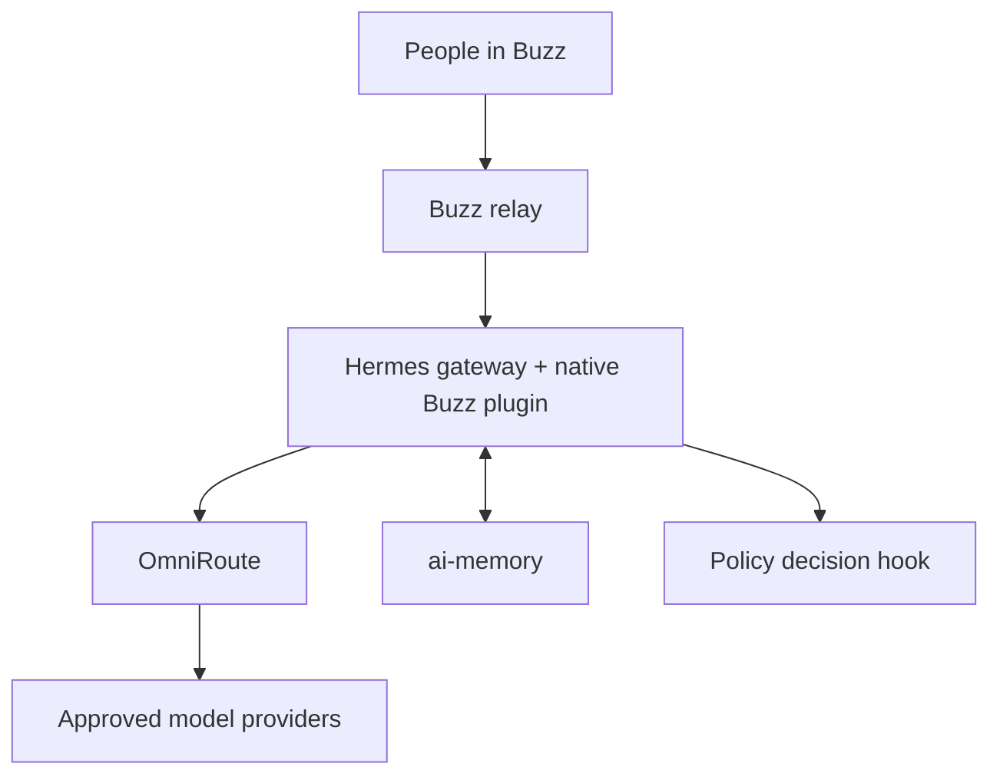

# Agent Factory

Agent Factory is a planning repository for a governed, memory-aware agent system built around one execution engine: **Hermes Agent**.

This repository is ready for implementation planning, not production deployment. It contains the reviewed architecture, integration contracts, security boundaries, milestone backlog, source pins, configuration examples, and the complete original v2 document set. No application functionality has been built in this pass.

## v1 in one sentence

Buzz provides the human interface; Hermes is the sole agent runtime; every model request goes through OmniRoute; Fubuki supplies a hash-pinned governance packet; ai-memory supplies project and company memory through a Hermes memory-provider plugin; tool calls pass a fail-closed Hermes hook before execution in a gVisor-contained runtime.

## Deliberate simplifications

- Hermes is the only v1 execution engine.
- Hermes' native Buzz platform plugin replaces the separate `buzz-acp` execution path.
- Codex/Claude/Pi adapters, HarnessRouter, the Harness Foundry, JIT, OpenHarness, and GBrain are not in the v1 runtime.
- “Codex through Hermes” means Hermes uses a Codex Responses-compatible model route through OmniRoute. The Codex CLI/app-server is not enabled in v1 because it would create a second execution path and can bypass the sole-egress design.
- ai-memory starts with two durable scopes: project and company. Team and per-agent durable scopes are deferred.
- Automatic memory promotion is disabled initially. Human approval remains mandatory when the learning loop is enabled later.
- AlphaEval is an optional evaluation lab after a hardened Hermes runner exists; it is not a production service.

## Reading order

1. [Status](STATUS.md)
2. [Architecture](docs/01_ARCHITECTURE.md)
3. [Component audit](docs/02_COMPONENT_AUDIT.md)
4. [Integration contracts](docs/03_INTEGRATION_CONTRACTS.md)
5. [Memory and governance](docs/04_MEMORY_AND_GOVERNANCE.md)
6. [Security](docs/05_SECURITY.md)
7. [Evaluation strategy](docs/06_EVALUATION.md)
8. [Build plan](docs/07_BUILD_PLAN.md)
9. [Decision log](docs/08_DECISION_LOG.md)
10. [Pre-mortem](docs/09_PREMORTEM.md)

The supplied v2 plan is preserved unchanged in [`docs/archive/v2-original/`](docs/archive/v2-original/README.md). The current documents supersede it where they disagree.

## Repository map

| Path | Purpose |
|---|---|
| `docs/` | Current plan, contracts, audit, risks, and decisions |
| `docs/archive/v2-original/` | Immutable copy of all 14 supplied planning documents |
| `config/` | Reviewed configuration examples; never put live secrets here |
| `deploy/` | Deployment contract and non-runnable topology blueprint |
| `.github/` | Pull-request checks and issue templates |
| `upstream.lock.yaml` | Exact upstream commits inspected in this audit |
| `scripts/verify-planning-repo.sh` | Offline structural validation for this planning repository |

## Current gate

Do not begin feature work until all Stage 0 exit criteria in [the build plan](docs/07_BUILD_PLAN.md) are satisfied. In particular, prove the Hermes→OmniRoute Responses route, the Buzz plugin flow, the Fubuki linter fix, gVisor compatibility, and the ai-memory provider seam with small executable spikes.
