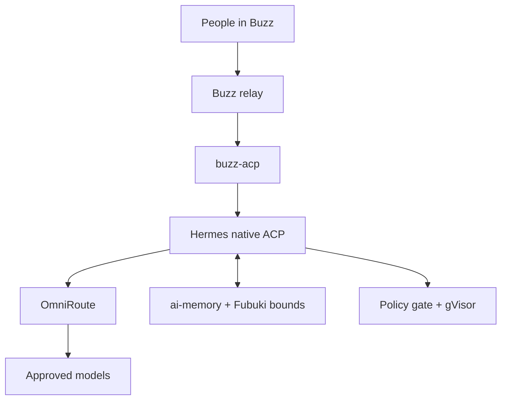
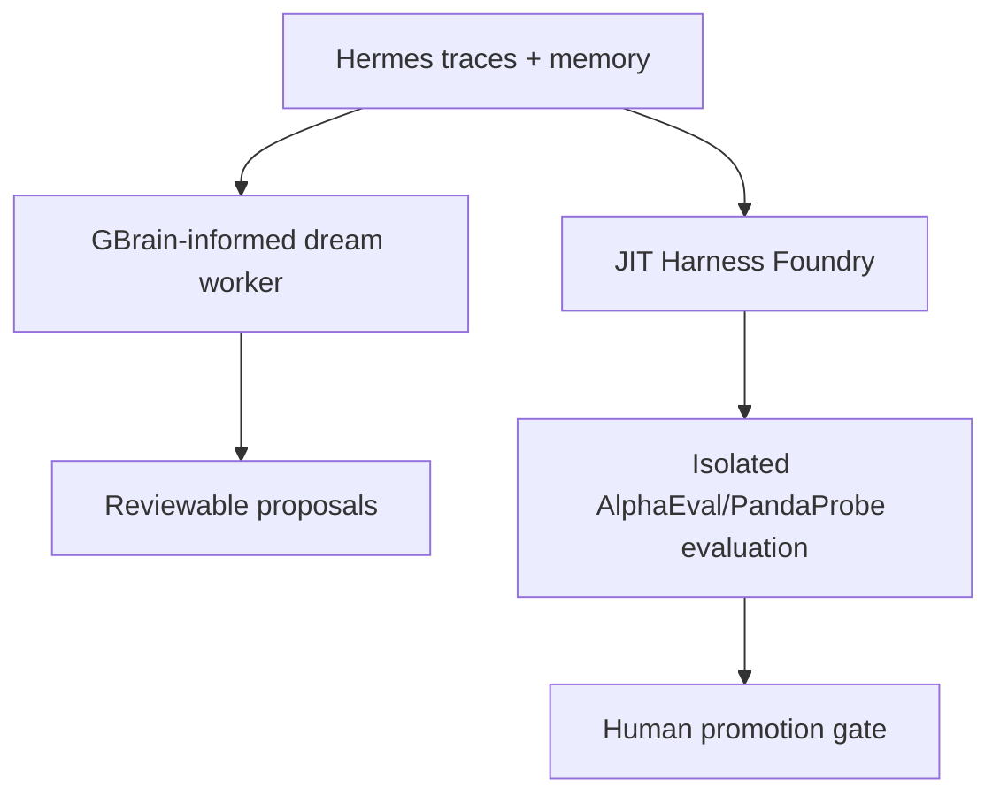

# Agent Factory

Agent Factory is a planning repository for a governed, memory-aware agent system with **Hermes Agent as the main workhorse**, plus a controlled research and improvement stack around it.

This repository is ready for implementation planning, not production deployment. It contains the reviewed architecture, integration contracts, security boundaries, memory and dream-phase design, JIT Harness Foundry, evaluation strategy, source pins, configuration examples, and the complete original v2 document set. No application functionality has been built in this pass.

## System in one paragraph

Buzz provides the human interface and `buzz-acp` drives Hermes through Hermes' native ACP server. Hermes is the sole stock production runtime and sends every model request through OmniRoute, including Codex-capable models. Fubuki supplies hash-pinned governance, ai-memory supplies the four logical memory levels through a first-party composite adapter, and tool calls pass a fail-closed policy gate inside gVisor containment. The later improvement plane retains GBrain-informed dream cycles, JIT-generated harness candidates, the Harness Foundry, AlphaEval-style evaluation, PandaProbe observability, and HarnessRouter only when an approved UHP-only harness actually needs it.

## What changed from the supplied v2 plan

- Hermes replaces Codex CLI, Claude Code, Pi, and their ACP adapters as parallel stock runtimes.
- ACP remains in the live path: `buzz-acp` talks to Hermes' native ACP server.
- Codex-capable models remain available through Hermes' Responses-compatible OmniRoute route; Codex is a model/backend choice, not another workhorse.
- JIT, the Harness Foundry, GBrain/dream phase, HarnessRouter's conditional Phase 2 role, PandaProbe, AlphaEval, Fubuki, ai-memory, gVisor, and the development tools remain in the plan.
- Source-audit corrections are retained: the four memory levels require a composite adapter; Fubuki has two seams to fix/test; OmniRoute compression needs a real request/header assertion; whole-runtime gVisor is not per-tool isolation; AlphaEval and generated harnesses require a hardened sandbox.

## Reading order

1. [Status](STATUS.md)
2. [Architecture](docs/01_ARCHITECTURE.md)
3. [Component audit](docs/02_COMPONENT_AUDIT.md)
4. [Integration contracts](docs/03_INTEGRATION_CONTRACTS.md)
5. [Memory and governance](docs/04_MEMORY_AND_GOVERNANCE.md)
6. [Security](docs/05_SECURITY.md)
7. [Evaluation and observability](docs/06_EVALUATION.md)
8. [Build plan](docs/07_BUILD_PLAN.md)
9. [Decision log](docs/08_DECISION_LOG.md)
10. [Pre-mortem](docs/09_PREMORTEM.md)
11. [Harness Foundry](docs/10_HARNESS_FOUNDRY.md)
12. [Dream phase](docs/11_DREAM_PHASE.md)

The supplied v2 plan is preserved unchanged in [`docs/archive/v2-original/`](docs/archive/v2-original/README.md). The current documents supersede it only where the source audit or Hermes runtime decision requires a correction.

## Repository map

| Path | Purpose |
|---|---|
| `docs/` | Current plan, contracts, Foundry, dream phase, audit, risks, and decisions |
| `docs/archive/v2-original/` | Immutable copy of all 14 supplied planning documents |
| `config/` | Reviewed configuration examples; never put live secrets here |
| `deploy/` | Deployment contract and non-runnable topology blueprint |
| `.github/` | Pull-request checks and issue templates |
| `upstream.lock.yaml` | Exact upstream commits inspected in this audit |
| `scripts/verify-planning-repo.sh` | Offline structural validation for this planning repository |

## Current gate

Do not begin broad feature work until the Stage 0 proof pack in [the build plan](docs/07_BUILD_PLAN.md) validates the Buzz→ACP→Hermes→OmniRoute spine, memory composition, Fubuki seams, policy failure behavior, and gVisor compatibility. JIT and GBrain work can begin as isolated research spikes, but their output has no production write or execution authority until later gates pass.
