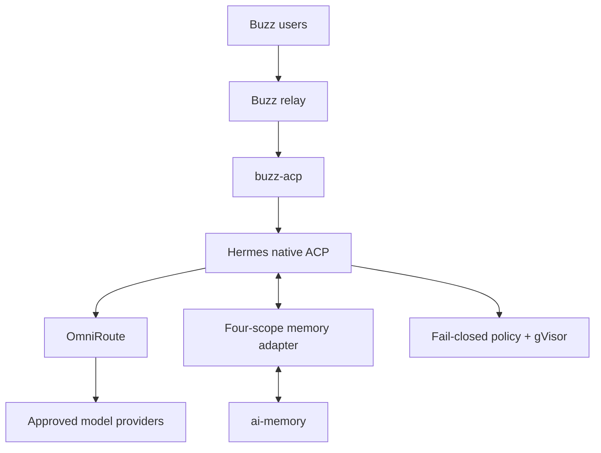
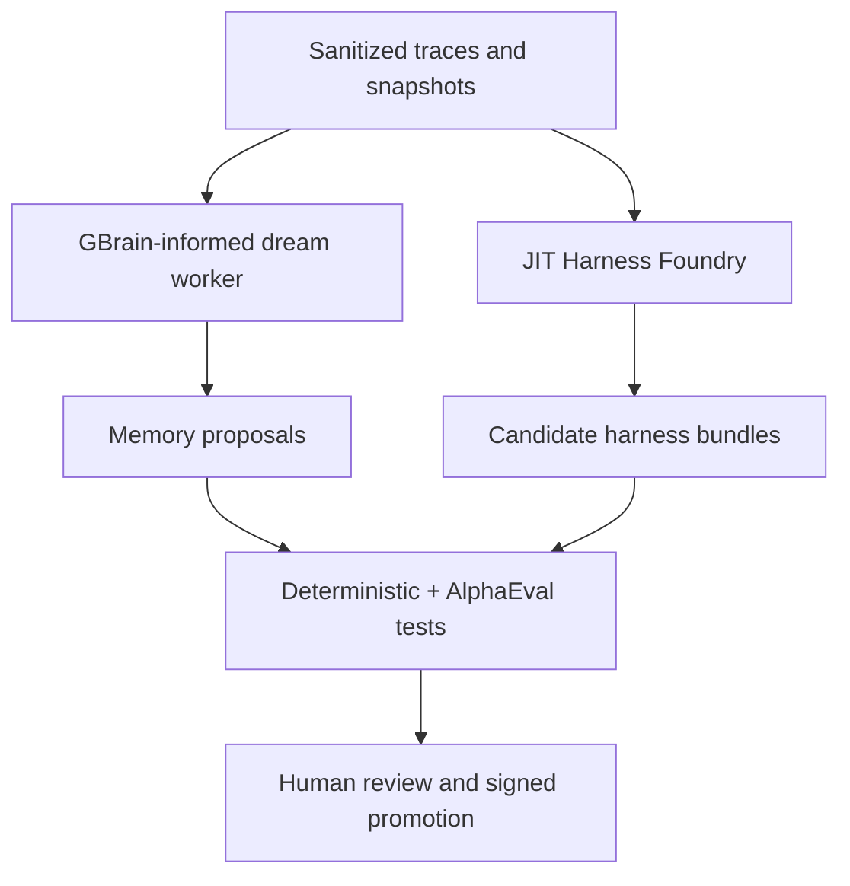
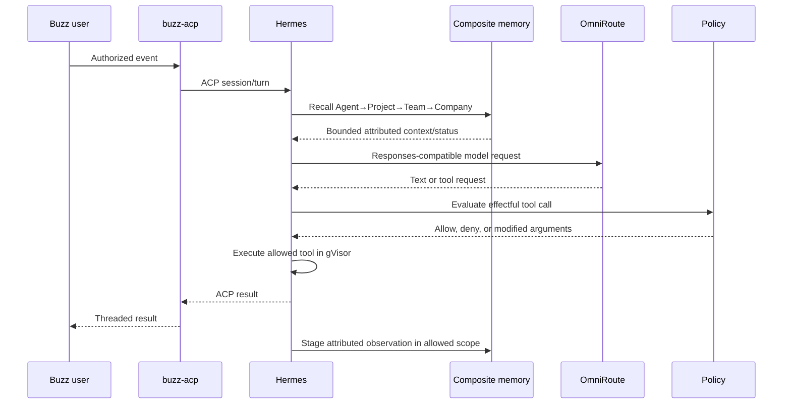

# 01 — Architecture

## 1. Outcome

Agent Factory keeps the full governed-memory and improvement design, with one narrow runtime simplification: **Hermes is the sole stock production workhorse**. Codex CLI, Claude Code, Pi, and their ACP adapters are not parallel runtimes. Everything else remains in its intended role.

The live interaction path is:

```text
Buzz relay → buzz-acp → Hermes native ACP server → Hermes agent loop
```

Hermes sends every model request through OmniRoute. A Codex-capable model is selected through Hermes' `codex_responses` provider mode; that does not create a second runtime.

## 2. Planes and ownership

| Plane | Components | Responsibility |
|---|---|---|
| Interaction | Buzz relay, `buzz-acp`, ACP | Human collaboration, transport, and Hermes process/session bridge |
| Runtime | Hermes Agent | Conversation, planning, tool orchestration, sessions, and stock production execution |
| Model routing | OmniRoute | Sole model/embedding API egress, provider credentials, route selection |
| Governance | Fubuki | Canonical persona/governance packet, bounds, lint, and packet hash |
| Memory | ai-memory + composite adapter | Four logical scopes, provenance, retrieval, staging, and reviewed promotion |
| Tool security | Policy service + gVisor | Fail-closed authorization and runtime containment |
| Dream/learning | GBrain-informed worker | Offline reflection, evidence checking, and reviewable memory proposals |
| Harness Foundry | JIT + adapters + optional OpenHarness patterns | Generate candidate harness bundles; never auto-deploy |
| Evaluation/observability | AlphaEval, PandaProbe | Isolated acceptance tests, trajectory analysis, and promotion evidence |
| Conditional harness access | HarnessRouter | Phase 2 UHP bridge only for an approved non-ACP harness |

## 3. Production topology



`buzz-acp` launches `hermes-acp`. Hermes remains the process that owns reasoning and tools. ACP is the client/runtime interface, not a second agent engine.

## 4. Improvement topology

The improvement plane is retained but isolated from production authority.



- The dream worker can propose memory changes but holds no ai-memory admin credential.
- JIT generates five-file candidates plus a first-party manifest; candidates receive no production secrets or network.
- AlphaEval-style runners and PandaProbe analyze isolated runs.
- An approved candidate normally becomes a Hermes plugin/profile. HarnessRouter is introduced only if an approved UHP/Responses-only harness cannot use ACP.

## 5. One-turn lifecycle



Failure behavior:

- Unknown Buzz senders and invalid/replayed events are denied.
- Missing or malformed policy decisions block the tool.
- OmniRoute failure fails the model turn; Hermes never falls back to a direct provider.
- Normal recall may degrade visibly because Hermes' external-memory provider contract is non-fatal.
- `memory_required` workflows use a separate pre-dispatch health gate; Hermes' `pre_llm_call` hook is not a fail-closed gate.

## 6. Four logical memory scopes

ai-memory natively exposes `(workspace, project)`, not a hierarchical four-scope model. A first-party adapter preserves the intended four levels with explicit mappings:

| Logical scope | ai-memory mapping |
|---|---|
| Company | `(factory, _global)` |
| Team | `(factory, team--<team-id>)` |
| Project | `(factory, project--<project-id>)` |
| Agent | `(factory, agent--<agent-id>)` |

The adapter reads with precedence Agent → Project → Team → Company and writes only to the explicitly authorized active scope. This adapter is an authorization boundary; path names alone are not isolation, and sensitive tenants may require separate ai-memory instances or workspaces.

## 7. Trust boundaries

| Boundary | Required control |
|---|---|
| Buzz → `buzz-acp` | Membership/allowlist, signature verification, independent freshness and replay controls |
| `buzz-acp` → Hermes | Pinned `hermes-acp`, bounded session lifetime, explicit timeouts, audited process ownership |
| Hermes → OmniRoute | Internal scoped key, fixed base URL, no upstream keys, compression assertion |
| Hermes → memory adapter | Authorized identity/scope tuple, bounded reads/writes, Fubuki filtering |
| Model → tool | Fail-closed policy hook, canonical arguments, deny by default |
| Runtime → host/network | gVisor, narrow mounts, resource limits, controlled egress |
| Dream/Foundry/evaluation → production | Sanitized exports only, separate credentials/network/storage, signed human promotion |

## 8. Explicit runtime decision

Removed as stock runtimes: Codex CLI/app-server, Claude Code, Pi, `codex-acp`, `claude-agent-acp`, and `pi-acp`.

Retained: ACP, `buzz-acp`, Hermes, OmniRoute, Fubuki, ai-memory, four memory scopes, GBrain/dream, JIT Harness Foundry, OpenHarness research, AlphaEval, PandaProbe, conditional HarnessRouter, gVisor, ast-grep, Comby, and the policy service.
