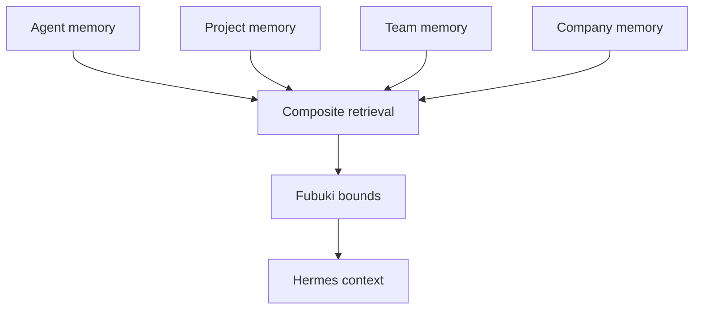
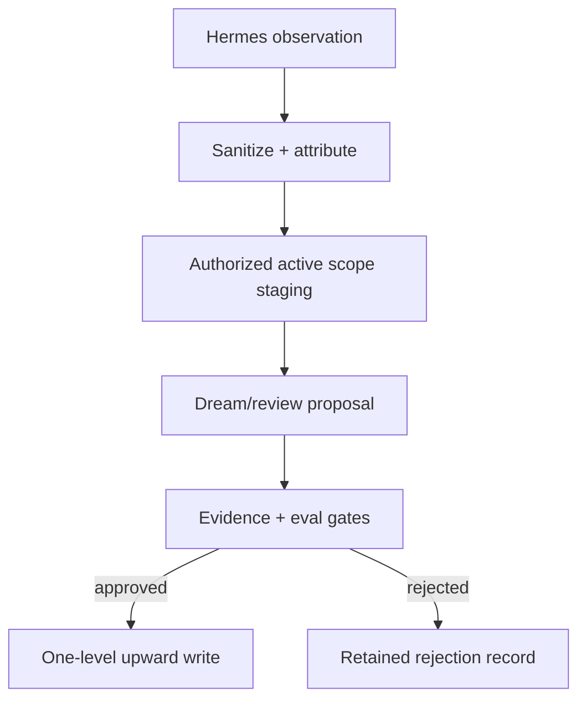

# 04 — Memory and governance

## 1. Separation of authority

| Concern | Authority |
|---|---|
| Persona, invariants, bounds | Fubuki packet |
| Active reasoning/tool loop | Hermes |
| Durable records/provenance | ai-memory |
| Scope composition/authorization | First-party composite adapter |
| Dream proposals | Isolated GBrain-informed worker |
| Promotion | Deterministic gates + human/operator workflow |
| Model/provider selection | OmniRoute |

Memory is untrusted data, not system instruction. Neither a dream proposal nor a generated harness can rewrite governance.

## 2. Four logical scopes retained



| Logical level | Mapping | Typical content | Write authority |
|---|---|---|---|
| Agent | `(factory, agent--<agent-id>)` | Stable agent-specific working preferences/lessons | Authorized system adapter for that agent |
| Project | `(factory, project--<project-id>)` | Project decisions, conventions, state | Authorized project turn/staging workflow |
| Team | `(factory, team--<team-id>)` | Team standards and shared procedures | Reviewed project→team promotion |
| Company | `(factory, _global)` | Organization-wide invariants and approved knowledge | Operator-reviewed promotion only |

Precedence is Agent → Project → Team → Company for ordinary overridable facts. Fubuki/company invariants marked non-overridable remain authoritative. Every injected record retains its origin and stable ID.

This is a custom logical hierarchy over ai-memory projects, not native hierarchical RBAC. The adapter validates the actor/agent/team/project tuple on every request. Same-workspace tokens cannot be treated as per-project isolation; highly sensitive tenants should receive separate instances or workspaces.

## 3. Context assembly

1. Hermes base runtime instructions.
2. Fubuki governance projection and packet hash.
3. Policy-filtered tool descriptions.
4. Bounded Company/Team/Project/Agent recall, labeled as untrusted evidence.
5. Conversation history and current Buzz message.

The composite provider de-duplicates deterministically, records scope precedence, and never promotes text merely because it was recalled often.

## 4. Recall failure contract

The provider returns bounded content, stable IDs, scopes, relevance/confidence, Fubuki decisions, freshness, and a status.

- Normal tasks may continue with `memory_status=degraded`, shown in telemetry/run output.
- `memory_required` tasks fail before model dispatch when the separate health preflight fails.
- Hermes' native provider call and `pre_llm_call` hook do not supply a fail-closed gate.
- Cached results are labeled with their original freshness.
- Any scope authorization ambiguity fails closed for that scope.

## 5. Write and promotion paths



Rules:

- No model-callable approve, delete, purge, or promotion tool.
- Dream workers propose; system validators and humans decide/apply.
- Promotions move at most one level per reviewed action: Agent→Project→Team→Company.
- Company writes always require an operator audit event.
- Every write records session, turn, actor, governance hash, source event, input digest, and scope.
- Retries are idempotent. Corrections supersede rather than erase the audit chain.
- Legal/administrative deletion is a separate operator-only process.

## 6. Safe ai-memory posture

```toml
[auto_improve]
require_approval = true

[auto_improve.scheduler]
enabled = false

[maintenance]
enabled = false

[slots]
per_user = false
```

Equivalent nested variables use double underscores:

```text
AI_MEMORY_AUTO_IMPROVE__REQUIRE_APPROVAL=true
AI_MEMORY_AUTO_IMPROVE__SCHEDULER__ENABLED=false
AI_MEMORY_MAINTENANCE__ENABLED=false
AI_MEMORY_SLOTS__PER_USER=false
```

ai-memory's native auto-improve is not the cross-scope promotion mechanism. Keep it disabled until the proposal/evaluation contract is proven.

## 7. Fubuki lifecycle and fixes

- Lint and compile reviewed sources before Hermes readiness.
- Fix/wrap `persona_lint` so any violation returns the documented violation status regardless of ordering.
- Join `BoundDecision.record_id` values to source records explicitly.
- Hash canonical output and attach the hash to sessions, tool calls, recalls, writes, dreams, evaluations, and promotions.
- A new packet creates a new deployment/session boundary; it does not mutate an active session invisibly.
- Complete the upstream suite with declared dependencies and add negative fixtures for duplicate/missing IDs, stale hashes, malformed packets, and scope leakage.

## 8. Dream phase retained

The GBrain-informed dream worker is part of the roadmap, not a mere citation. It operates on immutable sanitized exports, can invoke isolated analysis subagents, verifies quoted evidence, and produces provenance-rich proposals. An orchestrator outside the worker revalidates evidence and submits the proposal to deterministic and human review.

The initial integration may adapt selected MIT-licensed GBrain modules/patterns or wrap the pinned repository. A Stage 5 spike chooses the smaller reliable seam. In either case, the worker receives no production write credentials and cannot auto-promote.

See [11 — Dream phase](11_DREAM_PHASE.md) for the detailed workflow.
