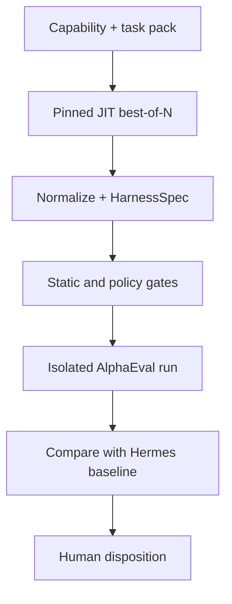

# 10 — JIT Harness Foundry

## 1. Purpose

The Harness Foundry remains a first-class later phase. It uses JIT to generate and compare specialized harness candidates while Hermes remains the stock production workhorse.

The Foundry is not a self-deploying agent factory. Its output is an untrusted candidate artifact until static, behavioral, security, and human gates complete.

## 2. Inputs and outputs

Inputs:

- versioned task pack and target capability;
- permitted tool/interface schema;
- Fubuki governance hash and non-secret projection;
- synthetic/sanitized memory fixtures;
- model route identifier through OmniRoute;
- generator seed, budget, and resource envelope.

JIT produces five source files:

- `memory.py`
- `planning.py`
- `action.py`
- `tool_policy.py`
- `prompt.yaml`

The first-party adapter adds `harness-spec.yaml`, `provenance.json`, and evaluation results. Never describe JIT as producing four modules.

## 3. Foundry workflow

Possible dispositions:

1. reject and retain evidence;
2. research-only candidate;
3. translate into a versioned Hermes plugin/profile;
4. approve a standalone experimental harness;
5. for an approved UHP-only standalone harness, propose a HarnessRouter ADR.

## 4. HarnessSpec requirements

The manifest records:

- candidate ID, parent/generator commits, input/seed/model digests;
- expected runtime and protocol: Hermes plugin/profile, ACP, or UHP;
- declared tools, filesystem roots, network destinations, and secret classes;
- model/embedding routes, always through OmniRoute;
- resource/time/process limits and containment profile;
- supported task pack and compatibility/version range;
- source/build/SBOM digests;
- evaluation summary and promotion signature state.

Unknown or undeclared capability denies execution.

## 5. Isolation and authority

- JIT runs offline in an ephemeral gVisor worker.
- Inputs are read-only; outputs go to a candidate-only artifact sink.
- No production credential, memory token, Buzz key, deployment token, Docker socket, or host network is available.
- Candidate code runs only in the separate evaluation sandbox.
- Rubric/evaluator code runs separately again.
- Generated `tool_policy.py` can reduce candidate behavior but cannot override the external Agent Factory policy service.
- Promotion copies by verified digest through an operator-controlled workflow; the Foundry cannot push itself.

## 6. OpenHarness decision

OpenHarness is a full standalone harness rather than a minimal skeleton. The Foundry proof pack must compare:

- a small first-party host/translator for JIT outputs;
- extraction of limited interface patterns from OpenHarness;
- a pinned, hardened OpenHarness derivative.

Select the smallest option that preserves reproducibility, required tool semantics, and containment. Do not place OpenHarness in production merely because it is listed as a Foundry component.

## 7. HarnessRouter decision

HarnessRouter is not required for Hermes or ACP candidates. It becomes eligible only when:

- a candidate has passed all gates and received explicit standalone approval;
- it exposes UHP/Responses rather than ACP;
- translating it to a Hermes plugin/profile or ACP would materially harm its capability;
- an ADR accepts the gateway's additional lifecycle, privilege, and isolation burden.

At that point use the official one-container gateway shape and retest its current UHP specification.

## 8. Done criteria

- Same inputs, pins, and seed produce an identical normalized candidate or explain nondeterminism.
- All five JIT files and manifest/provenance are present and digest-locked.
- Candidate has no undeclared capability or direct provider access.
- Security gates pass and quality is compared to Hermes on the same tasks/routes/budget.
- A human disposition is signed and auditable.
- No generated artifact can activate itself.
