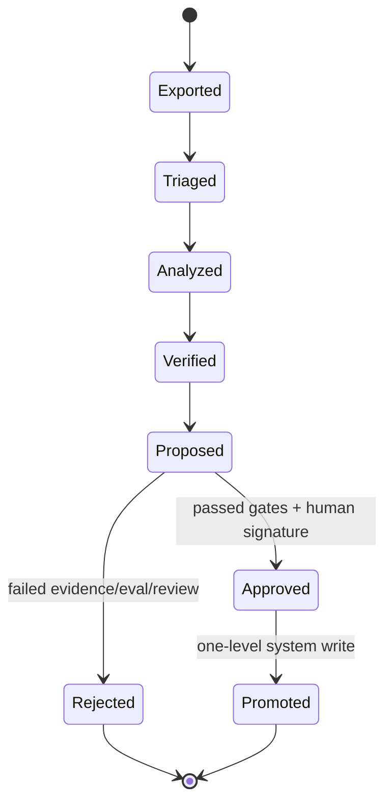

# 11 — GBrain-informed dream phase

## 1. Purpose

The dream phase remains the controlled learning mechanism for turning accumulated traces and memory into evidence-backed proposals. GBrain supplies the concrete architectural inspiration: triage, constrained parallel analysis, quote verification, provenance, orchestrator validation, and reverse writing.

GBrain is a full knowledge system, not a drop-in ai-memory plugin. Agent Factory will either wrap its pinned dream machinery or adapt selected MIT-licensed modules/patterns after a proof spike.

## 2. Authority model

| Actor | May read | May write |
|---|---|---|
| Exporter | Authorized production traces/memory | Immutable sanitized snapshot |
| Dream worker/subagents | Snapshot only | Scratch analysis and proposal bundle |
| System validator | Snapshot + proposal | Validation report/review queue |
| Human/operator | Evidence and evaluation | Signed approve/reject decision |
| Promotion service | Approved signed decision | One authorized target-scope record |

The dream worker and its subagents never receive ai-memory admin credentials, production tool access, or governance-write authority.

## 3. Workflow



1. Export an immutable, redacted snapshot with record/trace IDs and governance hash.
2. Triage recurring failures, corrections, successful procedures, conflicts, and missing knowledge.
3. Run isolated specialist analyses with no filesystem writes outside scratch.
4. Produce proposed changes with exact quoted evidence and source IDs.
5. A system validator re-resolves every quote from the frozen snapshot and checks scope/lineage.
6. Run deterministic injection, leakage, contradiction, and task-regression tests; optionally use calibrated OmniRoute judges.
7. A human approves/rejects. The system promotion service applies at most one upward scope transition.
8. Retain the proposal, evaluation, decision, and supersession/rollback data.

## 4. Proposal schema

Each proposal includes:

- immutable proposal and input-export IDs;
- source and target logical scopes;
- proposed content/operation;
- supporting and conflicting record/trace IDs;
- exact evidence excerpts plus verification status;
- rationale, uncertainty, expected benefit, and known risks;
- governance, worker, generator, model-route, prompt, and redaction versions;
- deterministic and judge results;
- required reviewer class and expiry/staleness rules;
- rollback/supersession relationship.

Missing or unresolvable evidence rejects the proposal.

## 5. Scope movement

Promotion is push-up-only and one level at a time:

```text
Agent → Project → Team → Company
```

A Project observation does not jump directly to Company. Each boundary has separate relevance, confidentiality, contradiction, injection, and regression gates. Company promotion always requires operator approval.

The dream phase may also propose a correction or supersession within the same scope, but never silently delete history.

## 6. Reverse writing and feedback

When a proposal is rejected or promoted, write a compact outcome record back to the proposal lineage—not directly into general recalled memory. This lets future dreams learn that a candidate was already considered without turning the review result into an instruction.

Repeated rejected proposals should be suppressed by content/source digest until material new evidence appears.

## 7. Safety tests

- Snapshot redaction removes secrets and prohibited content before worker access.
- Worker has no route to ai-memory admin, Buzz, policy mutation, production workspace, or providers except a scoped OmniRoute analysis key if explicitly enabled.
- Quoted evidence must resolve byte-for-byte or by a documented normalization.
- Stored prompt injection cannot alter worker authority, proposal schema, or validator behavior.
- Cross-scope confidential records cannot become a broader-scope proposal.
- A stale governance/input hash forces re-evaluation.
- Promotion service rejects unsigned, expired, multi-level, conflicting, or already-applied proposals.

## 8. Done criteria

- Wrap-vs-adapt choice is documented with pinned code and license notices.
- A full proposal can be reproduced from its immutable input and configuration.
- Worker failure produces no production mutation.
- Evidence, evaluation, human decision, and final write are linked by digests.
- Rejection, supersession, and rollback flows are tested across all four scopes.

## 9. Proposed, not built: Jev/Laya advisory triage (D-058)

The owner proposed on 2026-09-23 that Jev/Laya help decide what the dream phase keeps, promotes and filters. It is recorded as D-058 and is not built. The dream phase itself does not exist yet (Stage 5 of `docs/07_BUILD_PLAN.md`).

What it would do:

- Label and rank snapshot records and proposals: keep, promote-candidate, near-duplicate of a rejected proposal, noise.
- Order the human review queue so the strongest candidates come first.
- Flag near-duplicates of rejected proposals that §6's exact digest suppression misses.

What it must never do:

- Approve, reject or promote anything. The human signs every decision (§3 step 7), and the promotion service applies it.
- Enter the deterministic tests of §3 step 6, a gate, or the promotion service's checks (KC-J1; Standing Rule 12).
- Delete or hide a record. A "drop" is a queue label; every record and proposal stays listed and auditable (§5; Standing Rule 10).

How it would learn: each §6 outcome record is a human label. A later J1 contract amendment adds the capture-only types `dp.keep`, `dp.promote` and `dp.dup_rejected`. No type drives the queue until it holds 200 human labels and beats the deterministic baseline (§6 digest suppression) on a blind set (KC-J2, KC-J7). The queue stores the Jev label beside the human decision, so the override rate is measured.

Where it would run, decided in the Stage 5 design:

- Inside the worker at §3 step 2. The worker reaches models only through a scoped OmniRoute key (§7), so Laya needs an OmniRoute route (Standing Rule 3).
- System-side at the human queue (§3 step 7). The worker's network stays as it is, but the labeler reads untrusted proposal text, so its label is attack surface and never a filter.

When: after the J1 decision ledger closes and after the Stage 5 dream-phase build exists (task #195).
