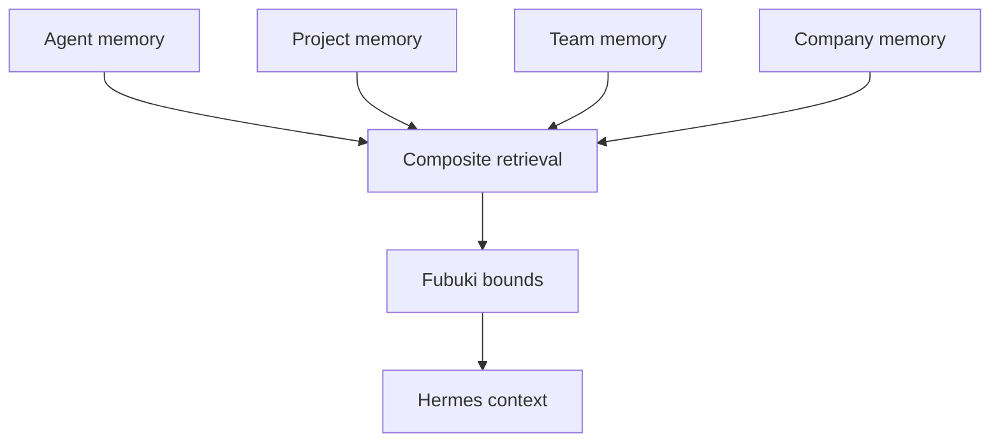

# MATERIAL PACK — S0-06 (four-scope adapter design proof, spike-gated)

> EVIDENCE ONLY. Verbatim extraction + located inventory. No design, no judgement, no
> recommendation. Assembled 2026-09-07/08 from the working tree at branch
> `claude/soundbox-kit-migration-iz1jwf`, HEAD `cc46704`. Other lanes hold uncommitted edits.
> **The 18 defect classes and the mint-wide AF-AP rows are carried once in
> `material-S0-02.md` §7 — read that section with this pack.**

---

## 0. INVENTORY TABLE

| item | source file:line | exists? | venue |
|---|---|---|---|
| Seed per-proof block S0-06 | `seeds/seed-stage0-v1.yaml:442-459` | yes | — |
| Frozen `spike_to_class_mapping` entry (`rust-ai-memory`) | `seeds/seed-stage0-v1.yaml:571-574`; `proofs/registry.yaml:30` | yes | — |
| Seed comment explaining S0-06's constraint gap | `seeds/seed-stage0-v1.yaml:564-569` | yes | — |
| Breakdown increment #3 (the spike) | `tasks/stage0-breakdown.md:54` | yes | sandbox row / PC actual |
| Breakdown increment #13 (the proof) | `tasks/stage0-breakdown.md:64` | yes | PC |
| Findings per-proof constraint | `docs/research/FINDINGS-STAGE0-v1.md:47` | yes | — |
| Findings Rust environment row | `docs/research/FINDINGS-STAGE0-v1.md:23` | yes | — |
| Findings §6a addendum 3 (class disputed) | `docs/research/FINDINGS-STAGE0-v1.md:113-114` | yes | — |
| Council KC-3 | `docs/research/COUNCIL-VERDICT-STAGE0-v1.md:35` | yes | — |
| Council disagreement 1 / unresolved 3 | `docs/research/COUNCIL-VERDICT-STAGE0-v1.md:79, 47` | yes | — |
| Plan-doc seam `docs/03` §4 composite memory provider | `docs/03_INTEGRATION_CONTRACTS.md:70-98` | yes | — |
| Plan-doc seam `docs/04` §1-§7 | `docs/04_MEMORY_AND_GOVERNANCE.md:3-116` | yes | — |
| Plan-doc seam `docs/01` §6 four scopes | `docs/01_ARCHITECTURE.md:99-110` | yes | — |
| ADR 0003 (four logical scopes) | `docs/adr/0003-four-logical-memory-scopes.md:1-23` | yes | — |
| ADR 0003 (two durable scopes — same number, different file) | `docs/adr/0003-two-durable-memory-scopes.md:1-16` | yes — **both accepted, both numbered 0003** | — |
| upstream pin `ai-memory` | `upstream.lock.yaml:33-38` | yes | — |
| `proofs/S0-06/` directory | `ls proofs/` | **no** | — |
| `proofs/S0-06/spec.json` / `result.json` / fixtures | — | **no**; ledger state `ABSENT` | — |
| `fixtures/s0-06/neg-unauthorized-tuple.json` (named by the seed) | seed:457 | **no** — no `fixtures/` tree at repo root | — |
| Registry entry S0-06 | `proofs/registry.yaml:17` | yes | — |
| Wave-0 spike artifact | `spikes/rust-ai-memory/result.json` (54 lines) | yes — POSITIVE | PC |
| Second spike naming S0-06 | `spikes/pc-bridge/result.json:44-50` | yes | PC |
| Blocked marker for S0-06 | — | **no** (execution_proof) | — |
| Ledger task rows | `todo/BUILD-TASKLIST.md:60` (spike DONE), `:70` (#13 pending) | yes | — |

---

## 1. THE SEED

### 1.1 `seeds/seed-stage0-v1.yaml:442-459` (verbatim)

```yaml
- proof_id: S0-06
  classification: execution_proof
  wave: 1
  increment_index: 13
  ledger_denominator: execution
  spike_dependency: [rust-ai-memory]
  fixture_format: committed scope/auth fixtures against a REAL pinned ai-memory instance
    (cargo build from the pinned commit; spike decides venue)
  assertions:
  - the auth tuple (actor/agent/team/project) is validated outside model control
  - merge precedence Agent->Project->Team->Company with deterministic de-duplication
    (same input twice -> byte-identical merged output)
  - writes land only in the explicitly authorized active scope
  - a honeytoken staged in one scope NEVER surfaces in another scope's recall (leak fixture)
  negative_control:
    fixture: fixtures/s0-06/neg-unauthorized-tuple.json
    expected_failure_reason: 'denied: scope-tuple-unauthorized'
  owner_placeholder: none
```

### 1.2 Frozen `spike_to_class_mapping` entry (`seeds/seed-stage0-v1.yaml:564-574`, verbatim — comment included)

```yaml
# Frozen spike-to-class mapping (interview Q2 decision): the ledger generator
# applies these rules MECHANICALLY when a Wave-0 spike artifact records a
# negative result; any transition not declared here requires a reviewed commit
# amending this block. Also completes a gap in the generated constraints, which
# omit S0-06: per the council verdict (KC-3) S0-06 is an execution proof whose
# venue the rust-ai-memory spike decides.
spike_to_class_mapping:
- spike: rust-ai-memory
  probe: cargo build of pinned ai-memory on the installed toolchain, then rustup 1.95 fetch
  negative_effect: {affected_proof: S0-06, from_class: execution_proof, to_class: blocked_capability, rule_id: map-rust-s006}
  positive_effect: {affected_proof: S0-06, class: execution_proof, note: KC-3 falsifies the blocked label}
```

Registry copy (`proofs/registry.yaml:30`, verbatim — `rule_id` added to the positive branch):

```json
  {"spike": "rust-ai-memory", "probe": "cargo build of pinned ai-memory on the installed toolchain, then rustup 1.95 fetch", "negative_effect": {"affected_proof": "S0-06", "from_class": "execution_proof", "to_class": "blocked_capability", "rule_id": "map-rust-s006"}, "positive_effect": {"affected_proof": "S0-06", "class": "execution_proof", "rule_id": "map-rust-s006", "note": "KC-3 falsifies the blocked label"}},
```

Alias in play (`proofs/registry.yaml:9`, verbatim): `"class_aliases": {"blocked_capability":
"blocked_host"}`, with the in-file note (`:26`, verbatim):

```
# COORDINATOR DECISION — VOCABULARY (2026-09-03): normalize blocked_capability to blocked_host when reading spike effects and mapping rules only; proof artifacts must use the canonical four-class enum.
```

`proofs/registry.yaml:17` records `"spike_dependencies": ["rust-ai-memory"]` — matching the seed.

### 1.3 Seed constraints binding S0-06 (`seeds/seed-stage0-v1.yaml:106-118`, verbatim excerpts)

```yaml
- Execution proofs are exactly S0-01, S0-02, S0-04, S0-05-mechanism, S0-07, S0-11;
  conformance-checked decisions are exactly S0-09, S0-10, S0-12
- Every proof ships a spec-time negative control that fails for a named exact reason
- All gates are deterministic and LLM-free; no LLM judge anywhere in the gate spine
- Upstream components stay commit-pinned via upstream.lock.yaml
```

**Recorded, not resolved:** S0-06 is absent from the `Execution proofs are exactly …` enumeration
(`:106-107`) — the omission the seed's own mapping comment (`:567-569`) names and closes: "Also
completes a gap in the generated constraints, which omit S0-06: per the council verdict (KC-3)
S0-06 is an execution proof whose venue the rust-ai-memory spike decides."

Seed dependency list naming the substrate (`seeds/seed-stage0-v1.yaml:92,94`, verbatim):
```yaml
  - ai-memory (four logical memory scopes via a first-party composite adapter)
  - Rust 1.95 toolchain (ai-memory build)
```

---

## 2. THE BREAKDOWN

### 2.1 Increment #13 — the proof (`tasks/stage0-breakdown.md:64`, verbatim row)

```
| 13 | S0-06 four-scope adapter design | `proofs/s0-06/` against a real pinned ai-memory instance | Auth tuple outside model control; deterministic precedence merge (twice identical); write only active scope; honeytoken leak fixture never crosses scopes | `neg-unauthorized-tuple.json` ⇒ `denied: scope-tuple-unauthorized` | spike-gated on #3 (`map-rust-s006`); needs add_repo ai-memory |
```

### 2.2 Increment #3 — the gating spike (`tasks/stage0-breakdown.md:54`, verbatim row)

```
| 3 | Spike: rust-ai-memory | `spikes/rust-ai-memory/result.json` | Fact recorded either way: cargo build of pinned ai-memory on 1.94.1, then rustup 1.95 fetch attempt; `classification_effect` per mapping `map-rust-s006` | spike-errored (crash/timeout) is distinct from spike-negative and blocks only S0-06 | in-sandbox (Wave 0) |
```

### 2.3 Pinned decisions bearing on S0-06 (`tasks/stage0-breakdown.md:20,21,24`, verbatim)

```
| Spikes classify, never gate; frozen `spike_to_class_mapping` applied mechanically; undeclared transitions need a reviewed commit | All spikes must pass before Wave 1 (runsc would deadlock Stage 0) | interview Q2 |
| Committed canonical fixtures drive the REAL pinned binaries; normalized-then-golden compare; `expected_failure_reason` inside each negative fixture | Byte-exact goldens (volatile fields) / test-time generation (oracle drift) / stub of the SUT (NO-STUBS) | interview Q3 |
| Four-way classification; status lines never a flat N/12 | 12 undifferentiated proofs | council |
```

Full table: `material-S0-02.md` §2.2.

### 2.4 Venue update clause (`tasks/stage0-breakdown.md:31-32`, verbatim excerpt)

```
podman-compose stacks for S0-01/S0-02 (#7, #8), S0-03/S0-04 (#14, #15) and
S0-06 (#13); S0-05's full canaries (#16).
```

**Contradiction recorded, not resolved:** the increment-table cell for #13 names no venue beyond
"spike-gated on #3 … needs add_repo ai-memory" (`:64`), while the venue update (`:31-32`) and
`PC-BRIDGE.md:69` assign S0-06 (ai-memory) to the PC; the spike itself already ran on the PC
(`spikes/rust-ai-memory/result.json:6` — `env_fingerprint: "pc-bridge:fedora:x86_64:rustup-1.95.0"`)
even though the breakdown's spike row (`:54`) says "in-sandbox (Wave 0)".

### 2.5 Ordering rationale clause (`tasks/stage0-breakdown.md:74`, verbatim excerpt)

```
#13 when its spike resolves;
```

### 2.6 NOT-built ledger lines touching S0-06

Breakdown-time (`:79-82`): "Nothing below exists yet: … any spike, any proof, any fixture …".
Live (`todo/BUILD-TASKLIST.md:32`, verbatim excerpt): "· ABSENT 4 — S0-02, S0-04, S0-05, S0-06".

Live rows (`todo/BUILD-TASKLIST.md:60, 70`, verbatim excerpts):
```
| s0-03-spike-rust-ai-memory | #3 spike rust-ai-memory (PC: cargo build at pinned commit) | DONE 2026-09-04 — POSITIVE: ai-memory v1.39.0 (edition 2024, resolver 3, MSRV 1.95, 12 workspace crates) compiles on the PC; default stable 1.93.0 succeeded, rustup 1.95.0 available; binaries produced (618 MB + 306 MB debug). **Digests captured 2026-09-04 over the live bridge** — fresh clone at the pinned commit, both `stdout_digest: uncaptured` →
```
```
| s0-13-s0-06-four-scope | #13 S0-06 four-scope adapter proof (real ai-memory on the PC) | pending | s0-02, s0-03 | leak fixture never crosses; unauthorized tuple denied |
```

`todo/BUILD-TASKLIST.md:580` (verbatim excerpt): "artifact: `spikes/rust-ai-memory/result.json`.
Classification effect: S0-06 stays `execution_proof`".

### 2.7 Owner answers (`tasks/stage0-breakdown.md:84-89`)

None names S0-06 directly. The PC-as-execution-host answer covers the ai-memory stack
(`:88` names S0-08's host; `:85-87` names the credential; the venue update `:28-38` names S0-06's
podman-compose stack).

---

## 3. FINDINGS + COUNCIL

### 3.1 Per-proof constraint (`docs/research/FINDINGS-STAGE0-v1.md:47`, verbatim)

```
| S0-06 | Four-scope adapter design | Auth tuple validated outside model control; Agent→Project→Team→Company precedence; write only active scope; leak fixtures; same-workspace tokens ≠ RBAC (`03` §4, `04` §2) |
```

### 3.2 Environment row that decides the venue (`docs/research/FINDINGS-STAGE0-v1.md:23`, verbatim)

```
| Rust cargo/rustc 1.94.1 | present | ai-memory needs Rust 1.95 (`docs/02` §2) — toolchain update or prebuilt needed; buildability is a spike question |
```

And the PC row (`:28`, verbatim excerpt): "…all container stacks (Buzz relay, OmniRoute,
ai-memory) … run THERE."

Capability ledger: `material-S0-02.md` §3.1.

### 3.3 Chairman-verified addendum 3 (`docs/research/FINDINGS-STAGE0-v1.md:113-114`, verbatim)

```
3. **S0-06's class is disputed** (execution proof vs blocked-but-procurable pending Rust 1.95)
   — settled empirically by the Wave-0 cargo/rustup spike, not by preference (verdict KC-3).
```

### 3.4 Cross-cutting invariant naming the memory failure contract (`docs/research/FINDINGS-STAGE0-v1.md:64-66`, verbatim)

```
- Fail-closed semantics: policy outage/malformed ⇒ deny (`03` §5, `05` §3); recall degradation
  is visible, `memory_required` uses a separate preflight because `pre_llm_call` fails open
  (`01` §5, `04` §4).
```

### 3.5 Council lines that touch S0-06 (verbatim)

Kill Criterion 3 (`docs/research/COUNCIL-VERDICT-STAGE0-v1.md:35`):
```
3. **If the Wave-0 Rust spike shows `ai-memory` builds on the installed 1.94.1 or that 1.95 is fetchable**, Ada's "blocked-but-procurable" label for S0-06 is falsified — reclassify it as an execution proof and re-issue the denominators in the same session.
```

Unresolved question 3 (`:47`):
```
3. **Is S0-06 an execution proof or procurement-blocked?** Feynman lists it among the 7; Ada's R2 concession moves it to blocked-but-procurable pending exact-1.95. Both agree the *action* is a Wave-0 cargo spike; they disagree on the *label*, which matters only because the label sets the honest denominator.
```

Points of disagreement 1 (`:79`):
```
1. **S0-06's class — unresolved.** Feynman: execution proof. Ada (R2): blocked-but-procurable pending Rust 1.95. Round 3 locked the wave plan without reconciling it. The disagreement is about the label, not the action — both want a Wave-0 cargo spike — but the label sets a denominator, so it must be settled by Kill Criterion 3 rather than by preference.
```

Recommended next step 3 (`:57`, verbatim):
```
3. Resolve the classification arithmetic to a **four-way** ledger — execution / conformance-checked decision / blocked-on-external-input (S0-03) / blocked-on-capability (S0-08, provisionally S0-06) — with separate denominators and no flat "N/12" anywhere.
```

Recommended next step 2 (`:56`, verbatim excerpt): "Run the Wave-0 spike matrix as four
independent, parallel, minutes-scale probes: Rust-1.95 availability · dockerd-in-sandbox · runsc
static install · **selective**-egress netns…".

---

## 4. PLAN-DOC SEAMS AND PINS

### 4.1 `docs/03_INTEGRATION_CONTRACTS.md:70-98` (verbatim — §4, the contract S0-06 encodes)

```
## 4. Composite memory provider

Implement one Hermes external `MemoryProvider` named `factory_memory`.

Logical mapping:

| Scope | ai-memory `(workspace, project)` |
|---|---|
| Company | `(factory, _global)` |
| Team | `(factory, team--<team-id>)` |
| Project | `(factory, project--<project-id>)` |
| Agent | `(factory, agent--<agent-id>)` |

Read contract:

1. Authenticate the actor/agent/team/project binding outside model control.
2. Query all authorized scopes.
3. Merge with Agent → Project → Team → Company precedence and deterministic de-duplication.
4. Attach scope, stable ID, timestamp, confidence, and provenance.
5. Apply Fubuki bounds and a hard token/character budget.
6. Return an explicit status. On failure, normal turns degrade visibly; `memory_required` turns fail a separate pre-dispatch health check.

Write contract:

- A system-controlled end-of-turn path may append a sanitized, attributed observation only to the authorized active scope.
- The model, dream worker, generated harness, and evaluator receive no raw approve/delete/purge/promotion tool.
- `_global` writes and all upward promotion require a reviewed companion workflow.
- Retries are idempotent by session/turn/event ID.
- The adapter enforces scope authorization because same-workspace ai-memory tokens are not per-project RBAC.
```

### 4.2 `docs/04_MEMORY_AND_GOVERNANCE.md:17-38` (verbatim — §2 four logical scopes)

```
## 2. Four logical scopes retained



| Logical level | Mapping | Typical content | Write authority |
|---|---|---|---|
| Agent | `(factory, agent--<agent-id>)` | Stable agent-specific working preferences/lessons | Authorized system adapter for that agent |
| Project | `(factory, project--<project-id>)` | Project decisions, conventions, state | Authorized project turn/staging workflow |
| Team | `(factory, team--<team-id>)` | Team standards and shared procedures | Reviewed project→team promotion |
| Company | `(factory, _global)` | Organization-wide invariants and approved knowledge | Operator-reviewed promotion only |

Precedence is Agent → Project → Team → Company for ordinary overridable facts. Fubuki/company invariants marked non-overridable remain authoritative. Every injected record retains its origin and stable ID.

This is a custom logical hierarchy over ai-memory projects, not native hierarchical RBAC. The adapter validates the actor/agent/team/project tuple on every request. Same-workspace tokens cannot be treated as per-project isolation; highly sensitive tenants should receive separate instances or workspaces.
```

### 4.3 `docs/04_MEMORY_AND_GOVERNANCE.md:40-58` (verbatim — §3 context assembly, §4 recall failure contract)

```
## 3. Context assembly

1. Hermes base runtime instructions.
2. Fubuki governance projection and packet hash.
3. Policy-filtered tool descriptions.
4. Bounded Company/Team/Project/Agent recall, labeled as untrusted evidence.
5. Conversation history and current Buzz message.

The composite provider de-duplicates deterministically, records scope precedence, and never promotes text merely because it was recalled often.

## 4. Recall failure contract

The provider returns bounded content, stable IDs, scopes, relevance/confidence, Fubuki decisions, freshness, and a status.

- Normal tasks may continue with `memory_status=degraded`, shown in telemetry/run output.
- `memory_required` tasks fail before model dispatch when the separate health preflight fails.
- Hermes' native provider call and `pre_llm_call` hook do not supply a fail-closed gate.
- Cached results are labeled with their original freshness.
- Any scope authorization ambiguity fails closed for that scope.
```

### 4.4 `docs/04_MEMORY_AND_GOVERNANCE.md:60-107` (verbatim — §5 write/promotion rules and §6 safe posture)

```
Rules:

- No model-callable approve, delete, purge, or promotion tool.
- Dream workers propose; system validators and humans decide/apply.
- Promotions move at most one level per reviewed action: Agent→Project→Team→Company.
- Company writes always require an operator audit event.
- Every write records session, turn, actor, governance hash, source event, input digest, and scope.
- Retries are idempotent. Corrections supersede rather than erase the audit chain.
- Legal/administrative deletion is a separate operator-only process.
```

```
## 6. Safe ai-memory posture

```toml
[auto_improve]
require_approval = true

[auto_improve.scheduler]
enabled = false

[maintenance]
enabled = false

[slots]
per_user = false
```

Equivalent nested variables use double underscores:

```text
AI_MEMORY_AUTO_IMPROVE__REQUIRE_APPROVAL=true
AI_MEMORY_AUTO_IMPROVE__SCHEDULER__ENABLED=false
AI_MEMORY_MAINTENANCE__ENABLED=false
AI_MEMORY_SLOTS__PER_USER=false
```

ai-memory's native auto-improve is not the cross-scope promotion mechanism. Keep it disabled until the proposal/evaluation contract is proven.
```

### 4.5 `docs/01_ARCHITECTURE.md:99-110` (verbatim — §6)

```
## 6. Four logical memory scopes

ai-memory natively exposes `(workspace, project)`, not a hierarchical four-scope model. A first-party adapter preserves the intended four levels with explicit mappings:

| Logical scope | ai-memory mapping |
|---|---|
| Company | `(factory, _global)` |
| Team | `(factory, team--<team-id>)` |
| Project | `(factory, project--<project-id>)` |
| Agent | `(factory, agent--<agent-id>)` |

The adapter reads with precedence Agent → Project → Team → Company and writes only to the explicitly authorized active scope. This adapter is an authorization boundary; path names alone are not isolation, and sensitive tenants may require separate ai-memory instances or workspaces.
```

`docs/01_ARCHITECTURE.md:119` (verbatim): "| Hermes → memory adapter | Authorized identity/scope
tuple, bounded reads/writes, Fubuki filtering |"
`docs/01_ARCHITECTURE.md:96-97` (verbatim):
```
- Normal recall may degrade visibly because Hermes' external-memory provider contract is non-fatal.
- `memory_required` workflows use a separate pre-dispatch health gate; Hermes' `pre_llm_call` hook is not a fail-closed gate.
```

### 4.6 `docs/02_COMPONENT_AUDIT.md:67-76` (verbatim — ai-memory audit facts)

```
### ai-memory — selected durable substrate for four logical scopes

- MIT; observed version 1.39.0; Rust 1.95; image Dockerfile is `docker/Dockerfile`; runtime user `ai-memory`.
- Native scope is `(workspace, project)` and `_global` is a reserved project.
- Map Company, Team, Project, and Agent to distinct project IDs behind one first-party composite provider. The provider enforces identity, read precedence, write target, bounds, and leakage tests.
- Same-workspace tokens are not native per-project RBAC. The adapter is a security boundary; high-sensitivity tenants may require separate instances/workspaces.
- `/api/v1` is read-only; writes are admin/MCP surfaces.
- Nested environment keys use double underscores, including `AI_MEMORY_AUTO_IMPROVE__REQUIRE_APPROVAL`.
- Auto-improve scheduling defaults on and approval defaults off when configured. Start with scheduler and maintenance off, approval on, and no model-callable mutation tools.
- Cross-scope promotion is a companion workflow, not native auto-improve.
```

`docs/02_COMPONENT_AUDIT.md:14` (verbatim): "| ai-memory has native `(workspace, project)` scope
only | Preserve four logical scopes through a first-party composite authorization adapter |"
`docs/02_COMPONENT_AUDIT.md:31` (verbatim): "- One external `MemoryProvider` is supported and
errors are non-fatal, so the four-scope logic belongs behind one composite provider."

### 4.7 `docs/05_SECURITY.md` (verbatim lines)

`:22` — "| Four-scope memory leak | Authenticated scope tuple, adapter enforcement, least privilege | Cross-scope honeytokens and query pack |"
`:53` — "| Memory mutation | Stage/promote/approve/delete | System staging only; promotion/delete operator workflows |"
`:80` — "| Memory adapter | ai-memory and audit sink |"
`:81` — "| ai-memory | OmniRoute only when explicitly enabled for embeddings/consolidation |"
`:91` — "- The composite adapter owns scope-limited memory access; ai-memory admin credentials stay operator-only."
`:103` — "- Cross-agent/project/team/company canaries never appear outside authorized recall."

### 4.8 `docs/09_PREMORTEM.md` (verbatim lines)

`:9` — "| 3 | Four-scope adapter leaks data | Team/agent canary appears in another scope | Auth tuple, deny-by-default adapter, honeytoken suite, stronger tenant split |"
`:10` — "| 4 | Memory silently disappears | Answers ignore known facts without a status | Visible degraded marker and strict-workflow preflight |"
`:16` — "| 10 | ai-memory learns/deletes without review | Unexpected scope changes or missing records | Scheduler/maintenance off, approval on, no model mutation tools |"
`:35` (stop-the-line) — "- memory crosses Agent/Project/Team/Company authorization boundaries;"

### 4.9 `docs/07_BUILD_PLAN.md:14` (verbatim) and Stage 2 (`:30-36`, verbatim)

```
| S0-06 | Four-scope adapter design | Auth tuple, precedence, write-target, and leak fixtures |
```

```
## Stage 2 — four-scope memory

- ai-memory deployment from `docker/Dockerfile`, scheduler/maintenance off and approval on.
- First-party composite Hermes provider covering Agent, Project, Team, and Company mappings.
- Identity/scope binding, deterministic precedence/de-duplication, Fubuki-bound results, and visible degradation.
- Authorized active-scope staging writes only; no model-callable mutation/promotion/delete tools.
- Cross-scope leakage, retry/idempotency, and sensitive-tenant isolation tests.
```

### 4.10 ADRs — two accepted files share the number 0003

`docs/adr/0003-four-logical-memory-scopes.md` (verbatim, whole file):

```
# ADR 0003 — Four logical memory scopes over ai-memory

- Status: accepted
- Date: 2026-09-02

## Context

Agent Factory requires Company, Team, Project, and Agent memory. ai-memory natively scopes records by `(workspace, project)` and reserves `_global`; per-user slots are injection constraints, not page-level RBAC. Dropping Team and Agent would discard intended behavior, while presenting path conventions as native isolation would be inaccurate.

## Decision

Retain all four logical scopes behind one first-party composite Hermes provider:

- Company: `(factory, _global)`
- Team: `(factory, team--<team-id>)`
- Project: `(factory, project--<project-id>)`
- Agent: `(factory, agent--<agent-id>)`

The adapter authenticates the actor/agent/team/project binding, reads with Agent→Project→Team→Company precedence, applies Fubuki bounds, and writes only to the authorized active scope. Promotion is a separate reviewed one-level workflow.

## Consequences

The four-level goal survives, but the adapter becomes a security-critical authorization boundary with extensive leak tests. Same-workspace tokens are not treated as per-project RBAC; sensitive tenants may require separate instances/workspaces.
```

`docs/adr/0003-two-durable-memory-scopes.md` (verbatim, whole file — **also `Status: accepted`,
same date, contradicting decision**):

```
# ADR 0003 — Two durable memory scopes in v1

- Status: accepted
- Date: 2026-09-02

## Context

The original Agent→Project→Team→Company hierarchy was mapped onto ai-memory as if those were native security scopes. Current ai-memory is fundamentally scoped by workspace and project; per-user slots affect injection but are not page RBAC.

## Decision

Use the active project plus the reserved global project as project and company memory. Hermes owns session/local state. Team and durable per-agent scopes are deferred. Company promotion is an explicit operator workflow.

## Consequences

The provider and authorization model remain understandable and testable. Some desired hierarchy is postponed, but no path-name convention is misrepresented as isolation.
```

`docs/08_DECISION_LOG.md:12-14` (verbatim — the accepted decisions on this seam):
```
| D-006 | Preserve Company, Team, Project, and Agent memory as logical scopes | Retains the design goal using an explicit adapter over ai-memory's native model |
| D-007 | The composite memory adapter is an authorization boundary | Same-workspace ai-memory tokens are not native per-project RBAC |
| D-008 | Normal recall degrades visibly; strict workflows preflight | Matches Hermes' non-fatal provider contract honestly |
```
`docs/08_DECISION_LOG.md:36` (open choice, verbatim): "| X-006 | Shared ai-memory workspace vs
stronger tenant separation | Threat classification and cross-scope authorization tests |"

### 4.11 `upstream.lock.yaml:33-38` (verbatim)

```yaml
  ai-memory:
    repository: https://github.com/akitaonrails/ai-memory.git
    commit: 73715b6f1b2f0abb0a8b0ed47c1f69b1bd1b806e
    observed_version: 1.39.0
    license: MIT
    role: durable_memory_substrate_for_four_logical_scopes
```

`upstream.lock.yaml:2` — `snapshot_date: "2026-09-04"`.

### 4.12 `.env.example:37-43` (verbatim — the ai-memory variables the plan pins)

```
AI_MEMORY_DATA_DIR=/var/lib/ai-memory
AI_MEMORY_AUTH_TOKEN=replace-with-operator-root-token
AI_MEMORY_AUTH__TOKEN_PEPPER=replace-with-ai-memory-init-generated-pepper
AI_MEMORY_AUTO_IMPROVE__REQUIRE_APPROVAL=true
AI_MEMORY_AUTO_IMPROVE__SCHEDULER__ENABLED=false
AI_MEMORY_MAINTENANCE__ENABLED=false
AI_MEMORY_SLOTS__PER_USER=false
```

---

## 5. WHAT EXISTS TODAY

### 5.1 `ls -la proofs/S0-06/`

```
ls: cannot access 'proofs/S0-06/': No such file or directory
```

No spec, no checker, no fixtures, no result, no blocked marker. `ls -d fixtures` →
`No such file or directory`, so the seed-named `fixtures/s0-06/neg-unauthorized-tuple.json`
does not exist either.

### 5.2 Registry entry (`proofs/registry.yaml:17`, verbatim)

```json
  {"proof_id": "S0-06", "title": "Four-scope adapter design", "classification": "execution_proof", "wave": 1, "spike_dependencies": ["rust-ai-memory"], "required_negative_controls": 1, "assertion_count": 4},
```

Ledger state (`proofs/ledger.json`):
```json
    {
      "classification": "execution_proof",
      "proof_id": "S0-06",
      "state": "ABSENT"
    },
```

### 5.3 Schemas

`spec.schema.json` / `result.schema.json` verbatim: `material-S0-02.md` §5.3.
`spike.schema.json` verbatim: `material-S0-05.md` §5.3 (the schema the S0-06-gating spike artifact
already satisfies).

### 5.4 Exemplars

S0-07 / S0-11 (execution) and S0-09 (decision): verbatim `spec.json`, checker skeletons and
S0-07's attestation block in `material-S0-02.md` §5.4. S0-07 is the committed example of a proof
whose positive leg drives a REAL pinned upstream checkout by absolute path
(`"cmd": ["python3", "proofs/S0-07/check_fubuki_corrections.py",
"/home/user/nerdherderdani/fubuki-os"]`).

### 5.5 Runner and validator

Mint path `scripts/proof-runner:131-223` and the spike/transition rules
`scripts/validate-ledger:345-393` — verbatim in `material-S0-02.md` §5.5 / `material-S0-05.md`
§5.5. Validator check map: `material-S0-02.md` §5.6.

---

## 6. VENUE FACTS

### 6.1 Which host each leg needs

`PC-BRIDGE.md:69` (verbatim excerpt): "- **PC via bridge:** … S0-06 (ai-memory) …".
`PC-BRIDGE.md:59` (verbatim): "| Containers = **podman** (rootless; `systemctl --user start
podman.socket`, `DOCKER_HOST=unix:///run/user/1000/podman/podman.sock`, `podman-compose`, volumes
need `:Z` for SELinux) | Buzz relay stack (Postgres 17 / Redis / MinIO), OmniRoute, ai-memory run
here via podman-compose, not docker |"
`PC-BRIDGE.md:63` (verbatim): "| Python 3.11 venvs the norm (system 3.13 avoided); Rust/cargo
state unknown here | Rust 1.95 for ai-memory: verify `rustup` on the PC via the bridge (Wave-0
spike) |"

### 6.2 What the Wave-0 spike proved — `spikes/rust-ai-memory/result.json` (verbatim, whole file)

```json
{
  "spike_id": "rust-ai-memory",
  "schema": "proofs/schemas/spike.schema.json",
  "outcome": "positive",
  "ran_at": "2026-09-04T10:12:04+00:00",
  "env_fingerprint": "pc-bridge:fedora:x86_64:rustup-1.95.0",
  "runs": [
    {
      "command": "cargo build (default stable toolchain, fresh clone of pinned commit in /tmp/spike-rust-ai-memory); stdout_digest = sha256 of the captured build log",
      "exit_code": 0,
      "stdout_digest": "a03e0fedbbc9c9e2c761d63502345f0fd24ec9284ef79977d9cccc848fbaa75b"
    },
    {
      "command": "cargo +1.95.0 build (explicit 1.95.0 toolchain override); stdout_digest = sha256 of the captured build log",
      "exit_code": 0,
      "stdout_digest": "92bec25ad54c650450560360480d5f94d3d8ad203f81a2c724e0c641b330bbfb"
    }
  ],
  "facts": {
    "ai_memory_commit": "73715b6f1b2f0abb0a8b0ed47c1f69b1bd1b806e",
    "ai_memory_version": "1.39.0",
    "ai_memory_edition": "2024",
    "ai_memory_resolver": "3",
    "ai_memory_msrv": "1.95",
    "ai_memory_workspace_members": [
      "ai-memory-core", "ai-memory-store", "ai-memory-wiki", "ai-memory-mcp",
      "ai-memory-hooks", "ai-memory-llm", "ai-memory-consolidate", "ai-memory-web",
      "ai-memory-cli", "ai-memory-workstream", "evals"
    ],
    "rust_toolchain_file": "ABSENT (no rust-toolchain.toml in repo)",
    "pc_default_stable": "rustc 1.93.0 (254b59607 2026-01-19)",
    "pc_rustup_toolchains": ["stable (1.93.0, default)", "nightly", "1.95", "1.95.0"],
    "pc_target": "x86_64-unknown-linux-gnu",
    "built_binaries": {
      "ai-memory": "618 MB (debug)",
      "ai-memory-eval": "306 MB (debug)"
    },
    "cargo_lock": "present (126 KB)"
  },
  "classification_effect": [
    {
      "affected_proof": "S0-06",
      "from_class": "execution_proof",
      "to_class": "execution_proof",
      "rule_id": "map-rust-s006",
      "reason": "ai-memory v1.39.0 (Rust, edition 2024) compiles on the PC: default stable toolchain succeeded, and rustup 1.95.0 is available as explicit override"
    }
  ],
  "not_verified": [
    "cargo test (build-only spike per seed spec; test suite not run)",
    "release profile build (debug profile only)",
    "whether the default-toolchain success reflects MSRV advisory enforcement or a concurrent-run environment artifact (1.95.0 available either way)"
  ]
}
```

### 6.3 The second spike naming S0-06 — `spikes/pc-bridge/result.json:44-50` (verbatim)

```json
  {
   "affected_proof": "S0-06",
   "from_class": "execution_proof",
   "to_class": "execution_proof",
   "rule_id": "map-rust-s006",
   "reason": "rustup already has 1.95.0 on the PC -> ai-memory buildable there; the sandbox cargo spike becomes secondary"
  }
```

and its Rust fact (`spikes/pc-bridge/result.json:22`, verbatim):
```json
  "rust": "rustc/cargo 1.93.0 default; rustup toolchains: stable, nightly, 1.95.0 (ai-memory buildable with cargo +1.95.0)",
```

Sandbox-side Rust (findings `:23`): "Rust cargo/rustc 1.94.1 | present".

### 6.4 Observability

`docs/OBSERVABILITY-RUNBOOK.md:44-46` (verbatim): "`NOT built.` here: no exporter, no envelope
emitter, no dashboards wired — this runbook records the live PC endpoints and the lessons so the
first telemetry increment starts from facts."

### 6.5 Blocked marker

**None.** S0-06 is `execution_proof` (`proofs/registry.yaml:17`); no `probe.json`, no
`blocked.json`. The `blocked_capability` outcome exists only as the *negative* branch of
`map-rust-s006` (seed `:573`), which the spike's positive result did not take.

---

## 7. CLASS PREFLIGHT

**The 18 defect classes** — verbatim in `material-S0-02.md` §7.2-§7.3.
**Mint-wide AF-AP rows** (AF-AP-36, AF-AP-56, AF-AP-27, AF-AP-29, AF-AP-30) — verbatim in
`material-S0-02.md` §7.5.

### 7.1 Registry coverage of this proof's subject

**Recorded fact:** no AF-AP row's mechanism names memory scopes, the four-scope adapter, ai-memory
or honeytokens. Keyword sweep over the registry table
(`docs/INCIDENT-LOG.md:145-203`): `scope` matches AF-AP-17, AF-AP-30, AF-AP-44, AF-AP-58,
AF-AP-59 — in every case the word is used for *lane scope*, *world-scope* or *storage scope*, not
memory scopes; `memory` matches only AF-AP-50 (`MemoryError` as an interpreter-dependent bound);
`ai-memory` matches zero rows. The rows below are the ones whose MECHANISM applies to the
S0-06 subject matter (authorization boundary, leak fixture, real-substrate build), each quoted
verbatim.

### 7.2 AF-AP rows whose mechanism applies to an authorization-boundary / leak-fixture proof

`docs/INCIDENT-LOG.md:167` (AF-AP-23 — an open-ended filter passed off as an allow-list; the
S0-06 auth tuple is an allow-list over four scopes): quoted verbatim in `material-S0-02.md` §7.4.

`docs/INCIDENT-LOG.md:170` (AF-AP-26 — permissive-default / relative-only security predicate; a
`.get(field, <benign>)` on a scope field): quoted verbatim in `material-S0-05.md` §7.1.

`docs/INCIDENT-LOG.md:172` (AF-AP-28 — a security assertion that trusts the SUBJECT's self-report;
the analogue is believing the adapter's own claim about which scope it wrote): quoted verbatim in
`material-S0-05.md` §7.1.

`docs/INCIDENT-LOG.md:186` (AF-AP-42 — fixture-shaped hollow green; a synthetic scope/record
fixture that diverges from ai-memory's real record layout): quoted verbatim in
`material-S0-02.md` §7.4.

`docs/INCIDENT-LOG.md:196` (AF-AP-52 — oracle without a self-test; the honeytoken leak oracle is
exactly this shape):
```
| AF-AP-52 | oracle without a self-test — a test oracle never fed known-bad/known-good inputs and never shown to change any test's outcome can be a tautology (`return True` left 49 passed unchanged) | an `_absent_under_…` / `_is_clean` helper used only inside assertions that other assertions already imply | every oracle ships with self-tests (known-bad → detected, known-good → clean) and at least one test whose redness depends only on it; the oracle is strictly wider than the implementation and its own code | 2026-09-06 VERIFY-D5e F2 |
```

`docs/INCIDENT-LOG.md:155` (AF-AP-11 — a subprocess test that proves the host toolchain rather
than the declared one; the class for a cargo-built pinned binary driven from a test):
```
| AF-AP-11 | a subprocess test spawns a repo CLI through its shebang — the green proves the host interpreter's site-packages, not the declared toolchain | `subprocess.run([str(CLI)…` with no `sys.executable`; a `#!/usr/bin/env python3` script under test with venv-only deps | increment #1 harvest: PC 33/33 vs sandbox 17 red (2026-09-03) | SWEPT(2026-09-03) — `sys.executable` first in every spawn; TEST_SCREEN row |
```

`docs/INCIDENT-LOG.md:188` (AF-AP-44 — module-scope environment probe that RAISES; the class for a
test module that probes an ai-memory path or a PC-only directory at collection time):
```
| AF-AP-44 | module-scope environment probe that RAISES — a test module (or import-time code) probes a venue path with `Path.exists()`/`os.stat` at collection time; under another identity (CI's non-root runner, a 0700 `/root`) the probe raises PermissionError and aborts the WHOLE test job before any test runs, so every green is local-only | `@pytest.mark.skipif(not <path>.exists()` / `.is_file()` / `.is_dir()` at module scope; `os.stat`/`Path.exists` on `/root/...`, `~`, `/home/<user>` outside a try/except OSError | 2026-09-06: `tests/test_sentrux_review.py` killed the CI `tests` job at collection on four consecutive pushes (checkpoints 4-5) while local runs pasted `772 passed` | OPEN(2026-09-06) — venue probes return ABSENT on any OSError (skip, never error), one unit control injects PermissionError; a pushed head is green only when its CI run is READ (build-loop); TEST_SCREEN row; sibling caught by CI the same day (run on 79f8f5b: `tests/test_sentrux_review.py::test_usage_error_exits_64` — the wrapper reported the binary missing and exited 0 BEFORE validating its arguments, so the usage test held only where the binary exists; usage validation now precedes the venue probe, proven as uid 65534) |
```

`docs/INCIDENT-LOG.md:148` (AF-AP-4 — sandbox-probe-as-world; the class that governed the S0-06
class dispute until the PC spike ran): quoted verbatim in `material-S0-03.md` §7.1.

`docs/INCIDENT-LOG.md:157` (AF-AP-13 — a declared-contract fact hardcoded in the gate; relevant
because S0-06's class flows from a registry-declared transition, never from code):
```
| AF-AP-13 | a declared-contract fact hardcoded inside the gate that checks the contract (the registry's missing rule id injected by validator code) | any literal rule/proof id in validator code outside the canonical constants (`allowed.setdefault("map-…")`) | `_allowed_transitions`, increment #1 (2026-09-03) | OPEN — red test `test_allowed_transitions_come_only_from_the_registry` (repair lane); registry now declares every rule id |
```
